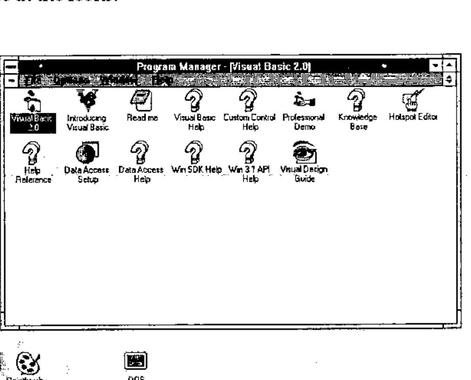
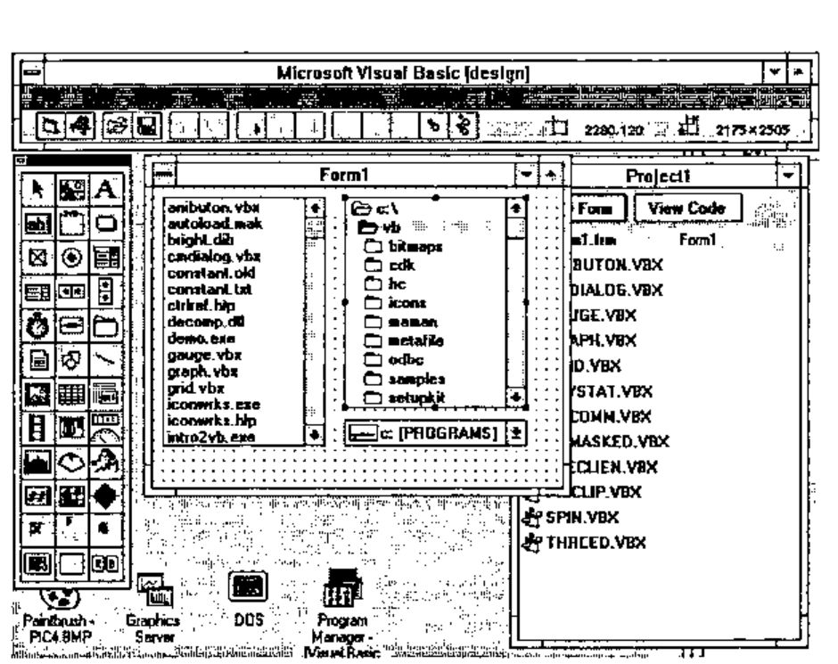
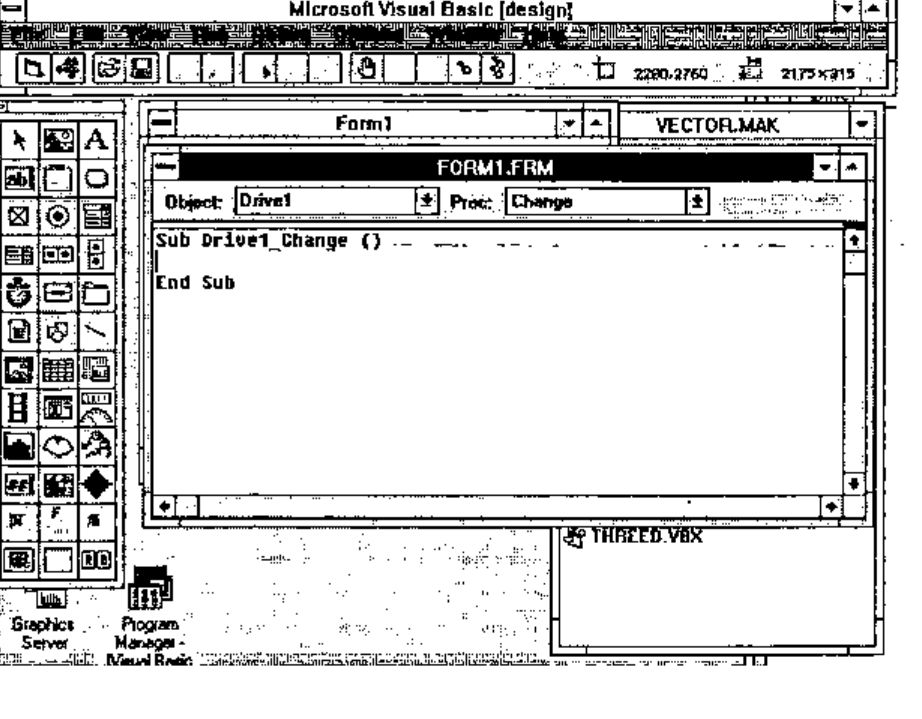
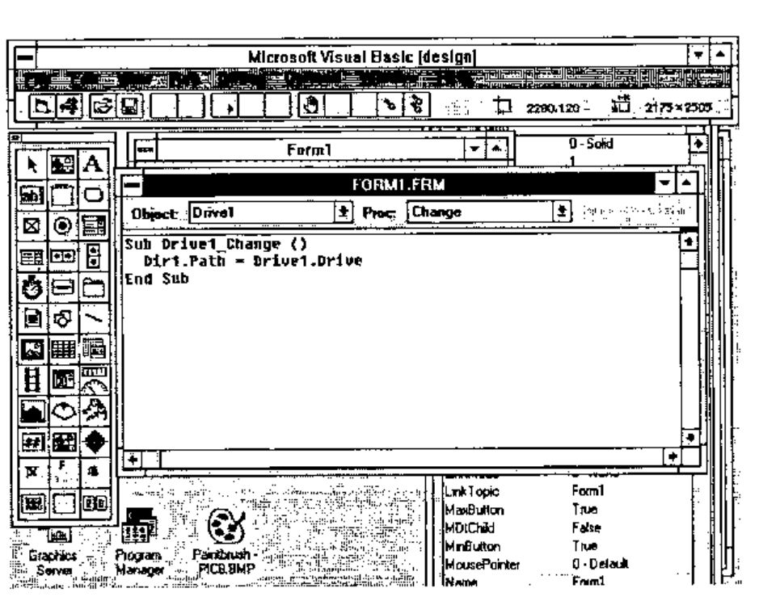
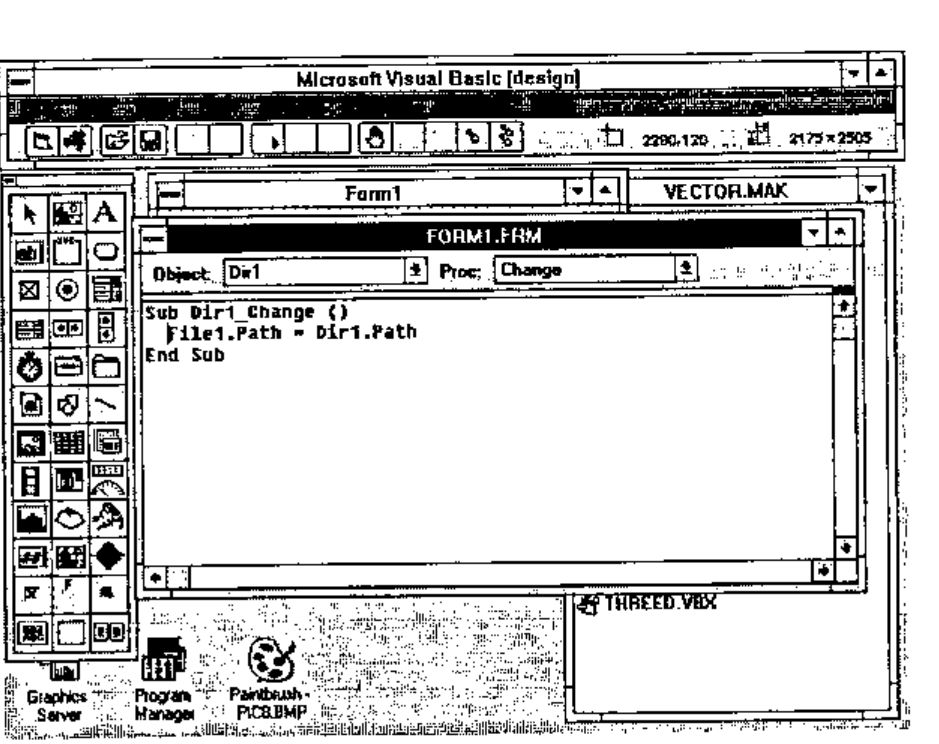
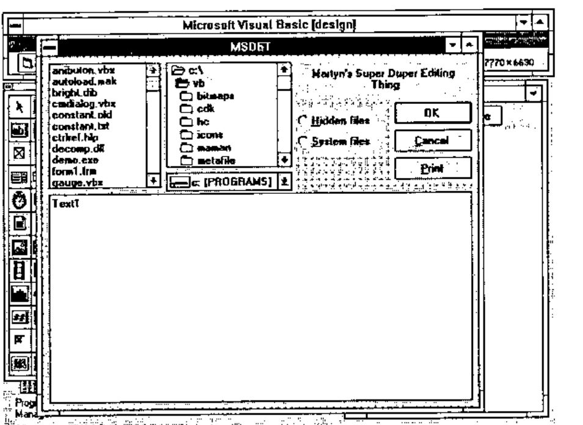
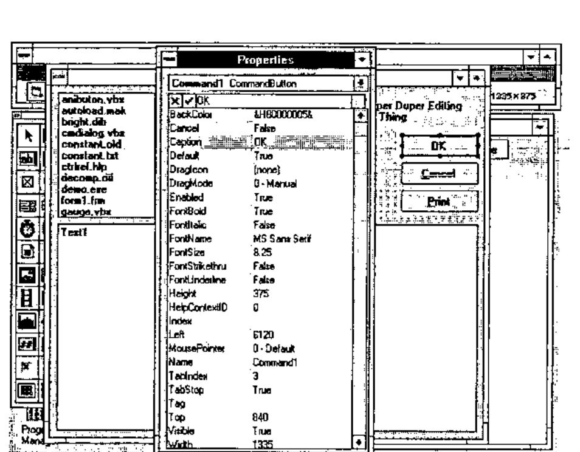

*by Martyn Adams*
{ .byline }

I am a Visual Basic programmer. Please stop laughing! I am in disguise you see, I am really an APL programmer but there are reasons why I am not programming in APL any more.

Seriously though — I will have to explain why the situation is as it is and hope that someone, particularly an APL vendor, will take a lesson or two from this article and address some of the problems I have encountered. I am/was a pretty good APL programmer in my time but market forces have changed things and I have had to adapt to the market place. Now I like to see myself as a sort of fifth columnist — examining the competition and feeding back the details for the benefit of my colleagues in the APL world.

I suspect you are like me, once you have got to grips with Iverson Notation other languages are just a verbal abuse of your time and energy.

So then, I will start by giving you a brief history (not long enough to be boring) that will put things into perspective and explain how I arrived where I am, and then I will delve into Visual Basic (VB) by running through a sample VB session. The session itself will create a simple Windows program and I will let you judge how easy it would be to program in APL for Windows — whichever APL that is.

Before I start though, a word of warning. During the last five or six years I have come across some pretty fundamental changes in software design and build methodologies. Two new buzz-phrases are Object Oriented Programming and Graphical User Interfaces (GUIs) like Windows. If you hear someone say that OOP is just like subroutines, and GUIs are more complicated than necessary — they are dangerously WRONG! I should know — it cost me.

I have seen experienced software developers ignore Windows and stick to DOS for as long as they could and then try to implement their old style monolithic programs under the Windows environment. It never works. The net result of my tolerance to such follies has cost me and my company at least thirty thousand pounds over the past year — and that is just through this simple lack of foresight and understanding by a programmer. Take heed, programming style has changed — and you must be aware of these changes and change with it!

The mentalities I have come across seem to break down into two types:

> **Type 1** are the old established players who would not contemplate developing products under Windows until it had become something everyone was using. Now it is probably too late for them to make a credible jump and a wonderful opportunity has been lost for ever.
>
> **Type 2** are the old established players who did make the jump but did not understand what Windows is all about. They did not understand OOP or GUIs or what they were really trying to achieve and consequently made a mess of the entire affair. Their attitude was one of blind indifference and even cynicism when it came to Windows.

Notice that it is mainly the ‘old established players’ which form this resistance movement. If you are one of those you could well find your future in programming rather difficult. You have been warned. I hope you are not amongst this crowd — if you believe you are, or might be, buy yourself a copy of VB and develop a little program in it. VB is not OOP — but it does not have to be as we will see.

OK then, history. A few years ago I was employed by a consultancy and we developed a pretty good system in APL. It ran, naturally, slower than a comparable system developed in C or PASCAL — but our development costs were extremely low and the speed at which we developed the system was phenomenal. We stayed streets ahead of the competition by improving the functionality of the system and our clients were quite prepared to buy top-end machines to offset those performance issues. This system ran under good old DOS.

The problems we encountered with this development culture were trivial at first, but grew until they became quite considerable. Firstly, we had to ship a complete copy of the APL interpreter with every copy of software, giving clients access to our original source code. Later we had a Run Time System, however we then had to negotiate discounts and distribution deals as a special case as we were not a common phenomenon in the APL community. Then the APL vendor decided to improve the usability of the interpreter at the expense of workspace and speed. The features we wanted were not included.

To top it all, we had clients purchasing machines with (the then) new EGA and later VGA screens and we had to wait six months before the upgrades could be properly reflected into the design of our software. Networks seemed to come as a complete surprise to APL language developers and we had to develop some tricky APL code to enable multiple concurrent access to our large databases.

It was also pretty apparent that the interpreter was not keeping up with the fast moving PC market. Fortunately APL is such a powerful language that you can code around most of the shortcomings in the language itself. But worse was the endemic APL culture — never mind the professionals trying to build and ship a professional product — let us help the learners. Of course there is nothing wrong with that, on the contrary, we need more APL introductions which are easy to use. But without the delivery of commercial systems how will APL ever become a respectable name in the software market?

Then came OS/2 closely followed by Windows. It took years before APL really caught up, and I am not sure it has yet. Look at the VB demonstration later in this article.

At the end of 1990 I left to develop my own ‘New Generation EIS’ software package using APL as a prototype. Although it generated a lot of interest and it was technically competent, it was never a viable product. APL still was not on Windows in a form in which I could develop and ship stand-alone products, and everyone was asking me for Windows software. So I had to switch to another language.

I chose a new ‘Fourth Generation Language’ from a new British supplier. Eighteen months later substantial technical issues built up until I could no longer sustain product development in this environment. Old fashioned concepts were applied to development which gave me no end of trouble with the Windows environment. Finally, the product was killed off with an over ambitious pricing structure.

So I had to switch again, but to what? My options, based on my own programming experience, were:

> MicroSoft C<br>
> MicroSoft Visual Basic<br>
> Borland C++<br>
> Borland Turbo Pascal for Windows (TPW)<br>
> An APL for Windows

Well, I had tried Borland’s C++ and TPW — and I was very impressed with TPW. It compiled like lightning and had a really well integrated development environment which enabled stepping through the code, examination of variables, error trapping, breakpoints, watches, stacks, back tracking, full access to the windows API, ability to build custom DLLs, etc. Even better debugging than most APLs! No Run Time Systems to worry about, no licensing problems. Even when using the editor the source code is highlighted in colour according to the syntax. It is Object Oriented too.

MicroSoft’s C at that time was like any other C product but worse. HUGE!!! The index for the documentation alone is over 500 pages long! I remembered back to the good old days when our development costs were low and the development times far better than the competition. "Not for me!" I thought.

APL? Well, there are one or two good APLs on the market which might have filled the bill. But I chose not to go that route for many reasons. I shall list some of them:

1. The additional cost of APL interpreters or Run Time Systems.
2. Interaction with some of the APL systems was not truly Windows like.
3. Insufficient flexibility with access to Windows APIs, DLLs etc.
4. Less APL expertise around than say, PASCAL, C or BASIC.
5. Cannot expect users to purchase and adapt the source code based on APL.
6. Past experiences.
7. Smaller user community.

So I took the pragmatic decision and from the list of languages I picked two. For product development we use Borland’s PASCAL 7.0 (an enhanced version of Turbo Pascal for Windows), and for client customisation and other bespoke work we use MicroSoft’s Visual Basic. They are both cheap, well integrated into the Windows environment, nearly as productive as APL, faster to run (well the PASCAL is anyway), future proof to a greater extent than APL and easier to market.

I hope that explains my position clearly and gives some real-life feedback to the APLers of this world.

## Now to the Visual Basic Example

I use VB2 Pro — its full title is Visual Basic Professional release 2.0. It only came out in January 1993 and costs about £350. Release 1 came out the year before. Installation is straightforward, a little time-consuming and a little space-consuming, mine is currently up to 15 Megabytes but I do not believe you need all of that.

It comes with all the stuff you would expect:

> - a simple tutorial (noddy really)<br>
> - a professional’s tutorial (simple really)<br>
> - example icons<br>
> - a context sensitive language help system<br>
> - a development environment<br>
> - examples of applications — including an icon editor.

and some useful extra goodies:

> - a help file on general experiences and how to do things in VB<br>
> - a help file on the Windows API<br>
> - a help file on the Microsoft official Windows look and feel<br>
> - a help file on how to extend the VB windows controls (buttons, lists etc.)<br>
> - the source code for a product installation tool kit written in VB<br>
> - a help text compiler, together with a hot-spot editor for hypertext type stuff

Not bad?

So, for our example let us assume that we have installed VB2 and we are going to write a simple application which enables us to edit simple ASCII text files with full Windows look and feel — like the NotePad program that comes free but better. First, we open the Program Manager Visual Basic 2.0 program group and goggle at the icons.



Second, we double click on the Visual Basic 2.0 program icon to reveal four new windows. In the screen image I have minimised Program Manager, otherwise the screen gets a little cluttered.

![Microsoft Visual Basic [design]: the menu bar, the tool box, the empty Form1 with its snap grid, and the Project1 window listing Form1.frm and the VBX files](art10000030/vb1.jpg)

At the top of the screen is the main VB menu window. With the screen you actually control the VB development session by adding new source files, forms (I will explain these in a moment), compile into an executable program, switch between projects, start/stop/trace program execution and set the default colours and such like.

To the right is a window with a list of the program libraries and form files. Double click on these to start editing the code but as we have only just begun there is only one form called Form1. The VBX files are extensions to VB which enable 3D controls, multimedia, simple spreadsheet emulation, graphs, OLE, email, communications etc.

To the left is the tool box: you click on this to select the bits and pieces that go onto a form. Each one of these bits and pieces is called a ‘control’. A control is something like a scrollable list, a data entry box, a place to put text, an icon, a button etc.

Finally, in the middle is the blank form called Form1. A form is a really a ‘window’ into which we put the controls and the dots are the snap-grid so that we can align the controls and resize them to match up perfectly. The granularity of the snap-grid is adjustable too. The form is the fundamental building block of a VB program (although not compulsory) and one builds a VB program around a form and its embedded controls.

So to put the first control into the from we simply double-click on the button in the tool box that almost looks like a miniature disk drive. This puts a drop down list box into the form.

![Form1 with a drive list box (c: […]) in the middle](art10000030/vb2.jpg)

To see it work we just press F5.

![Microsoft Visual Basic [run]: Form1 with the drive list dropped down, showing drives a: to f:](art10000030/vb3.jpg)

Voila! Form1 is now running and even now is a Windows compatible program. The picture shows the screen image after I have clicked on the drop down list to show my disk drives, so this program could become a little utility as it stands, and would be especially useful for networked PCs to show what disks are currently connected.

Now perhaps you are starting to see why I like Visual Basic — I have developed a little application with a resizable and movable window without writing a single line of Basic!

Let us move on. After stopping the program by double clicking on the little control box at the top left of the window, I added two more controls to Form1, a file list, and a directory list and I have moved and resized all of the controls into a pretty group. I have also made the window larger to cope with them all.



I press F5 to run this program and…

![Form1 running, listing files, directories and the drive c: [PROGRAMS]](art10000030/vb5.jpg)

… the file list lists files, the directory list lists directories and the drop-down list lists disk drives. It all works with one proviso, namely that they are not connected. Changing a disk drive does not change the drive that the directory list is looking at, and changing the directory does not change the file list. So we stop the program and now we write some Basic.

On the design screen I double-click on the drop down list of disk drives and get…



…a template for the Basic source code. When designing a form you can always jump to the Basic source code underneath a control by simply clicking on the control that activates it. I type in an assignment statement…



… which basically (forgive the pun) says ‘Whenever Drive1 (the drop down list) changes, set Dir1 (the list of directories) to be at the new disk drive’. Then I save that and double click on the directory control (called Dir1) and type in some more code which says ‘Whenever Dir1 (the directory list) changes, set File1 (the list of files) to be at the new directory’.



Now I have a fully working navigation structure which allows me to navigate all around my disk and select files at will — just like other real Windows programs which have File Open and Save As… options. I have only written two lines of Basic and all the rest is completely automatic. So now to build the full and final screen design…



…notice that I have managed to put in some 3D text, a couple of check boxes, some buttons etc. In order to change any of the attributes of, let’s say, a button I can simply select it, press F4 and fill in the form.



All of the attributes on all of the controls can be filled in this way, and Visual Basic even allows you to change them when the program is running. This last feature means you could design a button which moves around the screen always running away from the mouse — never to be caught and depressed!

However, full Windows look and feel is properly supported. You can make forms and controls invisible, inactive, change states and anything else under program control simply by assignment statements. You can even assign to controls that are located on other forms. You can directly call the Windows API (which is documented) and call any available DLL routines if you have the appropriate documentation.

To round off this example I added a few extra lines of code to the buttons — two lines for the Cancel button, a few to the OK button, one to the print button, one line to each of the check boxes.

Windows has something called ‘Accelerators’ which means that if you press an Alt-key combination some action takes place. VB2 builds these in automatically, if you specify a button or menu option with a name like E&xit the & symbol underlines the x character which automatically becomes the Alt-X key accelerator. No coding necessary, but you can override this if you want.

To make the editor actually edit something, I added a few lines of code to the file list box which, when a file was selected, loaded a file and assigned it to the big text box (Text1). This is the edit area and it automatically creates a scroll bar when the contents become larger than height of the screen. Here is the loading code:-

```text
Sub File1_Click ()
     ' comment: load a file for editing
     Dim Path$, record$
     ' comment: Get the file name
     Path$ = Dir1.Path
     If Right$(Path$, 1) = "\" Then
          Path$ = Path$ & File1.FileName
     Else
          Path$ = Path$ & "\" & File1.FileName
     End If
     ' comment: now load the file
     contents$ = ""
     Open Path$ For Input As #1
     Do While Not EOF(1)
          Line Input #1, record$
          contents$ = contents$ & record$ & Chr$(13) & Chr$(10)
     Loop
     Close #1
     ' comment: This one line updates the screen
     Text1.Text = contents$
End Sub
```

Some more Basic code is needed, but it is quite straightforward so I will not bore you with the detail. Adding a Windows style drop down menu bar across the top of the window is simply a matter of form filling again and then attaching code to each of the menu options. Even drag and drop is supported.

To improve this application I could make the edit area resizable when the window is resized (two or three lines of code), add Save File, Rename, Delete and Copy buttons to turn it into a little session manager.

## Colour and Help

There are a couple of other things I have not mentioned. The editor colour codes the source code by syntax, meaning that comments, keywords and variables are displayed in different colours. This greatly eases the understanding of the code. Finally, there is a built in context sensitive help. Double click on any keyword, press F1 and the help text describes it in detail. Do the same on any control and the help text describes the control in detail too. This means that if you want to learn Visual Basic you can simply buy the product, load it and press F1 for help — although some of the help text assumes you already know Basic.

## Summary

There is a lot more to VB2, I have only scratched the surface, but I hope that by now you can see that it is extremely simple to develop applications with it. If there could be a Visual APL I would be skipping on the desktops. Developers of this Visual APL would have to realise that screen presentation is very important, and the underlying language has almost become secondary to the screen image.
