*notes by Anthony Camacho*
{ .byline }

## A Miracle that it Should have Happened at All?

We reproduce here the Welcome! from the conference final program:

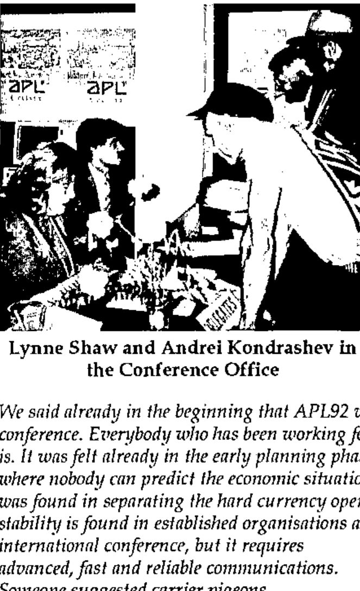

Lynne Shaw and Andrei Kondrashev in the Conference Office
{ .caption }

> *The participants of APL92 in St Petersburg are witnessing a miracle. Two years ago, during APL90 in Copenhagen, when the first aspirations of an APL conference in the Soviet Union were in the air, nobody could quite believe it would be possible in two years, especially not the two SovAPL delegates. They knew that the bureaucracy was unbeatable, travelling from and to the country was next to impossible and international communications were nonexistent or poor. A famous slogan says that the impossible will be done while you wait, miracles will take some more time. Now we know it takes almost two years. On the other hand, we can say that the doubters were right, the APL conference did not take place in the Soviet Union.*
>
> *We said already in the beginning that APL92 will be much different from any other APL conference. Everybody who has been working for this conference knows already how different it is. It was felt already in the early planning phase. Budgeting an enterprise like this in a country where nobody can predict the economic situation in the next month is a crazy job. The solution was found in separating the hard currency operations from internal operations where the stability is found in established organisations and structures. We wanted to make a truly international conference, but it requires advanced, fast and reliable communications. Someone suggested carrier pigeons. Fortunately, just as the need arose, electronic mail networks reached Moscow and Leningrad. Finally the feared communication problems were not too bad at all. We learned the tricks how to best use telephones, fax and email, and how to send a letter from Moscow to USA in four days for less than one rouble.*
>
> *This conference was made possible because so many APL friends in so many countries saw the opportunity to strengthen the world-wide APL community and took it as a personal challenge. The authors of papers, referees, the international program committee, ACM and SigAPL officers and many other volunteers showed quite exceptional tenacity, flexibility, and understanding in order to overcome problems and to make cooperation work. We can simply say that we have had the most international, most experienced team of the APL history to work on this conference. But ultimately the participants will make the conference. We hope you will make it a unique, unforgettable experience. Remember that we learn most from different friends. You will find lots of different friends in St Petersburg.*

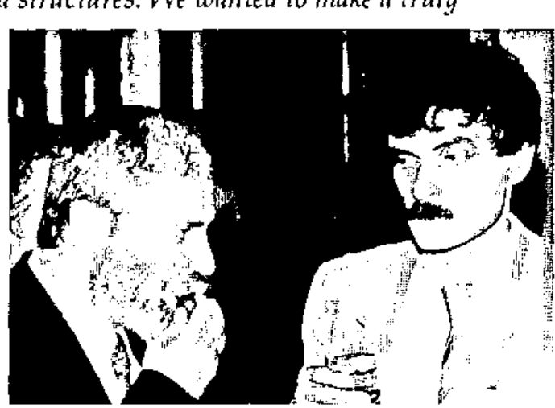

Grigory Amirdjanov (Treas) and Andrei Kondrashev (Chairman)
{ .caption }

## Small is Beautiful

Around two hundred delegates seems to be a good size for a successful conference especially if most of them are able to stay in a single building and eat together. Far more interaction is possible and one gets to hear about other people’s doings. Although there was only one paper using J and the offer from Bob Bernecky to conduct the proposed J workshop arrived too late for the organisers to take it up, there was a lot of talk about J. Arthur Whitney (the originator of the rank operator and author of ‘A’) was telling people about ‘K’, his suggested successor to J. I had one breakfast with Arthur sitting next to me entering expressions on a pad, showing the results and explaining how the interpreter could handle the dialect — it was Special K for breakfast that day even though Kelloggs wasn’t on the menu! Later he decided that as what he proposed was not really a successor to J the name ‘K’ was inappropriate. He may call it ‘R’ for reduced instruction set but Paul Chapman thinks R is for Arthur. Arthur agreed to try to write a fullish description and send it to Vector; a treat worth joining the British APL Association for in my opinion.

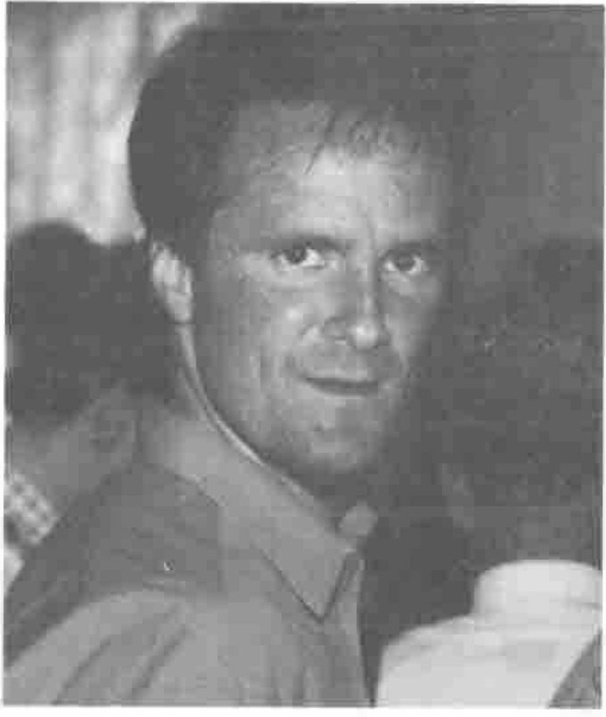

Arthur ‘K’ Whitney
{ .caption }

### Some Difficulties were Marvellously Overcome

The food! We were told it was all imported from Finland. Amazingly we ate well; no-one went hungry. We had fresh milk and cornflakes at breakfast if we wanted. The buffets at all the special events had almost too much luxury food. By the end of the conference we would have been glad of some plain bread and butter, but no-one could complain at caviar, sliced beef, smoked ham, smoked salmon, mixed vegetables rolled into bite sized balls, cheeses, savoury pastries, cherries, strawberries and bananas.

The drink too was good. Champagne at every buffet with white wine and sometimes beer and sometimes red wine, plus pepsi and carbonated water for the non-alcoholics. Tea, coffee and fresh milk for breakfast; beer and coca-cola for lunch and always boiled water to clean one’s palate.

### Some Easy Tricks were Missed

For the first day or so there were problems finding one’s way about; there were no signs or they were inadequate. Announcements were not always made when a paper or workshop was cancelled because the author had not been able to come. Room changes were not announced and this caused some papers to begin very late — in fact the timing of the conference took its cue from the unexplained twenty-seven minute delay in starting. I suspect this is a consequence of the way Russia has run for years: motto — when things go wrong don’t make waves or it may get worse!

### There were one or two Disasters

For the first two days the water heating was out of action; the hot taps produced water the colour of black coffee. The relief when it did work was considerable and the colour changed to pale Chinese tea so we neither smelled nor looker dirtier at the end of the conference than we were at the beginning.

I suppose the worst disasters were the papers that were not given and the workshops that were not held because the speakers did not come. This was a surprise to me because as the Russian visa procedures are so inflexible the organisers knew a considerable time beforehand just who would be there. Usually when one knows of a speaker’s absence one gets the speaker to nominate someone who is coming to do the presentation.

## The Best Tours and Entertainment Yet

More trouble was taken with entertainment than ever before. The five evenings were completely used up with a Welcome reception, an Exhibitors Reception, a trip to Kronstadt, a picnic at Lomonosov and the banquet. Here are a few notes on the events:

### The Welcome Reception

This was held in Shuvalov’s palace. The rooms were extremely ornate; we were fed with a champagne and caviar buffet and treated to speeches from various people, with interpreters when they spoke only Russian. This was a good chance to get to meet people and talk. As I had numerous commissions to execute for I-APL and ASL and had been asked to sound out people about the British APL Association’s proposal to run APL 94 at York, I welcomed this and the other opportunities.

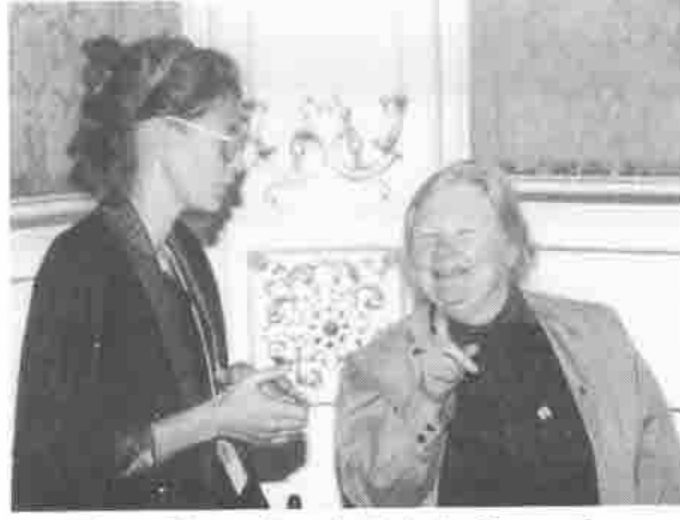

Elena Korovina & Sylvia Camacho
{ .caption }

### The Exhibitors’ Reception

The exhibitors’ reception was held mainly in the large corridor outside the exhibition, the souvenir shop and the posters.

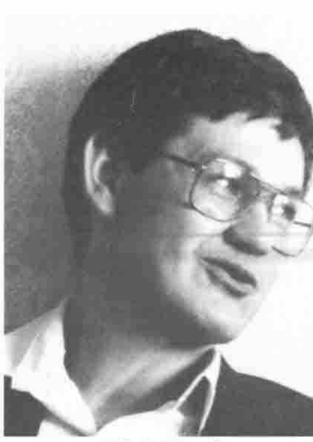

Nikolai Puntikov (Social Program and Tours)
{ .caption }

### The Trip to Kronstadt

The Kronstadt cruise was a highlight of the conference. We were taken by bus to board three large hydrofoil launches and driven at high speed across the sea to Kronstadt which has been a closed city for seventy years. Even citizens of the USSR could not go there unless they worked there. Kronstadt is the naval base that used to guard the approaches to St Petersburg from the Baltic. It is an island now connected to the mainland by two huge long causeways (still under construction) with great bridges to allow ships access to St Petersburg. On disembarkation we were entertained by a naval band. Then we walked through a small park and along a road to the hall of the officers’ mess (which the program tells us is in Menshikov’s Palace) where the buffet supper was laid out for us. The band came with us and re-assembled on the stage under a sign which read "OFFICER — PROFESSIONAL HEROES", where it played to us in between the speeches. The trip back was by coach along the causeway and overland. It was a long trip and we noticed for the first time that we had a police escort at the head of the cavalcade. Once off the causeway we drove through some of the northwestern suburbs of St Petersburg — vast dreary blocks of flats which seemed endless. One of our hosts told us "The centre may now be St Petersburg again but this is still Leningrad".

### The Picnic at Lomonosov

After Kronstadt had been so good we didn’t expect too much of the "Picnic". The coaches were led by a Police escort which confidently went through red lights and drove in the centre or even the wrong side of the road when the right side was not free. Even when the police had a green light, it was often red by the time the eighth coach reached it, but the cavalcade was not to be split and carried on undaunted. Russian drivers must be prepared for this sort of thing as there were no accidents or sounding of horns, even when the last coach crossed a red light with the police car quite out of sight. The journey was a long one as Lomonosov is on the other side of St Petersburg to the South East.

As we milled around the coaches on the scrubby parking lot a band struck up and our hosts told us to follow the band. To our amazement, out of a wood marched the band dressed in eighteenth century costumes with wigs and braid on their uniforms and followed a zigzag path through the wood to one side of the lake where it paused for a couple of numbers to allow the 250-odd picnickers to catch them up and regroup. Then off we went again round the lake in front of the Chinese palace and through a pergola to find trestle tables with champagne for us all.

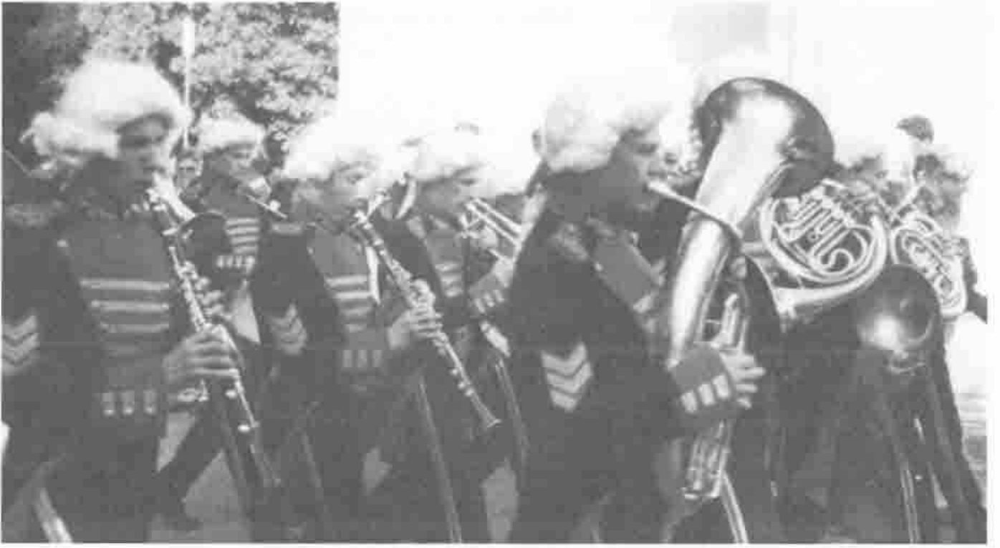

After the champagne we were off again to the courtyard in front of the house where the band left us. There a flute, violin and cello played some eighteenth century music and a man in eighteenth century costume declaimed some poetry by the Russian poet and chemist whose house it had been. We were encouraged to walk round the back of the house where we found a Russian folk dance group; a group of dancers in bright costumes and a group of musicians including two piano-accordions and a bass balalaika. These gave a spirited performance with much whooping and stamping.

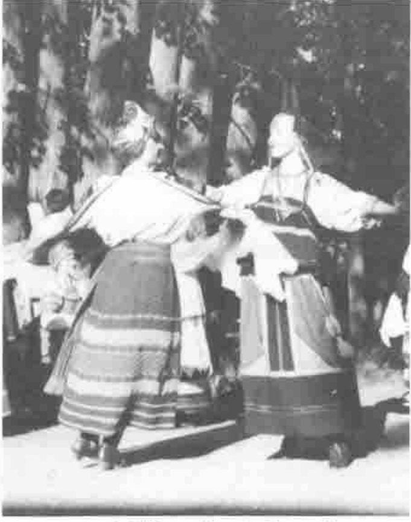

… much Whooping & Stamping
{ .caption }

Then we were encouraged to return to the building by the car park where the buffet supper was served. Upstairs and in other rooms there were souvenirs on sale. After supper we could go on a tour of the Chinese palace; it was very richly decorated and the marquetry floors were quite outstanding — we had to wear felt pads tied on under our shoes so as not to mark them. Then we had another escorted ride back to the Education Centre where we arrived at 11.30 pm. Of course at this time of night in July St Petersburg is still light. Except when it was very dull or raining I could read at any time, even indoors at midnight.

### The Banquet and Floor Show

After another exciting coach ride we reached the Pribaltiskaya Hotel, built (to a very high standard) by the Swedes — or so I was told. After a glass of champagne we were let into a huge ballroom with decoration that I now think of as ‘standard international luxury hotel’, found a table and sat down to eat the first course which was already laid out. The food was even more luxurious than usual. As well as the usual wines there was red wine and vodka and the first course was followed by fillet steak with duchesse potatoes and fruit and ice cream.

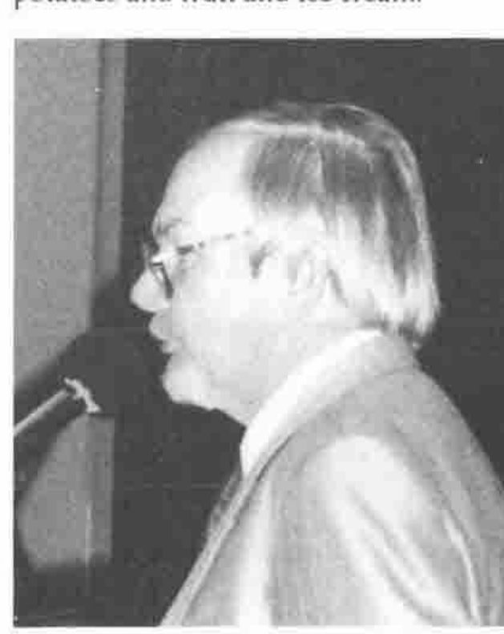

Erkki Juvonen
{ .caption }

Erkki began the announcements with a sequence of thanks to the many people who helped to make the conference such a success, telling us that a small miracle has occurred in St Petersburg this week. Everyone thanked got a cheer or a round of applause and the wives who had helped also got a bouquet. Erkki himself and the hardest workers of all had standing ovations.

Larry Moore (chairman of APL 93) gave a short slide show of the beauties of Toronto and we were all urged to attend and to find ways to make it possible for our Russian friends to come too. Then we had a floor show! Talk about over the top; there were pop singers eating their microphones, a contortionist (not quite entirely naked), a chorus line of dancers with one leg sheathed in gold lamé and the other not, and best of all a juggler. Apart from the juggler this was not at all to my taste but in this I defer to other people’s judgement. If we had had this in New York I would not have been surprised but in St Petersburg it was amazing.

### The Tours

I only went on one of the tours. If they were all as good the accompanying persons must have had a marvellous time. It was billed as St Petersburg from above — to climb the highest buildings for the sake of the view from the top. There was both a guide and an interpreter who didn’t always agree with the slant on things that the guide offered. They kept asking how many of us were from the USA and as it happened none of the party was. I felt the emphasis on the spiritual side of life was put in to please transatlantic tastes and that the guide was too inflexible to change it on the fly.

We went up the Petropavlovskaya cathedral tower, and apart from the views were allowed to inspect the clock which can play tunes on an extensive carillon. One of the drums is programmable but is not at present in use: the clock is being refurbished by some Belgians, we were told. The tower is not usually open to tourists or Russians. We were told we were the first tourists allowed up. Then we went up the Admiralty tower, which is similarly restricted. We had to wait to be admitted and for naval personnel to lead us up and unlock as we went. The view from the top is excellent, and the way up dusty and ill-lit enough to believe that we really were the first westerners allowed in.

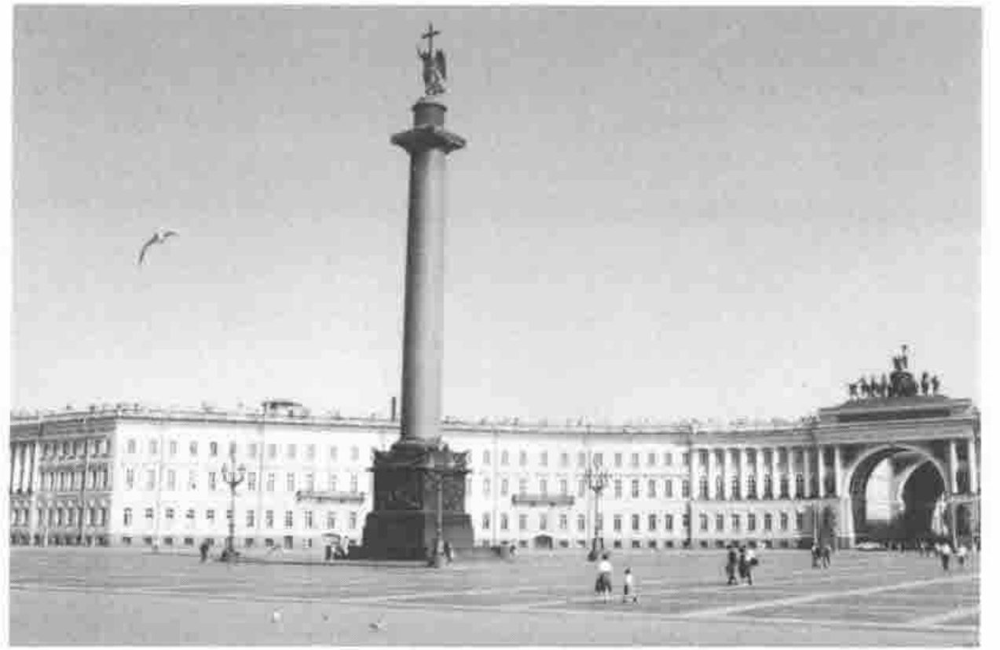

The Winter Palace
{ .caption }

## The Program

Highlights were the papers by Langlet, Tollet with Harrison and Spunde. As Dieter Latterman remarked in introducing Christoph Popsiech "Christoph has used APL2 of course: otherwise he wouldn’t be allowed to talk here". Maybe there was not too much APL2, but there definitely was too little J and Sharp and other implementations. I certainly felt that Dieter had hit the nail on the head even though he immediately corrected what he had said.

In general the program allowed one to attend more of the sessions one wanted because there was less going on elsewhere, but in spite of this I missed Bernecky’s last wind tunnel, Curtis Jones on APL plotting, Johann Mitlöhner on porting via ASCII and all but one of the workshops.

## The Software Library

R G Brown ran the software library. When we arrived there were sets of disks and a 20 page descriptive manual. By the Wednesday there were an additional seven megabytes of contributions, including some updates to his public domain libraries from Dick Holt of HRH systems, the workspaces of APL Traceguide (this was a poster of APL\*PLUS/PC utilities from Zalman Rubinstein of Israel), J version 5.0 from ISI, Peter Lewis’ spreadsheet, Adrian Smith’s Adobe type 1 APL font with samples (almost indistinguishable from the 2741 font for 2741 characters), the Ctalk material, the material from bulletin boards on J edited to work in the latest version of J from Alain Delmotte and the 1991 index of APL articles by Rosemary Snow. It was the largest software library ever and the descriptive manual a welcome innovation. I look forward to receiving my copies of the extra seven megabytes.

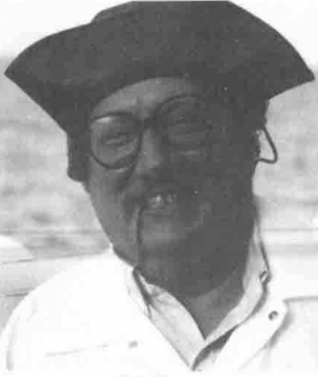

Bob Brown
{ .caption }

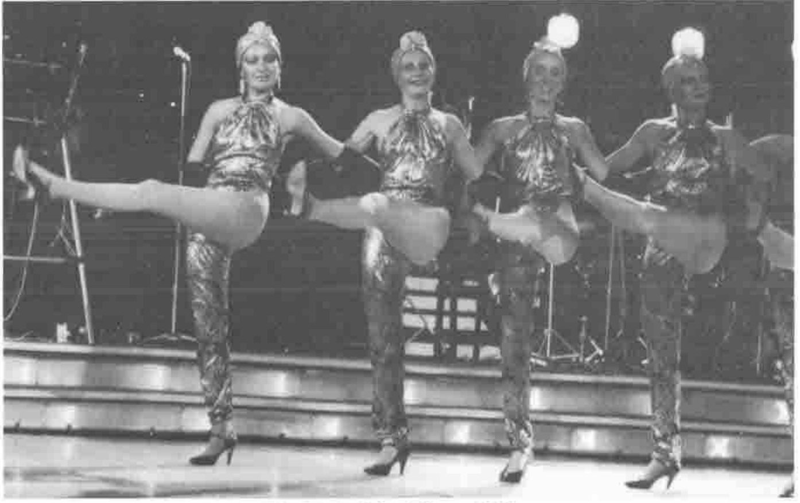

The End of the (Chorus) Line
{ .caption }

## Conference Diary

### Opening Plenary

This was billed to start at 10.00 — at 10.27 the conference Chairman, Andrei Kondrashev went to the podium and announced the conference open. No explanation of the delay was offered.

Erkki Juvonen, program co-chairman, made the initial announcements. Sessions were to be 60 minutes long to allow for language difficulties. Workshops were to be in whatever format the convenor chose. He suggested that each of us aims to contact five names new to APL as the first step in spreading the word. Then he welcomed us to the conference and repeated the welcome in Russian, French, German and what I guess was Finnish.

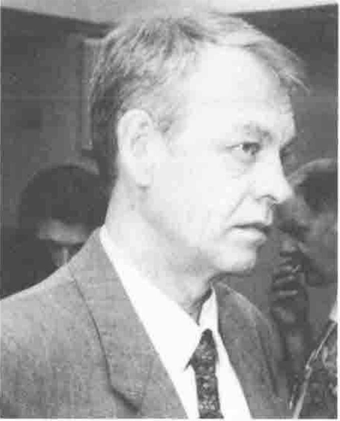

Viktor Ivannikov
{ .caption }

Viktor Ivannikov, program chairman, also welcomed us. He wants to keep APL linked to the main stream of computer science. He suggested that we copy the twin town idea in computer science. He told us that APL was growing in Russia — from this year there will be APL courses in Moscow State University (to be taught by Professor Popselov and Andrei Kondrashev) and as the leading institution it is likely that others will follow suit. Russia will introduce a new copyright law based on the European tradition so the current practice of using pirated or public domain software can end and vendors can find a market in Russia. He ended by telling us that there is a real opportunity to make APL popular in Russia and that we should talk of this as the first ACM conference in Russia.

Erkki then introduced Lynne Shaw as the representative of the ACM to welcome us to this ACM conference, which she did and then Erkki introduced Josef de Georgi, the manager of the IBM office in St Petersburg.

Josef de Georgi told us he was an expatriate Austrian with the difficult task of introducing IBM into St Petersburg. The problem is that nobody knows how to get from where the parts of the old USSR now are to where they want to be. Mayor of St Petersburg Sobchuk has many grand projects: a highway to Helsinki, a Free Customs Port, a highway to Moscow. Such projects will take ten years and meanwhile we struggle and our difficulties strengthen and are exploited by the enemies of perestroika. Matters are made worse by the ethnic problems — worst at present in Yugoslavia but likely to break up Czechoslovakia and who knows what they will do in the USSR? Nobody knows how to stabilise the rouble, or how to get farmers to produce enough to make Russia self-sufficient in food.

IBM opened an office in Moscow in 1974 but the trade embargo on computers following the Russian invasion of Afghanistan put them almost back to square one again. The embargo was only lifted in 1989. Now IBM Russia has 85 employees; in St Petersburg there are two foreigners and three locals. In spite of the problems IBM believes in the potential of the CIS; it supports APL2 as the strategic interactive language. Finally Josef de Georgi urged us to read the welcome address in the final program.

### Gérard Langlet: Towards the Ultimate APL-TOE

This was not billed as a plenary session but as there were no workshops or competing papers in effect that was what it was. APL-TOE stands for the APL theory of everything. M. Langlet believes that one can discover laws of nature without experimentation.

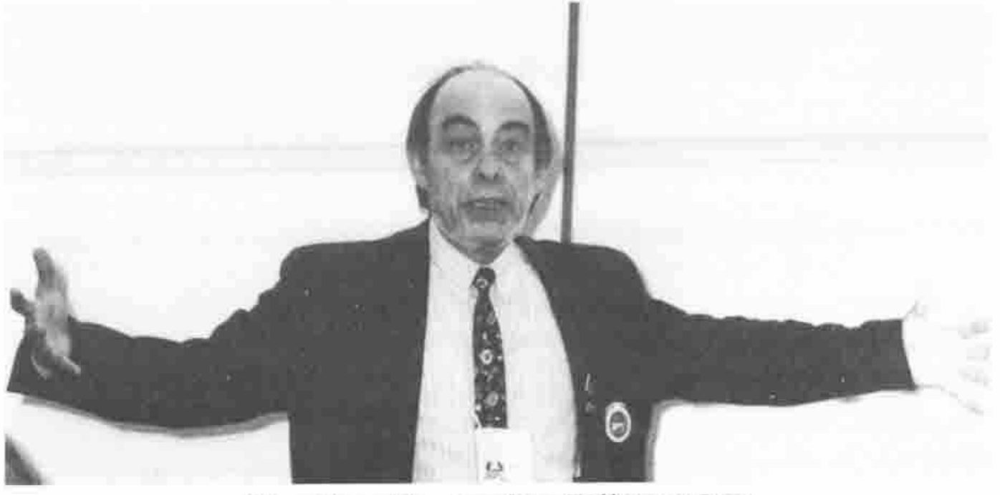

Gérard Langlet: a very long Difference Scan
{ .caption }

The argument runs something like this: things must, in the last resort, be made of simple components. At the lowest level of all, models made of simple components are likely to match the real world because both are fundamentally simple. Gérard Langlet has spent great efforts over the years on algorithmic compression and, as a result, has found many algorithms in their most compressed form are made up of difference scans.

He then dazzled us with fascinating simple matrices. Some were self inverse, some, when inverted, changed the signs of a symmetrical group of the elements. He showed us how to generate a Sierpinski triangle. He showed us the pariton, a matrix generated by repeated difference scans which had one of the properties of a hologram in that many different parts of it contain enough information to reconstruct the whole. He found analogies to Pauli’s exclusion principle, ways of magnifying or shrinking a pariton matrix which preserve its essential characteristics. A fractal is a matrix operator: the smallest fractal is a single bit.

M. Langlet asserted that his next example was not artificial but NATURAL intelligence. Newton found gravitational attraction but physicists could not easily reconcile the gravitational attraction with the repulsive forces that apply at the smallest scales. The difference scan on vectors does something very like this. By the time M. Langlet had reached helicons and robys I had lost the ability to take notes as well as follow the argument. But I am convinced that there is something in this. If it is possible at all to build mathematical models of the physical world, we assume that the equations are simple enough for us to discover. Surely this is as arrogant or even more arrogant than M. Langlet’s proposal that we should work the other way and look for instances of the simplest suitable mathematical models in the real world.

If the model is simple and elegant enough then, he hopes, there will be something physical that corresponds at some scale — at some level of generalisation. That is all we are doing when we say two apples plus two apples makes four apples — it is true even if no two apples are alike.

This paper was the best of the conference for me. After this there was only one way for it to go — down. But, to compensate, in every question time that M. Langlet attended after this, he asked some question such as whether the speaker had tried simplifying his expressions by using difference scans. It became the running joke of the conference.

There is a recommended text for the Theory of Everything — by John D Barrow of the University of Sussex ISBN 0-19-853928-2.

### Gustav Tollet and Peter Harrison: A Bézier Curve Builder

The Drawmaster product from IBM contains about 20,000 lines of APL code. It is all the work of three people, Gustav Tollet in Helsinki, Tom Springel in White Plains and Peter Harrison in Hursley. It now serves several thousand users.

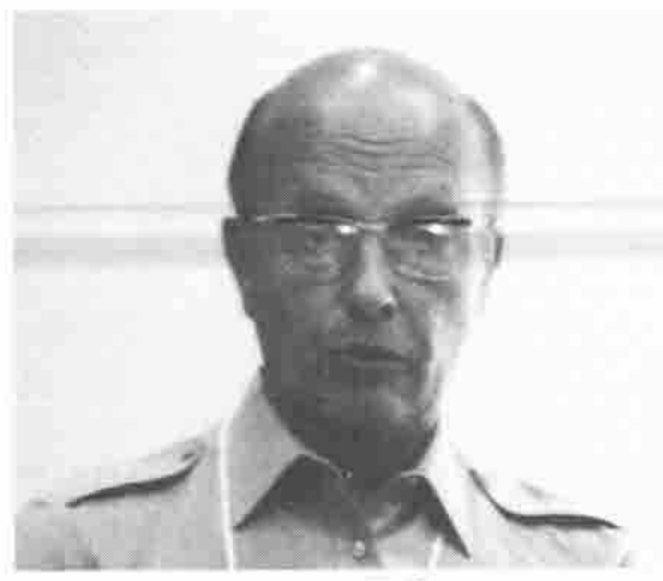

Gustav Tollet
{ .caption }

It was begun in 1984 when it was common to represent curves by polylines — sequences of short straight lines which were shorter where the curve changed direction rapidly. M. Bézier worked for Regie Renault and invented his representation of a curved surface to make it easier to describe the curves of a car body. The two-dimensional version is a simplification. The formula is a parametric cubic and is transformable, which is to say it can be reflected, rotated, transposed and displaced by the same procedures as polylines. B-splines and conics are not transformable in this way. Bézier curves, however, cannot exactly represent conic sections and the problem of finding the point of intersection of two Bézier curves has not yet found a general solution. The Bézier curve is much more economical in space; typically a 95-segment polyline might be a 21-segment Bézier. And a straight line is just a limit of a Bézier, so the whole of any curve can be approximated by Béziers. Such a reduction in the storage needed for a drawing, which might be a megabyte or more, is a prize well worth working for.

To convert a polyline to Bézier one must first identify the end points and then match the curves. The IBM team had a great deal of help from Pat Bierne of Corel Systems (one of the authors of CorelDRAW!) who challenged them with polylines of 100 points forming a circle (represent it as four symmetrical quadrant Béziers) and a rectangle with rounded corners (represent it as four straight lines and four corner quadrants).

Gustav Tollet explained some of the techniques used. They were fascinating but your reporter couldn’t write fast enough. You can buy the proceedings to read the paper. Vector hopes to scoop the world by printing the complete code (which is Gustav Tollet’s copyright) — but we don’t yet have a date!

And the advantages? Not only is it very economical of space but the conversion is really fast and completely reliable. In answer to Ray Polivka’s question Peter admitted that "Yes Pat Bierne was impressed". By the way the words "of the sum of squares of deviations (called the error value below)." were omitted from the end of the last paragraph on page 261 of the proceedings.

### Tien Chi Chen: Globally Convergent Polynomial Iterative Zero Finding Using APL

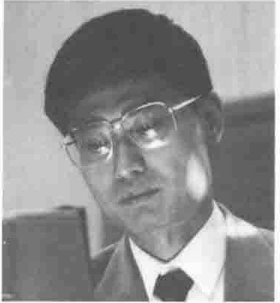

Tien Chi Chen
{ .caption }

Your reporter did not understand the mathematics; the essence of this paper was that the new iterative method of finding solutions (zeros) is much faster than Newton’s or Laguerre’s methods and Mr Chen has found how to avoid successive iterations oscillating between two or more values.

The presentation plotted values graphically and showed how the iterations approached the solutions even in hard cases such as several symmetrical clusters of points, symmetrically arranged.

### Martin Gfeller: Walks Into the APL Design Space

Martin began with a survey of where APL is today. Iverson’s book is 30 years old; there are several incompatible dialects of APL; there is stagnation rather than commercial growth; APL is not accepted as part of computer science; little university time is spent on teaching or using APL; the APL community hasn’t chosen a niche or decided to be a universal language. He then showed us some diagrams categorising the market and applications. He suggested that APL could survive only if it adapted itself to the future; then he listed the strengths of APL and considered how to add to the paradigm, which is based on functions and arrays, without inconsistency. The suggestion is that APL could include an Object Oriented paradigm without damaging its fundamental characteristics. Since attending the presentation I have read the paper and feel that Martin’s arguments deserve more careful attention than I gave them at his presentation. Too many people, disappointed at the poor rate of growth in the use of APL, decide that what is wanted is a re-design of the product: nearly all re-designers fail to preserve the consistency of the syntax and elegance of the primitives. On this occasion I did NOT feel that I was listening to a poor salesman re-designing the product as an excuse for his failure.

### Igor Popselov: Russia on the Way from Plan to Market: the Experience of Modelling.

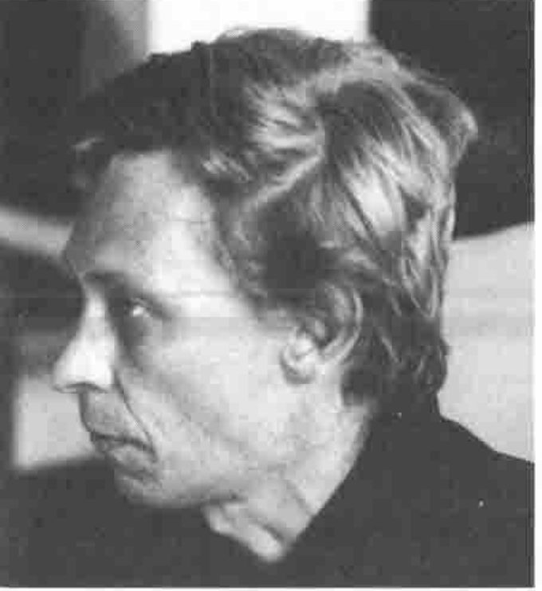

Igor Popselov
{ .caption }

Professor Popselov told us he has used APL for 15 years. It has the advantage for him that the code contains nothing but the model. He proposed to show us some real economic models of the Russian economy. The demonstration is not specially arranged but is a real run of the current version of the model. Regrettably, in order for the audience to see the large screen projections of the computer output, the lights were turned down and note-taking became impossible. The system is written in APL\*PLUS/PC and is in the software exchange as system GRAND. Interested people can try it out for themselves.

Professor Popselov paid tribute to the work of Andrei Kondrashev, our conference chairman, for creating the system that displayed APL, Cyrillic and Roman alphabets all on the screen at once.

### Eke van Batenburg: Porting and Optimising STAR

Mr. van Batenburg began with a short lesson in biochemistry. RNA is the template formed on stretches of the unzipped DNA which is required to be replicated. When the RNA comes off the DNA it does not stay straight but becomes a tangled string and some parts of the string become stuck to other parts. It may even become knotted. These connections of one part of the RNA strand to another are the secondary structural characteristics of the RNA and are important in determining its further behaviour. The program STAR does STructural Analysis of Rna.

The most famous program for this work is by Zuker; it is very computing-intensive because it works out all possible attachment points and makes all the connexions in one go. Runs take a whole night on a VAX. STAR looks for the points which attract each other most strongly and then those which are next strongest and so on. Because the number of cases is much reduced by this procedure it is very fast. Because the likeliest connexions are chosen first, which matches the way the RNA strand gradually gets more and more places stuck, it sometimes produces a better prediction of the secondary structure which an RNA strand will form. The run which took the VAX a night using Zuker takes 11 seconds on a 386/33.

The program took 9 months plus a further 9 months to produce a nice user interface. For the lessons learned while porting the program to APL.68000 (on Atari and Macintosh), APL2 and Dyalog please see the paper.

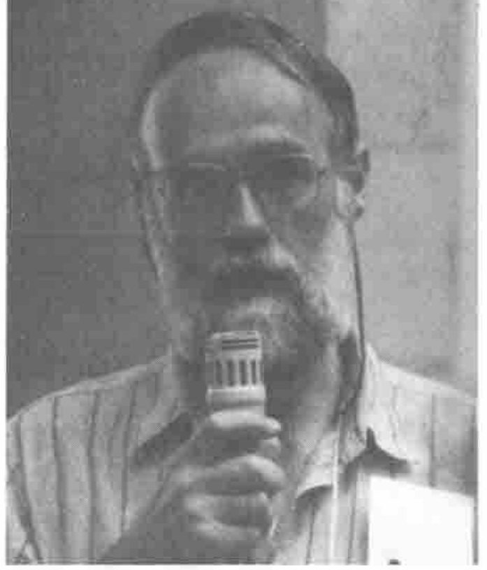

Eke van Batenburg
{ .caption }

There were some delightfully easy things (such as porting the engine to APL.68000) and some problems (such as APL2 refusing to share the machine with QEMM or how to get a nice user interface out of AP124).

I liked the advice on optimisation:

1. Don’t do it.
2. If you are an expert, don’t do it yet.
3. Don’t do it everywhere: make an execution profile and an "irritation" profile (the first to show where the bulk of time is used; the second to show where time is used that spoils the user interface). Only improve what these profiles show to need it.

### R Bernecky and G Osterburg: Compiler Tools in APL

Bob Bernecky was introduced as the Potentate of Snake Island Research. He gave the advantages of compilers as broadening the range of applications where APL was competitive, simplifying the creation of applications, improving reliability and improving performance (especially where code must be iterative).

A compiler can be built of a finite state machine and a table of transitions processing an input string. Such a compiler cannot recognise languages which require backtracking. Bob gave a nice example of the table of transitions for validating input of a real number.

Gert Osterburg of Technoma showed us how the specification of an application went through the stages: input; tokenise; parse; evaluate. From the token definitions the FSM generator creates the FSM table which converts the input into a token list. From the grammar the parser generator creates the parsing table which converts the token list into a parse string. From the semantic definitions of the primitives the parse string can then be evaluated to produce the result.

Sharp APL\370 contains facilities to incorporate functions written in machine code; they appear as locked functions. The FSM and PARSER functions were produced this way.

### J-J Girardot: The CTalk Programming Language: a Strategic Evolution of APL

It irritates APLers to have the supposed weaknesses of APL (those that prevented it from taking over the world) listed again and again. Jean-Jacques began by doing this; how else could one introduce an new language to APLers as an improvement? His view of the weak points is: the line structure of defined functions and branching, the late binding of identifiers hence the ambiguity of some instructions (they depend on what is localised) and the character set.

CTalk is designed to look like C with all the usual control structures, with lexical binding, nested definition of operations and functions as first class objects. Of course it uses the ASCII character set.

CTalk is at present an unfinished experiment. As a benchmark J-J ran a Fibonacci function and whereas APL is 800 times slower than C, CTalk is only 20 times slower. The biggest drawback of the current implementation is that it doesn’t cater for arrays of more than one dimension which makes porting APL systems to it non-trivial. CTalk is in the software library.

### R G Willhoft: Petri-net Evaluation using APL2

I didn’t know what Petri-nets were and was surprised to find that I had used something similar in the 1960s when working on interactions in real-time systems. They were first published in 1962. A Petri-net consists of ‘places’ and ‘transitions’. Each place may be connected to one or more transitions by an arrow; each transition may be connected to one or more places by an arrow. When a place is ‘occupied’ or switched on then each transition it is connected to is partially or wholly enabled. When every such input to a transition is enabled then it may ‘fire’. The firing may be delayed for a minimum time or forced to happen within a maximum time, but in general there are no constraints. When a transition fires the places with arrows to it become ‘unoccupied’ and those with arrows to them from it become ‘occupied’ thus perhaps enabling further firing. This scheme is used for analysing such mechanisms as communication networks, multi-access storage mechanisms in computers and even neural nets. Analysis may reveal the possibility of a deadlocked state where no transition is wholly enabled, or that there are states which are unreachable.

Mr Willhoft showed us the ‘coverability tree’ which is valid when there are no time constraints and shows the possible states, the ‘firing diagram’ which adds time constraints and may make some states unreachable and the ‘GRID’ — a graph of reachable instantaneous descriptions. The functions used to perform these analyses and others are in the paper and the software library. The representation of the Petri-net is explained thus allowing us to devise further analyses if we wish. The system has been used to avoid deadlock and obtain maximum reliable performance from several hardware designs.

### Elod Polgar: Europe without Borders: New Dimensions in APL

Dr Polgar showed a nice series of slides with a message of hope that APL has many opportunities to grow in a Europe newly enlarged by the opening of the east. He asked some interesting questions and told a story about an exam where the examinees had three hours to answer the question "Is this a question?". He asked the audience what they thought the shortest answer was and your reporter, who had heard it before, said it was "If this is an answer." and won a prize — a spoon with a telescopic pointer as a handle; it can be extended according to the devilishness of my supping companions.

### SigAPL Meeting [Wednesday 14.00-15.00]

Rosemary Snow has produced the 1991 index of APL articles and appealed for people to send her material to be indexed. Bob Bernecky said that the utility of the index on disk would be much improved if properly chosen keywords were included; people won’t browse as there is too much material. R G Brown spoke for Quote-Quad. Subscribers should now have the December 1991 issue and the following issue has gone to press. The next issue should get to Jon McGrew, who is production editor, in August and the fall ’92 issue in September or October. It is hoped that Quote-Quad will be up to date again by the end of the year or the beginning of next year. After enquiries with ACM SigAPL have discovered that Quote-Quad is not prohibited from taking advertisements and will now do so. The rate will be $500 (U S Dollars) for a full page or approximately pro-rata, but check with SigAPL before sending money. Quote-Quad is short of good material.

In answer to Anthony Camacho’s questions Lynne Shaw told us that the current membership was around 1300 and the circulation of Quote-Quad nearly 2000.

### Education Workshop: convenor Professor Howard A Peelle

Professor Peelle asked everyone to introduce themselves with a two minute statement. After this introduction anybody could say what they liked. Per Gjerlov said his daughter (a crystallographer) suggested that the average age of APLers at conferences could be brought down if, in each country, the APL group ran competitions with a ticket for two to the next conference as a prize. Walter Spunde wanted to return ownership of the learning process to the student — I-APL helps to make this possible but is short of graphing tools. Ed Shaw feels we need teaching material in a series of workbooks each on a specific topic.

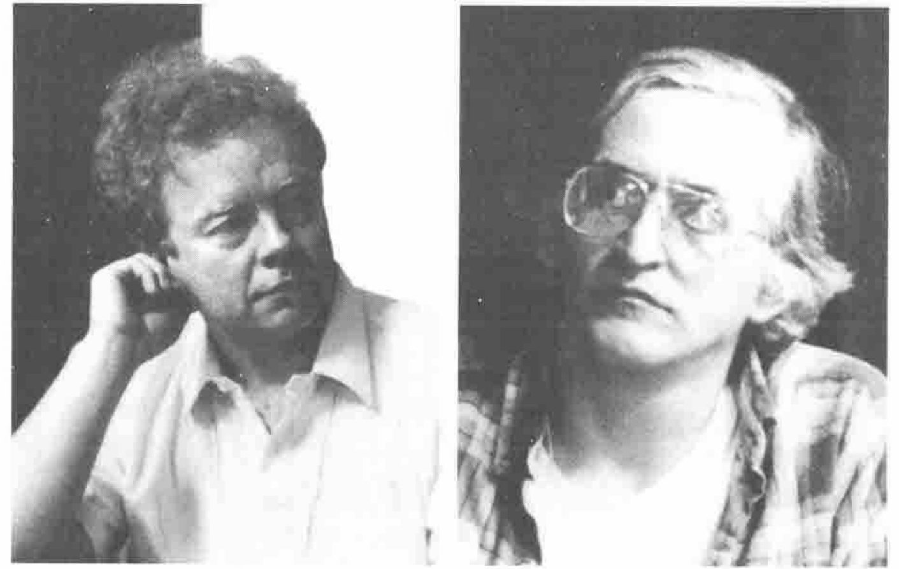

Oleg Luksha and Rolf Levenbach at the Education Workshop
{ .caption }

Eke van Batenburg wanted some marketing guidelines, saying "How do I justify teaching APL?". Anthony Camacho asked people to submit such material for publication in Education Vector. R G Brown offered copies of a course outline he had taught in New York financial institutions for some years. Phil Benkard felt that some people would like to know more about the theory of APL and how it works. Sasha Skomorokhov arrived and said he would like a book of problems and solutions in many languages so that people could see how short and elegant the APL2 solutions were. Someone reported that the annual ACM programming contest did not allow APL entries. Lee Dickey offered Waterloo University’s FTP (email file transfer protocol) site.

Professor Peelle summarised:

1. Encourage APL organisations to get young people to conferences
2. Produce workbooks
3. Provide a FULL (with graphics) APL cheaply
4. Publish material in Education Vector
5. List the universities and colleges where APL is used
6. Enter an APL team for the programming olympiad
7. Complain to the ACM about the exclusion of APL & enter their contest
8. Publish APL solutions to problems
9. Send material for circulation by email to Lee Dickey
10. Use email more for communication
11. Adopt a teacher and help to get APL used in school

Ed Shaw complained that this (two-hour) session had been a talking shop. There were no actions assigned; nobody had undertaken to do anything except Lee Dickey and the value of this meeting would be lost as soon as the people here forgot what was said. Ed is a go-getter and I agree with him; at each conference we begin again the job of considering how to get APL used in education and all we do is consider it. Readers of Vector can prove me wrong by taking up some of the suggestions and acting on them. I wish I had gone to hear the presentations on the Last Wind Tunnel, Jogging with APL and Cannibals and Missionaries which were on during this workshop.

### Alexander Kalinin: Information Security in the former Soviet Union

Colonel Kalinin worked for the KGB for 17 years and described it as a monster but its staff were just soldiers doing their jobs. He described the structure of the new federal agency which was linked to the major intelligence gathering department (part of the army). It has three sections: radio monitoring, government signals and cryptography. The cipher equipment is used by both the latter sections and computer analysis is used for special purposes in radio monitoring. After a survey of cryptography Colonel Kalinin told us that Russia has the world lead in cryptography and that private companies cannot compete with the government agencies.

### Alexei Skurikhin: Neural Networks in J

Regrettably the majority of the Program Committee took the view that J is not APL and that J papers should not be included in the conference. When a J paper by a Russian was submitted they amended their view to ‘J is not APL except when written by a Russian’. I look forward to papers from McIntyreski, Iversonovich, Huisov and McDonnellanov at Toronto. This presentation began with a partial history of neuro-engineering and the reasons for choosing J (its power and extensions beyond any enhanced APLs made implementation easier). The difference between explicit and tacit definition was explained; all the code uses explicit definition. An illustration in the paper builds the learn verb which incorporates a version of back propagation from twenty-nine subordinate functions. Mr Skurikhin explained how, as J does not have a ready-made menu generator, he used quickC and CScape to handle inputs and link-J to connect with J. The work was done in J version 3, but it is intended to convert to version 5.0 and to keep up to date with later versions as they are issued.

### Alexander Skomorokhov: Do Russian Children Like APL2?

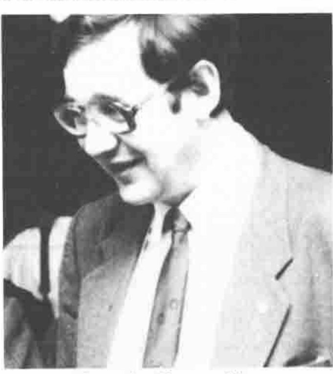

Alexander Skomorokhov
{ .caption }

Sasha’s foils were all ‘intentionally blank’. He told us that those that can, do: those that can’t, teach and those that can’t teach, teach teachers.

He strongly supported the use of an enhanced APL as an exercise of the mind. APL2 is like playing chess but much, much better. He would like to see an experiment where two classes were matched and one taught APL2 and the other not. He suspects that the APL2 class would become cleverer at non-APL2 subjects because the exercise in symbolic manipulation would be valuable in all thinking. Many computer languages can be learned and impart valuable lessons, for example Prolog, but the special quality of APL is that the pupil can look at the function and understand how the computer does it. The pupil can apply the function in new situations. APL kills the mystery surrounding the computer; instead of a magic black box whose results are not to be questioned it becomes a controllable machine for which we can take responsibility.

At the conference there was a daily class in which Sasha and others taught APL2 to a collection of 13 and 14 year-olds from local schools. He said he didn’t have to teach them; they taught themselves; they already knew Pascal and were too strong in computer science to need much guidance. He gave examples of the sort of things that they were doing by the end of the week.

He wished it was less expensive to equip a school to teach APL.

### Walter Spunde: Challenging the Maths Curriculum

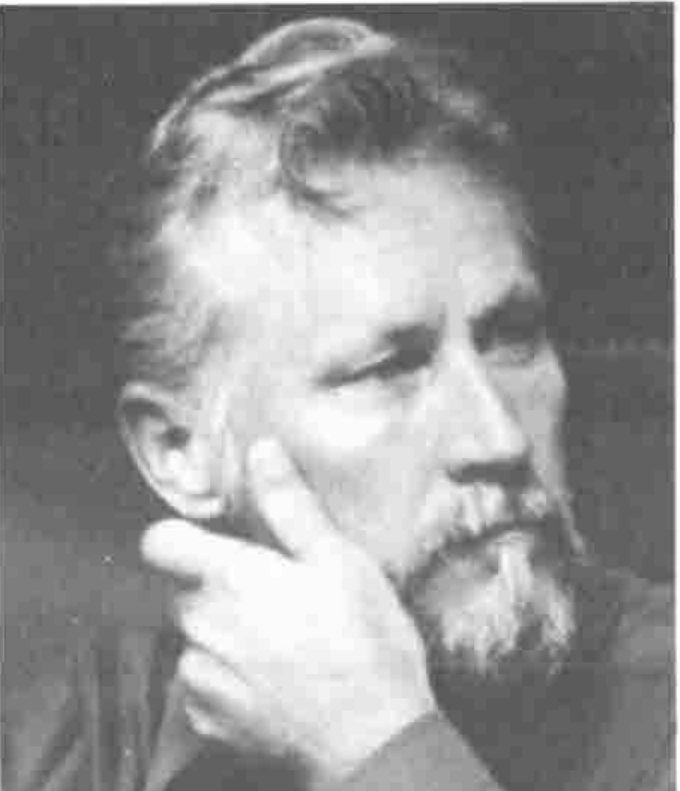

Walter Spunde
{ .caption }

After a slide of an ancient woodcut showing Boethius and Pythagoras, Walter suggested that the Abacus held up mathematical development for a long time because it replaced symbolic manipulation by rote operations. (Your reporter was surprised to find his bill in a St Petersburg bookshop added up on an abacus.) It is regrettable that many mathematics faculties look down on calculation. Many mathematical education packages simply fail to teach — they hide the material to be taught from the student and were probably wonderful mathematical educations for the authors.

A teacher has to think through the activity demanded of the student and how the student is to find a way to learn from that activity. Walter then asked us to try to find a way to show that the sum of the distances from the generators of an ellipse to a point on the ellipse is constant, and then by the aid of a picture of the cone with the ellipse and a sphere resting in the cone made it obvious. He seeks to achieve a better balance between geometric insight, symbolic manipulation and calculation.

His equivalent to the worksheet is a storyboard, on which exposition, problems, hints and suggestions for exploration can be mixed. Examples showed how the weaknesses of poor algorithms can be demonstrated. "In no other language could one afford the luxury of implementing so poor an algorithm to demonstrate a basic idea." Thus he aims to return ownership of the curriculum to the student.

He paid tribute to I-APL without which he might never have made the early steps in this work, but had found moving to APL\*PLUS (with the aid of an educational grant from STSC) a marvellously liberating experience. His conclusion was that APL is a very good tool to use in the classroom.

The presentation was a superb example of professional exposition. I urge anyone interested in education to read the paper; it has more commonsense in it about how to teach than I had heard at any APL conference.

### Professor Howard A Peelle: Education and the Future of APL

After listing the points in his summary from the education workshop (see above) and an extensive quotation from Tama Traberman’s address to APL 85, Professor Peelle listed for us one word for each letter (26) of the Roman alphabet which he felt was appropriate to APL and then one word for most (some of them cannot begin a word) of the (31) letters of the Cyrillic alphabet which he felt was appropriate to APL. The Cyrillic exercise was less successful owing to the limited vocabulary in Professor Peelle’s Russian phrasebook. This vapid exercise seemed to take hours — Professor Peelle went on so long that the educational meeting which he had called to follow-up the educational workshop was aborted.

### Per Gjerlov: the Song of the Whale

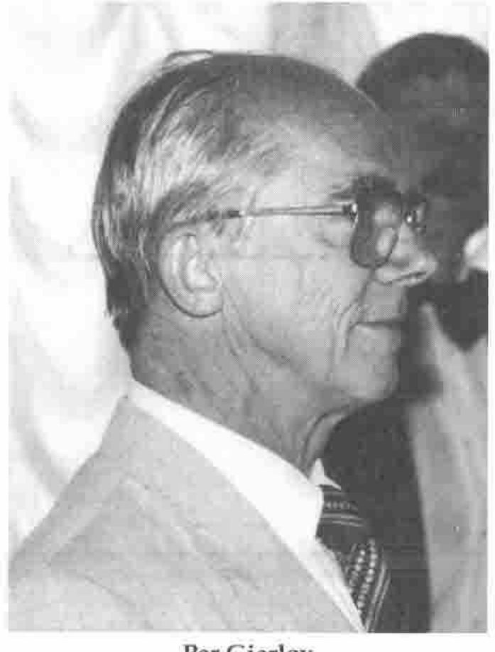

Per Gjerlov
{ .caption }

As Per said, this was a marvellous slide show of a holiday he has had since retiring from IBM, on a boat in the Azores with an English team researching a group of whales. It also had a serious purpose. The sounds made by the whales are recorded and the aim is to find out what meaning they contain. It would be nice to be able to identify whales from the sound each produces, for example. The sounds are mainly clicks and these are extracted from the recordings and plotted.

The data has been used several times in a course Per teaches at the laboratory for Applied Mathematical Physics at the Technical University of Denmark. There are other options which mostly use languages with which the students are already familiar, such as Fortran. The whale option attracted more than half the students this year and they surprised and delighted the authorities by the keenness they showed, the hours they worked in the laboratory and the excellent results some of them produced. As the option is only marked PASS of FAIL the motivation Per obtained from them was clearly excellent.

### Farewell [Friday 13.00-13.10]

Erkki closed the conference by changing his shirt to one with a holiday look and feel and telling us he thought he deserved a holiday! The noise the audience produced was evidence that they agreed.

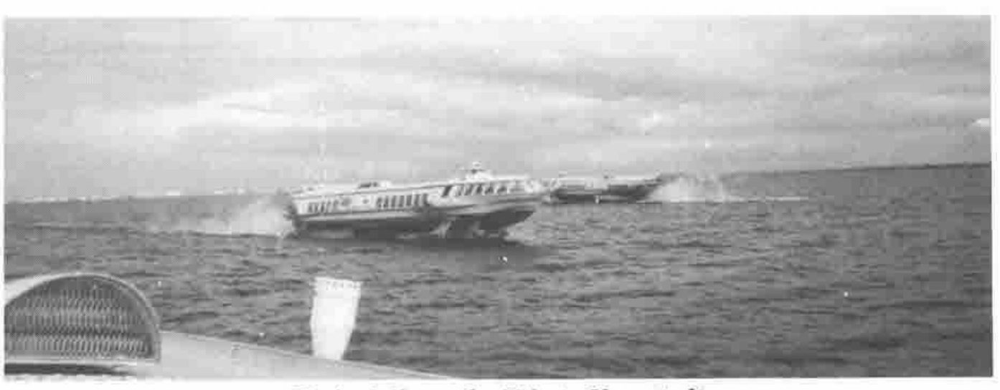

Hydrofoils on the Trip to Kronstadt
{ .caption }
