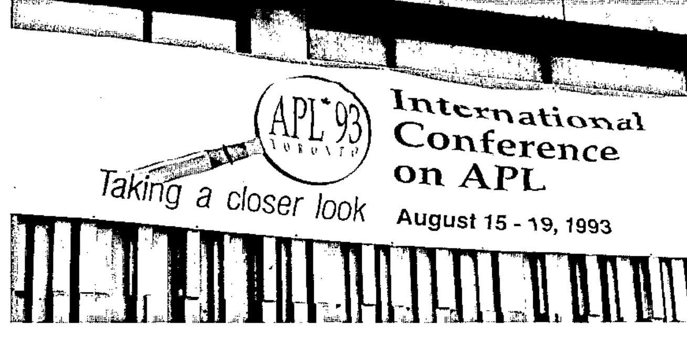
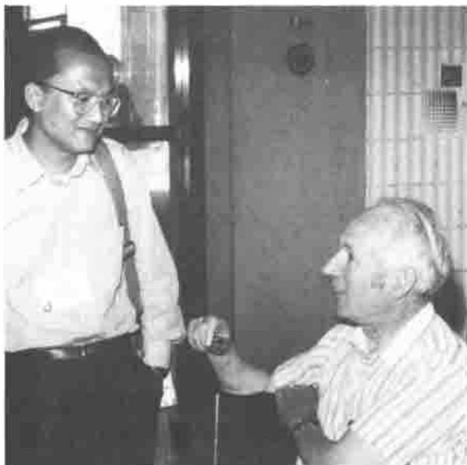
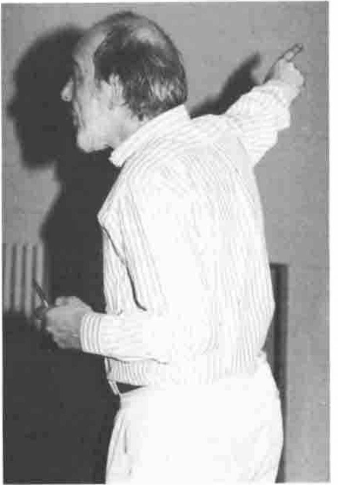
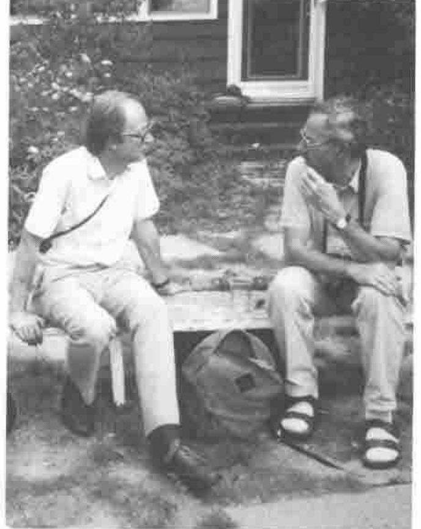
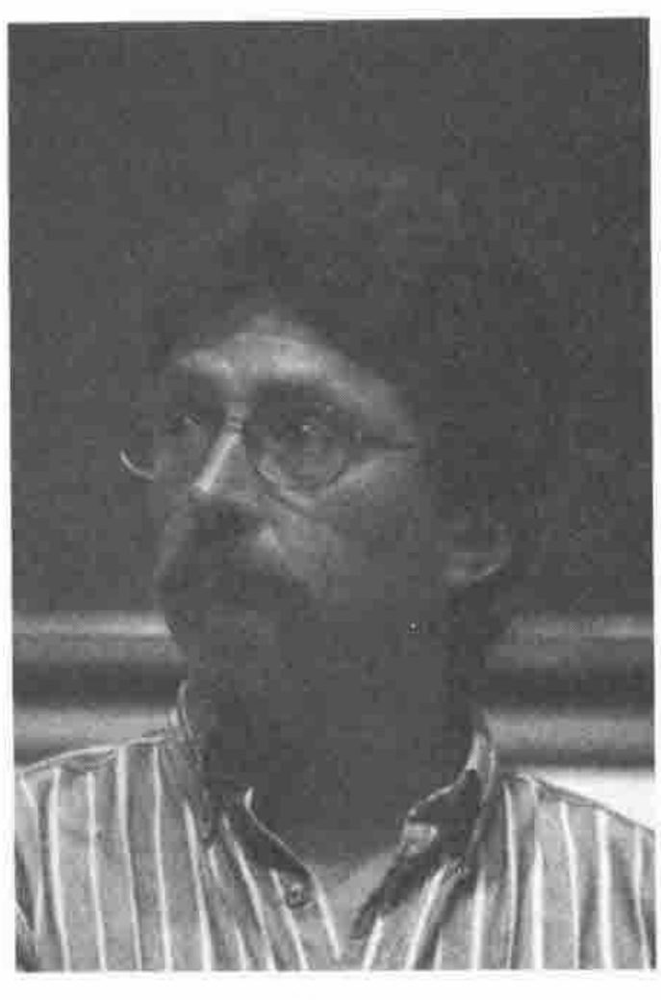
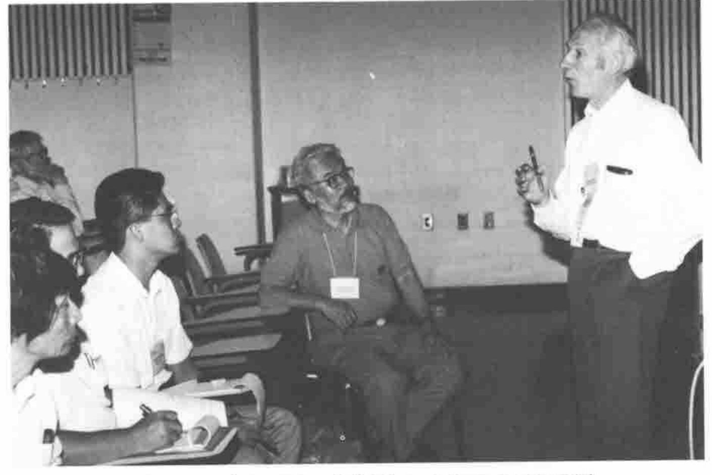
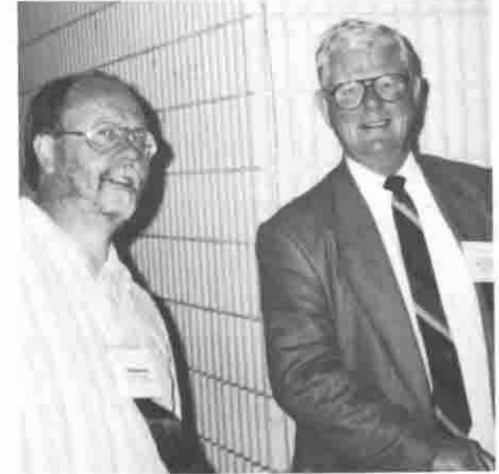
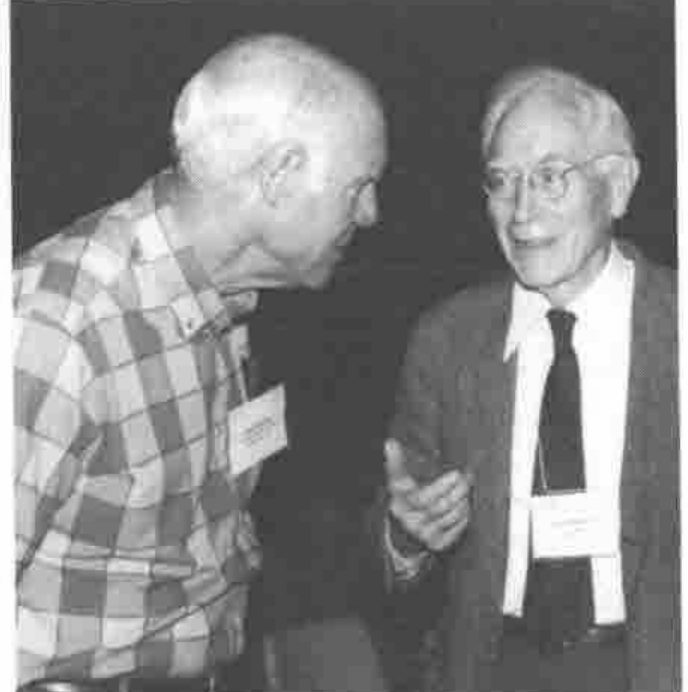

Thanks to everyone on the Vector working group for prompt and thorough notes on the tutorials and presentations.

Particular thanks to Richard Procter, Dieter Lattermann, Marc Griffiths, Diane Whitehouse, Ray Cannon, John Searle, Phil Benkhard, Anthony and Sylvia Camacho and Carlton Moore for an excellent set of photographs — the usual apologies for not fitting more of them into the available space.
{ .note }

## The Lessons of Toronto — APL93: Pain and Painkiller and well worth “Taking a Closer Look”

*by Sylvia Camacho*
{ .byline }

I was introduced to APL in 1980, after being connected with the computer business for over 20 years. My first reaction to APL was one of simple delight and the expectation that, as computing hardware increased in power, this astonishing language would take the programming profession by storm. I get no marks for foresight but as I listened to the papers at APL93 I was working hard on my hindsight.

### The Pain

**Donald McIntyre** *‘An Introduction to J’*: the reaction of the APL community to the introduction of J has been instructive. One old APL hand expressed to me in private the feeling that Ken Iverson had betrayed his loyal followers. This led me to reflect that while APL is above all things an intellectual pursuit, one does not have to work in the field for long before becoming aware that it generates pain.



Roger Hui and Donald McIntyre
{ .caption }

Fundamental change to a paradigm on which hard thought has been expended is very difficult to accept and persuasion to attempt it generates strong emotions. For years APL has provoked this pain in computing, mathematical and scientific communities outside the APL pale but J was born within the pale and is pricking us all.

Nevertheless this Workshop was over-subscribed and enthusiastically received despite being conducted in a high humidity heatwave in a room of 40 people and 30 computers with inadequate air conditioning. Donald makes no secret of the fact that he found J hard to come to terms with after years of APL. I have now attended his workshop twice and I have not attempted any J, notwithstanding which I am convinced Ken Iverson has surpassed APL in power and elegance. One of the most striking differences is that whereas APL borrows from and extends the use of mathematical terms, J borrows from and extends the use of grammatical terms. Why is this an advance? I can only say that the convergence of mathematical and natural language in the terminology used to describe the J structure ‘feels right’ and that this is a good scientific reason for adopting it: ask any leading physicist.

**Donald McIntyre:** *‘The Triumph of Symbols over Words’*. This was the opening plenary session. The theme has been explored before by Donald McIntyre although never before to the skirl of the pipes. The fact that J has abandoned the special APL symbols gives the theme an added significance. The APL community has grown used to the arguments accompanying its challenge to conventional mathematical notation. Now APL itself is challenged by the expression of similar ideas, extended and more coherent, but in the limited and arbitrary notation of ASCII. Ah, the pain of it!

Donald’s genius is to demonstrate amusingly that this conflict is as old as mankind. In particular Egyptian hieroglyphs changed from ritual priestly pictures to something more secular and with phonetic overtones. This being the language of the gods the apparently useful transition was resisted by the priestly establishment and the Egyptian language came to be written, for secular purposes, in the Greek notation. Thus the point is made that the notation may be better or worse for many reasons but it must not be confused with the language itself or the ideas the language expresses.

Is the pain eased by knowing that it was felt in all previous articulate generations? Perhaps not but it makes a superb lecture.


Part of the Plenary Audience
{ .caption }

### The Toiler in the Elysian Fields

**Gérard Langlet** *‘Building the APL Atlas of Natural Shapes’*: the most notable thing to be said of Gérard is that he does not feel the pain of the paradigm shift because he takes the tools Iverson gives him and builds a world of his own. Take, he says, a minimum set of numbers/nouns and functions/verbs and operators/adverbs: what does the name matter. Take, especially, not-equal scan and binary vectors and build models. I will show you, he says, that this simple set of tools can model the most profound theories in physics and biology (last year’s paper) and in fractals and related non-continuous, non-linear mathematics (this year’s paper). His bravado has an intoxicating effect and his pictures are beautiful and some are in the Software Exchange.



Gérard Langlet
{ .caption }

**Norman Thomson** *‘Understanding ANOVA the APL Way’*: Norman’s paper followed on from a typical polymath offering by Gérard Langlet. The two papers formed an interesting contrast but, as Norman said in his opening remarks, they both have an obsession: Gérard’s obsession is not-equal scan, Norman’s obsession is enclose with axis. He discovered that this was the key to developing functions to be used for the set of statistical procedures known as Analysis of Variance.

### The Painkiller

A different aspect of the pain associated with APL is generated by the tension between the detached intellectuals and the professional programmers with employers to satisfy and a living to earn. This Conference marked the start of the relief of that tension. The work put in by the APL Vendors is bringing Graphical User Interfaces to the market very shortly after the release of MS Windows 3.1. This Operating System is achieving the wide and deep penetration needed to set a de facto standard.

**Adrian Smith** *‘Co-operative Programming with Windows DDE’*: with the advent of DDE (Dynamic Data Exchange) and OLE (Object Linking and Embedding) and the, as yet something less than ideal, availability of DLLs (Dynamic Link Libraries), APL or J can be exploited to the full, doing the hard algorithms and leaving the hardware-user interaction where it belongs, in the Operating System.



Adrian Smith and Dieter Lattermann
{ .caption }

Adrian has adapted to this almost pain-free world with enthusiasm and demonstrated how to exchange data with other applications running under Windows to display a graph, format a document or manage a database. Excel is an excellent spreadsheet but it cannot invert a matrix? Then why not set it up with a new toolbar with controls identified by any picture you fancy (even the domino from that controversial notation). Then you can call APL from Excel and knock the numbers into shape. Whether it be with APL, J, Excel, Word or Access let each cobbler stick by his last and whatever the shape of the users’ feet their shoes will not pinch. Thus we can expect that next year’s Conference will be painless for both APL and J practitioners.

**Eric Iverson** *‘Windows GUI Programming in ISIAPL’*: Eric’s Workshop was one of the highlights of the Conference for me. I have been attending APL conferences since 1986 and at each I have heard pleas from APL programmers to APL implementors for tools to enable them to compete with the growing number of packages featuring Graphical User Interfaces. The various vendors of APL interpreters attempted to respond with Auxiliary Processors and then with system functions like `⎕WIN` but such language extensions are expensive to produce and expertise gained in one is not transferable to a different vendor’s product. Last year, however, Microsoft moved the game into an entirely different ballpark. The 3.1 version of their Windows Operating System sets a PC standard for GUI at an affordable price and provides the framework within which APL implementors can develop Windows tools quickly and cheaply. The May 1993 release of Iverson Software APLIWIN now goes a very long way towards responding to the clamour for tools to enable APL applications to compete in look and feel with the so-called Fourth Generation languages while having all the power of an advanced APL including nested arrays and compex numbers.

Eric began by explaining that he admires the Microsoft Visual Basic approach but that he feels when using it that he ‘does not know what is going on under the hood’. Therefore the goal for his APL and J Windows implementations was to create a *Window Driver* (`⎕WD`) which would be easy to learn and to use for straightforward applications. He envisages the Window Driver itself as a learning tool and so it takes the form of a script language like PostScript or SQL. He hopes to make the Window Driver itself available as a DLL (Dynamic Link Library) and thus able to be used in conjunction with other products, even other APL implementations. APLIWIN will also run under the OS2 Windows emulator.



Eric Iverson
{ .caption }

One of the most attractive APLIWIN features is an editor (`wdvedit`) which makes the creation and customisation of Windows objects easy and fast. Multiple boxes and buttons can be created and aligned and the window can be instructed to resize automatically to accommodate them.

APLIWIN has good on-line Help which should be printed to constitute a windows facilities manual. It comes with a set of workspaces which demonstrate GUI code and provide tools for the application builder. The price is very good: $30 US for APLIWIN, $30 for the language manual and free run time (£25 each from I-APL in UK). The language manual (fundamentally Sharp APL, of course) has the typical Iverson terseness and would be improved by an index but I have used APLIWIN for real (i.e. paid!) work despite having been brought up on APL\*PLUS.

The APLIWIN system function is `⎕wd` with a string argument consisting of elements of the scripting language with the semi-colon separators: e.g. `⎕WD 'ptop;'` keeps all the window visible (the colour of the title bar shows whether it is the window in use). See Adrian Smith’s report on the ISI tutorial (page 67) for more details and examples of `⎕WD` in use.

APLIWIN supports both DDE (Dynamic Data Exchange) and OLE (Object Linking and Embedding). The best way to learn about this is to invoke a second APL session `'winexec "PATH apl.exe"'` and move the new APL window to the lower half of the screen. If, like me, you give APL all the space you can spare you will have to cut the sessions down to a size compatible with simultaneous running. From the top window (the server) now enter `vd 'ddename serv;'` Then `⎕←d←'*data' wdg vd'wait;'` puts the upper session into Running mode.

In the lower session (the client) now enter

```apl
      )load isidemo
  vd 'ddepoke servtopic item "how now cow"'
```

after which ‘how now cow’ will appear in the top session and both sessions will be in Ready mode.

Two APL sessions are useful for learning DDE but one can then progress to making the top session Excel. In such cases the best results are obtained by creating an EXCEL macro to handle the data. The same applies when sharing data with the MS Access relational database.

### Conclusion

My conclusion is that complaints that APL applications cannot be given a competitive GUI ‘look and feel’ are now completely misplaced. There is a very powerful choice between using stand-alone APL which has been given a GUI or using DDE and OLE techniques to exploit the best features of other software.

For largely numeric data capture why try to re-invent the wheel? Use Excel, which is an excellent spreadsheet, and pass the captured data to APL for complex processing. For a good relational database with all the standard facilities use MS Access but pick up APL when the data processing gets tough. For a beautiful document incorporating APL use MS Word and cut and paste from an APL session.

Now who needs C or Fortran?



Saigusa translates at Donald McIntyre’s Japanese Tutorial
{ .caption }



Dick Bowman and Larry Moore — Chairman SigAPL and Chairman APL 93
{ .caption }



Don Farrand and John McPherson
{ .caption }
