This section of Vector documents all British APL Association meetings, and any other events of interest to the APL world. If you have recently attended any gathering which you feel would be interesting to Vector readers, please let the Editor have a brief note, and we will include it here.

APL95 has come and gone, and the Vector team have done their best to recover from the heat and the jet-lag in time to get a conference report together in double-quick time. Even so, we are running about one week behind our normal schedule, so apologies in advance if Vector has failed to reach you in July!

Thanks to Ray Cannon, Dieter Latterman and Anthony Camacho for the various photographs.

**The conference challenge:** Adrian’s name-badge was mis-spelled as "Andrian Smith"; place the minimum number of APL symbols to the left of the text vector `'Andrian'` to remove the unwanted `'n'`. In Dyalog APL you can do it with 3 characters!

## APL 95 at San Antonio, Texas

*notes by Anthony Camacho*
{ .byline }

The conference began on Monday 5 June. Before the opening plenary there was an excellent explanation of why APL is so valuable to actuaries, by Rhonda Aikens of United Services Automobile Association — a really large insurance company.

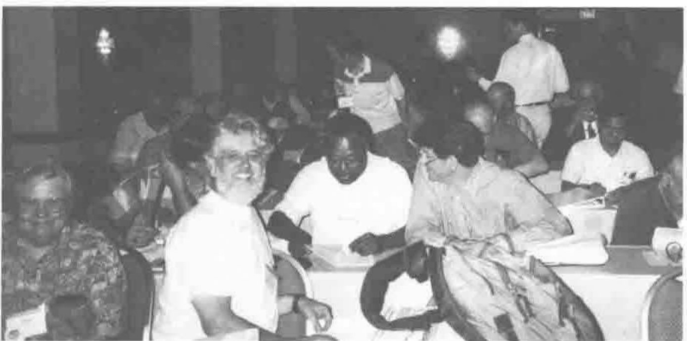

The Audience at the Opening Plenary
{ .caption }

The opening plenary was an analysis, by John Feo of the Institute for Scientific Computing Research at Lawrence Livermore, of the reasons for the comparative failure of SISAL (a functional scientific computing language) to achieve the level of usage and acceptance its developers aimed at. The analysis could also be applied to APL.

The lunch breaks were occupied by Vendor Forums: Dyadic on Monday, IBM on Tuesday and Soliton on Wednesday. The conference ended before lunch on Thursday with a closing plenary by Charles Brenner who explained the work of the paternity laboratory, which uses DNA analysis to provide evidence to exonerate a man from the accusation that he has fathered a child and occasionally can establish parentage beyond reasonable doubt. He didn’t show any APL because his portable and the display were incompatible.

The rest of the conference most of the time ran four streams in parallel — a seminar, a workshop and two refereed papers.

This meant a wider choice than usual and the opportunity for much fuller treatment. Seminars ran for 1.5 to 6 hours and many workshops for 3. Unfortunately there were no hands-on workshops. To provide a roomful of computers was too difficult or expensive.

There were under 140 delegates plus 60 or 70 people involved with the exhibition and conference organisation so splitting them into four streams sometimes meant a speaker had a very small audience.

Sometimes the organisers guessed wrong which sessions would be most popular and late room changes interrupted some presentations, but on the whole the conference ran very smoothly, with little trouble.

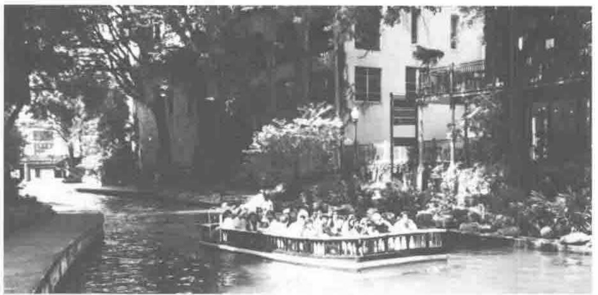

90 degrees in the shade!
{ .caption }

Having almost everyone stay in the same hotel where all the sessions and meals were did help to make it possible to hold ad hoc meetings or to go down to the bar for company if one needed it with a good chance of finding it. When the time in the lift is the major part of one’s travelling time one can do more, see more and end the day less tired.

On the other hand the negotiated special rate for the hotel, though good value for that hotel, was not cheap and for two people sharing a room the cost of registration and hotel was around $1500 plus meals. In our case the fare from England and back was almost as much and so the total cost for two people was over $3000.

At this rate very few people who have to pay their own way choose to attend. Most delegates were paid for by their employers and it is now the accepted wisdom that a conference full of seminars and workshops is more likely to motivate employers to send their staff than a conference that looks like a holiday.

The St Anthony hotel occupied a whole side of Travis Park, which is square, and the banquet was held in the open air on the paved area around the memorial to ‘Our Confederate Dead’ in its centre. The food was Mexican-style and there was a guitar playing trio, a cowboy skilled with whip and juggling and a (very loud) Mexican 8-piece band. There were Margheritas and beer to drink; the beer didn’t run out and the promised cash bar did not materialise. Wine drinkers were not catered for. The San Antonio police and hotel security staff kept out interlopers.

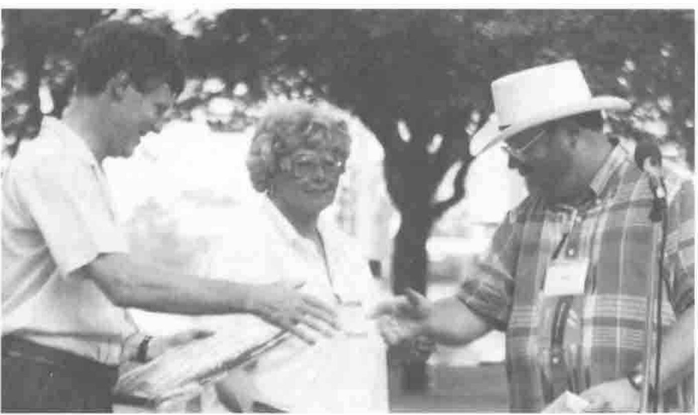

Peter Donnelly receiving his shared plaque from Mike Kent, (with Melissa Dalton of C/M Planners in the background)
{ .caption }

At the banquet the Kenneth E. Iverson award for outstanding achievement was presented by Mike Kent to John Scholes and Peter Donnelly. In response John and Peter gave handsome credit to their colleagues in England. Stuart Yarus announced that APL 96 would be held in Europe with himself and David Eastwood (of the British APL Association and MicroAPL Limited) as joint chairmen and with Adrian Smith and Phil Benkard as joint programme chairmen. The location is not yet fixed.

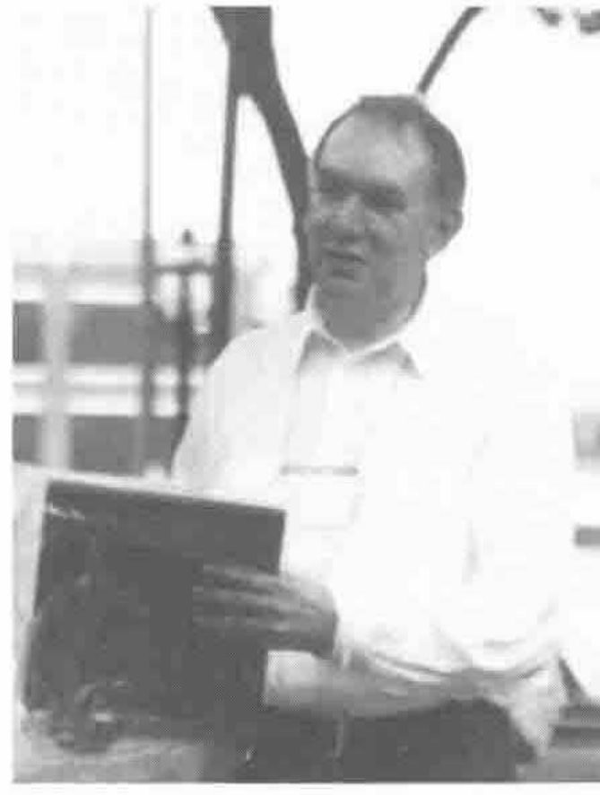

John Scholes shares the Award
{ .caption }

The hotel was less than two blocks from San Antonio’s attractive Riverside Walk which has paths along both sides of a narrow loop in the San Antonio river with many restaurants, bars and shops. There is even a theatre with the seats on one side of the water and the stage on the other. It was also an easy walk from the hotel to the Alamo, the Mexican ethnic market, the craftsmen’s colony ‘La Villeta’ and many good shops.

For me the outstanding feature of the conference, which was so well designed and run to be attractive and valuable to corporations and their employees, was the amount of J.

I spent the majority of my time in J sessions and nearly all were well attended. There were eight J papers, a six-hour seminar by Donald McIntyre, a three hour seminar by Ken Iverson aided by Roger Hui and a 1.5-hour seminar by Chris Burke. There were even occasions when two J sessions clashed. I am very glad to see how far the APL community has come to recognise that J is APL and of great interest even to an audience predominantly consisting of commercial APL programmers. As recently as St Petersburg many people were taking the view that ‘J is not APL unless written by a Russian’.

There were some marvellous APL papers. Bob Bernecky awarded prizes to Kevin Harzfield (for his paper on modelling the effects of acid leaching on concrete), to Clare Townsend (for her APL implementation of the Club of Rome’s world model of population) and to (Bill) Koko (for the presentation of his six-hour seminar on Nonlinear Constrained Optimisation).

As John Searle was unable to attend we cannot bring you his usual collection of quotations. Here is the best I could glean:

> Roger Hui, explaining his programming style: ‘I adopted it in self-defence so I could keep up with Ken’.
>
> Donald McIntyre: ‘Everywhere you look you see almost nothing but forks’.
>
> Ken Iverson: ‘… engineers — characterised not so much by their ignorance as their pride in it.’ ‘A mathematician, no matter what problem you give him, reduces it to the previous case.’ Of Graham, Knuth and Patashnik’s book on Concrete Mathematics: ‘The way they managed to make do with conventional mathematical notation is an absolute marvel.’
>
> Harvey Davies: ‘Even the driver’s blind dog knows that zero divided by zero is bugger-all.’
>
> A rumour heard at the banquet: ‘Dyalog’s migration level `⎕ML 99` will give Dyalog users 100% compatibility with J.’
>
> Phil Benkard: ‘Scalars conform easily, because they have no axes to grind’ and (later in the same session) ‘… and they are not afraid of getting in over their depth.’
>
> Phil Benkard: ‘With Vector notation, you can’t create a 1-item vector.’

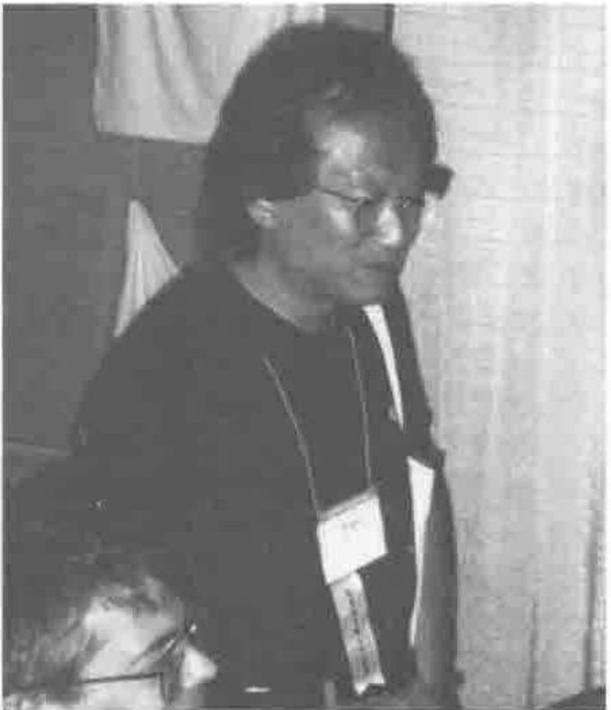

Roger Hui with Chris Burke
{ .caption }

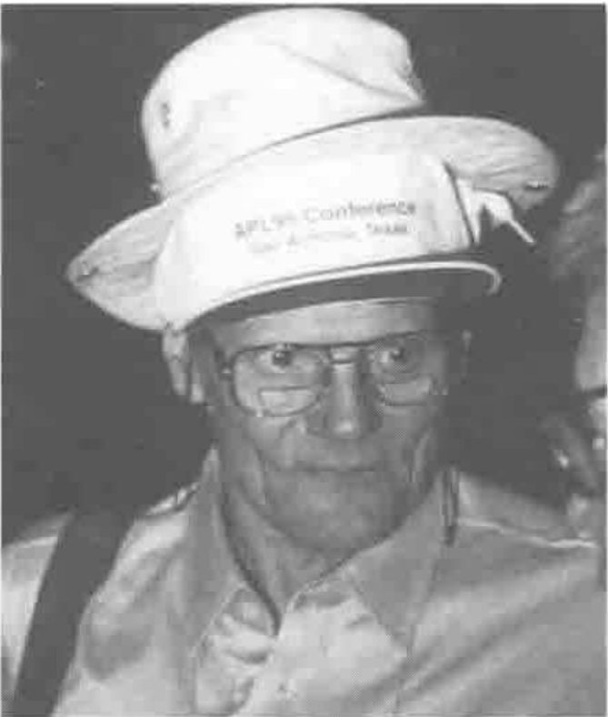

Phil Benkard wearing two hats!
{ .caption }

## My Conference

*by Sylvia Camacho*
{ .byline }

Everyone attends a different Conference as a consequence of their choices between sessions. This year there were papers, panels, workshops and seminars in addition to invited speakers and plenary sessions. So here I am describing my conference.

This year was also unusual in having an invited speaker before the opening plenary. Rhonda Aikens of United Services Automobile Association struck an upbeat note by her enthusiasm for the use of APL for a core set of tools used by her Company. She was accompanied by some of her staff and the suggestion that they would be around the Conference looking to see what they could learn or teach was encouraging. I wonder, did it happen?

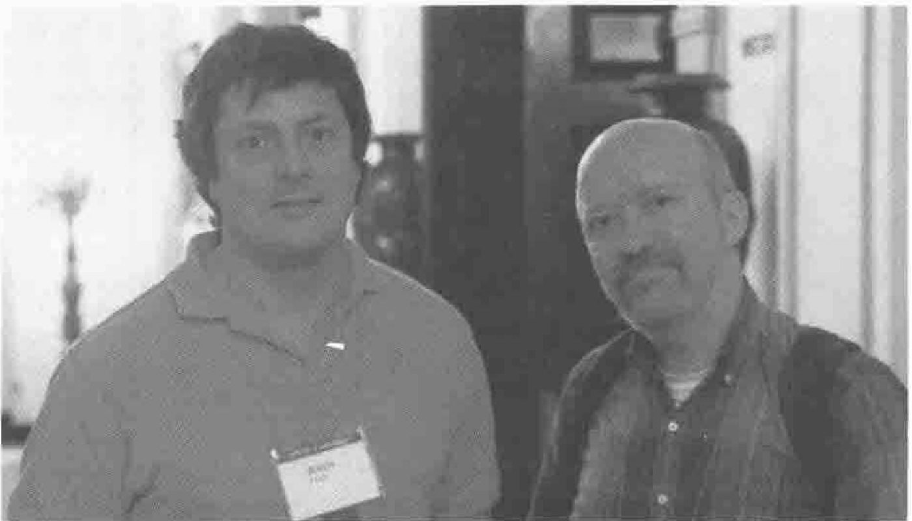

John Feo with Bob Bernecky at the Opening Plenary
{ .caption }

The opening plenary was a presentation of the flip-side. Dr John Feo of the Institute for Scientific Computing Research spoke about the SISAL language project which has been under development for the past twelve years but has made little headway against FORTRAN, COBOL and LISP. He is now of the opinion that it would be preferable to work to develop new facilities within established languages such as FORTRAN and points to the success of C++ as an example. I felt that the vendors who presented their latest changes at APL95 had taken most of this message on board and are now moving to a much more favourable position in the market.

The Dyadic presentation by John Scholes was a superb piece of laid-back theatre which gave the impression of a confident and competent group who like what they are doing and enjoy each others’ company. For those who know the duck joke, this time there were multiple ducks on multiple ponds and I predict that next year they will lay eggs.

The IBM vendor presentation by Jim Brown was workmanlike and carefully targeted to support those many programmers who have to support old-fashioned, largely mainframe, systems. I believe they will be stimulated to investigate the many ways IBM now makes it possible to give perfectly serviceable code a modern look and feel without the expense of a major rewrite.

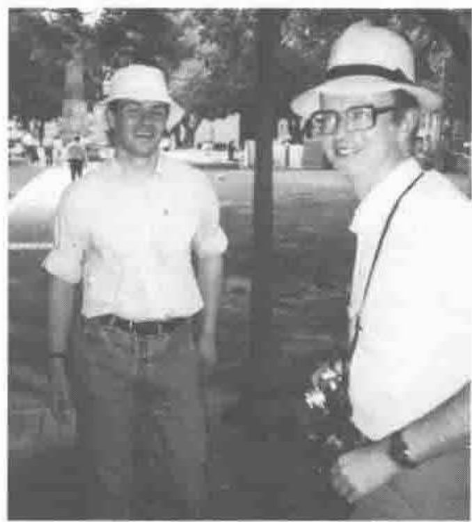

Team *Causeway* at ’95
{ .caption }

The confident forward-looking stance was also very noticeable in Adrian Smith’s workshop based on his *Rain* workspace which is shipped as shareware with Dyalog APL/W. The graphics are superb and potential users should have come away confident that they will be given good support over a wide range of platforms. This impression was reinforced by the presentation of the Causeway GUI software, which Adrian and Duncan Pearson’s new company is now supporting. Thanks to both for taking the Mayor’s Suite and for the beer they provided in it.

There is a convergence of ideas within the APL community that tools are now available to enable the complex algorithms and fast development times, which have always characterised APL, to be offered to users in any guise which makes them feel comfortable. If they have a favourite spreadsheet, you can now hide APL behind it to do the number-crunching. If they are Visual Basic experts wrap their APL up that way. On the other hand, if they are APL experts, the vendors are fast learning to match and outmatch the GUI functions of all the popular packages. In this respect APL is moving towards the position in the market currently occupied by C++ which can only be coded by experts or very enthusiastic amateurs, but naive users need never be aware that APL is the engine at the back of their screen. The closing plenary was a good example of this; Charles Brenner needs APL to make his heavy analysis change rapidly with his research but he directed the interest of his audience entirely towards his fascinating investigation of comparisons of DNA which has been made possible by the Genome Project.

The bridge for me between these commercial considerations and the rest of my Conference was exemplified by the fairly intense reaction of Alan Sykes towards Walter Spunde’s championship of a concrete numerical approach to the teaching of Calculus. Alan is concerned that the abstract methods traditional to mathematics will fall victim to the power of the computer. As an interested onlooker I think they are both right.

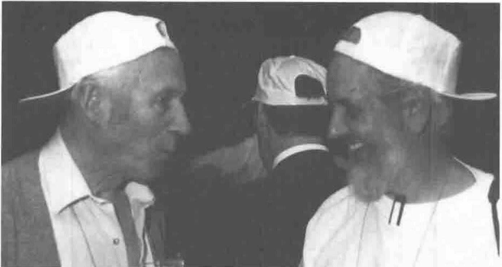

Donald McIntyre and Anthony Camacho showing his J side
{ .caption }

The remainder of my conference was taken up by J. First with Donald McIntyre’s seminar which made me believe at last that I could come to terms with J and that there is no better way to spend my time. I know that it is hard for professionals still needing to make a living, whether as Vendors or programmers, to accept that Ken Iverson’s second thoughts are a great advance on the APL notation which has had no rival over so many years. As the editorial to Vector 11.1 admitted, APL is a language for the elite and practitioners have a large investment in it. J is a dialect of APL and the relationship is obvious but there is no upward compatibility and the learning curve is steep.

## The Exhibition

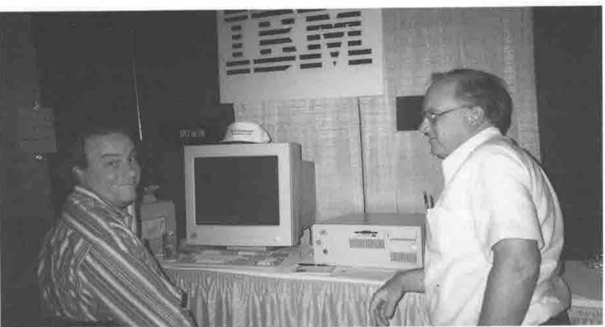

Dave Liebtag and Jim Brown on the IBM Stand
{ .caption }

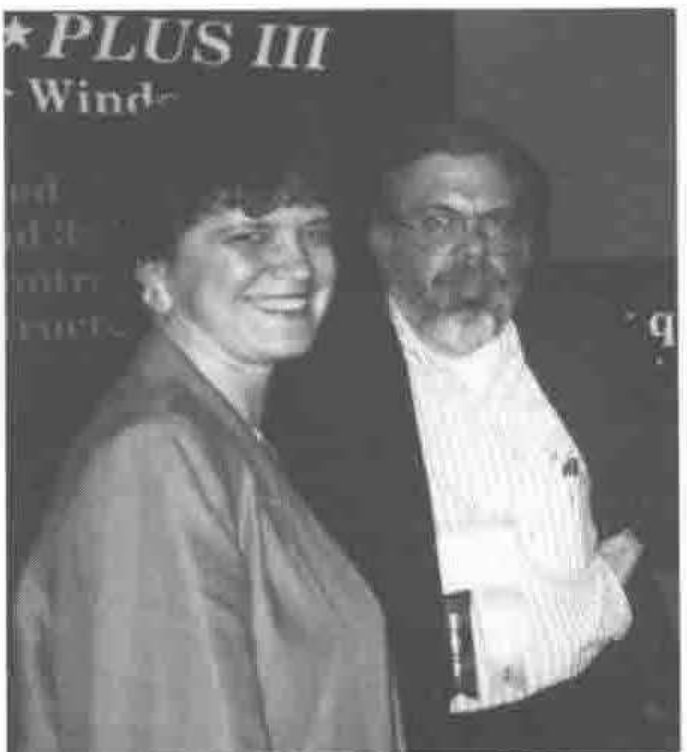

Jaci and Bill Rutiser of Manugistics
{ .caption }

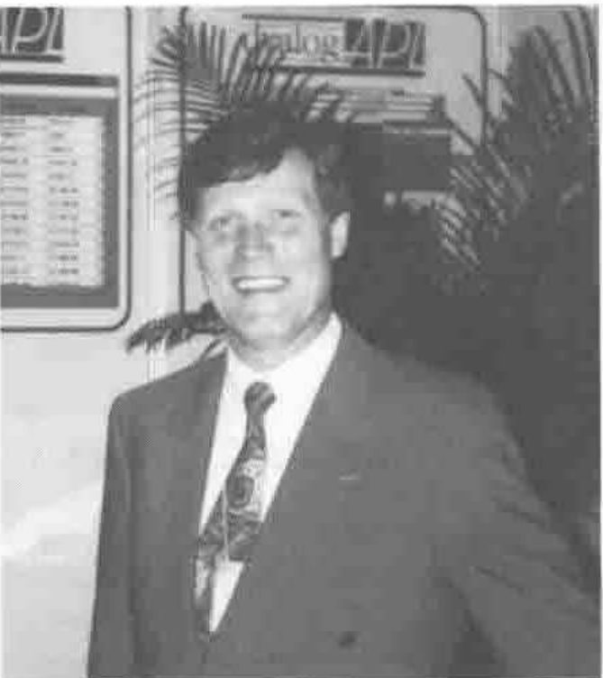

Peter Donnelly of Dyadic
{ .caption }

The seminar on Ken Iverson’s new book ‘*Concrete Math Companion*’ was given by Ken with Roger Hui at the keyboard. It was a delight for the way it demonstrated how well their minds are matched. It is always a pleasure to see a highly intellectual enterprise pursued with total commitment. However it was Chris Burke who added the icing to the cake for me by showing that the version of the J software now being sold by Strand Software has the facility to present a GUI face to the world. What is more, as J is based entirely on ASCII files, it will look to naive users like a conventional motor even if they lift the bonnet (Brit for ‘hood’). Consequently I believe that this language for the elite could come into widespread use. Why should J libraries not come to rival FORTRAN or C libraries? It has none of the unfamiliar look imposed by the special environment and character set of APL and thus J developers have the enormous advantage of moving onto a greenfield site, but they can build using the computer infrastructure established over many years by the major software vendors and accepted without question by computer users.
