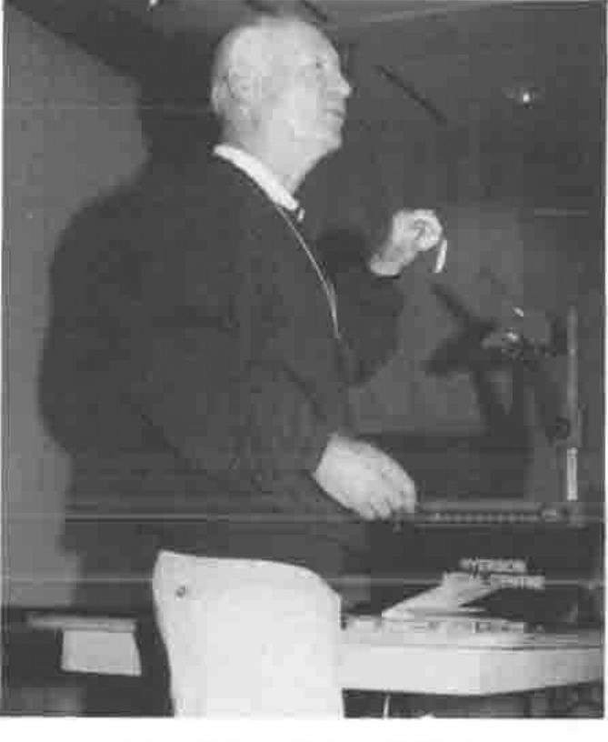
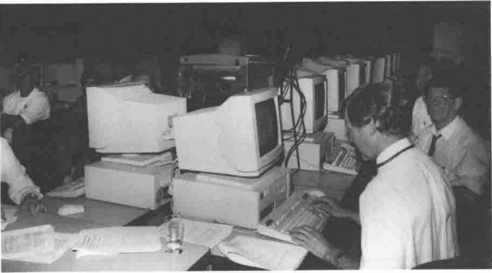
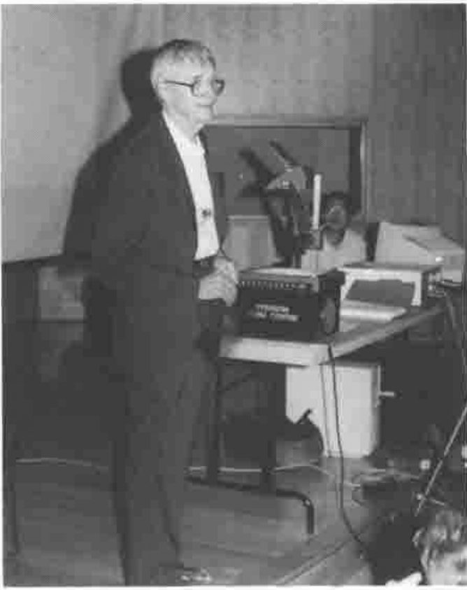
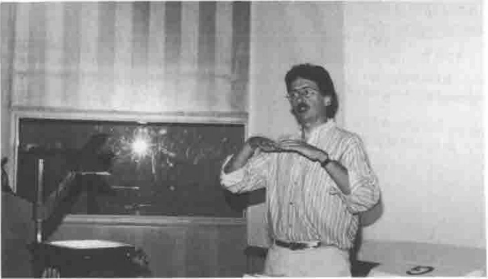

*by Duncan Pearson and Adrian Smith*
{ .byline }

## Acknowledgements

The conference notes are mainly by Duncan Pearson, with some extra material from Adrian Smith. The photographs are selected from the very comprehensive set by Richard Proctor.

The three papers which follow have been revised by their authors subsequent to the conference, but are not materially different from the material which appears on the APL98 CD ROM.

You may order the APL97 CD ROM from www.torontoapl.org for $C20, postage paid world-wide, via cheque, money order, Visa, Master, or Amex. Toronto SIGAPL will make the CD ROM electronically available and updated at, or linked to, its web page (www.torontoapl.org).

Vector 14.3 will carry a full directory listing of the CD, with abstracts of papers where available.

## Opening Address (Ian Sharp)

This talk was for many the highlight of the conference, probably most for the wit, poise and excellent comic timing of Ian Sharp. Using the parallel of the pocket knife he attacked the tendency of the writers of interpreters to add "useful" features to what was a simple elegant tool and made a proposition that each major new feature, each extra blade on the knife, halved its market, even though the new "improved" version was fully "upwardly compatible" with the old.

Ian Sharp with an OBPK
{ .caption }

He may have had a point and his speech was very well received, perhaps by many who had been programming in 2nd generation APL too long to remember quite how painful some things could be without the benefit of nested (or boxed) arrays.

> *"Remember – every time you add a new feature to your product, you reduce its potential market by half."*

Perhaps the less well remembered part of his talk was about the role of the refrigerator with its post-it notes, rather than the television, as the family information centre. He pointed out that a great deal of what we see as advanced computing and user-interface techniques have been going on in people’s kitchens for many years already, such as overlapping windows and garbage collection (on notes) using a complicated combination of least-recently-used and time-expired algorithms.

## Dyalog APL Socket Programming

This was a workshop using the one laboratory of networked PCs. Peter Donnelly introduced sockets and TCP/IP in the context of the Dyalog APL implementation which is well integrated into their GUI object/message structure with socket objects of different types and events occurring on them, to which callback functions can be attached. Sockets on different ports, which might be implementing different interfaces to the same data, would have the functions specific to each interface as callbacks on the events of the sockets for that interface. The event functions might themselves reside in the namespace of the socket. This contrasts with the J approach which provides a very thin cover on the socket API through a foreign conjunction, and a number of cover functions to simplify most of the standard tasks. The J approach might provide a finer control but it would be easier for the tyro to get going with the Dyalog implementation as we saw from the success of the exercises.

Peter Donnelly giving his Workshop
{ .caption }

Everyone ran through a series of exercises that developed through two interpreters on the same machine passing text messages to each other, to interpreters on separate machines exchanging APL arrays. The pace of the exercises was well judged with very few users falling behind and with plenty for the more adventurous to get their teeth into. There were few of the technical glitches that have dogged this kind of event in the past and the whole thing seemed to run very smoothly.

## Bob Bernecky — APEX Compiled APL

In this talk Bob went through the reasons for compiling APL and then described some of the techniques that he uses to provide improvements in execution time.

The main reason for the whole exercise being speed Bob went into just what takes the time in normal APL execution. From runtime analysis of the Sharp APL timeshare system and from other studies he gave statistics that only a quarter of all time taken was spent in the primitive functions and that the rest was distributed between syntax analysis, argument conformance checking and memory allocation. The one surprise to those who have not attended one of Bob’s talks is that in nearly all APL systems, whether they are well or badly written, the majority of code is working on one- or two-element arrays and that the standard argument for APL, that the interpreter overhead is compensated for by the small amount of interpretation relative to work done, is simply not valid in reality.

The second and to me more interesting part of the talk concentrated on some of the techniques used to reduce the time taken in not only the syntax analysis but also in the conformance checking and memory allocation, and even in some cases by the use of clever optimisations in the execution. The APEX compiler works on a self-contained unit of code, usually a function and its sub-functions, for which the inputs and outputs are known. It analyses code in files in the APLASCII Workspace Interchange Format (`.wif`). It determines for each noun in the system as much information about it as it can, for each stage in the process. If on one line a variable is assigned a permutation of an index vector using deal on equal arguments, then on subsequent lines where that variable appears the rank and datatype are known, provided that there are no branches of execution in between the assignment and the use. If the assignment used a constant argument to the deal then not only is the rank but also the shape known. This allows pre-allocation of memory. If the fact that it is a permutation vector is also carried forward and a subsequent use of the vector is to sort it, then an optimised single-pass sort that uses a pigeon-hole technique can be used providing further reductions in execution time.

These methods are obviously heavily dependent on being certain of the possible execution paths through the code and much of the work that Bob has done is in this area where he uses state-of-the-art analysis to determine this as reliably as possible.

The output of the analysis of the APL is not machine code, nor even C, but SISAL which is a language optimised for parallel execution on multi-processor machines. This in its turn generates C which is compiled into the object code. The opening plenary at APL95 was given by the leader of the SISAL project at the Lawrence Livermore Laboratories. For those compiling APL, speed is obviously important and to such people the best use of multi-processor machines is likely to be a significant requirement.

## Ken Iverson and Roger Hui — The Mathematical Roots of J

This talk, particularly the second half, was for me the highlight of the conference. Ken and Roger did a double act with Ken on the foils doing most of the talking and with Roger on the keyboard interjecting with more detail and providing interesting examples using the new J Version 3.05.

Ken and Roger
{ .caption }

I had expected an abstruse talk on the domain theory underlying the J syntax but in fact the talk was more about the way in which APL and J have their conceptual roots in mathematical ideas and notation. The talk had the title it did because nearly all of the examples, especially the more detailed ones, were from J. One explanation that stuck in my head illustrates these roots well. The constant verb, which to a programmer seems a superfluous thing, is seen in context when considering for example the third derivative of a cubic which, despite being constant, is still a function.

The talk was wide ranging and covered the main explanatory areas of the dictionary pretty much in order. There were explanations of the intrinsic ambivalence of all J verbs, the cap, the fork (covering also the dyadic case which was missed in Donald MacIntyre’s talk at APL96) and also the way in which verbs act on arrays using rank, including an explanation of cells frames and atoms. There was a diversion into history to discuss the etymology of matrix and vector and then a discussion of roots of unity at which point Roger said that he had some examples. He dazzled us with some neat expressions demonstrating the isomorphism of the group of seventh roots under multiplication to iota 7 under + mod 7. Ken then went on to give an explanation of Dual and its similarity to matrix operations involving transpose and inverse.

After some more examples from Roger we moved into the seriously mathematical realm of Stirling numbers, coefficients of the Taylor expansion — which I thought was extremely well explained, and Fibonacci numbers. About here I got a little lost but I retained a feeling that my time had been well spent and that J was supremely well suited to supporting the teaching of mathematics in high schools. It is good that this market is now being explored by Strand and ISI.

## John Scholes — Dynamic Functions

The use of dynamic functions has been explained in Vector already after they made their appearance at APL96 so I will not go into the details here. John gave us some of the background, explaining how he had caught the functional programming bug and had dreamed of incorporating the techniques into APL. He gave some simple examples of the syntax and demonstrated recursion and also the use of tail recursion to simulate looping. He has put the same optimisation into Dyalog APL as appears in Scheme and many other LISP dialects. If the last line of a dynamic function is a call to itself, after which no more work needs to be done in the function, then the function need not create a new level of the stack, but merely take its arguments back up to the beginning again. This and the lexical scoping, whereby free variables are bound at definition time rather than at execution time, show the roots of dynamic functions in functional programming and LISP. The next thing that John must implement to hook us completely, is execution on demand and thus infinite lists.

## Eric Iverson — Java and J

Eric’s talk, falling as it did at the end of the conference, provided the cream on the bread and butter pudding. He gave a simple and immediately understandable explanation of the underlying internet technology, the best I have heard, and then went into what Java was all about. It is best perhaps to give some quotations.

On HTTP and HTML:

- "Like the best magic it relies on the simplest trick"
- "It is an OBPK" (which turned out to be Ian Sharp’s One-Blade Pocket Knife)

On Java:

- "Java is not an OBPK. It has fork, spoon, kitchen sink, hot and cold running coffee — I LOVE it!"
- "It has all of the drawbacks of a compiled language and all the drawbacks of an interpreted language all rolled into one small neat package."
- "There are 100s and 1000s of Java books out there which are all the same apart from a few short sentences."

Eric Iverson on HTML
{ .caption }

Having warmed the audience up suitably he could do no wrong and so he moved on to the main body of the talk. He demonstrated how to build a web page that took a J expression from a field and displayed the result of executing in another field. When the example worked he nearly got a standing ovation.

## Conclusion

In summary it was a very worthwhile conference full of interesting talks. The facilities were adequate to the task and well worth the low cost of the conference. If they organised another I would probably be there.
