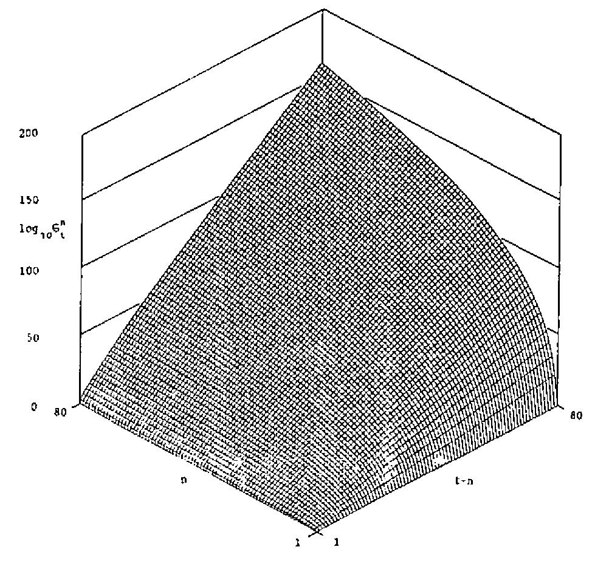

*by D R Appleton*
{ .byline }

## Theme

Several different APL functions, for the evaluation of Stirling numbers of the second kind, are presented. Their advantages and disadvantages are discussed.

## Exposition

A colleague doing some theoretical statistical work on the analysis of an experiment which had resulted in counts from the truncated Poisson distribution being observed, recently asked me if I had an APL function to evaluate the Stirling numbers of the second kind. I did not have such a function, but he told me they were defined for positive integers n and t by

σ<sub>t</sub><sup>n</sup> = (1/n!) Σ<sub>k=0</sub><sup>n</sup> (n k) (−1)<sup>n−k</sup> k<sup>t</sup>

a formula obtainable from Abramowitz and Stegun (1964). With APL it is easy to turn this expression into executable form, for example:

```apl
    ∇ Z←N STIR1 T;K
[1]   Z←(÷!N)×+/(K!N)×(¯1*N-K)×(K←0,⍳N)*T
    ∇
```

However this function can be improved: it ignores the fact that the first term is identically zero, it does not make it clear that the result is always positive, and APL has a more concise way of summing alternating series. A better function is therefore given by

```apl
    ∇ Z←N STIR2 T;K
[1]   Z←|(÷!N)×-/(K!N)×(K←⍳N)*T
    ∇
```

It may or may not be numerically preferable to factorise out the n! and use

```apl
    ∇ Z←N STIR3 T;K
[1]   Z←|-/(K*T)÷(!K)×!N-K←⍳N
    ∇
```

Of course APL’s power comes from its ability to handle several different values simultaneously. We could easily have a vector for *T*.

```apl
    ∇ Z←N STIR4 T;K
[1]   Z←|-⌿(K∘.*T)÷⍉((⍴T),N)⍴(!K)×!N-K←⍳N
    ∇
```

However, it is likely that the values of *T* we would require, at least to form a table of the Stirling numbers (which might be useful in the long run to save calculation) would be all the positive integers up to *T*. This leads to

```apl
    ∇ Z←N STIR5 T;K
[1]   Z←|-⌿(K∘.*⍳T)÷⍉(T,N)⍴(!K)×!N-K←⍳N
    ∇
```

and we could have, had we wished, developed `STIR2` to this form instead of `STIR3`. If we wish to produce and save a table of the numbers we may build `STIR5` into a loop:

```apl
    ∇ Z←N STIR6 T;I
[1]       Z←⍳0
[2]       I←1
[3]   L:Z←Z,I STIR5 T
[4]       →(N≥I←I+1)/L
[5]       Z←(N,T)⍴Z
    ∇
```

It is now time to look at the table of numbers this function produces; this is shown in Table 1 for `N=6` and `T=6`. It becomes very clear that a function which wastes its time calculating values for `N>T` is unsatisfactory. This, of course, should have become evident if a little more algebra had been done before turning to programming, or if `STIR2`, say, had been properly tested, but the functions are so simple it hardly seemed necessary to test them all individually!

*Table 1*
{ .caption }

| n \\ t | 1 | 2 | 3 | 4 | 5 | 6 |
|---:|---:|---:|---:|---:|---:|---:|
| 1 | 1 | 1 | 1 | 1 | 1 | 1 |
| 2 | 0 | 1 | 3 | 7 | 15 | 31 |
| 3 | 0 | 0 | 1 | 6 | 25 | 90 |
| 4 | 0 | 0 | 0 | 1 | 10 | 61 |
| 5 | 0 | 0 | 0 | 0 | 1 | 15 |
| 6 | 0 | 0 | 0 | 0 | 0 | 1 |

## Development

It is important to define more coherently the problem we are tackling. We now want to produce a table of Stirling numbers in which the element at row n and column p contains σ<sup>n</sup><sub>n+p</sub>, and to solve the practical problem underlying the computing problem we would like n to take values up to at least 100 and p to reach at least 2n for as many values of n as possible.

This means rewriting `STIR5` as

```apl
    ∇ Z←N STIR7 P;K
[1]   Z←|-⌿(K∘.*N+⍳P)÷⍉(P,N)⍴(!K)×!N-K←⍳N
    ∇
```

Running this in a loop produces Table 2 for N=8 and P=6. The magnitude of the values appearing in the table gives rise to concern for the function: when will it overflow? This is certainly a matter which will have to be investigated, but there are other interesting aspects to the table.

*Table 2*
{ .caption }

| n \\ p | 1 | 2 | 3 | 4 | 5 | 6 |
|---:|---:|---:|---:|---:|---:|---:|
| 1 | 1 | 1 | 1 | 1 | 1 | 1 |
| 2 | 3 | 7 | 15 | 31 | 63 | 127 |
| 3 | 6 | 25 | 90 | 301 | 966 | 3025 |
| 4 | 10 | 65 | 350 | 1701 | 7770 | 34105 |
| 5 | 15 | 140 | 1050 | 6951 | 42525 | 246738 |
| 6 | 21 | 266 | 2646 | 22827 | 179487 | 1323652 |
| 7 | 28 | 462 | 5880 | 63987 | 627396 | 5715424 |
| 8 | 36 | 750 | 11880 | 159027 | 1899612 | 20912320 |

From row 2 it is clear that σ<sup>2</sup><sub>t+2</sub> = 2 σ<sup>2</sup><sub>t+1</sub> + 1, and from row 3 it is not too difficult to deduce that σ<sup>3</sup><sub>t+3</sub> = 3 σ<sup>3</sup><sub>t+2</sub> + σ<sup>2</sup><sub>t+3</sub>, and hence to discover the recurrence relation

σ<sup>n</sup><sub>t</sub> = n σ<sup>n</sup><sub>t-1</sub> + σ<sup>n-1</sup><sub>t</sub>

This enables us to write a function without calculating the factorials or binomial coefficients in our original definition.

```apl
    ∇ Z←N STIR8 P;I;J
[1]           Z←(N,P+1)⍴1
[2]           I←2
[3]   NEWROW:J←2
[4]   NEWVAL:Z[I;J]←Z[I-1;J]+I×Z[I;J-1]
[5]           →((P+1)≥J←J+1)/NEWVAL
[6]           →(N≥I←I+1)/NEWROW
[7]           Z← 0 1 ↓Z
    ∇
```

But what is this? An APL function with a double loop? Surely that is unnecessary. Instead of working a row at a time we must evaluate the table by columns.

```apl
    ∇ Z←N STIR9 P;J
[1]           Z←(N,P+1)⍴1
[2]           J←2
[3]   NEWCOL:Z[;J]←+\Z[;J-1]×⍳N
[4]           →((P+1)≥J←J+1)/NEWCOL
[5]           Z← 0 1 ↓Z
    ∇
```

Now we have a much faster function (taking about a quarter of the time `STIR8` does for `N=80` and `P=80`), which is approaching its final stage, but let us look more closely at the table and the function we have written. Column 1 is just `+\⍳N` and column 2 is therefore `+\(⍳N)×+\⍳N`. Indeed column *P* is `⍎1↓(7×P)⍴'×+\(⍳N)'` an expression so concise it is hardly worth writing a function for. Notice that `⍎1↓(9×P)⍴'×⎕←+\(⍳N)'` prints out the entire table given by `STIR9`, although it transposes it and prints each line to a different format. This is avoidable, for small values of *N* and *P*, by `⍎2↓((12×P)⍴'×⍎⎕←10 0⍕+\K'),'←⍳N'` but we wish to store the table, not print it, a task which is done by our final version

```apl
    ∇ Z←N STIR P;K
[1]   ⍎((13×P-1)⍴'Z←Z,+\K×(-N)↑'),'Z←+\K←⍳N'
[2]   Z←⍉(P,N)⍴Z
    ∇
```

which is slightly faster even than `STIR9`.

## Recapitulation

We have seen how it is worthwhile to look at the problem from a theoretical point of view so that we may obtain different algorithms for calculation. Even with an apparently obvious formula, simply translated into APL, it may be more appropriate to use a recurrence relation. This is not only for reasons of time, which are not of vital importance if the values obtained are to be stored in any case, but for reasons of numerical accuracy. In passing we suggested that `STIR2`, which involves the calculation of a factorial and a set of binomial coefficients, might have different numerical properties from `STIR3` which involves two sets of factorials.

To investigate this suppose `N=50` and `T=60`, the sort of numbers which might indeed arise as the result of a small experiment. `STIR1` and `STIR2` give σ<sup>50</sup><sub>60</sub> = 2.02×10<sup>25</sup> while `STIR3` and `STIR4` give 5.06×10<sup>25</sup>. The sensitivity of each function to the order of summing the series can be looked at by changing `-/` in `STIR2` and `STIR3` to `-/⌽`; the results change to 1.71×10<sup>26</sup> and 7.09×10<sup>25</sup> respectively. With `STIR4` we can even alter the calculated value depending on which values other than 60 we include in vector *T*. `STIR` (and `STIR9` which uses the same arithmetic) gives 9.55×10<sup>24</sup> for σ<sup>50</sup><sub>60</sub>, which I believe to be correct. Not only is the algorithm contained in `⍎1↓(7×P)⍴'×+\(⍳N)'` remarkably succinct, it is numerically preferable to the others. `STIR` works whenever `350>N+2×P` and occasionally outside that range. When the function fails it is sometimes because the workspace becomes full, and sometimes because a domain error occurs.

The figure shows an isometric plot of the common logarithm of the Stirling numbers of the second kind, for values of n and t-n up to 80. The values given above, except for that of 9.55×10<sup>24</sup>, are system-dependent; the ones quoted were obtained from IBM APL on a Personal Computer, the same phenomenon occurs with different values using TRYAPL2. Other systems give a domain error instead of inaccurate results.



*Figure: the Stirling Numbers of the Second Kind*
{ .caption }

## Coda

The style of programming illustrated in `STIR` can be utilised in many instances of recursion, though the Stirling numbers of the second kind may be the most elegant. Readers might like to deduce what the following expressions evaluate.

```apl
⍎'+',((9×N-2)⍴'Z←Z,+/¯2↑'),'Z←1 1'
⍎1↓((16×P)⍴'×+\(-(⍳N)+K←K+1)'),'+0×K←¯1'
⍎'+',((31×P)⍴'Z←Z+N⍴+⍀((⌈N÷K),K)⍴((K←K+1)⍴0),'),'Z←N⍴K←1'
```

## Reference

[1] Abramowitz, M. & Stegun, IA (eds). *Handbook of mathematical functions with formulas, graphs, and mathematical tables.* Washington: US Govt. Print. Off. 1964.
