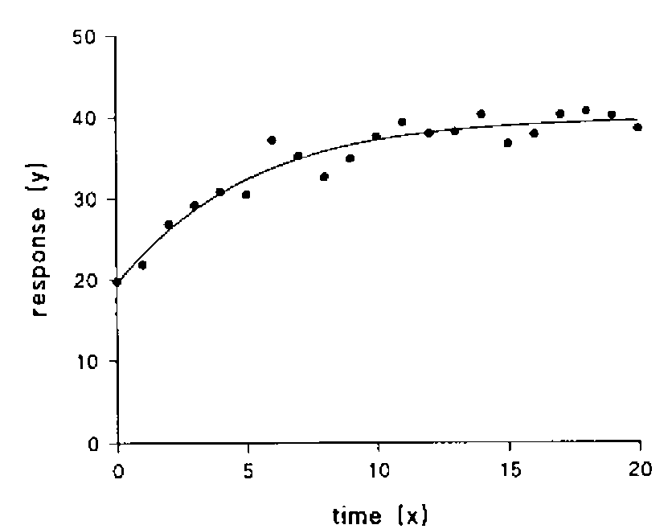
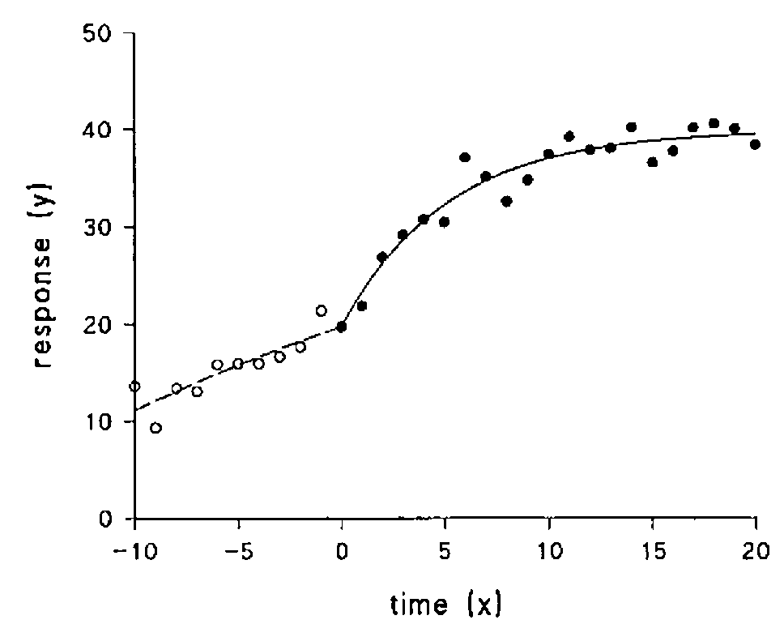
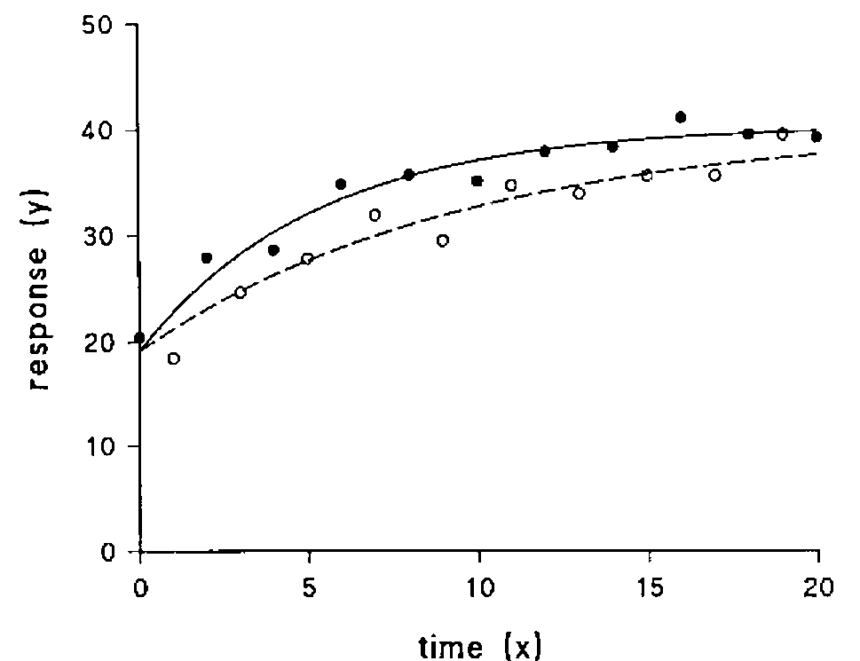

*by D R Appleton (University of Newcastle upon Tyne)*
{ .byline }

## Abstract

Non-linear curve-fitting of well behaved functions is easily performed in APL. Because of APL’s notation it is also simple to fit functions which might otherwise be trickier.

## Introduction: fitting a simple curve

*Example 1.*
{ .caption }



Suppose data are available, as shown above, for a process which can be expressed in the form:

> y = y<sub>∞</sub> − ( y<sub>∞</sub> − y<sub>0</sub> ) e<sup>−αx</sup>

The response y might be a concentration, or the logarithm of a concentration, of some substance in blood, air or water; and we shall take time x to be measured in minutes. In APL this function and its derivatives with respect to its parameters can be written as follows, using a, b and c to represent y<sub>∞</sub>, y<sub>0</sub> and α respectively:

```apl
fn ← 'a - (a-b) × * -c×x'
fa ← '1 - * -c×x'
fb ← '* -c×x'
fc ← 'x × (a-b) × * -c×x'
```

From initial estimates the parameters may be estimated by successive repetition of the line:

```apl
⎕ ← (a b c) ← (a b c) + (y - ⍎fn) ⌹ (⍎fa),(⍎fb) AND (⍎fc)
```

assuming the data values are in x and y and that `M AND N` is, for example,

```apl
M,[2-0.5×1=⍴⍴N]N
```

If the initial estimates are reasonable, the iterative process will converge quickly; the fitted curve is also shown in Figure 1. As it is inefficient to evaluate the exponential function so often, we could write:

```apl
fn ← 'a-g×a-b'
fa ← '1-g'  fb ← 'g'
fc ← 'x×g×a-b'
```

and repeat the two lines :

```apl
g ← * -c×x
⎕ ← (a b c) ← (a b c) + (y - ⍎fn) ⌹ (⍎fa),(⍎fb) AND (⍎fc)
```

## A Trivial Extension

Now suppose that we have further information, namely that the process has been operating at a constant value until time zero, and we have data not only at that time but also at times from -10 minutes to -1 at 1-minute intervals. This, of course, is easily incorporated into our curve-fitting by supposing all the readings to have been made at time 0.

## A Further Extension

*Example* 2. But what if our information about the history of the process is less trivial? Suppose in fact that during the previous 10 minutes the process was describable by the same equation, but with a replaced by α another rate parameter β, and the data appear as shown in Figure 2.

*Figure 2*
{ .caption }



We do not wish to fit the two processes separately, and in some way combine our estimates of the common parameters; we wish to fit the two equations as a single curve, and here is where APL’s notation makes life so easy. If we let *d* play the part of β and write

```apl
g ← * -x × (c × x>0) + (d × x≤0)
```

then we can leave *fn*, *fa* and *fb* as they are, and write:

```apl
fc ← 'x × (x>0) × g × a-b'
fd ← 'x × (x≤0) × g × a-b'
```

The iterative procedure is the same as before, except that there are 4 parameters.

## Another Extension

*Example 3*. As well as being able to handle situations where the function to be fitted changes (at a known value of x), the same methodology can cover simultaneous fitting of two or more curves with some parameters in common. Suppose now that we have observations on two processes

> y<sub>i</sub> = y<sub>∞</sub> − ( y<sub>∞</sub> − y<sub>0</sub> ) e<sup>−α<sub>i</sub>x</sup>        (i=1,2)

and that observations are made every minute, alternately on y<sub>1</sub> and y<sub>2</sub>, from time 0 to 20 minutes, as shown in Figure 3.

*Figure 3*
{ .caption }



If we now take as the function *g* the expression

```apl
* -x × (c×2|x+1) + (d×2|x)
```

then the function to be fitted and its derivatives with respect to the parameters are given by:

```apl
fn ← 'a - g × a-b'
fa ← '1-g'  fb ← 'g'
fc ← 'x × (2|x+1) × g × a-b'
fd ← 'x × (2|x) × g × a-b'
```

Once again the iterations proceed smoothly, and the fitted curves are plotted in Figure 3 with the data.

Naturally, it is sometimes harder to express the function as succinctly, but if all the observations of one process are arranged to precede those of the other in the x and y vectors, it will not be difficult to come up with a suitable expression.

## Precision of the Parameter Estimates

Unfortunately, while the use of the dyadic domino function greatly simplifies the process of estimating the parameters, it also bypasses the calculation of the information matrix and therefore does not allow estimation of their standard errors. Once the iterations have converged the following lines produce them (for a 4 parameter curve):

```apl
resids ← y - ⍎fn
derivs ← (⍎fa),(⍎fb),(⍎fc) AND (⍎fd)
varcov ← (⌹(⍉derivs) +.× derivs) × (+/ resids×resids) ÷ ¯4+⍴x
sterrs ← (1 1 ⍉ varcov) * 0.5
```

If the line estimating the parameters iteratively is extended to include the assignments to resids and derivs, only the last two lines are required.

## Functions of the Parameter Estimates

It is often possible to derive adequate estimates of the precision of functions of the parameters. Such functions might be just the sum or difference of 2 parameters, or the expression for the area under the curve, or perhaps its value or derivative at some point. The standard errors of such derived functions depend on the variance-covariance matrix of the parameter estimates (evaluated above as varcov) and the derivatives of the functions with respect to the parameters.

Suppose we wish to estimate the area between the two curves in example 3. This is given by (y<sub>∞</sub> − y<sub>0</sub>)( 1/α<sub>2</sub> − 1/α<sub>1</sub>) or in APL terms `(a-b)×+/÷d,c` and we could evaluate the derivatives algebraically if we wished. However, it may be instructive to calculate them numerically. Using function `∆DERIVS`:

```apl
    ∇ Z←par ∆DERIVS fn
[1]   ⍎par,'←',par,'×1.0001'
[2]   Z←⍎fn
[3]   ⍎par,'←',par,'÷1.0001'
[4]   Z←10000 × (Z - ⍎fn) ÷ ⍎par
    ∇
```

we can construct function `DERIVS`:

```apl
    ∇ Z←pars DERIVS fn
[1]   ((⍳⍴pars)⊂pars) ∆DERIVS¨⊂fn
    ∇
```

which will produce numerical approximations to the required values. The value and standard error of the required area are given by:

```apl
⍎area ← '(a-b)×+/÷d,c'
der ← 'abcd' DERIVS area
(+/+/varcov × der ∘.× der) * 0.5
```

## Discussion

Curve-fitting is only a useful technique when there is a good reason for it. Too often it is just a way of smoothing data without thereby gaining any useful insight into the underlying process. However, if the fitting of a particular equation can be justified theoretically, and its parameters or functions of them can be interpreted, it may be valuable.

This article has shown that an APL program which can fit simple equations may also without difficulty be used for more interesting cases. A good program will, of course, do much more than has been attempted in this short exposition. It will certainly cope with any number of parameters up to a specified limit; some indication of one way to handle this is given in `DERIVS`. It will also, most importantly, check that the user has not made a mistake in his expressions for the derivatives of the function; this need was another reason for including `DERIVS`. Other checks and decisions, certainly on the iterative process itself to make sure that the parameter estimates do not exhibit large changes, and to decide how convergence is to be assessed, are required; reports on possible outliers are also advisable, and the output must be clearly labelled and expressed to a number of decimal places which reflects the convergence criterion. A library of standard curves for which all the necessary expressions exist would be a useful adjunct.

Perhaps someone will write such a program for the APL Statistical Library.
