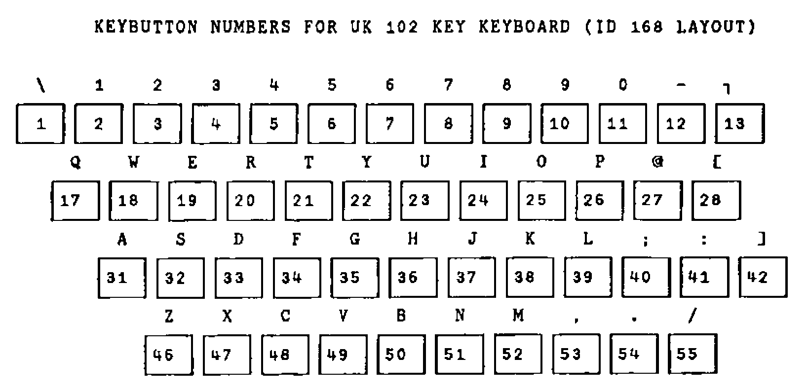
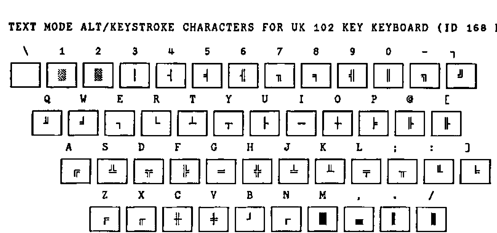

*by Ajay Askoolum*
{ .byline }

## Background

The APL keyboard is at once the most visible strength and weakness of the language in so far as its acceptance is concerned. It is generally true that an APL programmer finds the relevant APL symbol without difficulty even when the keycaps are not annotated or engraved with the APL symbols; this is the case on any country mapping supported by DOS. This consistency is a major strength.

The weakness of this regime comes to the fore with APL beginners. The special symbols are alien enough, but the real difficulty is in locating them on a keyboard which does not have the symbols engraved on the keycaps.

## The APL-Keycap Challenge

APL\*PLUS II allows the keyboard to be fully configured and customised. IBM supply replacement APL keycaps for their 102-key keyboard. Is it possible to use IBM APL keycaps and a reconfigured APL\*PLUS II keyboard without conflict with other applications on the PC? Why would you want to find out anyway? The answers depend on personal choice but must surely herald a major potential benefit, a fully-functional UK keyboard.

For the purposes of APL the advantages are obvious: a visible APL keyboard for use in the UK, that is one with engraved APL symbols and with a £ sign in text mode. The novice no longer guesses the location of the special APL symbols as they are visible. And the configuration does not conflict with other packages on the PC.

The reality of the APL\*PLUS text keyboard, that is the one invoked with ALT/CAPS LOCK in a session started with K=APL in the CONFIG.APL file, is that it is a **US 101-key keyboard** irrespective of the keyboard configuration in the AUTOEXEC.BAT or CONFIG.SYS start-up files in the PC. Thus SHIFT 3 produces # and not £ and the key immediately to the left of the Z is dead. It does not exist on the US keyboard, hence the difference in the key count of UK and US keyboards.

The pre-requisites for the option of customising the keyboard fully are therefore an IBM 102-key UK keyboard and DOS version 4 or later.

## Replacing the Keycaps

It is easy to replace the existing keycaps with the IBM APL keycaps, particularly as there is a tool supplied to do the job. Having done that, you find that some of the keycap characters no longer correspond to the characters actually obtained on depressing the key. For instance, SHIFT 8 does not produce ( but \* etc. This is resolved by adding the following line to the CONFIG.SYS file and rebooting the PC:

```text
INSTALL=C:\DOS\KEYB.COM UK,437,C:\DOS\KEYBOARD.SYS /ID:168
```

This will have the effect of replacing the default keyboard (ID 166) with the alternative layout (ID 168).

In order to make it easy to refer to specific keys on the keyboard, I have used the notation [row;column], where ‘row’ is the keyboard row starting from the top, and ‘column’ is the key number in that row counting from the left. The Esc key is therefore [1;1], the BACKSPACE key is [2;14] and so on.

At the DOS prompt and with the APL keycaps on, the omissions are:

1. the key [3;13] does not have the `[` symbol engraved
2. the SHIFT key [2;1] does not produce `|` as engraved but ▌
3. the [5;2] key does not have the correct engravings but has `|` and `_`

These would not be problems if the keyboard had ID-168 keycaps to start with. As it is, the above list is not daunting to remember in comparison with the task of remembering the location of all the APL symbols.

Another disparity exists between IBM APL and APL\*PLUS II. The `→` symbol is on shift [3;12] in IBM APL and is UNSHIFTED [3;13] in APL\*PLUS, and `⍙` is on alt [3;13] in IBM APL and APL\*PLUS has the symbol `⊖` on that key. These can be remapped, and other keys such as `⍷` and `≠` can be put on the keyboard where other symbols are not assigned.

## Remapping the APL\*PLUS Keyboard

The actual method of the keyboard remapping technique is discussed in chapter 11 of the User Manual for Version 4. The essential concepts to grasp are:

**a) key button number**

Appendix 20 of the Reference Manual of Version 4 provides the relevant reference. This is essentially the scan code associated with each key on the keyboard which is recognised by the BIOS routines in the PC. Thus it is hardware dependent, and cannot be changed. However, for the UK keyboard there is one addition, key button number 42. The table for the typewriter keys is as follows:



**b) raw shift state numbers**

Chapter 11 of the User Manual of Version 4 provides the relevant reference. In brief, the table is:

| RAW SHIFT STATE | DEFAULT SHIFT KEY |
|:-:|---|
| 0 | No Shift |
| 1 | Shift |
| 2 | Ctrl |
| 4 | Alt |

Note that the raw shift state numbers are 0 and powers of 2 and that combinations of raw shift state such as ALT+CTRL i.e. 2 + 4 produces a raw shift state of 6. However, SHIFT+SHIFT produces 1, that is only unique raw shift state numbers are recognised in any combined keystroke.

**c) effective shift states**

Again, Chapter 11 of the User Manual of Version 4 provides the relevant reference. The table of valid combinations is:

| RAW SHIFT STATE | APL Keyboard | Text Keyboard |
|---|:-:|:-:|
| 0 no shift | 0 | 1 |
| 1 shift | 2 | 3 |
| 2 ctrl | 4 | 4 |
| 3 ctrl+shift | 9 | 9 |
| 4 alt | 5 | 6 |
| 5 alt+shift | 7 | 8 |
| 6 alt+ctrl | 10 | 10 |
| 7 alt+ctrl+shift | 4 | 4 |

**d) the ASCII table or `⎕AV` atomic vector**

Each character is associated with a unique number from 0 to 255, in index origin zero. The associated number with any character can be given by `(-~⎕IO)+⎕AV⍳character` e.g. `(-~⎕IO)+⎕AV⍳'⍷'` returns 3.

Thus, in order to assign £ to SHIFT 3 on the text keyboard:

a) establish the keybutton number (KN) of key [2;4] i.e. 4<br>
b) establish the raw shift state i.e. 1<br>
c) look up the effective shift state (ESS) i.e. 3<br>
d) find the ZERO ORIGIN index of £ in `⎕AV` i.e. 156

The next step is to combine this information to produce a keystroke number as follows `1000⊥KN,ESS`. Thus for the example `1000⊥3 4` produces `3004`. The final step is to add the line `KEY 3004 = 156` to the CONFIG.APL file. On the next invocation of APL\*PLUS II, £ will be on the text keyboard: try ALT+CAPSLOCK, then SHIFT + 3. Some examples of reassignments are:

```apl
KEY 2007 = 241 ⋄ ⍝ put ⍙ on alt key [3;16]
KEY 2027 =  26 ⋄ ⍝ put → on shift key [3;12] as in IBM APL
KEY 42   =   3 ⋄ ⍝ put ⍷ ON KEY [4;13]
```

In the re-mapped keyboard, it would be useful (for screen design) to have the line-drawing symbols on the ALT key combination in APL\*PLUS in text mode. One scheme for these could be:



The keybutton numbers do not change. The zero origin indices of the characters ░ ▒ │ ┤ etc. are `176 177 178 179 180` etc. respectively. The effective shift state is 6 and the keybutton numbers are as on the table above. Thus, the lines to be added to CONFIG.APL are:

```text
KEY 6001= 176
KEY 6002= 177
KEY 6003= 178
KEY 6004= 179
KEY 6005= 180
     etc.
```

## Function Keys

A further aspect of customisation deals with function keys. By default, the function keys are dead, that is they produce no action. Moreover, the event numbers associated with F1… are 601 … etc. and these events do not cause an exit from `⎕WIN`, and `¯1 ⎕WKEY 601` produces *DOMAIN ERROR* and therefore cannot be defined as an exit key.

It would be useful to select events to associate with the function keys, such as F1 to mean help, F7 to mean previous page, F8 to mean next page etc. These would be useful for instance when navigating the ring editor. If the event numbers associated are within the range of `⎕WKEY`, all the events could be set to cause an exit from `⎕WIN`.

For example, event number 499 (edit object at cursor) could be associated with F2 with the line `PFKEY 2=499` in the CONFIG.APL file, and then `¯1 ⎕WKEY 499` will set up F2 as an exit key. Conceivably, the event numbers associated with the function keys could vary from workspace to workspace thereby creating a problem for any `⎕WIN` handling functions. This can be resolved as follows:

```apl
RES←⎕WIN FieldWindows ⋄ ⍝ Trap ⎕WIN results
DEF←∊⎕PFKEY¨0 100 200∘.+(~⎕IO)+⍳12 ⋄ ⍝ Get defs of fn keys
PFK←(DEF∊RES[⎕IO+1])/,600 700 800∘.+(~⎕IO)+⍳12 ⋄ ⍝ Fk event no
```

Thus no matter what the current event number of the function keys, the `⎕WIN` routines would always use the event numbers associated with the function keys.

Ironically, this facility for redesigning the keyboard mapping for APL\*PLUS II sessions can be abused to the extent that any symbol can be placed on any keybutton number, thereby adding to rather than removing the chaos.

Perhaps STSC should supply UK keyboard configurations for both ID 166 and ID 168 together with a consistent set of predefined function keys with sets of engraved APL key caps for established makes of keyboards as an option. This must be more convenient than the previous practice of supplying character ROMS and expecting users to manage the hardware modification themselves. This implies two CONFIG.APL files on disks destined for the UK.

On the issue of CONFIG.APL, STSC should supply versions where every single parameter is initialised to a default. Ideally, a robust installation routine should change the defaults automatically. This would avoid some bugs slipping through (`⎕KEYLOG` and `⎕KEYSRC` cannot be initialised in CONFIG.APL with version 4.0.03) and would prevent enigmatic errors which take a lot of valuable time to debug. In my case, I spent a whole day establishing why a `)COPY WS OBJECT` was generating a *WS NAME ERROR* message. The answer? My CONFIG.APL had specified a `tempdir=` pointing to a subdirectory which did not exist.

## References

[1] APL\*PLUS II Version 4 Reference Manual

[2] APL\*PLUS II Version 4 User Manual

[3] *Keyboard Layouts and Code Pages* (IBM DOS Version 5.0)

[4] APL\*PLUS/PC Version 6.0 Reference Manual (re internal tables defining keyboard interpretation)
