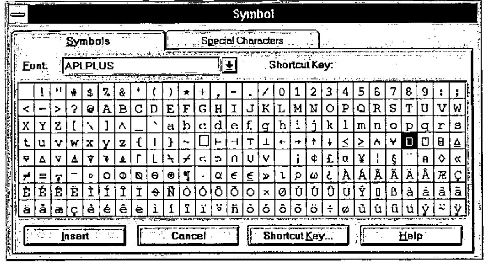
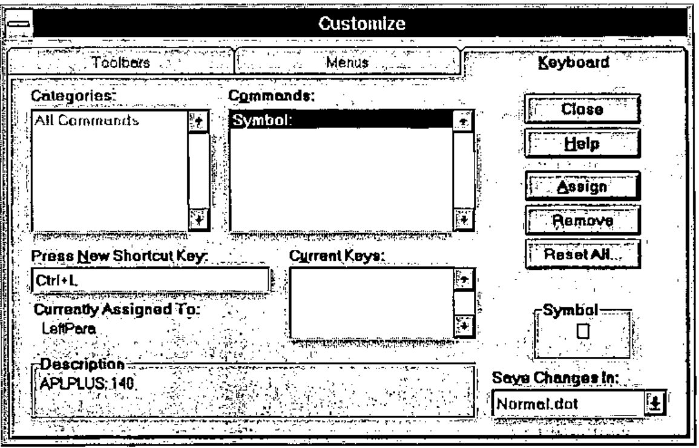

*by Ajay Askoolum*
{ .byline }

It would be quite convenient to be able to key APL characters directly into a WINDOWS word processor in order to create, for instance, fax messages. With WORD6 this is possible in a few simple steps:

First step, copy the default WORD6 template NORMAL.DOT to another name in order that you can revert to it if necessary. In order to locate NORMAL.DOT, type DIR NORMAL.DOT /S followed by &lt;ENTER&gt; at the DOS prompt, on each of your logical/physical DOS drives. This will respond with the location of the file, perhaps as follows:

```text
 Volume in drive I is MS-DOS_6
 Volume Serial Number is 3A2A-18E8
Directory of I:\MSOFFICE\WINWORD\TEMPLATE
NORMAL   DOT        11,776 04/05/96   20:37
        1 file(s)        11,776 bytes
Total files listed:
        1 file(s)        11,776 bytes
                      7,454,720 bytes free
```

Then copy NORMAL.DOT to, say, XNORMAL.DOT as follows:

```text
copy  i:\msoffice\winword\normal.dot i:\ msoffice\winword\xnormal.dot
<ENTER>
```

Remember to use the path reported by DIR NORMAL.DOT /S on your computer.

Second step, click on File, New to open a new document based on the NORMAL.DOT template.

Third step, click on Insert, Symbol and the following dialogue will be displayed.



Select the APLPLUS font, then highlight an APL character (⎕ is highlighted above), click on Shortcut key and the following dialogue will appear:



Note:

- I have chosen Ctrl+L as the short cut key. Shift+L will not work! For other characters such as ⍋ use Ctrl+Shift+3. The use of Ctrl is preferable to Alt since WINDOWS uses Alt.
- The short cut key is shown. If the character is already mapped, it will be shown in the Current Keys box. Click on Assign to make the assignment. An assignment made in error can be corrected by highlighting it and clicking on Remove.
- The changes will be made in NORMAL.DOT — This saves having to select the file in the Save Changes In box. After all the keys have been mapped, NORMAL.DOT can be re-named more appropriately to, say, APLPLUS.DOT and NORMAL.DOT can be restored from XNORMAL.DOT.
- Click on Close to save the assignment and then click on Close to close the Symbol dialogue.
- In order to test the assignment, press Ctrl+L: ⎕ should appear; if not, review what you have done.
- There is no need to re-assign typewriter keys. Besides WORD6 would not allow it *in situ*.

Repeat step 3 for all the APL keys. The layout of the keyboard is found in APPENDIX E of the APL\*PLUS III Reference Manual. Alternatively, type ]KB within an APL\*PLUS III session if the user command processor is installed for a display of the layout.

If you use multiple APL interpreters, use the font which comes with the interpreter. This enables APL characters to be mapped consistently for use within WORD6 and may confuse the meaning of Unified Keyboard yet further. The symbol ∘ in the ISIAPL font is the only one which I have come across which cannot be assigned for use within WORD6 since WORD6 uses it to mark paragraph end (character 0182).

If an APL character is assigned to a key combination that WORD6 already uses, WORD6 will re-assign its function to another key combination. For instance, WORD6 used Ctrl+A to ‘Select All’ text in a document and upon ⍺. being assigned to the same key combination, WORD6 will reassign ‘Select All’ to Ctrl+Num5. This is done automatically.

Any APL expression thus entered into WORD6 (using whatever font for typewriter keys but APLPLUS, or another, for symbols) can be highlighted, copied to the clipboard and pasted into APL where it can be executed as though it had been entered within the session.

*[Ed – except for a very few characters which Word thinks are for typesetting use. Beware of grade-up and grade-down in the DyalogAPL and APL+Win mapping – they paste as " into the APL session]*
