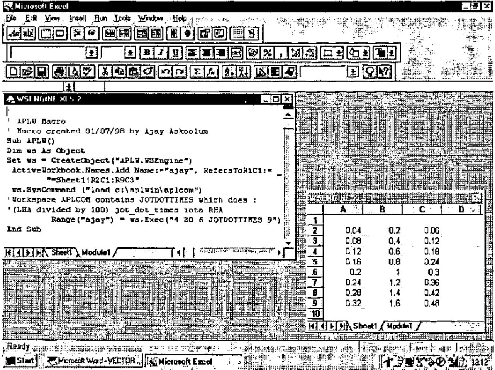

*by Ajay Askoolum*
{ .byline }

Context sensitive help driven by Windows is a powerful refinement to any application. Indeed this is a hallmark of any ‘polished’ or ‘professional’ Windows application and should be considered integral to the design of applications. There are several Microsoft Word add-on packages which facilitate the production of the \*.hlp file. A help facility based on a \*.hlp file offers the following advantages:

1. the \*.hlp file is independent of the application itself. Provided that the topics are known, the \*.hlp file compilation can be delegated to help authors: the application development and help file authoring can proceed concurrently.
2. the \*.hlp file can be written in such a way that it can also be printed as the user manual.
3. the ‘annotate’ facility enables users to elaborate the content of the help topics within the \*.hlp file itself.

By convention, context sensitive help is available on pressing F1: help on the context indicated by the position of the cursor is shown by WINHELP which then takes over, enabling selective browsing/printing/copying of the topics in the help file.

WINHELP "Displays Help for a particular topic identified by a *context number* that has been defined in the [MAP] section of the .HPJ file." (Windows 3.1 SDK)

Now, the provision of WINHELP driven help does not seem straightforward. The APL+Win manuals do not cover this ***at all***. However, APL+Win provides the building blocks.

If an edit object has focus, the name of the object can be found as follows:

```apl
('#' ⎕wi 'focus') ⎕wi 'name'
```

Note that the above expression yields the name of the edit object [works while the form on which the object appears in the Wait loop], not its context number. In fact APL+Win does not cater for a property which can contain the *context number*.

The APL+Win header file APLWADF.INI does not include the WinHelp call: that is, the `⎕wcall` function **cannot** make sense of an application programming interface call as documented:

```text
BOOL WinHelp(hwnd, lpszHelpFile, fuCommand, dwData)

HWND hwnd;              /* handle of window requesting help */

LPCSTR lpszHelpFile;    /* address of directory-path string */

UINT fuCommand;         /* type of help   */

DWORD dwData;           /* additional data      */
```

APL+Win will recognise the call to WinHelp if the following line is added to the APLW.INI file:

```text
[Call]
WinHelpIdx=B(HW,*C,U,C) ALIAS WinHelpA
```

Now, `⎕wcall 'WinHelpIdx' {parameters}` will be recognised. This still relies on the context number.

The following alternative line (courtesy of Dave Phillips, many thanks Dave) overcomes this problem:

```text
[Call]
WinHelpIdx=B(HW,*C,U,*C) ALIAS WinHelpA
```

Now, a line such as:

```apl
⎕wcall 'WinHelpIdx' 0 'C:\APLWIN\APLGUI.HLP' 'HELP_KEY' 'Form'
```

will display help on topic Form from the Windows Interface help file provided with APL+Win. Note that the topic itself rather than the context number is used.

The F1 facility can be added to an application as follows:

```apl
⎕wself←'form.Help' ⎕wi 'New' 'Menu'
⎕wi 'caption' '&Help'

⎕wself←'form.Help.Context' ⎕wi 'New' 'Menu'
⎕wi 'caption' ('&Context',⎕TCHT,'F1')
⎕wi 'shortcut' 112 0
⎕wi 'prompt' 'Context Sensitive Help'
⎕wi 'onClick' 'CSHELP'
```

where the function CSHELP identifies the context (focus) and calls WINHELP.

Alternatively, the help facility can be provided from a floating menu (available on right click) as follows:

```apl
⎕wself←'ROBOT' ⎕wi 'New' 'Menu'

⎕wself←'ROBOT.OPT1' ⎕wi 'New' 'Menu' ('caption' 'Context Help')
    ⎕wi 'onClick' 'CSHELP'
```

In fact both mechanisms can be deployed and since the help call is managed by the function CSHELP both will behave identically.

The function CSHELP is:

```apl
    ∇ CSHELP
[1]    0 0⍴⎕wcall 'WinHelpIdx' 0 'C:\SAMPLE\APPLIC.HLP'
'HELP_KEY' (('#'          ⎕wi 'focus') ⎕wi 'name')
    ∇
```

where C:\\SAMPLE\\APPLIC.HLP is the help file to use.

The help facility is now in place. What of the procedure for creating the help file itself? I can recommend *HelpBreeze* from SolutionSoft. It is time to search the WEB for further information on help compilers!

## APL and the Component Object Model

*by Ajay Askoolum*
{ .byline }

APL+Win version 3.0 can act as an ActiveX server to Excel. As usual, the APL+Win Reference Manual provides the bare bones of this capability, on pages 4.43 to 4.46. I did not find this comprehensive enough to produce a quick working example.

However, in case you are interested in using this, the screen print below provides an example which illustrates this capability.

In this *simple* example, a range in an Excel Sheet is updated by running a macro, APLW, which calls APL+Win to load a workspace, run the function JOTDOTTIMES with the arguments supplied. By default, the taskbar does not show an APL+Win session.



The function JOTDOTTIMES is :

```apl
    ∇ Z←L JOTDOTTIMES R
[1]   ⍝ Example of APL÷WIN acting as an ActiveX server to EXCEL 5.0
[2]   Z←(L×0.01)∘.×⍳⌊R
    ∇
```

Note that the appropriate registrations detailed in the manual must be carried out for this example to be reproduced. Also, note the implicit `⍉` of the result when it gets to Excel.
