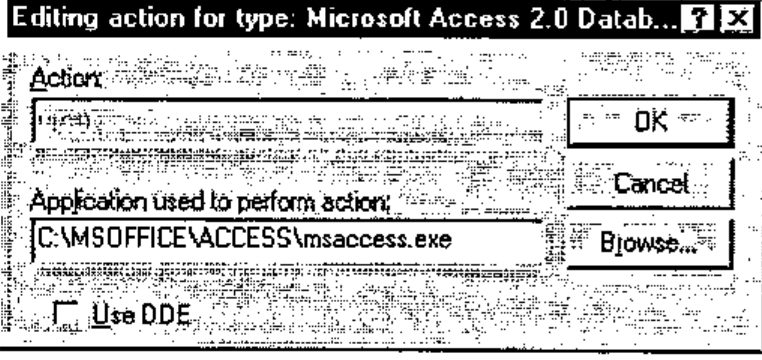
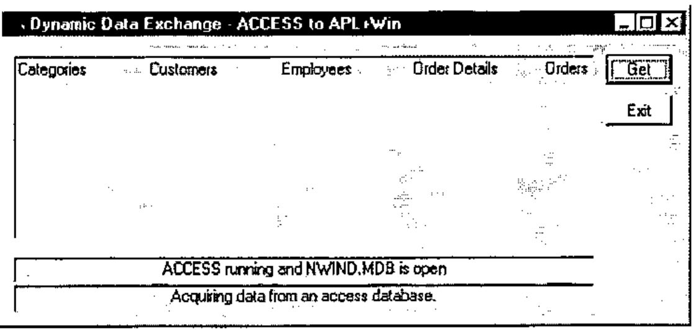
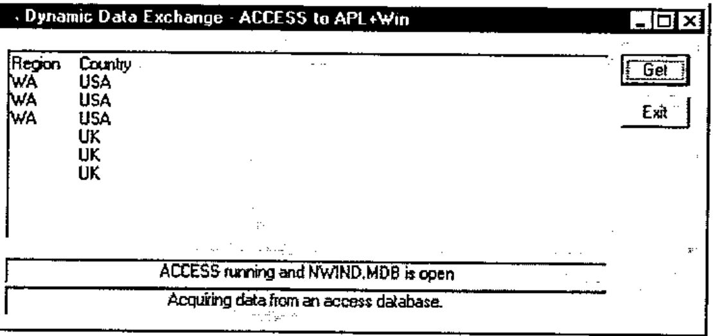

*by Ajay Askoolum*
{ .byline }

## Introduction

*Dynamic Data Exchange* (DDE) is a means of exchanging data between two *concurrently running* Windows applications which support DDE. DDE is ‘old’ technology, has inherent limitations and is no longer recommended for distributed applications. However, it can be very useful to the system developer for one off data acquisition.

This article demonstrates DDE conversations between APL+Win version 3.0 and Microsoft Access version 2.0. The discussion of DDE properties and Windows Application Programming Interface (API) should be relevant to other APL interpreters.

## Starting Applications

DDE requires that the two applications sharing data are running concurrently. In practice, this would mean that the server application (Access) should be started, the database to be shared be open and then for APL+Win to establish communication.

It is preferable that APL+Win itself starts Access prior to establishing a conversation, thereby ensuring that Access is ready. Then, only the database name and location need be known.

For this article, it is NWIND.MDB which is a sample database packaged with Access, found at *c:\msoffice\access\sampapps* on my computer.

For APL+Win to start Access, it must

- identify the exe which runs Access
- call the exe file and open NWIND.MDB

## Identifying exe

If MSAccess is correctly installed (confirmed by dialogue below: within Explorer, click View, click Options, {locate Microsoft Access 2.0 Database}, click Edit, Click Edit...),



the Find Executable API call can be used to locate the exe file.

```text
HINSTANCE FindExecutable(lpszFile, lpszDir, lpszResult)

LPCSTR lpszFile;   /* address of string for filename*/
LPCSTR lpszDir;    /* address of string for default directory*/
LPSTR lpszResult;  /* address of string for executable file on return*/

The FindExecutable function finds and retrieves the executable filename
that is associated with a specified filename.

Parameter          Description

lpszFile           Points to a null-terminated string specifying a
                   filename. This can be a document or executable file.
lpszDir            Points to a null-terminated string specifying the drive
                   letter and path for the default directory.
lpszResult         Points to a buffer that receives the name of an
                   executable file when the function returns. This null-
                   terminated string specifies the application that is
                   started when the Open command is chosen from the File
                   menu in File Manager.

Returns            The return value is greater than 32 if the function is
                   successful. If the return value is less than or equal to
                   32, it specifies an error code.
```

In APL+Win this is :

```apl
    ∇ Z←Locate_Exe R
[1]   ⍝ Return name of EXE for file R
[2]   Z←1000⍴⎕tcnul
[3]   Z←⎕wcall 'FindExecutable' R '' Z
[4]   :if 32<⎕io⊃Z
[5]       Z←(⎕io+1)⊃Z
[6]       Z←(¯4↓(4/1),∧\~(Z ⎕SS '.exe')∨Z ⎕ss '.EXE')/Z
[7]   :else
[8]       Z←''
[9]       'Failed to locate exe for file ',R
[10]      ÷0
[11]      ⍝ Normally you'd use MessageBox API call for error trapping!
[12]  :endif
    ∇
```

```apl
Locate_Exe 'C:\MSOFFICE\ACCESS\SAMPAPPS\NWIND.MDB'
```

returns

```text
C:\MSOFFICE\ACCESS\msaccess.exe
```

## Starting exe with Source File

Another Windows API, WinExec does this.

```text
UINT WinExec(lpszCmdLine, fuCmdShow)

LPCSTR lpszCmdLine;  /* address of command line*/
UINT fuCmdShow;      /* window state of new app.*/

The WinExec function runs the specified application.

Parameter            Description

lpszCmdLine          Points to a null-terminated Windows character string
                     that contains the command line (filename plus optional
                     parameters) for the application to be run. If the
                     string does not contain a path, Windows searches the
                     directories in this order:
Returns              The return value identifies the instance of the loaded
                     module, if the function is successful. Otherwise, the
                     return value is an error value less than 32.
```

In APL+Win, this is:

```apl
    ∇ Z←Start_Exe R
[1]   ⍝ Open file R in a hidden window
[2]   Z←⎕wcall 'WinExec' ((Locate_Exe R),' ',R) 'SW_HIDE'
[3]   :if 32>Z
[4]       'Error Opening ',R
[5]       ÷0
[6]   :endif
    ∇
```

The **shwCmd** SW_HIDE can be substituted by SW_SHOWMAXIMIZED if you want to see Access running. Refer to the WINDOWPLACEMENT API call for documentation of other **shwCmd** options.

Thus,

```apl
Start_Exe 'c:\msoffice\access\sampapps\nwind.mdb'
```

will start Access and open NWIND.MDB.

This approach will enable APL to start any exe application, preferably from a menu. For example,

```apl
Start_Exe 'c:\myfile.htm'
```

will launch the default internet browser (if it exists) and open the file c:\myfile.htm.

## Getting Table *Categories* from NWIND.MDB

Run the function Access_DDE and click the Get button for the following to appear:


The function Access_DDE is :

```apl
    ∇ Access_DDE;⎕wself
[1]
[2]   'Access' ⎕wi 'Delete'
[3]
[4]   ⎕wself←'Access' ⎕wi 'New' 'Form' 'Close'
[5]       ⎕wi 'caption' 'Dynamic Data Exchange - Access to APL+Win'
[6]       ⎕wi 'extent' 13.125 62.25
[7]       ⎕wi 'where' 9.5 11.375
[8]
[9]   ⎕wself←'Access.bn1' ⎕wi 'New' 'Button'
[10]      ⎕wi 'caption' 'Get'
[11]      ⎕wi 'where' 0.875 55 1.375 6
[12]      ⎕wi 'onClick' '''Access.ed1'' ⎕wi ''DdeRequest'''
[13]
[14]  ⎕wself←'Access.l1' ⎕wi 'New' 'Label'
[15]      ⎕wi 'caption' 'Access running and NWIND.MDB is open'
[16]      ⎕wi 'style' 1
[17]      ⎕wi 'edge' 1
[18]      ⎕wi 'where' 10.125 1 1.25 53
[19]
[20]  ⎕wself←'Access.ed1' ⎕wi 'New' 'Edit'
[21]      ⎕wi 'style' 4100
[22]      ⎕wi 'ddeMode' 'cold'
[23]      ⎕wi 'ddeTopic' 'MSACCESS|NWIND;TABLE Categories'
[24]      ⎕wi 'ddeItem' 'All'
[25]      ⎕wi 'where' 0.875 1 8.5 53
[26]      ⎕wi 'onChange' 'APLvar←''Access.ed1'' ⎕wi ''text'''
[27]
[28]  ⎕wself←'Access.bn3' ⎕wi 'New' 'Button'
[29]      ⎕wi 'caption' 'Exit'
[30]      ⎕wi 'where' 2.75 55 1.375 6
[31]      ⎕wi 'onClick' '''Access'' ⎕wi ''Delete'''
[32]
[33]  ⎕wself←'Access.l2' ⎕wi 'New' 'Label'
[34]      ⎕wi 'caption' 'Acquiring data from an access database.'
[35]      ⎕wi 'style' 1
[36]      ⎕wi 'edge' 1
[37]      ⎕wi 'where' 11.375 1 1.375 53
[38]
[39]  'Access' ⎕wi 'Wait'
    ∇
```

It is assumed that:

- you understand APL+Win and therefore Access_DDE
- you can write Access_DDE for your APL interpreter, if different

However, the DDE properties deserve further explanation.

```apl
⎕wi 'ddeMode' 'cold'
```

The ddeMode property has three possible values:

| Value | Meaning |
|---|---|
| 'hot' | requests an automatic link, and the server application will send the requested data ddeItem as soon as it changes. Nothing is sent until the data is changed. |
| 'cold' | 'cold' specifies a manual link. The server sends a data item when the client application requests it by using the DdeRequest method |
| '' | severs the client server link. |

Access_DDE specifies a *cold* link, that is, will use NWIND.MDB on a *read only* basis.

```apl
⎕wi 'ddeTopic' 'MSACCESS|NWIND;TABLE Categories'
```

The ddeTopic property defines the topic of a DDE conversation with another Windows application. It is used on both client (APL+Win) and server (Access) sides of a conversation.

The options (the phrase following NWIND, the database file name) are :

| Value | Meaning |
|---|---|
| nothing | specialist, see ddeItem below |
| TABLE tablename | will send/receive the tablename specified |
| QUERY queryname | will send/receive the queryname specified |
| SQL sql string | a valid SQL string up to 255 characters |

```apl
⎕wi 'ddeItem' 'All'
```

When ddeTOPIC omits a specification including and beyond ; (see below) , the possible values for ddeItem are :

| Value | Meaning |
|---|---|
| TableList | returns list of tables in database |
| QueryList | returns list of queries in database |
| FormList | returns list of forms in database |
| ReportList | returns list of reports in database |
| MacroList | returns list of macros in database |
| ModuleList | returns list of modules in database |

That is, the structure of the data base can be queried. For example,

```apl
⎕wi 'ddeTopic' 'MSACCESS|NWIND'
⎕wi 'ddeItem' 'TableList'
```

will return



Note that Access table names may contain imbedded spaces in their names and therefore they are unsuitable as APL+Win variable names. A good strategy is to turn space into underscore for workspace manipulation of those names.

When ddeTOPIC is not omitted, the possible values for ddeItem are :

| Value | Meaning |
|---|---|
| All | return all data, including field names |
| Data | return all data, excluding field names |
| FieldNames | return field names |
| FieldNames;T | return field names and Access field types |
| NextRow | data in next row |
| PrevRow | data in previous row |
| FirstRow | data in the first row |
| LastRow | data in the first row |
| FieldCount | the number of fields |
| SQL Text | SQL statement representing a table or query |
| SQL Text;n | n allows SQL statement to be broken down in n character long chunks. |

An example:

```apl
⎕wi 'ddeTopic' 'MSACCESS|NWIND;SQL SELECT Region,Country FROM
Employees WHERE Title="Sales Representative"'
⎕wi 'ddeItem' 'All'
```

Note, only two fields are being selected, namely *Region* and *Country*. Specify \* for all fields.



```apl
⎕wi 'onChange' 'APLvar←''Access.ed1'' ⎕wi ''text'''
```

On APL+Win receiving data from Access, the variable APLvar is updated in the workspace.

```apl
      ⍴APLvar
47
      ]DISPLAY APLvar
┌→─────────────┐
│Region Country│
│WA USA        │
│WA USA        │
│WA USA        │
│ UK           │
│ UK           │
│ UK           │
└──────────────┘
```

APLvar is a simple text vector, delimited with tabs and newlines.

## Inherent Limitations

As APLvar comes from an Edit box,

- it is restricted to 64K in length (can be overcome when ddeItem 'NextRow' is used, in most cases)
- it is text

It requires further manipulation in APL. This requires some fluency in nested APL.

First,

```apl
APLvar2←(APLvar≠⎕tcnl)⊂APLvar

      ⍴APLvar2
7
      ]display APLvar2
┌→─────────────────────────────────────────────────────────────┐
│┌→─────────────┐ ┌→─────┐ ┌→─────┐ ┌→─────┐ ┌→──┐ ┌→──┐ ┌→──┐ │
││Region Country│ │WA USA│ │WA USA│ │WA USA│ │ UK│ │ UK│ │ UK│ │
│└──────────────┘ └──────┘ └──────┘ └──────┘ └───┘ └───┘ └───┘ │
└∊─────────────────────────────────────────────────────────────┘
```

Second,

```apl
APLvar3← ⊃(⎕tcht≠¨APLvar2)⊂¨APLvar2
      ⍴APLvar3
7 2
      ]display APLvar3
┌→──────────────────┐
↓┌→─────┐ ┌→──────┐ │
││Region│ │Country│ │
│└──────┘ └───────┘ │
│┌→─┐     ┌→──┐     │
││WA│     │USA│     │
│└──┘     └───┘     │
│┌→─┐     ┌→──┐     │
││WA│     │USA│     │
│└──┘     └───┘     │
│┌→─┐     ┌→──┐     │
││WA│     │USA│     │
│└──┘     └───┘     │
│┌→─┐     ┌→┐       │
││UK│     │ │       │
│└──┘     └─┘       │
│┌→─┐     ┌→┐       │
││UK│     │ │       │
│└──┘     └─┘       │
│┌→─┐     ┌→┐       │
││UK│     │ │       │
│└──┘     └─┘       │
└∊──────────────────┘
```

Thus,

```apl
APLvar3[;⎕io] gives the variable Region
 Region WA WA WA UK UK UK
      ≡APLvar3[;⎕io]
2
```

For record by record indexing,

```apl
    ∇ ByRecord R
[1]
[2]   :for i :in 1↓⍳1↑⍴R
[3]       (Region Country)←APLvar3[i;]
[4]       ⍝ 'Your Code For Processing Records Goes Here'
[5]   :endfor
    ∇
```

The first index is dropped because ddeItem was All: this would not be necessary if ddeItem were specified as Data.

Third, since the original variable APLvar is read as text (there is no other way), the values need to be converted to the appropriate types. APL+Win has `⎕vi` and `⎕fi` for this purpose.

## Conclusion

Having received the topic from Access, the link must be severed:

```apl
'Access.ed1' ⎕wi 'ddeItem' ''
```

and you need to close Access.

In this article, Access acts as a server to APL+Win. Another contribution can explore Access as a client to APL?

## References:

1. Microsoft Windows 3.1 Resource Kit
2. Microsoft Access 2.0 On Line Help
3. APL+Win On Line Help
