*reviewed by Ajay Askoolum*
{ .byline }

APLX is a cross platform APL development environment for Windows, MacOS and Linux. Workspaces are interchangeable across platforms. Portability requires that no platform specific features be used except in conditional blocks of code. For instance, a `⎕na` function based on a Windows API call will be meaningless on the Mac or Linux platforms.

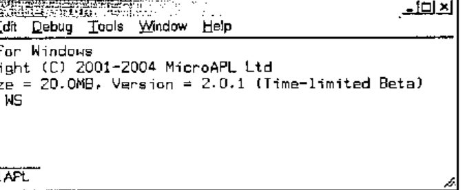

Although APLX is the newest commercial APL interpreter, it is based on APL.68000 and therefore it is not only robust but also from an experienced APL provider, MicroAPL.

This article is based on the Windows personal version (there is a server edition). I have explored APLX on Windows 2000. APLX distinguishes itself with several unique cutting edge features.

## Building on the APL.68000 Legacy

APLX still supports the APL.68000 features, including the del editor, component file functions (`⍈`, `⍐` etc. see below), library numbers etc. For a cross platform development, the use of library numbers provides a unified method for referring to folders in APL code.

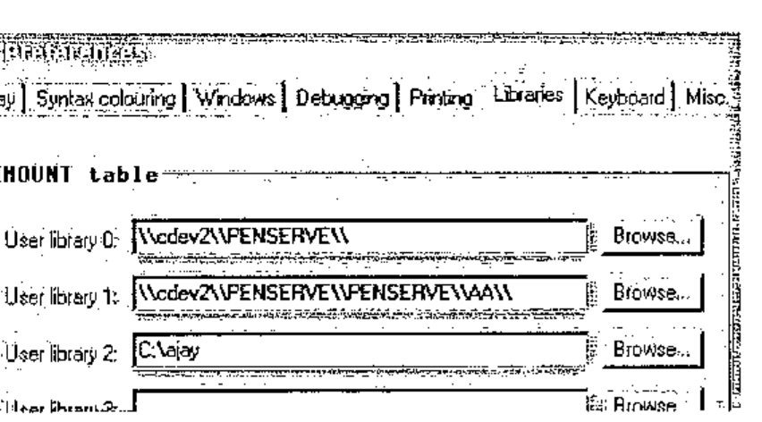

Up to 10 permanent library numbers (0 to 9) can be defined using the **Tools | Preferences + Libraries** tab.

`⎕mount ''` returns current definitions.

Libraries may be defined either using Universal Naming Convention (UNC) or drive letters or both. Libraries created using `⎕mount Variable` are session bound only; permanent libraries need to be defined using the above dialogue.

```apl
      tie1←'0 afile.text' ⎕ncreate 0 ⍝ Library numbers with native files
      tie2←'0 penserve\aa\bfile.txt' ⎕ncreate 0 ⍝ Path appended to library
      tie3←'1 cfile.txt' ⎕ncreate 0
      tie4←'2 dfile.txt' ⎕ncreate 0
      ⎕nnums
1 2 3 4
      ⎕nnames ⍝ Refers to UNC names, not libraries
\\cdev2\\PENSERVE\\afile.text ⍝ UNC name returned
\\cdev2\\PENSERVE\\penserve\aa\bfile.txt ⍝ Path correctly appended
\\cdev2\\PENSERVE\\PENSERVE\\AA\\cfile.txt
C:\ajay\dfile.txt ⍝ Fixed path returned
```

Library numbers and UNC or fixed paths can be used interchangeably:

```apl
      '\\cdev2\\PENSERVE\\afile.text' ⎕nerase tie1
      '0 penserve\aa\bfile.txt' ⎕nerase tie2 ⍝ Library + path
      '1 cfile.txt' ⎕nerase tie3 ⍝ Library instead of path
      'C:\ajay\dfile.txt' ⎕nerase tie4 ⍝ Path instead of library
```

Although APLX provides support for the APL and unified keyboards, it provides a facility for switching from the APL keyboard to the locale keyboard using Ctrl + N. This is useful in that the unified keyboard does not appear to map all keys to the locale keyboard. For instance, # is found on shift + 3 and not where engraved on the keycap. This may quite correctly be perceived as a nuisance as it should not be necessary – this is reminiscent of ALT + BCKSPACE on mainframe APL. Vendors may not be able to ignore internationalisation considerations for much longer. APLX has begun to make inroads into this area: this is such an obvious area for vendors to establish competitive advantage.

The system function `⎕conf` allows some configuration of date and time formats as shown below. However, this does not extend to the language in which system constants are reported.

```apl
      )save
2004-02-09 18.58.57 aa
      6 ⎕conf 3 1 1
4 0 1
      )save
9/02/2004 18:59:08 aa
```

In line with other APL, now APLX has the full list of `⎕tc` and `⎕tc*` system constants or functions.

```text
      ⎕display (3 1⍴⎕a ⎕A ⎕ts) ⎕w ⎕m
┌→──────────────────────────────────────────────────────────────┐
│ ┌→─────────────────────────────┐ ┌→─────────┐ ┌→─────────┐    │
│ ↓ ┌→─────────────────────────┐ │ ↓SUNDAY    │ ↓JANUARY   │    │
│ │ │abcdefghijklmnopqrstuvwxyz│ │ │MONDAY    │ │FEBRUARY  │    │
│ │ └──────────────────────────┘ │ │TUESDAY   │ │MARCH     │    │
│ │ ┌→─────────────────────────┐ │ │WEDNESDAY │ │APRIL     │    │
│ │ │ABCDEFGHIJKLMNOPQRSTUVWXYZ│ │ │THURSDAY  │ │MAY       │    │
│ │ └──────────────────────────┘ │ │FRIDAY    │ │JUNE      │    │
│ │ ┌→──────────────────┐        │ │SATURDAY  │ │JULY      │    │
│ │ │2004 2 11 9 11 34 46│       │ └──────────┘ │AUGUST    │    │
│ │ └~──────────────────┘        │              │SEPTEMBER │    │
│ └∊─────────────────────────────┘              │OCTOBER   │    │
│                                               │NOVEMBER  │    │
│                                               │DECEMBER  │    │
│                                               └──────────┘    │
└∊──────────────────────────────────────────────────────────────┘
```

For now, APLX returns these constants without any reference to the locale: it needs to return this information in line with it.

It is possible to protect a workspace with a password – this requires library numbers to be used.

Any attempt to load a protected workspace without specifying the password fails with a ‘WS LOCKED’ error; there is no prompting for the password.

```apl
      )save 0 myws:mypwd
2004-02-08 16.23.21

      )load 0 myws
WS LOCKED
      )load 0 myws:mypwd
SAVED  2004-02-08 16.23.21
```

APL has the ability to save the contents of the active workspace and re-open it in its entirety or retrieve selected functions and variables from the archive.

APLX can transfer the active workspace to a transfer (\*.ATF) file. The name of the transfer file may be a fully qualified name or one specified by reference to a library number – APLX adds the ATF extension.

```apl
      )out 0 myws
```

If library 0 is defined as c:\\, the above is equivalent to:

```apl
      )out c:\myws
      )clear
CLEAR WS
```

The contents of a transfer file can be added to the active workspace either in its entirety or selectively.

```apl
      )in c:\myws ac

      ⍴⎕nl 2 3
1 2
      )in c:\myws
      ⍴⎕nl 2 3
2 2
```

An ATF file is a workspace saved in text format. As with workspaces, the appropriate system commands do not require the file extension to be specified. Although most objects transfer correctly, another APL may not be able to read the entire ATF file because of language and atomic vector differences.

APL system commands can be executed within code rather than in immediate mode only.

```apl
      ∇ExecSysCmd
[1]   a←⍎')symbols'
      ∇ 2004-02-08 16.30.32
      ExecSysCmd
      a
IS 1026, USED 2
```

## Cross-platform Development

Platform commands can be executed from the interpreter. For Windows, the syntax is shown below. The string `CMD /C` instructs the interpreter to use COMMAND.COM.

```apl
      a←⎕host 'CMD /C dir c:\aa /s'
      ⍴⊃(a≠⎕tcnl)⊂a
181 81
      ⍴b←⊃(a≠⎕tcnl)⊂a
181 81
      b[⍳3;]
Volume in drive C is Ajay
Volume Serial Number is 6C34-55CF
Directory of c:\ajay
```

The host system can be interrogated as shown below.

```apl
      ⎕host ''
WINDOWS
```

Since the host name can be queried programmatically, it is possible to embed platform specific code within functions: this removes the need for maintaining platform specific workspaces in isolation. NOTE: workspace files are interchangeable across platforms.

```apl
      ∇Z←PlatformCode;A;B;C
[1]   ⍝ Illustrates platform dependent coding
[2]    A←'Hello! '⍝ block of common code goes here
[3]    :Select ⎕host '' ⍝ platform specific code in a :select structure
[4]    :Case 'AIX' ⍝ AIX specific code
[5]    :Case 'LINUX' ⍝ LINUX specific code
[6]    :Case 'MACOS' ⍝ MAC specific code
[7]    :Case 'WINDOWS' ⍝ Windows specific code
[8]      B←'This is APLX hosted by Windows.'
[9]    :EndSelect
[10]   C←'Task Id is ',⍕'#' ⎕wi 'taskid' ⍝ more common code
[11]   Z←A B C
      ∇ 2004-02-10 21.37.09

      ⊃PlatformCode
Hello!
This is APLX hosted by Windows.
Task Id is 15166396
```

The APLX interpreter functionality simplifies access to some platform features – very neatly.

```apl
      ⎕host 'hostname' ⍝ Like the GetComputerName Windows API
ajaylap
      '#' ⎕wi 'text' 'Ajay Askoolum' ⍝ Write to clipboard
      '#' ⎕wi 'text' ⍝ Retrieve clipboard
Ajay Askoolum
      ⍴'#' ⎕wi 'printers'
4
      ⍴'#' ⎕wi 'fonts'
45
```

## Re-inventing APL+

OK, feel free to read APL\*PLUS – a quad function for everything. Traditionally, personal computer based APL interpreters have provided a self-sufficient development environment: APL system functions provide access to the operating system facilities.

The requirement of cross-platform portability coerces APLX back into this tradition; however, APLX can also deploy platform specific features such as Windows ActiveX objects.

## Black Magic APL

Some aspects of APL work very mysteriously. These work fine with APLX, illustrating its compatibility with other APL interpreters.

```apl
      a←10?1000
      ((2|a)/a)←0 ⍝ Replace odd numbers by 0
      a
132 756 0 0 0 48 0 680 0 384

      a←⍳10
      1⊥a ⍝ Sum of vector
55
      0⊥a ⍝ Last element of vector
10
      a←10 2 3⍴⍳60
      1⊥a ⍝ Like +/[⎕io]a
280 290 300
310 320 330
      0⊥a ⍝ Like a[(1↑⍴a)-~⎕io;;] BUT no need to know rank of argument
55 56 57
58 59 60
```

Other recent (I am not sure but APLX may well have had these features for a long time) improvements in APL work fine in APLX too.

```apl
      2++\⍳10 | N-Wise
3 5 8 12 17 23 30 38 47 57

      (2 3⍴⍳10)×[⎕io]2 3 ⍝ Axis operation
 2  4  6
12 15 18
      (2 3⍴⍳10)×[⎕io+1]2 3 4 ⍝ More Axis operation
2  6 12
8 15 24
      a←(2?50) (5?100)
      (⊂¨⍋¨a)⌷¨a ⍝ Sort with thin quad (APL2 compatibility)
 1 34  4 6 52 53 84
      a
 34 1  52 84 4 6 53
```

Consider two vectors created as follows:

```text
      a←10?100
      b←7?90
      ⎕display a b
┌→────────────────────────────────────────────────────────────┐
│ ┌→─────────────────────────────┐ ┌→───────────────────────┐ │
│ │27 5 74 33 64 76 100 37 25 99│ │66 68 59 7 57 80 25│ │
│ └~─────────────────────────────┘ └~───────────────────────┘ │
└∊────────────────────────────────────────────────────────────┘
```

I raised this on the Vector Wiki pages recently. I am quite baffled as to the reason neither of the expressions shown below work (with APL+Win, originally – and now with APLX).

These do not work!

```apl
(2|¨a b)/¨a b
DOMAIN ERROR
      (2|¨a b)/¨a b
      ^
      (2|¨a b)/a b
DOMAIN ERROR
      (2|¨a b)/a b
      ^
```

It is baffling why this works!

```text
      ∇Z←L Fn R
[1]   ⍝ Operator
[2]   Z←L/R
      ∇ 2004-01-30 11.36.58

      ⎕display (2|¨a b) Fn ¨a b
┌→────────────────────────────────────┐
│ ┌→──────────────────┐ ┌→─────────┐ │
│ │27 5 33 37 25 99│ │59 7 57 25│ │
│ └~──────────────────┘ └~─────────┘ │
└∊────────────────────────────────────┘
```

Note the interpreter level support for `⎕display`.

## File Functions

APLX version 2.0 adds the full complement of `⎕f` and `⎕n` functions with some useful improvements. Library numbers and fully qualified path names can be used interchangeably. Library numbers can be used with both types of files: therefore, applications can be based exclusively on library numbers. Practically speaking, the switch between a development and testing environment is achieved as easily as defining a library number. That is, a simple switch of library numbers points the application to one or the other of the two environments.

*First*, it is possible to use a tie number of 0 for both component and native files and for both create and tie operations: APLX allocates the next available tie number. This promotes sound code as it eliminates hard coded file numbers and the inadvertent references to the wrong numbers.

```apl
      tie←'c:\temp\xx.sf' ⎕fcreate 0
      tie
1
      ⎕funtie tie
      tie←'c:\temp\xx.sf' ⎕ftie 0
      tie
1
```

Like other APLs component file names do not need an extension: more accurately, any valid extension can be used for component file names. Native files can be tied with positive or negative integers – component files use positive integers only. APLX manages the sequence of native and component tie numbers independently: curiously, a given integer can be a tie number for both a native and a component file.

```apl
      'c:\temp\nativefile.txt' ⎕ncreate 0
1
      'c:\temp\compfile.apl' ⎕fcreate 0
1
      'nativefile' ⎕nappend 1
      'componentfile' ⎕fappend 1 ⍝ First component
      ⎕nread 1 82 100 0
Insufficient data available
FILE I/O ERROR
      ⎕nread 1 82 100 0
      ^
      ⎕nread 1 82, (⍴'nativefile'), 0
nativefile
      ⎕fread 1 1
componentfile
```

Note that the same integer, 1, is used concurrently as the handle for both a native and a component file. An important difference is that the native file cannot be read past the end of file without generating an error. The inability to read past the end of file may make the migration of an existing APL+Win application to APLX problematic – it depends on whether the code relies on the ability to read past the end of file.

*Second*, two new functions, `⎕fdelete` and `⎕fwrite` are provided for component files. The new `⎕fdelete` function allows a component to be deleted from anywhere in a file.

```apl
      (⍳10) ⎕fappend 1 ⍝ Second component
2
      ⎕fdelete 1 1 ⍝ Deleting first component
      ⎕fsize 1 ⍝ Should have just one component
1 2 2560 0 256
```

Remaining components are automatically renumbered after `⎕fdelete`.

```apl
      ⎕fread 1,1
1 2 3 4 5 6 7 8 9 10
```

In other words, all hard coded references to component numbers must be changed. Components are also renumbered when `⎕fwrite` is used to insert components.

```apl
      (2×⍳10) ⎕fwrite 1,0.5 ⍝ Insert before first
      ⎕fread 1 1
2 4 6 8 10 12 14 16 18 20
      ⎕fread 1,2
1 2 3 4 5 6 7 8 9 10
```

If the second element of the `⎕fwrite` function is omitted, it works like the `⎕fappend` function. If it is an integer, it works like the `⎕freplace` function: it must be a valid or existing component number. If it is a floating-point number, a component is inserted between `⌊SecondElement` and `⌈ SecondElement` components.

The renumbering of components may present practical difficulties: it is easily forgotten that hard coded references to component numbers need to be changed. My wish list is twofold: allow components to be written/inserted/read by name rather than by ordinal position, and allow a component file to be sparsely populated – this can be achieved by writing n components past the next available component. Currently, any attempt to write past the next available component creates a run time error.

*Third*, the `⎕nwrite` function can be used to write Unicode characters to native files. Native files are not written using ASCII and rely on the conversion argument for correct representation. The `⎕ucs` function provides conversion from `⎕av` to Unicode.

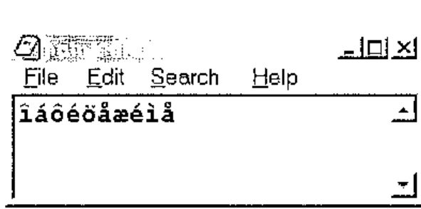

The second element of `⎕nread`, the conversion type, is crucial in reading from native files correctly. The help file documents the possible arguments. The `⎕nwrite` function takes the same arguments for writing to native files.

*Fourth*, the new functions `⎕nerror` and `⎕ferror` return the last error encountered and can be reported gracefully by an error handler routine. I wish APLX had thought of `⎕IsFileFree filename`: this could have returned 0 or 1 if the file were free and perhaps `¯1` if the file did not exist. This would reduce the need for error handlers. Perhaps it will be available in the next version?

## Standard Dialogues

The hallmark of any application boasting a Graphical User Interface (GUI) is the dialogues that allow the user to configure and manage their environment. On the Windows platform, the developer can use either the COMDLG.OCX object, subject to licensing requirements, or API calls. APLX provides native support for such utilities – that is, APLX offers standardisation and, from the developers’ point of view, simplicity (This approach liberates the APL developer from platform constraints). This is a valuable and persuasive extension to APL programming: other platform-dependent APL interpreters have failed to provide these facilities, leaving the developer to grapple with platform APIs and data structures that do not exist in APL but must be created therein.

The table below shows the standard dialogues on the first row and the common set of properties in the first column: the grid shows ✓ where the property is available to the dialogue otherwise it is ✗. Key properties are shown in a box (here, in bold).

| | ChooseColor | ChooseDir | ChooseFont | MsgBox | OpenFile | Printer |
|---|:-:|:-:|:-:|:-:|:-:|:-:|
| caption | ✗ | ✓ | ✗ | ✓ | ✓ | ✓ |
| children | ✓ | ✓ | ✓ | ✓ | ✓ | ✓ |
| class | ✓ | ✓ | ✓ | ✓ | ✓ | ✓ |
| color | **✓** | ✗ | ✓ | ✗ | ✗ | ✓ |
| copies | ✗ | ✗ | ✗ | ✗ | ✗ | ✓ |
| custom | ✓ | ✗ | ✗ | ✗ | ✗ | ✗ |
| data | ✓ | ✓ | ✓ | ✓ | ✓ | ✓ |
| default | ✗ | ✗ | ✗ | ✓ | ✓ | ✗ |
| directory | ✗ | **✓** | ✗ | ✗ | ✗ | ✗ |
| events | ✓ | ✓ | ✓ | ✓ | ✓ | ✓ |
| extent | ✗ | ✗ | ✗ | ✗ | ✗ | ✓ |
| file | ✗ | ✗ | ✗ | ✗ | **✓** | ✗ |
| filter | ✗ | ✗ | ✗ | ✗ | **✓** | ✗ |
| filterindex | ✗ | ✗ | ✗ | ✗ | ✓ | ✗ |
| font | ✗ | ✗ | **✓** | ✗ | ✗ | ✓ |
| fonts | ✗ | ✗ | ✗ | ✗ | ✗ | ✓ |
| handle | ✗ | ✗ | ✗ | ✗ | ✗ | ✓ |
| icon | ✗ | ✗ | ✗ | **✓** | ✗ | ✗ |
| margin | ✗ | ✗ | ✗ | ✗ | ✗ | ✓ |
| methods | ✓ | ✓ | ✓ | ✓ | ✓ | ✓ |
| name | ✓ | ✓ | ✓ | ✓ | ✓ | ✓ |
| opened | ✓ | ✓ | ✓ | ✓ | ✓ | ✓ |
| orientation | ✗ | ✗ | ✗ | ✗ | ✗ | ✓ |
| page | ✗ | ✗ | ✗ | ✗ | ✗ | ✓ |
| position | ✗ | ✗ | ✗ | ✗ | ✗ | ✓ |
| printername | ✗ | ✗ | ✗ | ✗ | ✗ | **✓** |
| printers | ✗ | ✗ | ✗ | ✗ | ✗ | ✓ |
| properties | ✓ | ✓ | ✓ | ✓ | ✓ | ✓ |
| range | ✗ | ✗ | ✓ | ✗ | ✗ | ✗ |
| scale | ✗ | ✗ | ✓ | ✗ | ✗ | ✓ |
| self | ✓ | ✓ | ✓ | ✓ | ✓ | ✓ |
| size | ✗ | ✗ | ✗ | ✗ | ✗ | ✓ |
| style | ✓ | ✗ | ✓ | **✓** | ✓ | ✗ |
| text | ✗ | ✗ | ✗ | **✓** | ✗ | ✗ |
| tie | ✓ | ✓ | ✓ | ✓ | ✓ | ✓ |
| units | ✗ | ✗ | ✗ | ✗ | ✗ | ✓ |
| winptr | ✗ | ✗ | ✗ | ✗ | ✗ | ✓ |

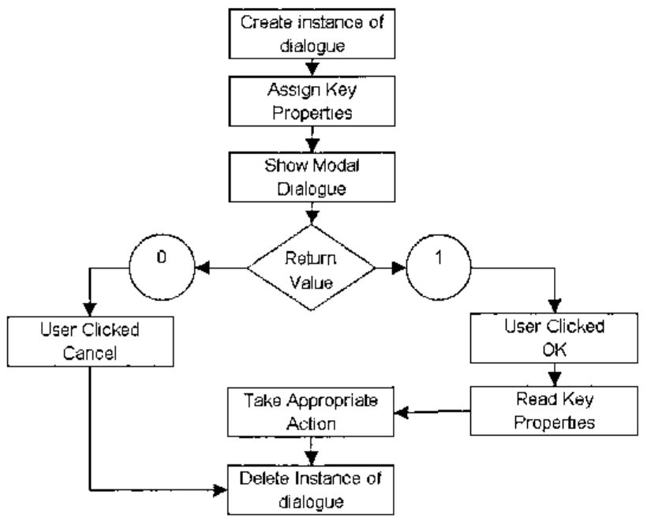

The procedure for showing the built in dialogues is illustrated above. All the dialogues, except Printer, are made visible for user interaction using the Show method. The Printer dialogue is made visible using either the Job or Setup methods.

Interpreter level support for these dialogues provides a very neat and efficient way of eliciting user input and avoids having to grapple with data structures when using API calls for the same purpose.

```apl
      ∇Printer
[1]   ⍝ Built in Printer dialogue
[2]    'pr' ⎕wi 'Create' 'Printer'
      ∇ 2004-02-08 11.29.13
```

By using the Create instead of the New method, there is no need to delete a previous instance.

After running the Printer function, the available printers can be enumerated.

```apl
      ⊃'pr' ⎕wi 'printers'
PS/PDF on FILE:
HP DeskJet 970C Series on USB/DeskJet 970C/ES9921310ZJQ
HP LaserJet 4L on LPT1:
```

Similarly, the available printer fonts can be enumerated.

```apl
      ⊃'pr' ⎕wi 'fonts'
Courier
CG Times
Univers
..
```

The Print method of the Printer object prints RichEdit text without any fuss. **File + Print Window** from the Editor window prints functions as shown if a colour printer is used and colour printing is enabled.

The help file provides working examples of each dialogue: this is a good place to start learning about APLX.

## The APLX IDE

Somehow, it is difficult to talk about an Integrated Development Environment (IDE) if it does not offer IntelliSense as well. APLX does not offer IntelliSense. The editor is like any other APL editor but has some significant facilities.

- **Edit | Clean up indentation** (Ctrl + I) inserts a wave pattern indentation to functions. APLX has control structures, adapted from APL+Win: proper indentation is valuable in that it increases the readability of long functions.
- **Copy + Paste** operations support atomic vector or Unicode character sets.
- Functions can be exported to and imported from text files.

The usual facilities for search and replace etc. are available but simple numeric arrays cannot be edited. Like other editors, this one cannot edit nested variables either.

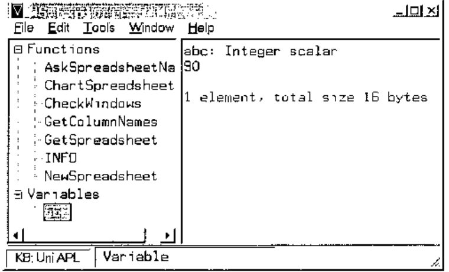

**Tools | Windows Explorer** displays the dialogue shown above. It shows all the functions and variables. Functions may be edited in the right pane: it would be difficult to edit variables, especially nested variables.

For the future, it would be very useful for the workspace explorer to show the dependency of functions graphically.

There is a debug option, with the usual facilities.

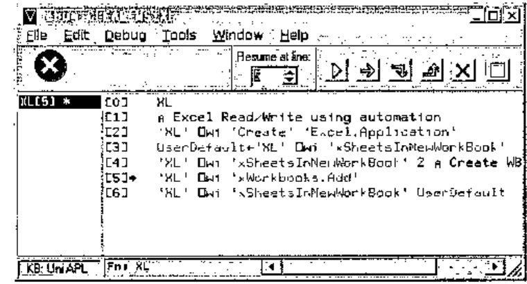

I still tend to use `⎕stop` and `⎕trace` for debugging. The ability to program function keys makes this easier.

```apl
('→⎕lc',⎕tcnl) ⎕pfkey 12
```

APLX has another dialogue that allows available GUI elements to be identified graphically.

**Edit | Control Browser** shows the dialogue below. The properties, methods and events of controls that can be put on APLX GUI forms can be examined. Note the Show Help and Preview buttons. Together, the controls of this dialogue accelerate the process of acquiring information on GUI elements that are available. A useful extension would be the ability to show the hierarchy of an active APLX form.

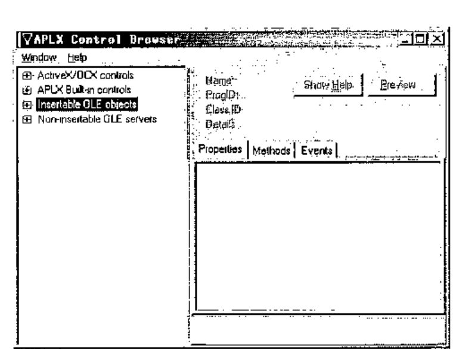

The process for deploying controls is quite simple and minimalist: controls must be children of APLX GUI forms or windows.

The example below shows the deployment of the calendar control.

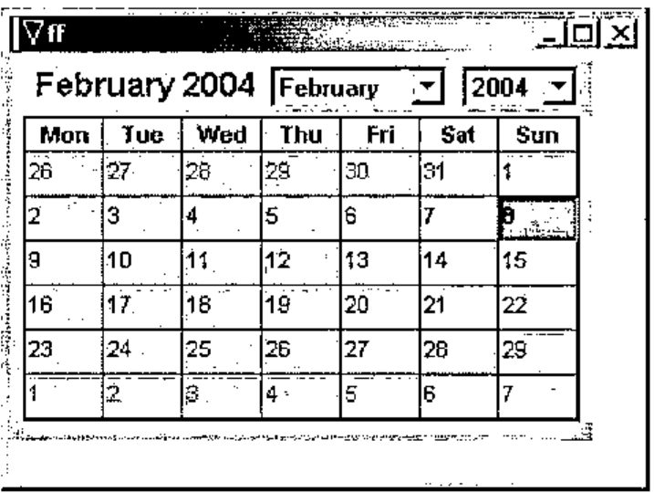

```apl
      ∇Calendar
[1]   ⍝ Using the Calendar Control
[2]    'ff' ⎕wi 'Create' 'Form'
[3]    'ff.cc' ⎕wi
       'Create' 'Calendar Control 9.0'
[4]    'ff' ⎕wi 'Show'
      ∇ 2004-02-08 19.34.20
```

The **File | Print | Workspace Listing** option sends the functions within the current workspace to the printer. Although `⎕vr` is missing in APLX, the listing is as though it were produced by `⎕vr`.

The **File | Session History** option can clear the current session or save it to a file that can subsequently be retrieved. Essentially, the session window is a record of keyboard activity and system results in the active workspace. All other things being equal, should the workspace and session be saved, the state of play may be recreated on another computer using the two files.

The IDE does not have a GUI form designer or editor. Depending on your experience, this may or may not be a handicap. I have used the APL+Win designer: although useful sometimes, I can live without it.

## Application Deployment

The distribution of the packaged exe requires APLXSupport.dll – subject to licensing requirements – and any used APLX fonts. On Windows, distribution of APLX applications could not be simpler! The EXE needs to be in the same location as the DLL – no registration is required.

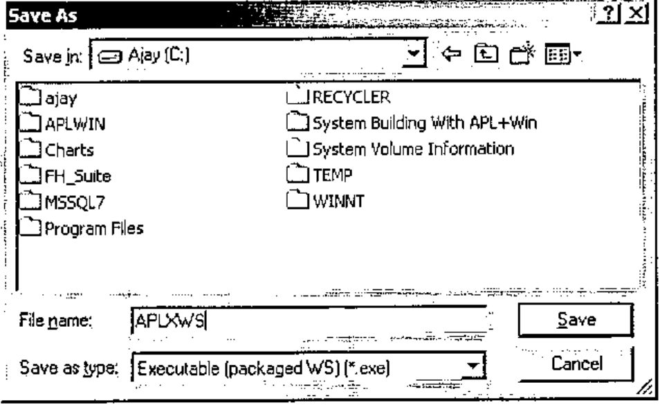

**File | SaveAs** can package a workspace into an EXE file, ready for distribution: note the Save as type option. The workspace must have its `⎕lx` set or it will do nothing!

## Language Enhancements

APLX has the `⎕sv*` and `⎕na` function for defining external language functions. On the Windows platform, API calls can be defined using the `⎕na` function. The FindWindow API call translates as follows:

```text
Declare Function FindWindow Lib "user32" Alias "FindWindowA" (ByVal lpClassName As
String, ByVal lpWindowName As String) As Long
```

```apl
      'FindWindow' ⎕na 'U USER32|FindWindowA  <CT[256] <CT[256]'
      FindWindow 'TAPLSessionWin' ''
1114352
```

The class name of APLX is TAPLSessionWin. FindWindow returns the windows handle of a class or zero. Another example is the MessageBox API call.

```text
Declare Function MessageBox Lib "user32" Alias "MessageBoxA" (ByVal hwnd As Long, ByVal
lpText As String, ByVal lpCaption As String, ByVal wType As Long) As Long
```

It translates as follows:

```apl
'MessageBox' ⎕na 'U USER32|MessageBoxA U <CT[256] <CT[256] U'
```

The message below is shown by the following line:

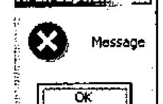

```apl
MessageBox 0 'Message' 'APLX Caption' 16
```

The functions defined using `⎕na` appear as normal locked functions and can be saved in the workspace.

```apl
   ⎕nc ⊃'FindWindow' 'MessageBox'
3 3
```

The process of defining `⎕na` functions for Windows APIs is rather tenuous: APLX does not devote a great deal of space to their definition. Perhaps this is to be expected from a cross platform development tool.

Another method permits true language extensions on the Windows platform. The Microsoft Script Control allows APLX to execute VBScript or JavaScript functions to be executed from the APL environment.

```apl
      ∇SC
[1]    'sc' ⎕wi 'Create' 'MSScriptControl.ScriptControl'
[2]    'sc' ⎕wi 'xLanguage' 'JavaScript'
[3]    'sc' ⎕wi 'XExecuteStatement' 'var myString="Monday/Tuesday";'
      ∇ 2004-02-08 20.42.15
```

Using the formatted numeric LPDISPATCH handle, I can execute JavaScript functions.

```apl
      xx←⍕'sc' ⎕wi 'XEval' 'myString.split("/")'
      'sc' ⎕wi xx,'.properties'
 x0 x1
      'sc' ⎕wi xx,'.x0'
Monday
      'sc' ⎕wi xx,'.x1'
Tuesday
```

APLX does not yet provide XML facilities: the developer has to write APL functions to produce XML trees. On Windows, the MSXML parser SDK can be used. This omission is surprising given that XML is currently fashionable, platform independent and APLX is a cross platform tool.

## APLX and GUI Elements

Like APL+Win, the APLX GUI interface is based on `⎕wi`; this creates a sense of familiarity for APL+Win users. However, there are important and significant differences; some of these, based on APL+Win version 4.0, are

- APLX can create a form using three classes, Form, Dialog, and Window; APL+Win has MDIForm and Form.
- APLX has OLE containers; APL+Win does not.
- APLX can resize its objects, parent and child, using its 4-element *anchor* property; APL+Win does not have this property.
- Both have a Grid and RichEdit controls. The APL+Win Grid object supports locale; the APLX Grid object does not. The size of both Grid objects exceeds the dimensions of an Excel worksheet and neither has methods for controlling pagination and printing. The APL+Win Grid can be saved as XML: APLX has no method for saving its Grid content.

Similarly, the control structure implementations in the two interpreters are very close but there are important differences.

From a developer’s point of view, it is difficult to understand the divergence of the GUI interface among APL interpreters. APL+Win, Dyalog, IBM and APLX have all diverged on GUI, control structures and language extension implementations while at the same time APL+Win, Dyalog and APLX have sought IBM core APL language compatibility. The scenario is reminiscent of SQL; in spite of an international standard, vendors have indulged in customised extensions in order to establish competitive advantage.

## Multi-session APLX

A parent APLX session may spawn one or more child sessions; child sessions can be controlled individually. MicroAPL describes this as “APLX runs as a single *process*, with multiple *threads*. One thread controls the user-interface, and each APL task has its own thread.” The initial APLX session is automatically the parent session: it can create another parent session using **File | New Session**. A child session is created as follows.

```apl
'apl' ⎕wi 'Create' 'APL'
'apl' ⎕wi 'Open' ⍝ Like visible = 1
```

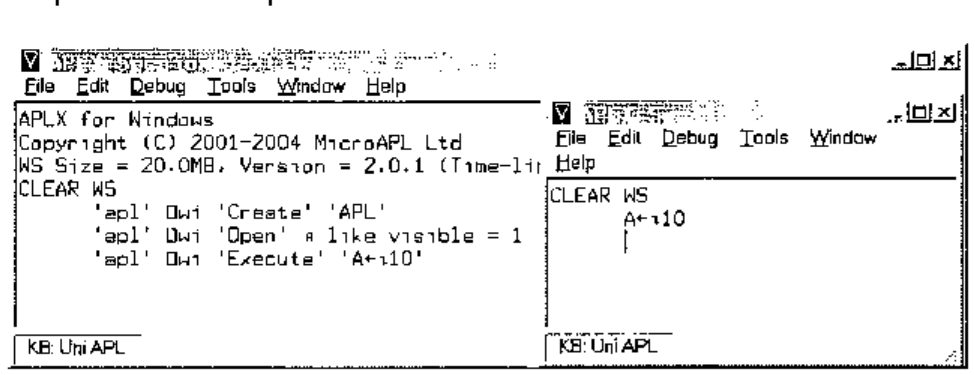

At this point, two sessions exist. The parent session creates a variable in the child session.

Like other objects, the properties, methods, and events of the child session may be enumerated.

```apl
      'apl' ⎕wi 'properties'
background children class data events extent methods name opened properties self size
status tasked text tie visible where wssize
      'apl' ⎕wi 'methods'
Close Create Delete Execute Hide New Open Send Set Show Signal Trigger
      'apl' ⎕wi 'events'
onClose onDestroy onError onExecute onOpen onReady onSend onSignal
```

Unfortunately, the properties and methods do not include the variables and functions, respectively, of the child session. That is a pity.

MicroAPL have chosen auxiliary processor 800 as the mechanism for sharing variable. On the plus side, using the `⎕svo` route, all sessions can share a set of variables.

The sessions can only share the variables via auxiliary processor 800.

As shown below, either session can query or change a shared variable.

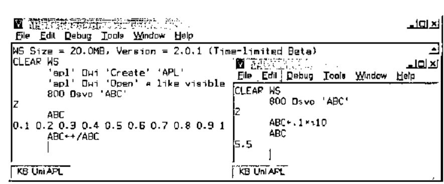

An alternative method for exchanging data is via user defined properties: MicroAPL calls these delta properties.

An example of using delta properties is shown below.

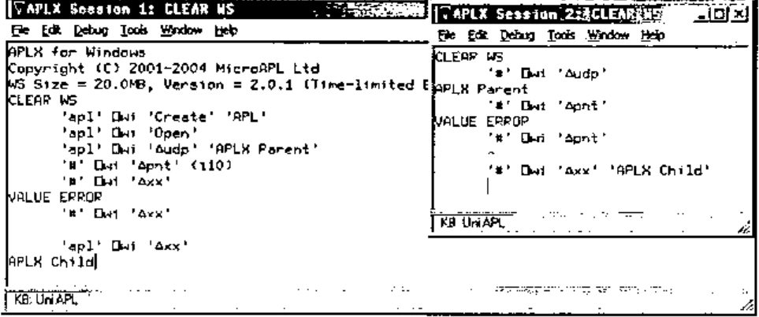

Note the pitfalls too!

The delta properties of the system objects of either the parent or child are not shareable. Any reference to a non-existent property generates an error. This can be a nuisance especially since there is no convenient way to test for the presence of a delta property. The documentation explains the various methods for using delta properties.

Of the methods of child sessions, Execute provides the gateway to some very powerful facilities.

In the example below, the parent executes these commands.

```apl
⍝ Load workspace
'apl' ⎕wi 'Execute' ')load Child'
⍝ Run function
'apl' ⎕wi 'Execute' 'ChildAPLX'
```

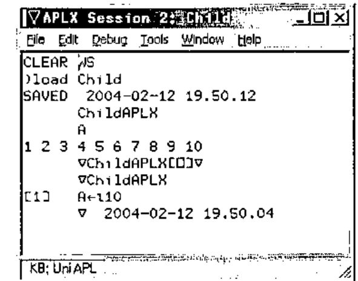

The child session, shown above, confirms the loading of the workspace and the running of the function – listed manually in the child session.

The crucial difference with APLX’s implementation is that the Execute method is asynchronous: control returns to the parent immediately. The parent may query the status property of the child in order to establish the state of the child. A status code of 1 indicates that the child is ready; the APLX documentation elicits all 6 codes. This means that an APLX application can create child tasks, and launch asynchronous tasks concurrently and monitor the status of the child tasks via events that they raise or their respective status property. Depending on system resources, a partitioned APLX application is likely to be very fast.

## APLX and COM Automation

The Windows platform offers Component Object Model automation. The classes that are available can be listed using `'#' ⎕wi 'xclasses'`. This has the potential for speeding up application development in so far as some aspects can be readily off loaded to automation servers.

ActiveX Data Object (ADO) provides easy access to databases. This example illustrates how easily APLX can add a data tier: that is, use databases.

```apl
      ∇APLXwithADO;Cnn;Sql
[1]    Cnn←'Provider=MSDASQL;Driver={Microsoft Access Driver (*.mdb)};DBQ=c:\nwind.mdb;'
[2]    Sql←"SELECT LASTNAME,FIRSTNAME,TITLE,BIRTHDATE FROM EMPLOYEES WHERE FIRSTNAME
LIKE 'M%';"
[3]    'RS' ⎕wi 'Create' 'ADODB.Recordset'
[4]    'RS' ⎕wi 'XOpen' Sql Cnn
      ∇ 2004-02-12 8.52.32

      APLXwithADO
      ⍉'RS' ⎕wi 'XGetRows' ⍝ Note the ⍉
 Peacock Margaret Sales Representative 13777
 Suyama  Michael  Sales Representative 23194
      'RS' ⎕wi 'XMoveFirst'

      'RS' ⎕wi 'XGetString' ⍝ Note ⍉ is not necessary
Peacock Margaret Sales Representative 19/09/1937
Suyama Michael Sales Representative 02/07/1963
```

The above are examples of how the record set object can be handled: they highlight two problems, first the need for `⍉` and second the inability of APL to represent dates. APLX is row major whereas the wider world seem to be column major – hence the need to transpose incoming data. APL does not have a date data type: incoming dates are integers representing *n* days from a reference date.

In practice, each record is processed in turn and transposition does not matter. Individual fields from the record set can be queried as follows:

```apl
      'RS' ⎕wi 'XMoveFirst'
      'RS' ⎕wi 'Fields().Value' 'FirstName'
Margaret
      'RS' ⎕wi 'Fields().Value' 'LastName'
Peacock

      'RS' ⎕wi 'XMoveNext' ⍝ Go to next record
      'RS' ⎕wi 'XClose' ⍝ Close record set
      'RS' ⎕wi 'Delete' ⍝ Tidy up
```

## APLX and Automation Servers

APLX can use automation servers such as Word and Excel. The process is quite simple, as illustrated below using Excel.

- APLX can use Excel as a data source.
- APLX can use Excel to present data from the workspace.

```apl
      ∇XL
[1]   ⍝ Excel Read/Write using automation
[2]    'XL' ⎕wi 'Create' 'Excel.Application'
[3]    UserDefault←'XL' ⎕wi 'xSheetsInNewWorkBook'
[4]    'XL' ⎕wi 'xSheetsInNewWorkBook' 2 ⍝ Create WB with 2 sheets
[5]    'XL' ⎕wi 'xWorkbooks.Add'
[6]    'XL' ⎕wi 'xSheetsInNewWorkBook' UserDefault
      ∇ 2004-02-12 10.52.37
```

After running this function, the Excel object is available for use.

```apl
⍝ Insert 20.4 into A1
      'XL' ⎕wi 'xWorkbooks().Sheets().Range().Value' 1 1 "A1" 20.4
⍝ Read the value back
      'XL' ⎕wi 'xWorkbooks().Sheets().Range().Value' 1 1 "A1"
20.4
⍝ Read back the value - alternative syntax
      'XL' ⎕wi 'xWorkbooks().Sheets().Cells().Value' 1 1 (1 1)
20.4
```

The latter syntax is highly suitable for APL. Consider the Excel object as a multi-dimensional array. The first dimension is the workbook. The second dimension is the sheet in the workbook. The third and fourth dimensions are the rows and columns in the worksheet. Thus APLX can use Excel using numbers to index this multi-dimensional array. This applies to scalar operations.

For array operations, it is still easier to think in terms of rows and columns rather than in terms of Excel ranges. Consider an APLX array.

```apl
      A
11718.59 67316.22 40860.74
47463.77 19506.89  4191.17
      ⍴A
2 3
```

This will use 2 rows and 3 columns in Excel. Next, decide which row and column the first element of A will appear in. Say, this is row 5, column 15 of the worksheet. The address to be occupied by A can be calculated as follows.

```apl
      (∊'R' 'C',¨⍕¨5 15 ),':',(∊'R' 'C',¨⍕¨¯1+5 15+⍴A)
R5C15:R6C17
```

This produces an xlR1C1 address but automation requires xlA1 addresses: it requires conversion. The Excel formula is:

```text
Application.ConvertFormula("R1C1:R10C5",xlR1C1,xlA1)
```

In APLX, this translates as follows.

```apl
      Range←(∊'R' 'C',¨⍕¨5 15 ),':',(∊'R' 'C',¨⍕¨¯1+5 15+⍴A)
      FromStyle←'XL' ⎕wi 'ValueOf' 'xlR1C1'
      ToStyle←'XL' ⎕wi 'ValueOf' 'xlR1C1'
      'XL' ⎕wi 'XConvertFormula' Range FromStyle ToStyle
      Address←'XL' ⎕wi 'XConvertFormula' Range FromStyle ToStyle
      Address
$O$5:$Q$6

⍝ Put values
      'XL' ⎕wi 'xWorkbooks().Sheets().Range().Value' 1 1 Address A
⍝ Get values
      'XL' ⎕wi 'xWorkbooks().Sheets().Range().Value' 1 1 Address
11718.59 67316.22 40860.74
47463.77 19506.89  4191.17
```

Ranges that contain numeric data only transfer as simple arrays – missing values are filled with 0 – and arrays containing mixed data transfer as nested arrays. This subtlety may cause inadvertent run time problems: the content of a range cannot be predictable and therefore APLX code cannot anticipate the depth of values returned. This could have been avoided by using nested arrays all the time. APLX provides a sample workspace to illustrate the basics of Excel automation: SAMPLEEXCEL.AWS.

## Conclusion

APLX is appealing for several reasons.

- At roughly half the price of competing interpreters, APLX ought to be the outright choice for cross platform development. This advantage applies to platform-specific development too, especially to Windows, the largest platform: the developer has a tool chest of readily available APLX functions for interaction with the operating system.
- Having used and witnessed the evolution of other APL interpreters, I know that the rate of progress in full platform compliance can be rapid: APLX, at just version 2.0, already provides core cross platform compliance on key aspects and has thereby liberated the APL developer. For example, a single syntax is used for core dialogues, and for native and component file handling.
- Being the newest provider, having re-entered the APL market, I expect MicroAPL to be energetic in developing its offering. Its core APL, based on APL.68000, already has a pedigree that can be trusted.
- APLX can deliver any business logic tier, much as any other interpreter. Its GUI is capable of delivering a standard – as expected by users on each respective platform – presentation tier. As demonstrated, its ability to use ADO and ODBC, on the Windows platform, empowers it to deliver a data tier. I assume that corresponding technology can be deployed on the other platforms. Therefore, APLX is a tool for n-tier application design.
- APLX is a cross platform development tool: this implies that it needs to provide core extensions within the interpreter. This means that a single APL syntax needs to be learnt for such things as browser and XML functionality: surely, these must be high on MicroAPL’s to-do list. Unicode support is already at the top of the list. Look out for version 2.0 and, hopefully, a series of quick releases offering these facilities!

For further details of APLX, trial versions, documentation etc., refer to:

> *http://www.microapl.co.uk/APL/index.html*.
