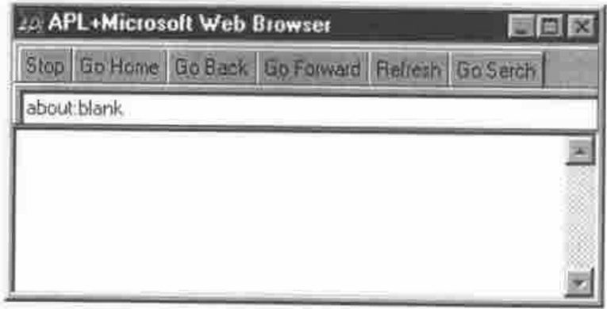
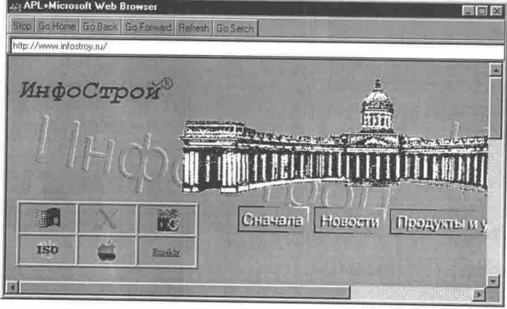
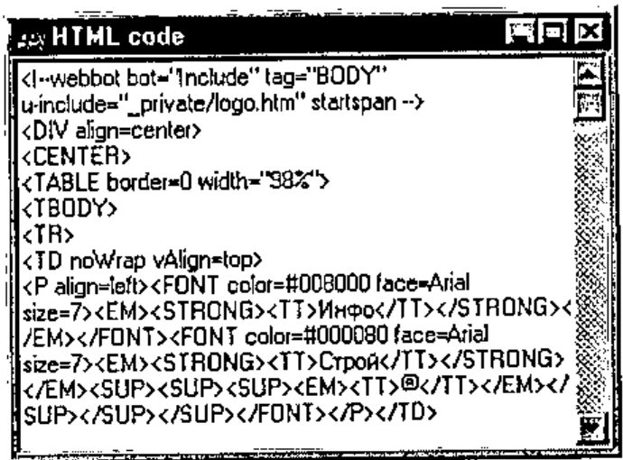
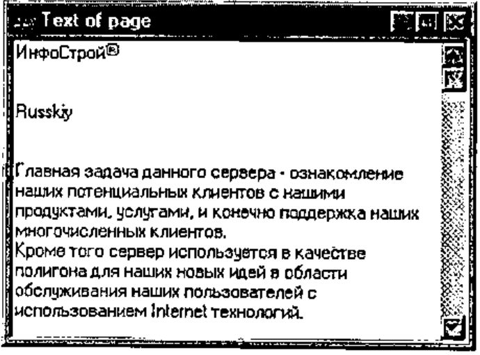
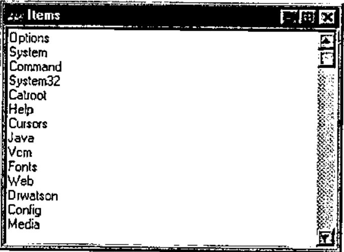

*by Alexandr Balako*
{ .byline }

## Introduction

Using OLE Automations (OLE and ActiveX) extends the features of common applications. In this article I want to describe the possibility of using the "Microsoft Web Browser" ActiveX in APL. This OLE Automation is a part of Internet Explorer 4 (IE) or higher. The simple workspace is described too.

## Object Model

Here I try to describe an object model of the "Microsoft Web Browser" (MWB). The MWB is a tool that allows access to different URLs (Uniform Resource Locators). It identifies the full path of a document, graphic, or other file on the Internet or an intranet. The MWB has a complex structure. That’s why I show the objects, properties, methods and events of the part that is used in the simple WS.

### Main object

Figure 1 shows the model of the main object:


**Figure 1**

Properties of the main object:

- **Document**: represents the content of the page that is currently navigated by the MWB;
- **LocationURL**: is a string that reports the path and name of the page;
- **LocationName**: is a string that reports the header of the page.

Methods that are used:

- **Navigate**: a command to read the page from a specified URL;
- **GoHome**: a command to navigate to the home URL (specified by the user as his home page);
- **GoBack, GoForward**: commands to navigate to the previous or next page;
- **GoSearch**: go to the search URL;
- **Refresh**: re-read the page from the current URL.

Just one Event was used:

- **DocumentComplete**: this event is reported by the MWB after reading the page.

After using the Navigate method it is possible to access a Document object. There are two types of Document that were used in the simple WS: HTML page and Folder. The Document as HTML page is shown in Figure 2 and as Folder in Figure 3.

### Document (HTML)

When the MWB has navigated to an HTML (Hypertext Markup Language) page, the Document object contains a property ‘body’. It can be used to access the page:


**Figure 2**

When the page contains frames it is possible to access the frame code through the frames property (I don’t examine this case here).

The properties InnerHTML and InnerText produce strings with the HTML code and the text of the page respectively.

### Document (Folder)

When the MWB has navigated to a folder, for example URL=‘C:\WINDOWS’, the document is represented by other objects, as it does not contain a ‘body’ property. Instead it has a ‘Folder’ property that represents objects through the items method. Each Item is a folder or file or URL.


**Figure 3**

Now we are ready to start with an example.

## Building a Simple Application

To build a demonstration WS we need set `⎕ML←0`, `⎕IO←1` and create two functions. The first one is the main function that will run the simple application and is listed below:

```apl
[0]WebBrowser;OBJName;OBJPref;tmp;MicrosoftWebBrowser;F_MicrosoftWebBrowser;⎕TRAP
[1] ⍝ This function Creates web browser
[2] OBJName←'MicrosoftWebBrowser'
[3] OBJPref←'F_MicrosoftWebBrowser.'
[4] ⍝ Create OCXClass
[5] OBJName ⎕WC'OCXClass' 'Microsoft Web Browser'
[6] ⍝ Create form
[7] (¯1↓OBJPref)⎕WC'Form' 'APL+Microsoft Web Browser'('Size' 480 640)
   ('Coord' 'Pixel')
[8] ⍝ Placing ActiveX to Form
[9] (OBJPref,OBJName)⎕WC OBJName('Size' 430 640)('Posn' 50 0)
   ('Attach' 'Top' 'Left' 'Bottom' 'Right')
[10] ⍝ Detecting Event DocumentComplete from WebBrowser
[11] (OBJPref,OBJName)⎕WS'Event' 'DocumentComplete' 'DocumentComplete'
[12] ⍝ Prepare decorate toolbar
[13] (OBJPref,'TB0')⎕WC'ToolBar'('Size' 1 640)
[14] ⍝ Prepare toolbar for controls
[15] (OBJPref,'TB1')⎕WC'ToolBar'('Size' 24 640)
[16] ⍝ Stop button
[17] tmp←'⍎3 ⎕NQ(OBJPref,''MicrosoftWebBrowser'')''Stop'''
[18] (OBJPref,'TB1.B1')⎕WC'Button' 'Stop'('Event' 'Select'tmp)
[19] ⍝ Go Home Button
[20] tmp←'⍎3 ⎕NQ(OBJPref,''MicrosoftWebBrowser'')''GoHome'''
[21] (OBJPref,'TB1.B2')⎕WC'Button' 'Go Home'('Event' 'Select' tmp)
[22] ⍝ Go back Button
[23] tmp←'⍎3 ⎕NQ(OBJPref,''MicrosoftWebBrowser'')''GoBack'''
[24] (OBJPref,'TB1.B3')⎕WC'Button' 'Go Back'('Event' 'Select' tmp)
[25] ⍝ Go forward button
[26] tmp←'⍎3 ⎕NQ(OBJPref,''MicrosoftWebBrowser'')''GoForward'''
[27] (OBJPref,'TB1.B4')⎕WC'Button' 'Go Forward'('Event' 'Select' tmp)
[28] ⍝ Refresh button
[29] tmp←'⍎3 ⎕NQ(OBJPref,''MicrosoftWebBrowser'')''Refresh'''
[30] (OBJPref,'TB1.B5')⎕WC'Button' 'Refresh'('Event' 'Select' tmp)
[31] ⍝ Go Serch button
[32] tmp←'⍎3 ⎕NQ(OBJPref,''MicrosoftWebBrowser'')''GoSerch'''
[33] (OBJPref,'TB1.B6')⎕WC'Button' 'Go Serch'('Event' 'Select 'tmp)
[34] ⍝ Tool bar for edit field to type address
[35] (OBJPref,'TB2')⎕WC'ToolBar'('Size' 24 640)
[36] ⍝ Button to react on Enter key
[37] tmp←'⍎0 0⍴3 ⎕NQ(OBJPref,''MicrosoftWebBrowser'') ''Navigate''
   ((OBJPref, ''TB2.ED'')⎕WG''Text'') 0 0 0 0'
[38] (OBJPref,'TB2.B1')⎕WC'Button' '"('Size' 0 0)('Default' 1)
   ('Event' 'Select' tmp)
[39] (OBJPref,'TB2.ED')⎕WC'Edit'('Size'(24 630))
[40] ⎕NQ(OBJPref,'TB1.B2')'Select'
[41] ⎕TRAP←11 'E' '→⎕LC'
[42] ⎕DQ ¯1↓OBJPref
[43] ⍝ End
```

The second one is the DocumentComplete function and it will detect the DocumentComplete event.

```apl
[0] DocumentComplete MSG;TMP;⎕TRAP;IT;Ind;TMP1
[1] (OBJPref,'TB2.ED') ⎕WS'Text'((OBJPref,OBJName)⎕WG 'LocationURL')
[2] :If 9≠⎕NC OBJPref,'H'
[3] (OBJPref,'H')⎕WC'FORM' 'HTML code'('Posn' 0 0)('Size'200 300)
[4] (OBJPref,'H.E')⎕WC'EDIT'('Style' 'Multi')('Posn' 0 0)('Size' 200 300)
  ('Vscroll' ¯1)
[5] :End
[6] :If 9≠⎕NC OBJPref,'T'
[7] (OBJPref,'T') ⎕WC'FORM' 'Text of page'('Posn' 0 310)('Size' 200 300)
[8] (OBJPref,'T.E')⎕WC'EDIT'('Style' 'Multi')('Posn'0 0) ('Size' 200 300)
  ('Vscroll' ¯1)
[9] :End
[10] :If 9≠⎕NC OBJPref,'F'
[11] (OBJPref,'F')⎕WC'FORM' 'Items'('Posn'0 620)('Size'200 300)
[12] (OBJPref,'F.E')⎕WC'EDIT'('Style' 'Multi')('Posn'0 0) ('Size' 200 300)
  ('Vscroll' ¯1)
[13] :End
[14] (OBJPref,'H.E')⎕WS'Text' ''
[15] (OBJPref,'T.E')⎕WS'Text' ''
[16] (OBJPref,'F.E')⎕WS'Text' ''
[17] ⎕TRAP←0 'E' '→0'
[18] 'TMP'⎕WC(1⊃MSG)⎕WG'Document'
[19] :If ×|⎕NC'TMP.body'
[20] (OBJPref,'TB2.ED')⎕WS'Text'((OBJPref,OBJName)⎕WG 'LocationURL')
[21] 'TMP'⎕WC'TMP'⎕WG'body'
[22] (OBJPref,'H.E')⎕WS'Text'('TMP'⎕WG'innerHTML')
[23] (OBJPref,'T.E')⎕WS'Text'('TMP'⎕WG'innerText')
[24] :ElseIf ×|⎕NC'TMP.Folder'
[25] 'TMP'⎕WC'TMP'⎕WG'folder'
[26] 'TMP'⎕WC TMP.Items
[27] IT←''
[28] :For Ind :In ¯1+⍳'TMP'⎕WG'Count'
[29] :Trap 0
[30] 'TMP1'⎕WC TMP.Item Ind
[31] IT,←⊂TMP1.Name
[32] :End
[33] :End
[34] IT←↑IT
[35] (OBJPref,'F.E')⎕WS'Text'(IT)
[36] :End
```

Now try to start the WebBrowser in the WS. The first screen is shown in Figure 4.



**Figure 4**



**Figure 5**

Try to type ‘www.infostroy.ru’ in the edit field and if you are connected to the Internet it shows the screen in Figure 5.

If you are not connected to the Internet type ‘c:\WINDOWS’ in the edit field and you will see the screen in Figure 6.


**Figure 6**

## Accessing Page Contents

While you are trying to explore different pages, at the top of your screen 3 little forms are created (they are created by the ‘DocumentComplete’ function). The first is a form with HTML code (see lines 18-23 of ‘DocumentComplete’):



**Figure 7**

The second one contains the text of the page:



**Figure 8**

And the last form contains items if the page shows a folder (see lines 25-33 of ‘DocumentComplete’):



**Figure 9**

## Play with the MWB

Now try to type in the edit field the path to an existing Office document. For example it could be ‘c:\My Documents\Document1.doc’ or ‘c:\My Document\Book1.xls’. I think that you have never seen it before in APL. If you have Office installed it is possible to edit files there!!! **This Part of the article was edited in the WebBrowser WS.**

## Conclusion

So we can power an application by Internet without creating an APL Java machine or APL HTML interpreter. It is possible to use this ActiveX as a tool to access Web sites, download files, copy, move and rename them without using low-level programming with the Windows API.
