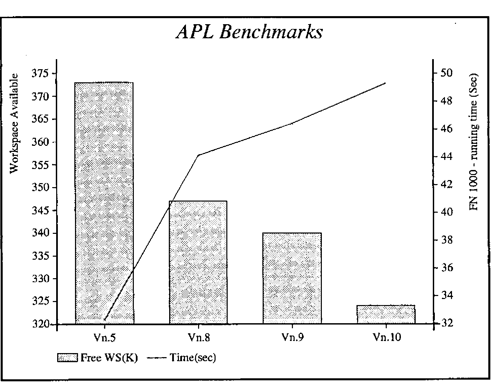

*reviewed by Jonathan Barman*
{ .byline }

## Introduction

STSC have come out with a new release of APL\*PLUS/PC almost exactly one year after the previous release. As in previous reviews, I will concentrate on the new features rather than trying to cover the entire product.

The major new feature is the introduction of `⎕NA` to access programs written in C or FORTRAN, which solves a lot of the hassle that was necessary previously. The remaining enhancements are relatively minor, but I suspect that the better colour support and the mouse control will prove to be very popular.

## Running non-APL routines

I wish this enhancement had come out earlier, it would have saved hours of work battling with assembler to provide those functions where APL is inherently slow. There are five components in the enhancement:

**Interface Programs**
:   When you want to run a non-APL program you have to install an Interface Program before going into APL. There is a special Interface Program for each different compiler and language combination. STSC have provided three, Microsoft C, Microsoft Fortran, and Turbo C. You can load as many Interface Programs as necessary to run the different flavours of non-APL programs. The source assembler is provided so that experienced programmers can write their own interface programs for other compilers and languages.

**Stack Allocation**
:   Compiling is as normal for the non-APL program, but at the linking stage it is necessary to include an STSC provided object deck with allocates room for the stack. The source assembler is provided so that one can change the size of the stack as required.

**`⎕MLOAD`**
:   `⎕MLOAD` reads .EXE and .MAP files and returns an integer vector of machine code which you save in your workspace. The vector is in a special internal format which STSC say is deliberately not documented.

**`⎕NA`**
:   `⎕NA` creates a special function in the workspace which will run the non-APL program. You have to specify which Interface Program to use, the name of the variable holding the module created by `⎕MLOAD`, the name of the entry point of the program, and the parameters together with the data types required by the program.

**)DEBUG**
:   If APL has been started under the control of the DOS DEBUG program, then )DEBUG takes a `⎕NA`’ed function as an argument and will hand over control to DEBUG when the function is run.

    To try out the new feature I created a little program in Turbo C to manipulate dates. My initial effort resulted in a spectacular crash in APL with garbage written all over the screen. Tracking down the error was fairly easy. First I made sure that the C program was behaving properly by adding a ‘main’ calling routine and using the Turbo C debugging facilities. When this did not cure the problem, I looked more carefully at the sample C programs supplied and found that I had omitted to declare the C functions as ‘far’. When this was corrected all worked beautifully. I never got )DEBUG to work but I must confess that I did not try very hard as it usefulness is limited when Turbo C has such magnificent debugging facilities.

    The automatic data type conversion facilities are very useful. Some years ago I wasted hours trying all sorts of tricks to force the APL interpreter to pass floating point numbers to an assembler routine. As well as being able to specify F8 for long floating point numbers, one can also specify I4 for long integer, I2 for the normal integers used by APL, and C1 for character. If coercion to the specified data type is not possible you get a `DOMAIN ERROR`.

    The problem of multiple arguments and results has been handled by extending APL for those functions which have been created by `⎕NA`. Multiple arguments are passed to a `⎕NA`’ed function as a right argument in the same format as the right argument to `⎕FMT`, with a set of statements separated by semicolons and the whole enclosed in parentheses. Multiple results must be assigned to a strand of variable names. For example, a program which takes 4 arguments, two of which are modified and returned as results, would be called with `A B ← FUN (A;B;C;D)`.

The whole thing looks to be a really useful extension which enables one to integrate APL and non-APL programs easily and quickly.

## Mouse Support

`⎕MOUSE` allows one to control the mouse, such as positioning it and specifying whether the clicks do anything. It is now possible to design mouse interaction with `⎕WIN` and `⎕WKEY`, with yet more special feature numbers such as one to move the cursor to the mouse position. I was unable to play with the facilities as I have not got a rodent, but the implementation looks comprehensive and reasonably easy to use.

## File System

The file system has always been plagued by the expanding replace problem. When `⎕FREPLACE` is used with an object which is bigger than the original object, then the new object is placed at the end of the file and you have to use `⎕FDUP` to recover the space taken up by the original object. Rather than doing a proper job of reusing old space automatically, STSC have extended `⎕FAPPEND` and `⎕FREPLACE` so that extra space can be reserved for a component. There is also a new system function `⎕FCSIZE` which enables one to find out what space has been reserved for a component. `⎕FDUP` does not take any notice of the reserved space, and removes it all when the file is cleaned up. Old hands at the game have been reserving extra space by writing large dummy variables to file on the first `⎕FAPPEND`, and the ‘enhancement’ just makes the process a little more convenient. One day STSC might provide a proper file system to eliminate all this nonsense.

## User Command Processor

The User Command Processor has been properly integrated so that the interpreter now recognises commands such as `]LIB` or `]MYFN` directly, rather than the original messing around with Function Key 5. The `⎕UCMD` system function replaces the previous `∆UCMD` function. The file formats have changed and a conversion function is supplied to upgrade. I found the processor very slow in use as there is a lot of disk activity, and my disk is relatively slow, but it is sometimes worth waiting for the results of the more exciting distributed functions.

## PostScript Support

A PostScript APL font is supplied, together with a special printer driver which does the normal Port 10 stuff. Not having a PostScript printer was tantalising, as I would have dearly liked to check this one out. If possible, a full review will appear in a later issue of Vector.

## Other Enhancements and Changes

The **colour support** for the APL session should be popular, and I cannot think why it was not done before. The changes required must have been relatively simple. The colours can be specified on entry, or `⎕POKE` can be used to set them during the session.

Calling the **Extended System** has been simplified as the session manager has been bundled up with its interpreter. There are now three favours of .EXE files, APLX for Extended, APL for standard, and APLNOG for no graphics.

**Font management** has been improved so that you no longer have to remember the whether you have an EGA or VGA, and you can use the extended depths of 28, 43 or 50 lines with APL characters. It no longer matters how many times the program is run, and the same program can be used to remove the APL characters when the APL session ends.

There is now an extra step in the familiar routine of copying all the relevant files from the supplied disks. Many files are distributed in a compressed format, so one now has to unpack them before use. The instructions are clear and the simple process only has to be done once. I liked having each packed file separate so that one can pick and choose which to unpack by looking at the directory. One often comes across software packed up into one huge file which has to be unpacked in total.

## The Smith Benchmarks

Yet again the benchmarks show up a slightly larger interpreter and slower performance. `⎕WA` is down 16K from Release 9, which inevitably increases running times as the garbage collect process has to be carried out more frequently. Nothing come free in this world, and the extra features are bound to take up more space for the code. Prospective purchasers will have to decide if the additional features are worth the degradation in performance.

I carried out the benchmarks on an IBM XT with a co-processor for floating point arithmetic, but only 576K of memory. This gives different absolute results from those shown by Adrian in Vector 6.4, but the differences between the releases seem to be consistent.

```
APL Expression                        Type         Vn.5    Vn.8   Vn.10
--------------                        ----         ----    ----   -----
⌊⎕WA÷1024                             ⍝ WA         373K    347K    324K
T←⎕TS ⋄ +/V+V ⋄ DO ⎕TS-T              ⍝ INT ....    380     380     380
T←⎕TS ⋄ +/V[I] ⋄ DO ⎕TS-T             ⍝ INT ....     50      50      50
-----------------------------------------------------------------------
T←⎕TS ⋄ V+.×V ⋄ DO ⎕TS-T              ⍝ RL ....     380     440     490
T←⎕TS ⋄ +/V*2 ⋄ DO ⎕TS-T              ⍝ RL ....    2080    2310    2310
T←⎕TS ⋄ X←+/M ⋄ DO ⎕TS-T              ⍝ RL ....     490     490     500
T←⎕TS ⋄ V+.×,M ⋄ DO ⎕TS-T             ⍝ RL ....    1200    1260    1260
-----------------------------------------------------------------------
T←⎕TS ⋄ +/S='T' ⋄ DO ⎕TS-T            ⍝ CH ....    3790    3950    3950
T←⎕TS ⋄ 'FAT'∊S ⋄ DO ⎕TS-T            ⍝ CH ....      50      50      50
T←⎕TS ⋄ X←S∊'FAT' ⋄DO ⎕TS-T           ⍝ CH ....    2800    5660    5660
-----------------------------------------------------------------------
T←⎕TS ⋄ X←B∨B∧~B ⋄ DO ⎕TS-T           ⍝ BL ....    5000    5650    5650
T←⎕TS ⋄ ∧/B ⋄ DO ⎕TS-T                ⍝ BL ....     110     160     160
T←⎕TS ⋄ X←∨\B ⋄ DO ⎕TS-T              ⍝ BL ....     220     270     270
-----------------------------------------------------------------------
T←⎕TS ⋄ FN 10 ⋄ DO ⎕TS-T              ⍝ FN ....     330     490     490
T←⎕TS ⋄ FN 100 ⋄ DO ⎕TS-T             ⍝ FN ....    3240    4560    4830
T←⎕TS ⋄ FN 1000 ⋄ DO ⎕TS-T            ⍝ FN ....   32.3s   46.5s   49.3s
-----------------------------------------------------------------------
T←⎕TS ⋄ X←FF∧.='EJD..' ⋄ DO ⎕TS-T     ⍝              50      50      50
T←⎕TS ⋄ X←FF∧.=⍉20 5⍴'EJD..'⋄DO ⎕TS-T ⍝           35.1s   39.5s   39.5s
=======================================================================
```

The standard system was used (APL.EXE), and all the timings shown are the minimum values that were returned. Higher times were assumed to be due to the garbage collect job that has to be carried out when there is no free memory for a new object.

The two most interesting lines are those timing the expressions `FN 1000` and `X←FF∧.=⍉20 5⍴'EJD..'`. The function `FN` (see Vector 6.4 for a listing) may cause the garbage collect process to occur more frequently, but I suspect that the interpreter is a mite slower as it has to check for `⎕NA`’ed functions with their special syntax. The big inner product has very little interpreter overhead as once everything is set up the majority of the time is taken up with doing all those thousands of equality tests, and there is no change in that process.



The benchmarks were not carried out on the Extended System, as this is intended for developers and would not normally be used for production systems. Speed is less important than good editing and debugging facilities.

## Conclusion

The same story yet again, more features, bigger size, and slower - all products seem to get like this towards the end of their life. I liked the `⎕NA` and the mouse support features, and can see many uses for them. I am less sure of the utility of some of the other features in both this and previous releases. It would be nice to be able to pick and choose the features that are needed so that a smaller faster interpreter can be used for production systems, without having to buy the minimum quantity of Run Time systems.
