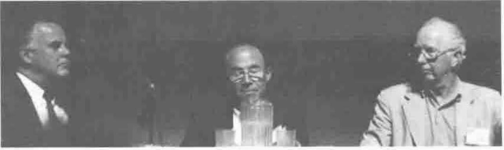
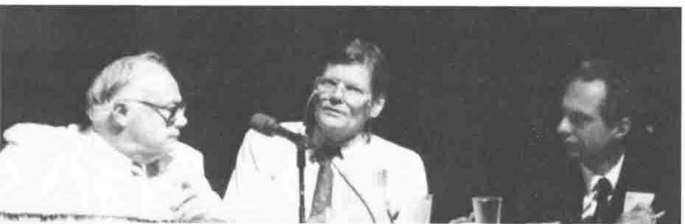

*reported by Jonathan Barman*
{ .byline }

Eugene McDonnell - The question is irrelevant. Surely proponents of J would not be thrown out of the APL community?

Garth Foster - J is quite definitely not APL. J is spelled differently from APL and has different syntax. There are many J constructs which cannot be translated to APL, so it can hardly be called a dialect. ISO APL allows extensions to the language, but J cannot possibly conform. Speakeasy and Q’Nial were never considered dialects of APL.

David Steinbrook - What is a dialect? Comparing SAX and J shows many similarities. J gives us the power we all wanted for the last 20 years. APL is really a dialect of J!

Phil Benkard - This is a political decision, but political decisions affect our lives. Many aspects of J are different from APL. Functions are referred to as Verbs, box is different from nesting, hook and fork are new in J, and strand notation is different. No formal decision can be made today, but what political decision should be made?

*Is J a Dialect of APL - the "I don’t cares" Joey Tuttle, David Steinbrook, Gene McDonnell*
{ .caption }

Joey Tuttle - Who cares if J and APL are different? Hopefully new insights will come from J and SAX which will enhance APL.

Richard Nabavi - Is US English a dialect of English? Richard cannot understand J. The academic view of a language is different from the commercial view, and sometimes the technically best solution does not win. For example DOS is technically poor but has wide support. The main objective should be to reduce the dialects of APL so that it can be promoted to a wide audience, and can be standardised. Will there be a J92 Conference?

David Weintraub - A standard is now available for APL, but will there be one for J? J seems to be more of a write-only language than APL. Could you implement APL in J?

Bob Bernecky - APL and J ideas need to be disseminated to the larger world of computing, and it does not matter what language is used. The character set inhibits APL. J is more compilable than APL, and has simpler syntax. The semantics of J are totally regular. Several mistakes were made in APL, and J is a new start where these mistakes have been rectified. J is not a dialect of APL, it is a functional language.

Garth Foster - Don McIntyre took a long time to learn J. Perhaps J is a successor of APL, but may not be a success.

Richard Nabavi - What versions of J are available? We should agree on the portrayal to the outside world.

Donald McIntyre - Will the ISO Standards committee decide whether J is a dialect of APL?

Phil Benkard - The APL2 syntax is simple, and the syntax and semantics are separated. There were mistakes in APL. It was disappointing that there was nobody present at the last Standards meeting representing the Sharp APL or J community.

Jim Lucas - APL and J form a family of languages.

Garth Foster - Everybody should buy and learn J. There is a history of language development, for example Pascal gave birth to Modula 2 and ADA. Let the market place choose whether APL or J is best. Teachers should use J, not APL.

Ed Cherlin - It is interesting that we are discussing the question at all. Why is this the one topic we want to argue about? Papers on J have been accepted at this conference, and will continue to be accepted.

Doug Bohrer - How many in the audience are new to APL? A show of hands indicated that there were very few.

Leroy Dickey - The J tutorial takes a page a day to complete.

Ken Iverson - The dictionary of J contains an introductory comment that J is a dialect of APL, so in a sense the whole debate is Ken’s fault! He is flattered to think that he has actually created a new language.

Phil Benkard - Many of us are amazed that Ken has invented a new language, as he invested heavily in the special symbols, which are no more in J.

Gerard Langlet - In order to use J one will need to be able to choose from many J interpreters. Also J must be a stable language, not subject to change.

Bob Bernecky - Surely APLers will not drum out the J community. The popularity of APL and J will only increase if we all aim to publish articles in the big circulation magazines and journals.

R G Sellinger - Learning J one has to go back to first principles. It is not a dialect of APL, but it is derived from APL. The APL community is unique in being able to look at and accept new languages and ideas.

Joey Tuttle - In his experience one did not need to go back to first principles when learning J.

Jim Lucas - One does not have to go back to the beginning when learning J. The arguments about floating or grounded enclose took place 4 years ago. Ken Iverson has now given us a new name for the grounded system. A power struggle is quite unnecessary, and we should all stop the arguments and get down to the business of promoting APL and J.

*reported by Anthony Camacho*
{ .byline }

Gene McDonnell said that he doesn’t care whether J is or is not a dialect of APL and asked ‘What are the consequences?’. Had I been organising the debate and known he was going to say this I would have not have included him on the panel. It was a bad way to begin, because there plainly are consequences. Debates are a poor substitute for an argument because debaters are at liberty to ignore each others’ utterances. In this debate they did so to an astonishing degree. I would have preferred a medieval disputation where each sentence from one disputant is responded to by the other and the argument progresses or not according to the skill of the disputants.

*Is J a Dialect of APL - the "better if nots" Garth Foster, Phil Benkard, Richard Nabavi*
{ .caption }

Garth Foster said that J is spelled differently and has a different syntax and semantics so it is a new language, not a dialect.

David Steinbrook said that J feels like APL.

Phil Benkard had asked Howard Peelle, who had told him a dialect ought to be a subset. J is spelled out, not in single symbols. Phil thought it was a political decision.

Joey Tuttle said, whatever the answer was, it would not affect his life, so he was inclined to agree with Gene. He suggested a language is a dialect that has an army and a navy. He thought that what Ken is doing is really valuable and wants to see it publicised and discussed at conferences. After all Michael Jenkins spoke about Nial at an APL conference because APLers were interested.

Richard Nabavi admitted he doesn’t understand J and felt it a pity that Jim Brown wasn’t on the panel "Is he too busy writing J2?". He felt more variations in APL would diminish rather than magnify the chance of APL succeeding. APL is not increasing its proportion of computer users. In general it isn’t the best solution that wins - look at MSDOS. He would like a single standardised APL which everyone could support and which would help to remove the doubts of potential customers. He snidely looked forward to being invited to J 92.

Dave Weintraub said that he keeps encountering three objections to APL - it’s write-only, it uses a different character set, it doesn’t stick to one standard - and this dialect makes things worse. He also thought J would be capable of implementing any variety of APL.

Bob Bernecky wanted to get the ideas behind APL into the greater world of computing. He had found that with J he doesn’t get the negative responses he used to get with APL. J has more regular semantics than APL, simpler syntax than APL, is more compilable than APL and omits the known errors in APL.

Garth Foster objected that simpler syntax wasn’t necessarily easier. He recalled Bob getting lost during his presentation and having to ask Roger "Where am I?".

Donald McIntyre said that APL conferences without Iverson would be like Hamlet without the Prince of Denmark.

Jim Lucas rejected Richard Nabavi’s arguments, saying the Catholic Church tried to standardise the rules of the universe for Galileo. He hoped APL conferences would include J. APLers (of all people) should be suspicious of any claim that J is unreadable or write-only. Even the symbol argument is suspect: Serbian and Croatian are very similar languages though written with different alphabets.

Garth Foster said Modula isn’t called a dialect of Pascal even though Wirth developed both.

Ed Cherlin said that the argument was odd: there are innumerable dialects of APL with four or five in every conference. The Personal Array Transactor, hailed as the first APL implementation, is further from modern APL than J is. Surely the clincher is that J has the interesting ideas that APLers want to discuss.
