*reviewed by Jonathan Barman*
{ .byline }

Iverson Software Inc. have released APL and J as Windows products. The Windows interface is identical in the two products, so if you have mastered it in APL you can immediately switch to J and run the equivalent code. The J disk comes with a DOS version as well.

## Getting Started

Installation was easy. I copied the disks, one for APL and one for J, into appropriate directories and was up and running almost immediately. On launching APL I got a message telling me that I had not installed the APL font. The standard Windows font installation soon put that right. These are full Windows programs, and you get the standard message if you try and run them in DOS. The icons included in the .EXE files are plain and ordinary, which suits me fine.

The APL font is very acceptable. The only difference between the ISIAPL font and Adrian Smith’s APL2741 font is that the alphabetic characters are upright rather than italic. Also, there are no line drawing characters. The following is an example of a little function from the *isiwin* workspace in both fonts.

![The function r←id wdg r, [1] r←,>1↓,(r[;⎕io]∊<id)⌿r, shown first in the upright ISIAPL font and then in the italic APL2741 font](art10000660/fonts.jpg)

On the screen the ISIAPL font looks cleaner with a much sharper definition at 10 point size. On paper there is not a lot of difference.

The session manager in both APL and J is identical, and appears to be a straight copy of the DOS session manager moved into a Windows environment. There is an execution line at the bottom of the screen, and the top part displays the results. The initial screen comes up filling up half the screen horizontally. I usually find that I need to change this shape, but there are no .INI files, so the programs do not remember the shape on exit. The following example of the APL session shows the workspaces available and the functions in the *isiwin* workspace which we will be exploring later.

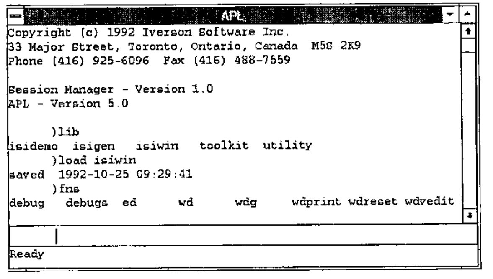

I am used to the IBM, APL\*PLUS or Dyalog APL style of session managers, where one can type all over the screen to edit and execute anything displayed. It does not take long to get used to the ISI way of doing things, but having to cut and paste text down to the execution line seems to take a fraction longer. You can use the arrow keys to scroll up and down the actual commands that have been typed, but you cannot see them all to select the one you want.

The size of the window does not alter the way in which variables are displayed, which is purely controlled by `⎕pw`. I have not found an equivalent in J, and expressions like `i.1000` wrap after some arbitrary number of characters. Expressions resulting in a wide character matrix, for example `1":|:(4#10)#:i.2000` (in APL `1 0 ⍕(4⍴10)⊤⍳2000`, except J requires `|:` or `⍉`), causes the screen to flash multiple times and eventually you get eight lines of output with a ragged right margin. The only way to see the right margin is to place the cursor on a line, press the Home key and then the left arrow key. It is most annoying not having a scroll bar along the bottom of the window so that you can see where you are in the wide display.

There is no menu bar along the top of the window, so none of the standard Windows features are included, such as changing the font size, or printing the session log. The standard cut and paste keys work in the normal way. With J this feature is most useful as it is easy to develop scripts in a Notepad window displayed along with the J session. Help is available with F1, which is reasonably full with APL. There is no list of all the APL primitive functions and operators; you need to buy the manual for that. The APL keyboard help is nicely done. The overstruck characters are distributed in a way with which I was not familiar, but otherwise it was easy to use. I only found by chance that O-U-T exit from `⍞` was in fact Ctrl-C. Obvious really, if I had stopped for a moment to think about it.

It is not possible to run multiple sessions of either program. Attempts to do so result in a check box appearing telling you that APL (or J) is already started.

## Windows Programming Example

Windows are created by running a system function `⎕wd` (`11!:0` in J) on a text vector right argument containing window programming statements. Each statement is separated with a semicolon, and "whitespace" of spaces, returns, tabs etc. are ignored, so you can edit a text vector with a normal editor. There are no symbols, and comments are allowed with the `rem` statement, so the result looks like some terrible form of Basic.

The APL documentation suggests that you run *gfx* in the *isidemo* workspace and become familiar with the application, so let us start with that.

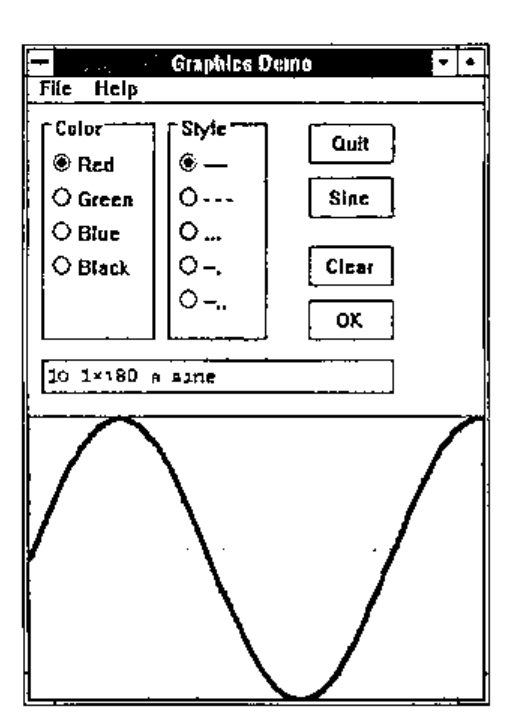

I clicked on the Sine button, and then clicked on the OK button to get the sine wave at the bottom of the window. The *gfx* function looks quite simple:

```apl
    ∇ gfx;ap;aprun;apwtwp;apwr;apid;⎕io
[1]   ⎕io←0 ⋄ aprun←1 ⋄ ap←'gfx' ⋄ gfxinit
[2]  lw:apwr←wd gfxwtwp
[3]   →(ap≢apid←ap,'*id' wdg apwr)/ln ⋄ →(3≠⎕nc apid)/lb
[4]  lx:⍎apid ⋄ →aprun×lw
[5]  ln:→(3=⎕nc apid←ap,3↓'*type' wdg apwr)/lx
[6]  lb:→(~' 3 fkey'≢'*type' wdg apwr)/lm ⋄ →lw⊣wd 'beep 3;'
[7]  lm:→lw⊣wd 'mb ',ap,' "',apid,' function not defined."
mb_iconexclamaticon mb_ok;'
    ∇
```

The *gfxinit* function which is called on line [1] contains a single statement `⊣wd gfxwp` which runs the *wd* function on a global in the workspace. *wd* is a cover function for `⎕wd` with a bit of error trapping. *gfxwp* is a text vector containing the windows ‘program’, which defines all the push buttons, radio buttons, input area and graphic area. `⊣` throws away the result from *wd*.

Line [2] runs *gfxtwp* which sets the default input focus and waits for the user to do something. This time the result from *wd* is saved in *apwr*. Results from *wd* are a 2-column matrix of boxed character vectors. `⎕wd` actually returns a simple character vector, but the cover function converts this into the desired format. In J the result of `11!:0` is in the correct format, so no cover function is needed. When I clicked on the Sine button the following was returned:

```text
*type    5 button
*parent  gd
*id      sine
red      1
solid    1
exp
```

The items in column 1 prefixed by a \* are system results; the remaining are the data from radio buttons and input boxes. *\*type* is always the first row and shows how the wait was ended. As I clicked a button I got the result *5 button*. The 5 can be used as a quick way of checking the type, as each of the possible types are coded 1 to 9. *\*parent* gives the id of the parent window. *\*id* is the id of the child window which was active. The remaining lines show the data in the other child windows. The *exp* child window contained nothing.

On line [3] the child window *id* is extracted from the result by the *wdg* function. If the id is not `'gfx'` but is a name of a function in the workspace then it is executed on line [4] and we go round the loop again. In my case the *gfxsine* function was executed, which contains the single statement `⊣wd 'csel exp;ctext "10.1×⍳180 ⍝ sine";'`. The first statement `csel exp` selects the child window with the id of *exp*, and then `ctext` inserts the text into that window.

If the \*id is not the name of a function in the workspace, then something else has happened. Lines [6] and [7] sort this out. If you press the Esc key, or close the window with Alt-F4, then the \*id row of the result contains text telling you what happened. If that fails, then line [5] executes a function based on one of the 9 return types.

The guts of the program is in the *gfxok* function, which can be called if you click on the OK button, or if you press Enter in the child window where you enter your expression (*exp*):

```apl
    ∇ gfxok;⎕trap;c;p;d
[1]   c←,(('red'⊃'green'⊃'blue'⊃'black')∊apwr[;0])/gfxcolors
[2]   p←,(('solid'⊃'dash'⊃'dot'⊃'dashd1'⊃'dashd2')∊apwr[;0])/gfxpens
[3]   ⎕trap←'∘0 c ⎕trap←''''⋄→le' ⋄ d←⍕plot,⍎'exp' vdg apwr ⋄ ⎕trap←''
[4]   →0⊣wd 'csel gfx;grgb ',c,';gpen ',p,';glines ',d,';gshow;'
[5]  le:⊣wd 'mb "Graphics Demo Message" "Not numeric
vector."||mb_iconexclamation mb_ok;'
    ∇
```

Lines [1] and [2] get the colours and line specifications from the radio button settings. Line [3] sets up error trapping and then executes the statement entered in the *exp* child window. Line [4] selects the graphics child window, sets the colours with *grgb* statement, the pen line with *gpen*, plots with *glines*, and displays the result with *gshow*. Line [5] displays a message box with the *mb* statement, which has four parameters specifying the title, the text to be displayed, an exclamation mark icon and OK pushbutton. *mb* does its own show and wait, so you do not have to code these explicitly. Executing line [5] on its own results in:

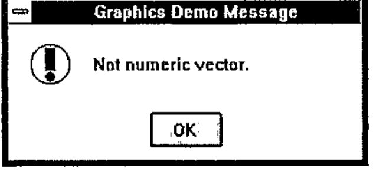

and *wd* returns:

```text
*type    2 nowait
*mb      OK
```

## GUI Programming

The *gfx* illustrates rather well the process that is necessary to program Windows in ISI APL or J. First you have to create the text vector that specifies the window ‘program’, which details all the child windows, radio buttons etc. that you need. Then you write a function which displays the window and waits for the user to do something. On returning from the wait all information in the window is returned to you, and you have to unpick the result to decide what to do next. Obviously you do not have to follow the style of programming adopted for *gfx*, which relies on `⍎` to avoid the multiple tests and branches that would otherwise be necessary.

ISI have provided a workspace *isigen* which enables you to write an application using exactly the same process as *gfx*. The *describe* variable in the workspace gives the step by step process required:

> *gen* is a generic application. Build your application by making a copy of the gen application and adding graphical objects and the functions they invoke.
>
> 0\. `gen ⍝` run gen and become familiar with it<br>
> 1\. `)wsid nap` — chose a name for your application<br>
> 3\. `apcreate 'nap' ⍝` rename gen functions, variables and references<br>
> 4\. `nap ⍝` run new application<br>
> 5\. `edit napwp` to add a new button with an id of test<br>
> 6\. `nap ⍝` run application and press new test button<br>
> 7\. define *naptest* function to do something when test is pressed<br>
> 8\. *apwr* variable is the result of the wait<br>
> 9\. add controls and functions, add initialization code to *napinit*, and add cleanup code to *napclose*<br>
> 10\. look at *gfx* functions in *isidemo* as examples
>
> The *gen* application has 4 functions and 2 variables:
>
> | | |
> |---|---|
> | *gen* | - main function and the ‘message loop’ |
> | *geninit* | - initialization and execution of *genwp* |
> | *gencancel* | - process ESC key — *pclose* window and call *genclose* |
> | *genclose* | - process *close* — cleanup and exit |
> | *genwp* | - *wp* run in *geninit* to display application window |
> | *genwtwp* | - *wp* run at top of message loop — must end with wait |

In spite of my almost illogical dislike of `⍎`, this is actually a good way to get a little application up and running quickly.

Running *gen* displays the following window:

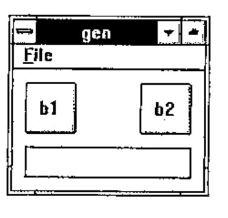

Pressing the Enter key in the edit box displays a message box which shows that the edit window was called *e1*. Line [7] of the *gen* function was executed, which is identical to line [7] of the *gfx* function shown above.

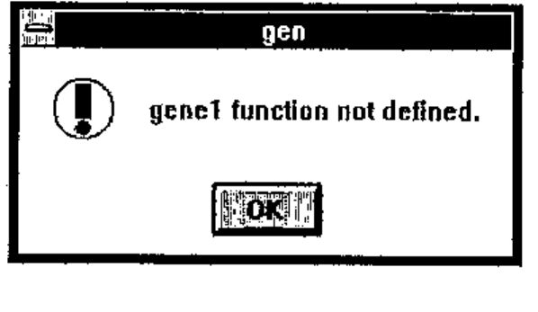

The contents of *genwp* show how the window was constructed:

```text
pc gen;

menupop "&File";
 menu open "&Open";
 menu cancel E&xit;
menupopz;

xywh 5 5 20 20;
cc b1 button;

xywh 50 5 20 20;
cc b2 button;

xywh 5 30 65 12;
cc e1 edit ws_border;
cfocus;
pas 5 5;
pshow;
```

The Windows program statement *pc* stands for Parent Create, and takes a parameter of the name of the parent window. *menupop* defines a single popup menu to go on the top of the window called File with the F as the accelerator key, and is terminated by *menupopz*. A 2-item pull-down menu has been defined under File. To define a button you have to first specify a rectangle with *xywh* and then specify a child window with the *cc* (Child Create) with parameters giving the id and the class of window. In this case b1 and b2 are buttons, and e1 is an edit window with a border. *cfocus* makes the edit box the current window. *pas* `5 5` adjusts the size of the parent window so that there is a border of 5 units around the child windows. *pshow* displays the window.

The *vdedit* function allows editing of the positions of the child windows, once you have created a text vector specifying the parent window and its controls. I ran `a←wdvedit genwp` and then pulled the edit window to be alongside the buttons, resulting in the following:

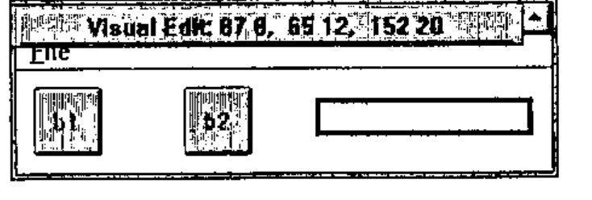

As *genwp* contains a *pas* statement the parent window has been automatically resized to accommodate the new layout. This is pretty crude stuff compared with proper Windows development programs, but at least it enables you to dispense with typing in funny numbers for the positions.

## Window Facilities

As you can see from the examples, you are completely dependent on the facilities that ISI provide in their Windows programming language. There are 62 commands which seem to cover most of the relatively simple things that one might want to do, but by no means cover all of the amazing possibilities that a C programmer has at his disposal, nor the things that appear to be possible in Visual Basic.

The only classes of child windows that can be created are Button, Combobox, Edit, Listbox, Static and Isigraph. Classes are defined in more detail with Styles, for example a pushbutton can be defined as having the style of *bs_autocheckbox*, or *bs_groupbox*. There are general purpose styles, such as *ws_border*, which can be applied to any of the classes of child windows.

Whilst getting to grips with the facilities available, I found the *winexec* command useful, mainly for dumping text and programs from the workspace into Write. A function is supplied to do the job:

```apl
    ∇ wdprint d;b
[1]   d←(1+b←d=CR)/d←,d,CR
[2]   d[(⍳+/b)+b/⍳⍴b]←LF
[3]   ⊣(⎕toascii d) ⎕hfwrite 'temp.wri'
[4]   ⊣wd 'winexec "write.exe temp.wri";'
    ∇
```

The general technique could be used to provide a way of communicating with other Windows programs, even though having to write a file and then starting another copy of a program is slow and rather crude.

## Comparison with Dyalog APL

Dyalog APL/W was reviewed by Duncan Pearson in Vector 9.2, October 1992. Duncan created a number base converter to demonstrate the facilities available, which seemed at first sight to be very similar to those in ISI APL and J, so I will follow Duncan’s steps. If you get out your copy of Vector 9.2, and turn to page 58, we will start at the top of the page.

To use the *isigen* facilities we have to load the workspace and set up the application:

```apl
      )load isigen
saved 1992-10-25 19:19:57
      )wsid bconv
was isigen
      apcreate 'bconv'
```

I will modify the *bconvinit* and *wdvedit* functions to add *pas*, *pcenter* and *pshow* commands to the end of the *bconvwp* variable, so that each stage of the process can be seen. Normally these commands are added at the end of the command variable.

```apl
    ∇ bconvinit
[1]   ⊣wd bconvwp,'pas 5 5; pcenter; pshow;'
    ∇

    ∇ wp←wdvedit wp;a
[1]   wp←wd 'vedit;',wp,a←'pas 5 5; pcenter; pshow;'
[2]   'cancel' ⎕signal(' 8 cancel'≢'*type' wdg wp)/8
[3]   wp←(-⍴a)↓'*vedit' wdg wp
    ∇
```

Now we can create the initial window with the initial edit box, and use *wdvedit* to make it look right:

```text
      bconvwp
pc bconv; pn "Number Base Converter";
xywh 10 10 113 12 ; cc exp edit ws_border es_autohscroll;
      bconv
```

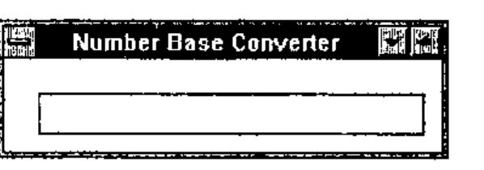

Using the same technique the statement `xywh 10 36 37 12; cc bin button bs_autoradiobutton;` was added for the Bin radio button, giving:

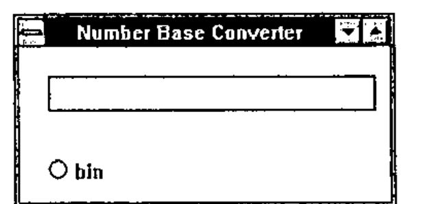

After a bit of messing around with *wdvedit* I got the window looking more or less like the picture at the bottom of page 59:

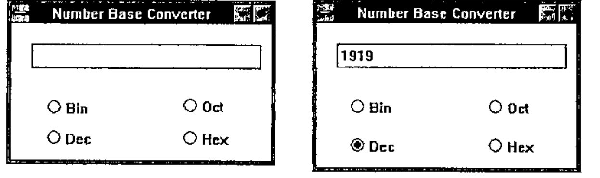

This involved using the *ed* utility, which is a function using the built in Window facilities to allow a simple Notepad type of editing:

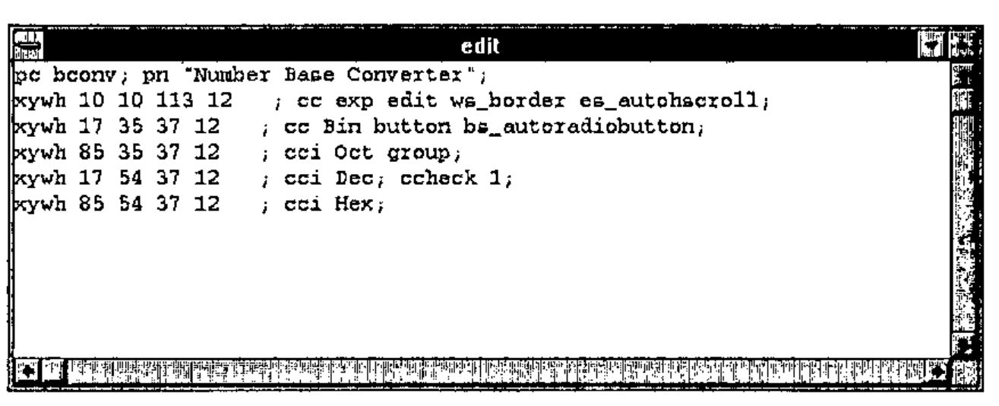

The next step is to write the function *bconvexp* to actually carry out the conversion. Here I met my first difficulty. I could not work out how to make a click on a radio button satisfy the wait so that one of my functions could be run to re-calculate the value in the edit box. It would seem to be necessary to add buttons such as Recalculate and Close in order to make this happen. The code for actually doing the conversion is much the same as Duncan’s. I added a global variable to hold the old base, which is initialised in *bconvinit*.

```apl
    ∇ bconvexp;base;text;num;conv
[1]   ⍝ Convert to base
[2]   ⍝ Get the new base required
[3]    base←(('bin'⊃'oct'⊃'dec'⊃'hex')∊apwr[;0])/ 2 8 10 16
[4]   ⍝ Get the characters entered
[5]    text←'exp' vdg apwr
[6]   ⍝ Conversion string
[7]    conv←'0123456789ABCDEF'
[8]   ⍝ Convert from old base
[9]    num←bconvold⊥conv⍳text
[10]  ⍝ Convert to new base
[11]   text←conv[((⌈base⍟1+num)⍴base)⊤num]
[12]  ⍝ Display text
[13]   ⊣wd 'csel exp;ctext ',text,';'
[14]  ⍝ Save base for next time
[15]   bconvold←base
    ∇
```

Finally, we can display the same results as shown on page 62:

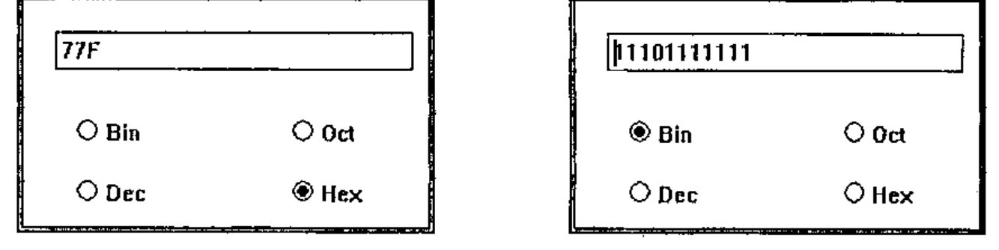

For each of the above results, I had to click on the radio button, then click on the edit window, then press the Enter key to get the number to change. There are a lot of functions available that I have not investigated, so perhaps there is a way of getting this to work more like Duncan’s Dyalog code.

## Conclusion

This is a simple interface to Windows which enables one to produce simple applications quite quickly. I was a little surprised at the rather pedestrian way in which the interface has been implemented. I had expected that there would be considerable use made of boxed arrays to pass commands into `⎕wd`, rather than a character vector. Developing applications with few of the sizes and positions of child windows hard coded, and lots of little functions for every task, would require a lot of work catenating bits to a character vector that would eventually be executed by `⎕wd`.

The only documentation that I had was the Windows help text. I printed it all out, so that I could have it by me whilst developing the above, and it has taken me about 2 days to write this review. I think that this shows that the interface is easy to use.
