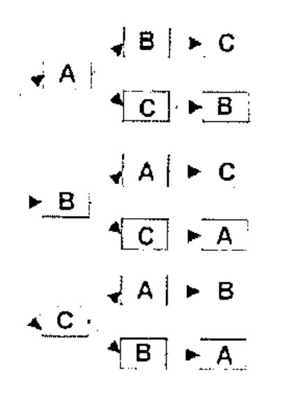
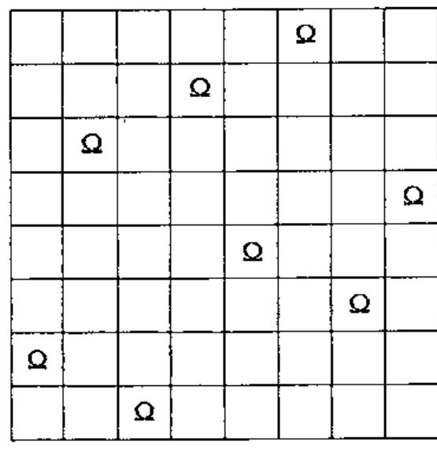
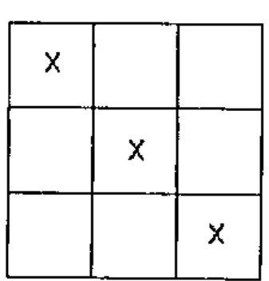
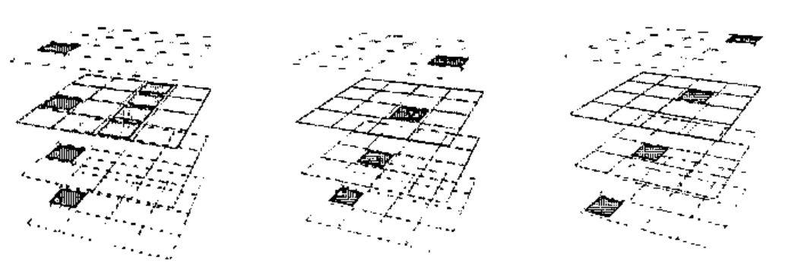
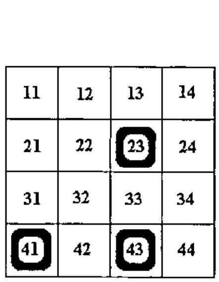
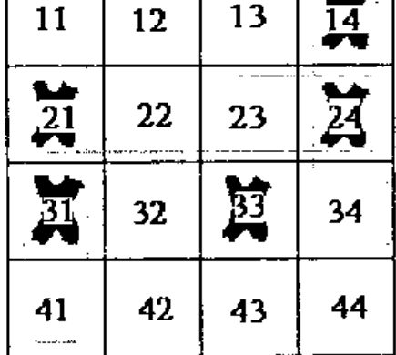
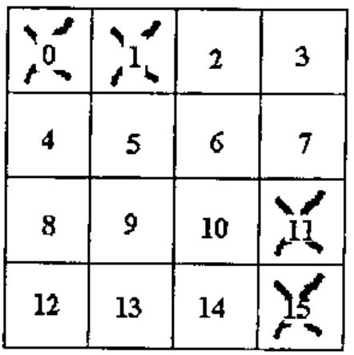
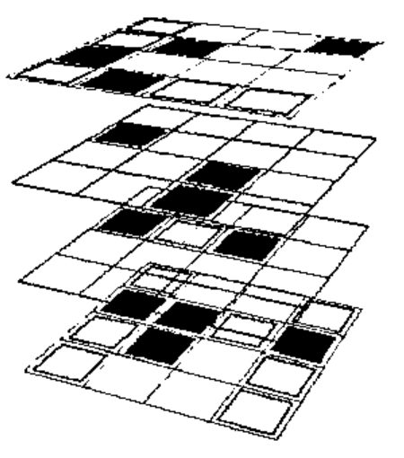

*by Dan Baronet*
{ .byline }

## Introduction

This article deals with tree searching using a popular game as medium. The code described here can be used in many situations to traverse a "tree" of possibilities.

## Keywords

This document discusses computer science subjects including *recursivity, tree searching, heuristic evaluation* and *sequential machines.*

## Examples

Tree searching is a technique that can be used to solve large-scale problems. Many situations can use tree searching, some more interesting than others. Possible examples are permutations, where all possible combinations of a set are being produced, and calling tree analysis, where all identifiers of a program are enumerated. This technique is used effectively in situations where others, even if possible, may not be practical, typically because they involve a large number of possibilities.

## Notions and Terminology

To better understand the concept of tree searching, consider the permutation case. If we were to show all the possible permutations of the letters A, B and C we would get 6 cases. The result would essentially consist of each letter followed by the permutation of the remaining letters in a "tree like" fashion, in a repetitive, recursive process.

Schematically it could look like the picture below, where we first generate all possible letters, then the remaining letters and, finally, the last letter.



This picture represents the whole *tree*. Each box is a *node*. Each combination of arrow/box is a *branch*. The point where all branches originate is the *root* and where they end is a *leaf*. The length of a branch from the trunk is its *depth*.

Not all trees are shaped like this one. Like biological trees, most have branches of various depths. Unlike biological trees, they don’t grow while you search them because they are static, at least the kind we will be dealing with.

Assuming that no setup is necessary, searching a path consists of two steps:

1. check for a solution and **generate** new branches
2. search each one of the new generated branches

This is a recursive process.

## Permutations

The previous example can be solved many (and even better) ways but we’ll use the tree technique as this is a good example.

Here we know we have a solution when no more branches may be generated. So,

1. check for solutions and generate new branches

The following code will do just that.

```apl
    ∇ unused←check_generate used
[1]   unused←'ABC'~used ⍝ return letters not in the branch
[2]   :if 0=⍴unused  ⍝ are we done?
[3]   ⎕←used ⍝ show the result
[4]   :endif
    ∇
```

This code merely consists of generating the letters NOT used in the branch. If the branch we are dealing with is a solution we display it.

This is it!

2. search each one

```apl
    ∇ trybranch branch; new; br
[1]   new←check_generate branch ⍝ the new material
[2]   :for br :in ⍳⍴new ⍝ try them all!
[3]   trybranch branch,new[br]
[4]   :endfor
    ∇
```

As we see, the function calls itself for each new branch generated.

If we run this code *as is*, all permutations of the 3 letters ‘ABC’ will be displayed. To display other permutations the function must be modified or a global variable used to hold the set to permute.

Many other problems can be solved with this technique. There is the 8 queens problem, the knight’s tour, the "knapsack" problem where, given a layout of pieces and rules for moving them, we must find the moves to put them in another configuration (Rubik’s cube could also fall in this category).

A more practical use is to generate the calling tree of programs, where all of the elements needed to run a program are identified.

All the above require their own *generation* function.

Let’s have a quick look at the 8 queens problem.

## The 8 Queens Problem

This problem is often assigned to computer science students to solve.

The idea is to put 8 queens[^1] on a chess board in such a way that none can capture another. There are 8!64 ways to put them on the board (4,426,165,368) but far fewer unique solutions[^2]! Trial and error is an unlikely recipe for success. A possible solution is shown below.

We could, of course, generate all combinations and screen out unwanted ones but with today’s machines it would take a fair amount of time (not to mention space if done all at once, the APL way). This is another good example for using tree searching techniques.



### A method

We put one queen down, note all the places where another queen can be placed without being captured, try the second queen on one of these, note the remaining positions, etc., continuing in this manner recursively.

Even with this method we’re not guaranteed a timely success. There are 64 possible squares for the first queen, 42 for the 2nd, 30 for the 3rd, etc. This can rapidly get out of hand. What we need is fast discriminatory technique.

### What do we know

One thing we know is that each queen will appear only once per row AND column. We can reduce the number of searches like this:

- try the 1<sup>st</sup> queen on each square of the 1<sup>st</sup> row
- try the 2<sup>nd</sup> queen on each square of the 2<sup>nd</sup> row (except where the 1<sup>st</sup> queen can capture it)
- try the 3<sup>rd</sup> queen on each square of the 3<sup>rd</sup> row (except where the 2 other queens can capture it)
- and so on

We know we have a solution when the branch is 8 steps long (when all the queens have been successfully placed on the board).

The generation function could look like this:

```apl
    ∇new←search_generate br; n ⍝ ⎕io 1
[1] new←(⍳8)~br,(br+n),br-n←⌽⍳⍴br ⍝ All safe squares to try
[2] :if 8=⍴br ⍝ Do we have a solution?
[3]   ⎕←br   ⍝ Display the solution found
[4] :end
    ∇
```

### When to stop searching

This is an important point. Do we want to search the ENTIRE tree or do we prefer to find only ONE solution? In the second case we must signal the end of the search and code for it. Naked branch is only good if no result must be returned. A better way to do this is either to `⎕signal` and trap or set a global variable and use it in the **trybranch** function as in

```apl
:if SolutionFound :return :end
```

[^3]

## An even more interesting example: Tic Tac Toe

### Overview



Everybody should be familiar with the 2-dimensional version of this game. This is the game of 9 squares (3 rows and 3 columns) where two players try, in turn, to acquire 3 squares (slots) lined up in a row. Like on this picture, to the left.

All positions (slots) a player acquires are marked with a symbol different from the other player. Typically, X and O are used as symbols.

The version we’ll be using is bit more elaborate but with the same rules.

### Model

The game discussed here is a 3-dimensional model (a *cube*) where 2 players try to line up 4 squares in any spatial direction.

The *cube* consists of 64 positions, or *slots*, of 4 *planes* of 4 rows by 4 columns where players make their moves alternatively, marking a new *slot* of their choice each time.

The *state* of the game changes from move to move. A typical game starts from an initial *state* where typically none of the *slots* are used to a final *state* where one of the players has acquired 4-lined up *slots* and the game is over.

Examples of possible lineups are:



In the first example 4 *slots* have been lined up vertically and 4 others horizontally. In the second the *slots* have been lined up "sideways". In the third the *slots* have been lined up from one top corner to the opposite bottom corner.

There are 76 different possible ways to line up 4 *slots* in this cube.

Each *slot* may be part of 4 or 7 of these *lines*.

There are 18 different *planes*[^4] and each *line* may be part of 2 or 3 of them.

‘X’ and ‘O’ to represent the 2 players.

### Discussion

In computer terms a typical game consists of

- Initialize the game
- Repeat
    1. your turn
    2. my turn
    3. display the state/cube
    4. Until the game is over

The game interface is of little interest here. It can be line by line, or with graphics. Graphics may be Windows-style or even *openGL* (see the various implementations listed below)[^5].

The section of interest for us is where we attempt to determine, from the state of the game, if a winning solution is possible. This is where tree searching comes in handy.

### Implementation

It is possible to detect a winning state by simulating moves. For example consider a single[^6] *plane* of the cube like the one to the right where each *slot* has been attributed a name (number) and the ‘O’s occupy positions 41, 43 and 23.



If it is ‘O’s turn to move then it can win within 6 moves by playing, for example, 14, 33, 44, 24, 22 and either 11 or 21.

The other player’s moves are predictable. S/he will be forced to play, at each corresponding move, to 32, 13, 42, 34 and either 21 or 11.

We need a function such that

```apl
Winningmoves← FindWinningMoves gamestate
```

will find a winning solution.

Or, since *gamestate* is a function of X and O we can use:

```apl
Winningmoves← X FindWinningMoves O
```

*Winningmoves* contains all the moves to play in the order they were found in order to produce a winning situation. Its format may also include the opponent’s move for practical reasons.

With such a function defined the bulk of the work will consist of building an interface around it. That part will not be covered here.

## Details

### The state representation

We must be able to represent the *state* of the game in a practical manner. Marking the 64 positions with X and O will uniquely represent the *state* of the game but is of little use.

Since we’re looking for complete *lines* a better representation of the *state* of the cube would be to code the number of X and Os on each *line*. This will require 76 integers (one per possible winning alignment) but will provide us with more valuable information, namely whether we (or the opponent) have lined up 4 *slots* or not.

For example a *line* with 4 Os could have the value 4 and a *line* with 4 Xs the value 40. A *line* with 1 X and 3 OS the value 13 and so on, i.e. exactly the number of Os on the *line* + 10 times the number of Xs[^7].

Initially, since the 76 *lines* have no X or Os in them, we have a *state* of 76 zeroes. At the end there will at least one 4 or one 40 in them but not both.

### The tree searching function

This one is easy. All we need to do is generate new branches and run them through the same function. Like the **trybranch** function above. This time it must deal with matrix results:

```apl
    ∇ Runbranch node; newbranches; br
[1] ⍝ Get <Generate> to provide the new branches for this node
[2] newbranches← Generate node
[3] :for br :in ⍳1↓⍴newbranches ⍝ For each newbranch
[4]   Runbranch node,newbranches[;br] ⍝ Try it
[5]   →SearchOver/0 ⍝ Are we done? Then destack.
[6] :endfor
    ∇
```

The function must also be able to stop searching when we decide so. After all, we’re only interested in ONE solution. Line [5] takes care of this.

### The *new branches* generating function

This function is responsible for generating all possible branches.

The idea is to generate moves which continually line up 3 *slots* and effectively *force* the opponent until s/he has to play at more than one place at once. We then win at the next move.

We start in a specific *state* with Xs and Os laid out. The two variables ‘FREE0’ and ‘STATE0’ contain information related to this initial *state*. These are used to create their local varying counterparts ‘Free’ and ‘State’ at each level of the search.

After any series of moves, if ‘State’ contains 30 we know we can win right away. If ‘State’ contains 20 we know we can further try as we have 2 *slots* on at least one *line* and we can force our opponent to play on each one of the remaining pair of *slots* on each one of these *lines*.

There is also a special case where we might be forced ourselves to play but which is of no consequence if our response also further forces the opponent to play.

Here’s the code to do the above. *ALL* is all the 64 *slots*. *LINES* is the 76x4 table of *slots* for each *line*.

```apl
    ∇new← Generate xo;State;Free;sl;li
[1] new←0/xo ⍝ assume no possible new move
[2] Free←FREE0∧~ALL∊xo ⍝ free slots=original free minus those used so far
[3] State←STATE0+stateof xo ⍝ state of each line=original plus branch state
[4] :if 30 ∊ State ⍝ Can I win? (3Xs, no Os on a line)
[5] Sequence←xo,2↑frees sline 30 ⍝ Yes, take note of the winning sequence
[6] SearchOver←1      ⍝ End the search
[7] :elseif 3 ∊ State ⍝ Can s/he win? If so WE are forced to play.
[8]  :if 1=⍴sl←frees sline 3 ⍝ If at more than 1 place then
        this is hopeless
[9]   :if ∨/li←(State=20)∧∨/LINES=sl ⍝ Can we also force opponent
        when we play there?
[10] new←2 1⍴ (sl≠1↑li) ⌽li←frees,li⌿LINES⍝ Indeed. Find where s/he
        is then forced.
[11]   :end      ⍝ And keep'on searchin'
[12]  :end       ⍝ We were in a fork 8- forget this branch
[13] :elseif 20 ∊ State      ⍝ we cannot win but we might be able
        to further force opponent to play
[14] new←State BEST frees sline 20   ⍝ Order all slots where
        we force opponent
[15] :end ⍝ no more possible move
    ∇
```

<*sline*> returns the ravel of the *lines* whose *state* is the same as its argument. ‘`sline 30`’ returns the *lines* with state 30.

<*frees*> returns the *slots* which are free in a list. Thus ‘`frees sline 30`’ returns the unused *slots* in the *lines* X which have 3 *slots* lined up.

<*stateof*> returns the state of Xs versus Os as defined previously.

### How to find a solution fast

We must find a way to get rapidly at the solution otherwise we could spend a very long time traversing the tree. One way is to attribute a *weight* to each position. To do that we can first attribute *weights* to lines, and for each slot sum up the values of each line it is used in. For example, if position P1 is member of 3 lines whose values are 10, 0 and 20 then P1’s *weight* is 30. If another position’s *weight* is more than P1, it will be tried first.

For example, in the following picture, X can force O at 7 places, only one of which will ensure a quick win. All the others may lead to a winning situation but only position 34 can create a fork and will do so in 2 moves.



Each slot is traversed by 2 or 3 lines here. Slot 11 is in lines 11-14, 11-41 and 11-44. But playing there is obviously not optimal.

On the other hand, slot 34, which is only in lines 31-34 and 14-44 is the best choice, because lines where X already has 2 tokens lined up are more valuable than those where X only has 1 token. By choosing the right *weights* for each *state* we can achieve the desired result. These weights must be guessed or evaluated heuristically. In the following code, the function <*BEST*> finds the best slot this way.

### Making the best choice

The <*BEST*> function orders the slots to reduce searching. It puts the "best" slots first according to the state of the lines. There are many ways to do this. The method used here is simple.

It first attributes a value to each *line* according to its state. Here a *line* gets the value 1 if it has 2 Xs on it, 0 otherwise. It then attributes a value to each *slot* by summing the value of all the *lines* it belongs to (a *slot* may belong to 4 or 7 *lines* in this *cube*, information held by variable *ISL*).

Thus:

```apl
    ∇sl←State BEST slots; value; ord
[1] value←0,State=20 ⍝ value of each line
[2] value←+/value[ISL[slots;]]
[3] ord←⍒value ⍝ which ones first
[4] sl←slots[ord,[-.1]ord+¯1*ord]     ⍝ alternate pairs
    ∇
```

Even with this method the tree it generates can be enormous. We must be able to "prune" it by specifying a minimum value for each *slot* and/or a maximum number of branches. Both can be specified at each level of the tree. To keep things simple we’ll use a maximum value of 4 such that line [3] now becomes:

```apl
[3] ord←(4⌊⍴ord)↑ord←⍒value
```

### Putting it all together

We now need a cover function for this. We need to initialize the *STATE0, FREE0* and the *SearchOver* variables, as follows:

```apl
    ∇ Sequence←X FindWinningMoves O;FREE0;STATE0;SearchOver
[1] ⍝ Find a winning sequence for X over O
[2]  STATE0←(+/LINES∊O)+ 10×+/LINES∊X
[3]  FREE0←~ALL∊X,O
[4]  SearchOver←0
[5]  Runbranch Sequence←2 0⍴0
    ∇
```

*Sequence*, the result variable, is set prior to calling <*RunBranch*> just in case no solution is found. In the event that we DO find a solution, <*Generate*> will take care of setting it properly.

This is where the ability to see and reset localized variables, on the stack, can be useful. In J, for example, this would not be possible. Instead the solution can be temporarily stored elsewhere, in a locale for example.



Let’s try it on a simple case:

```apl
      0 1 11 15 FindWinningMoves ''
3 7
2 0
```

Meaning "I will play 3, O will play 2, I will play 7 (and win)".

OK. Let’s try something more serious. In the following picture we have

```apl
X←15 9 24 18 57 40 42 22 1 56 4 59 53

O←12 3 48 51 60  0 63 41 2 52 8 55 58
```

(cell 0 is the top leftmost one).



To see if X can win we do:

```apl
      X FindWinningMoves O
 5 37 26 6 38 25 32 36 39
13 21 30 7 54 27 47 44  0
```

and X is assured victory in 9 moves *or less*. BUT! If it’s O’s turn to play s/he can win in 3 moves:

```apl
      O FindWinningMoves X
38 35 44
25 19  0
```

### Improvements

There are many ways to improve the search. We can

- fine-tune the pruning algorithm with better weights and functions
- allow the program to find a shorter solution
- specify a maximum search level to limit *"intelligence"*

To name a few possibilities.

In the various implementations below, some of these improvements have been made. Among others, the "BEST" algorithm uses values that have been reached after trying several evaluation methods (hence the term *heuristic evaluation*).

## Conclusion

There are many ways to tackle problems.

This tree searching technique is very good at going through large amounts of cases or situations.

Like every other technique one must exercise judgment when using it. If used without preparation it can be slow to produce results, if at all.

## Various Implementations

My first attempt at writing this game goes back over 20 years! The first version was line by line, with quote-quad for input. A similar version exists for SHARP APL, APL\*PC and J.

After graphics became popular I ported the game to APLPLUS\*II then Dyalog APL. A J version now also exists using graphics.

All the code can be found at www.dsuper.net/~danb/milinta.

[^1]: In a chess game the queen may move in all directions: horizontally, vertically and diagonally.
[^2]: Exactly 37 *unique* solutions.
[^3]: hardcore APLers may wish to use the expression ‘`→SolutionFound/0`’ instead.
[^4]: 4 on the Z axis (those we see in the pictures), 4 on the Y axis, 4 on the X axis and 6 more tilted.
[^5]: For those who cannot wait go to www.dyadic.com’s web server page or directly to 195.212.12.1:8081/ttt0.htm for an example of an interface.
[^6]: There are many other planes in the cube. For the sake of this example the other cube slots are not taken in account.
[^7]: The value 10 is for visual appearance only. In fact, any value above 4 would do.
