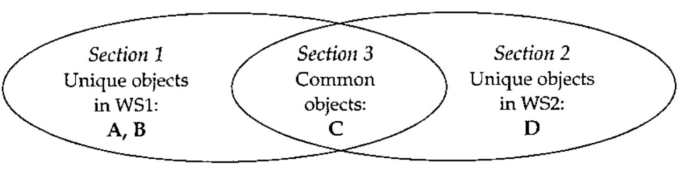

*by Dan Baronet*
{ .byline }

In the following article I use terms specific to our trade. You won’t find them in the dictionary but I assume the reader is familiar with words such as ‘monad’, ‘global’ (as a noun) and ‘default’ (verb). I use the terms ‘nested’ (as in ‘nested array’), ‘enclosed’ or ‘boxed’ interchangeably. I also use quotes and angle brackets to help determine the type of the object I am referring to. ‘Quotes’ denote a variable or workspace and &lt;angle brackets&gt; refer to a function/operator or file. Often, the context is sufficient to remove ambiguities. Italicized words have a special meaning and often precede their definition. Optional items are shown within [brackets].

## Introduction

Early in my programming career I realised there was a need to compare various APL objects. At that time (late 70s), there was no such thing in the “public domain”. I needed to compare variables, functions and packages, and in files too. This is when I started thinking about having my own set of utilities to do just that.

This is the third of a series of articles on tools in APL. This is an example of code that evolved from simple to complex utility where feedback from the users made it the way it is. It is compatible with earlier versions of APLs like APL/PC.

As usual keep in mind the date this text was written as things have a tendency to change…

## A Workspace to Compare Code

This is one of my first complete sets of utilities. It was first written for SHARP APL and was eventually ported to other platforms. It allows comparing code and reporting differences with various details. It was written with nested arrays and packages in mind. Today it also works on namespaces and overlays.

### COMPARE utility

Keywords: COMPARE, DIFFERENCES

This workspace will show where differences occur in APL objects found in a workspace or in a file.

### The core of the matter

The basis of this workspace is a function that takes the `∘.≡` of the lines of two matrices[^3] and returns a boolean matrix (‘m’) with the following properties:

1. no more than one ‘1’ per row or column
2. each 1 is below and to the right of the previous 1, if any
3. `+/,m` is a maximum for the 2 previous constraints

Function &lt;compbool&gt; performs that operation[^4].

### Basic functions

The next level function is dyad &lt;compcm&gt;, which takes two character matrices, compares them using &lt;compbool&gt; and formats the output nicely, combining the lines of the two arguments with decorators to show insertions and deletions. It also limits the comparison to the zones where the matrices differ in order to limit the amount of output. If two 100 lines matrices differ only by one line the output is limited to that region plus a few lines before and after to render the context. If the matrices are identical '' is returned.

&lt;compcm&gt; is used by &lt;compvar&gt; and &lt;compfn&gt; to compare variables and functions respectively. These functions all return a character result that depends on the presence and value of a series of global settings. Another function, &lt;compack&gt;, compares *packages* using the above two functions. The term *package* refers to its namesake in SHARP APL or APL2000 (where they are emulated), a namespace in Dyalog APL or an overlay in APLX. &lt;compack&gt;’s reporting behaviour is like &lt;compare&gt;’s (see below). Instead of taking workspace names as argument it takes *packages*.

### Comparing workspaces

Although the previous functions can be used on individual objects they are usually used in the context of comparison of workspaces.

In order to compare entire workspaces it is necessary to send the workspaces to a file and to use the &lt;compfile&gt; program using immediate execution statements as follows (**compare** is the comparison workspace):

```apl
)xload ws1
)copy compare tws
tws ⍝ transfer the workspace to file
)xload ws2
)copy compare tws
tws
)load compare
compfile '/switches (see below)' ⍝ the report is produced here
clearfile  ⍝ to clear file space
```

&lt;tws&gt; is the Transfer WorkSpace function. It moves the variables and functions of the current workspace onto a specific file preceded by some workspace info. If the file does not exist it is created. After &lt;compfile&gt; has been run, &lt;clearfile&gt; should be used to get rid of the file.

### Higher level functions

Under APL2000 or SAPL (if you have multi-task access) it might be easier to use the program &lt;compare&gt; as follows:

'ws1' compare 'ws2 /switches'

&lt;compare&gt; uses Stasks (every APL should have Stasks) to perform the previous immediate execution statements under SAPL. Under APL2000 ⎕INBUF[^5] performs the same function. Other APLs[^6] cannot do this automatically. Yet.

Dyad &lt;comparefiles&gt; takes two filenames as arguments and reports on the differences of each corresponding component using the same methods. It won’t report anything on identical components.

### Switches

You can use the following switches with the right argument of both functions:

| | |
|---|---|
| /norm | will left justify the fns before comparing them |
| /result | will return all the output as result. By default all output is displayed only. |
| /show= | temporary override for global SHOW (see below) |
| /xnames= | exclude the names that follow. A simple pattern can be given. |
| /xstr= | exclude the objects containing that string |

The use of these switches is strict (for details on the parsing rules see the previous Vector article on this subject).

## Output Specifications

The information displayed is determined by a few globals.

### DELINS

When differences are displayed between objects, *deleted* lines and *new inserted* lines are preceded by a symbol, one for each case. `DELINS` holds both characters. By default they are ‘←’and ‘→’.

### NLINES

This variable is for showing only the first N lines of a variable in the “unique symbols” area (see SHOW below). This prevents displaying too many lines if a variable is very big when displayed. The default for this variable is set at 10 (lines). This takes in account wrapped lines. If the output is incomplete the string ‘…(more)’ is added to the truncated display.

### NOLASTLINE

When set to 1 the last line of each function is ignored **if it is a comment.** This allows comparing workspaces generated by systems that *tag* functions with version control information[^7]. Default 0.

### SHOW

The report is divided into 3 sections:

[1] the symbols found ONLY in the first package or workspace<br>
[2] the symbols found ONLY in the second one<br>
[3] the symbols found in both

Three things can be shown in each *section*:

- the number of symbols
- their names
- their contents (or difference)

The number of symbols is always displayed if there are objects in a section. The names and contents may be displayed depending on the section’s value in SHOW:

| | |
|---|---|
| 0 | nothing is shown |
| 1 | the names only are displayed |
| 2 | their contents/difference only is displayed |
| 3 | both names and contents are displayed |

For example, if workspace WS1 contains objects A, B and C and workspace WS2 contains C and D. The first section (the objects only in WS1) would report on 2 objects: A and B. The second section (the objects only in WS2) would report on object D only and the third section (common objects) would report on object C, the only common name in both workspaces. Here’s a Venn diagram to illustrate:



If `1=2|SHOW[1]` then the names ‘A’ and ‘B’ would be listed in the first section after the line “2 outstanding objects in WS1”.

If `1=1↑2 2⊤SHOW[1]` then their values would also be displayed. The same would apply to the two other sections using `SHOW[2]` and `SHOW[3]`.

SHOW’s default value is 1 1 3, that is only the names of the objects in the first 2 sections (those with unique names) are displayed, not their values, and the names and the differences of the objects in the third section (the one with common names) are shown. To temporarily change this setting indicate so on the command line. For example, to only show the names for all sections:

```apl
'ws1' compare 'ws2 /show=2'
```

`SHOW` may me assigned a scalar in which case the same value applies to all 3 sections.

### ZONE

This one affects the display of differences between objects. This is the number of lines shown before and after the differences found. The default is set to 2. This allows seeing a couple of lines before and after the changes to possibly better understand the context.

### Details

The display includes pseudo system variables and the stack. For all APLs the pseudo variable ⎕SYS contains the grouping of the system variables. The first 6 elements are ⎕IO, ⎕CT, ⎕PP, ⎕PW, ⎕RL and ⎕LX. The remaining elements depend on the APL.

For APLs that still use groups[^8] the pseudo variable ⎕GRPS includes all the groups’ names and the objects they contain.

### Example 1

Workspace WS1 contains variables ‘v1’ with values 0 to 8 except [3 7] which are -1 and 0, and ‘v2’. It also contains functions &lt;f1&gt;, &lt;f2&gt; and &lt;f3&gt;, which contains 3 rows: ‘one’, ‘two’ and ‘three’. Global ⎕IO is 1.

Workspace WS2 contains a different variable ‘v1’ with values 0 to 8. It also contains functions &lt;f2&gt;, identical to the &lt;f2&gt; function in WS1 and &lt;f3&gt;, which contains 4 rows: ‘one’, ‘new two’, ‘three’ and ‘four’. Global ⎕IO is 0. There are no other objects in this workspace.

There is no stack in these workspaces.

The comparison output will look like this[^9]:

```text
'WS1' compare 'WS2'
*** comparing C:\APL\WIN\WS1 created 2003 9 14 18 19 25
      with C:\APL\WIN\WS2 created 2003 9 14 18 20 8

NOTE: - wss sizes differ by 124 bytes.

***   2 outstanding objects in C:\APL\WIN\WS1
f1  v2

***   4 common objects
≠⎕sys   f2    ≠f3    ≠v1

> Variable ⎕sys
objects are char matrices
←[0]  ⎕io =1
→     ⎕io =0
 [1]  ⎕ct =1.0E¯13
 [2]  ⎕pp =10

> Function f3
 [0]  f3
 [1]  one
←[2]  two
→     new two
 [3]  three
→     four

> Variable v1
objects are num vectors
elements 3 7 are differents (⎕io=1)
Var1 0 1 ¯1 3 4 5 0 7 8 Var2 0 1 2 3 4 5 6 7 8
use 'clearfile' to erase the file.
```

By default only the list of the objects in WS1 and WS2 is shown, not their values.

Since there are no outstanding objects in WS2 that section is skipped.

Pseudo system variable ⎕SYS contains one row per system variable in a character matrix format. Comparing it is the same as any other character matrix.

The list of common names includes a special character, ‘≠’, for each name whose definition is different.

After the report is displayed a file exists that contains a copy of both workspaces. To rerun the report one only needs to call &lt;compfile&gt; like this:

```apl
compfile ''
```

To rerun the report with different parameters either change the globals in the workspace or specify new line parameters. For example, to display the value of the objects only in WS1 enter

```apl
compfile '/show=2 0 0'
```

### Example 2

File &lt;filea&gt; has three components. File &lt;fileb&gt; has four components starting at component 2. Their component three contains character matrices which are different by 2 lines. Their comparison would look like this:

```text
      'filea' comparefiles 'fileb'
filea has 3 components starting at 1
fileb has 4 components starting at 2

⍟⍟⍟ component 3
objects are char matrices
 [1]  licence
 [2]  note
←[3]  x
←[4]  y
 [5]  CR
 [6]  DELINS

⍟⍟⍟ comparing access matrices
(no difference)
```

Components that are identical or not found in the other file are not shown.

## Conclusion

This code was written to help programmers do their job, not to be sold and make money (obviously). It’s a tool. There have been several tools created over the years by very capable people. This one doesn’t pretend to be the best but it’s easily available for free and it’s the same whether you use APL2000, Dyalog, APLX or SAPL.

Maybe it will be found in the new APL library under development. At any rate you can find it at www.milinta.com. Help yourselves if you think it can be of some use.

## Note

Anyone looking at my code may sometimes wonder why I wrote things this or that way. To accommodate all APLs I sometime use the “lowest common code” approach, code that will work in all APLs. I sometimes also add code to circumvent problems in a particular APL. For example, in this workspace, you’ll find the expression

```apl
,0 0 ⍉m
```

where the comma should normally be unnecessary. Unfortunately, a bug in some APLs make them return their right argument when it’s empty, requiring the use of the comma.

[^3]: Padded to get the same width if necessary

[^4]: There may be more than one optimal solution.

[^5]: there is a bug in APL2000 (V3.5) where a non empty stack interferes with the use of ⎕INBUF so comparing workspaces with pending stacks fails using this method

[^6]: some APLs like APL2 can but no version of this code exist for them. In Dyalog APL we can cheat by creating a temp namespace and ⎕cy’ing the workspace into it but we don’t get the stack this way. ⎕CY also won’t copy workspaces with a pending stack in V8.1, maybe other versions too.

[^7]: such tags generated by LOGOS are detected and automatically ignored in this version

[^8]: groups are still used in APL2 and SHARP APL on the mainframe. They are obsolete but are included for completeness

[^9]: the format may vary slightly from one APL to the other
