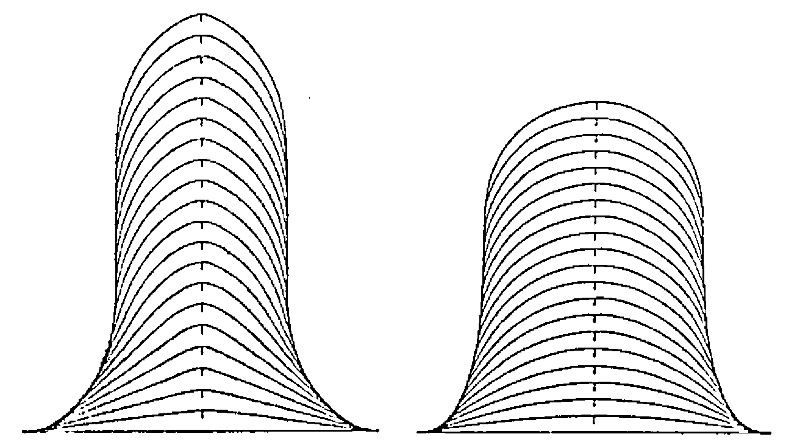
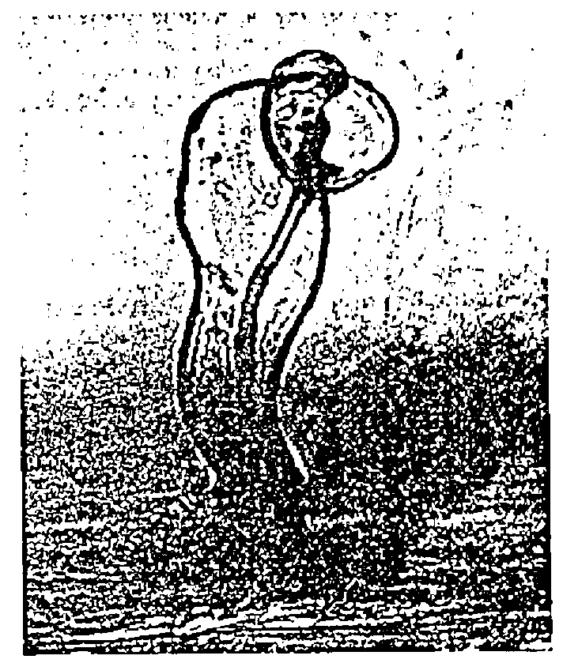
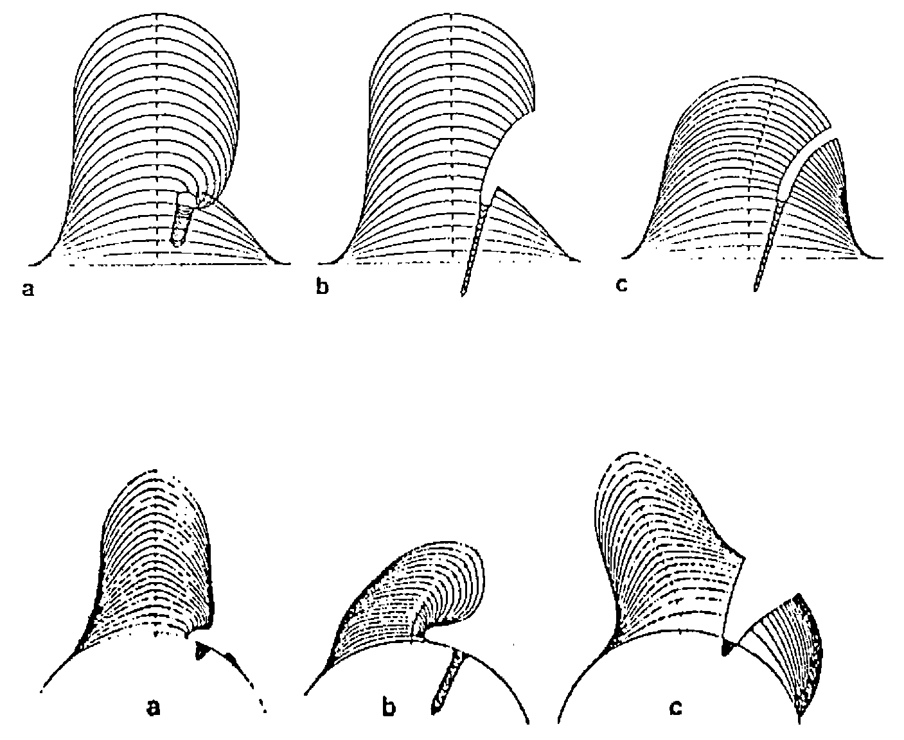
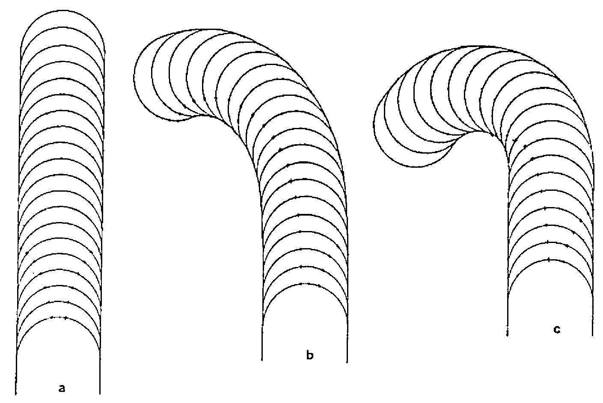
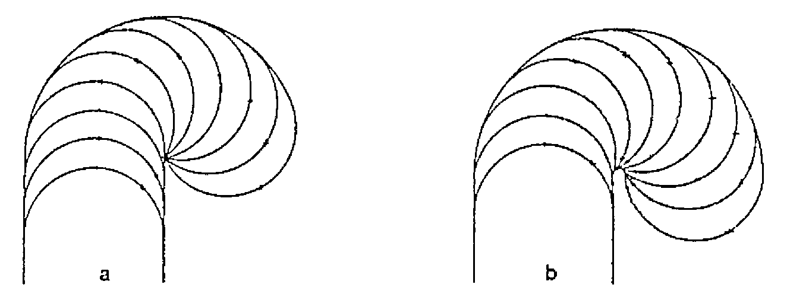

by F.H.D. van Batenburg and J.W. Kijne
{ .byline }

## Abstract

This paper describes our experiences with APL in a scientific project: investigation of the growth of root hairs of an agriculturally very important plant family. We introduce you first to our institute and to the people who work there. Next, we paint the puzzle we wanted to solve. We will show you how we gradually achieved a small but important step by means of simulation. Finally we will discuss the value of APL in acquiring our results and we will make an educated guess how this could compare to the use of PL/1.

## Introduction

The Institute for Theoretical Biology forms together with other biological units the Department of Biology of Leiden University, the oldest University of the Netherlands (1575).

The people who populate the Institute for Theoretical Biology (ITB for short) form a mixed lot of scientists. One finds among the permanent staff a mathematician, a statistician, 2 computer scientists and a philosopher of biology. Together they strive to solve biological puzzles in a fruitful mixture of biological intuition, mathematical or computer skill and solid experimental data.

In order to expose the strong and weak points of APL, we want to introduce you first to one of the scientific projects in which we were involved in the past five years. We will introduce you to the biological background briefly and present some solid data about the requirements of each project next. Next we intend to discuss the various characteristics in which APL distinguishes itself from other languages. Because of the proficiency in PL/1 of the first author (17 years of intensive use) we will confine ourselves mainly to comparisons with that language. We have no doubt, however, that our observations can be generalised to many other “conventional” languages which are closely related to PL/1 like ALGOL, BASIC, C, FORTRAN, PASCAL, and many others. Finally we draw up the balance sheet of the costs of these projects.

To make our point(s) stick, we should have data at our disposal of each project carried out both in APL as well as in another language. As you probably surmised, unfortunately we can only provide solid data about the application of APL. However, we intend to make those comparisons nevertheless by making educated guesses at the PL/1 equivalent. Although the lack of real experimental data is detrimental to an absolute belief in the correctness of the comparisons, seventeen years of PL/1 proficiency make up at least for enough backing to make them plausible.

## The Problem

In 1982 the first author started a project with J.W.Kijne of the Department of Plant Molecular Biology. In that department, research was underway to study the processes involved in infection by *Rhizobium* bacteria of leguminous plants. These plants count many important species among them like alfalfa, pea, bean, clover, lupin, soybean and many other plants which provide food for humans and for cattle. These plants are important because of their nitrogen-fixing ability, due to symbiosis with *Rhizobium* and *Brady-rhizobium* bacteria. Although nitrogen is indispensable for plant growth, plants are unable to absorb free nitrogen and they get their nitrogen from nitrates instead. So when the soil is exhausted of nitrates, farmers who are unable to buy sufficient N-fertilizer grow legumes before seeding the next crop. By ploughing in these legumes, they enrich the soil sufficiently well by bound nitrogen to allow for another type of crop next year. So the process of binding free nitrogen is very important for agricultural food production.

Rhizobial infection of legumes is essential for establishing a nitrogen-fixing symbiosis. Some legume varieties appear unable to get infected by *Rhizobium* and consequently those plants are unable to bind nitrogen.

Rhizobia infect the root hairs (root hairs are small outgrowths of root epidermal cells). The morphological result of such a root hair infection is curling and modified growth of the root hair. Such a marked curling is called a “shepherds crook” after its form (see fig.2). Such a prolonged curling finally results in development of a small nodule. These nodules are the small factories in which nitrogen binding takes place. Also, during that process of curling a very small filament (called “infection thread”) is growing inward (see fig.2).

At the moment at which the first author joined the team of the Department of Molecular Biology, Jan Kijne was developing alternative theories about the mechanism which could explain the curling of root hairs. Could it be, for example, that one of the bacteria attaches itself to the root hair wall and starts to stimulate the growth excessively at that spot? Would this result in the formation of a shepherds crook? And how would that interfere with the regular growth which is concentrated at the top of the root hair? Or alternatively, could an attached bacterium bring regular growth to a complete stop one-sidedly? This would force the opposite side of the root hair to overwhelm the side of the bacterial infection.

## The Answer

In order to analyse the consequences of these hypotheses we developed a simulation model in APL. At first we simulated normal growth of a root hair under various assumptions of tip-growth. See fig.1 for the results.



*Fig.1: Simulation results of model 1 with normal growth; each line is the cell wall at consecutive time-steps. Left a triangular, at the right a cosine shaped growth gradient.*
{ .caption }

Next we started to introduce the growth of an infection thread. Our idea was that the growth of an infection thread itself would modify root hair growth and would automatically result in a shepherds crook.

Fig.2 shows such a shepherds crook and in the centre of the root hair one distinctly observes the infection thread.



*Fig.2: A roothair of* Pisum sativum *showing a shepherds crook and a distinct infection thread. Photograph by Dr.J.K. van der Have.*
{ .caption }

Several hypotheses about the possible mechanism of infectious thread growth were examined. For example, we considered a local inversion of the normal growth gradient, a local diminishing of growth, a local stimulation of growth, and several others.

However, none of them proved to be satisfactory (see fig.3).



*Fig.3: Simulation results of model 2 with infection thread.*
{ .caption }

Although the results were unsatisfactory because apparently our ideas didn’t conform with the real mechanism, these simulations were valuable nevertheless. Because, next to refuting our ideas, the results also showed us the flaw in our previous reasoning: if standard growth of the top continues (as we assumed in all hypotheses) then the top will gradually move away from the infected spot (see fig.3). This does not conform to what we observe in nature. So, apparently the bacterium cannot operate locally and more or less independently of the normal top growth; it must influence the standard top-growth much more severely.

It took our group a while to reassess the situation. Apparently we should look for a mechanism in which the bacterial infection actually competes with the top over the growth process itself. Our new ideas were incorporated into the simulation model. The results are depicted in fig.4 and fig.5.



*Fig.4: Simulation with competing attractions a = 5:5, b = 5:1, c = 10:1.*
{ .caption }



*Fig.5: Simulation with bacterial competition against a central growth mechanism a = small influence range, b = large influence range.*
{ .caption }

Comparison of fig.5 with fig.2 shows that the newer proposed mechanism could explain the growth mechanism involved in root hair curling.

At this moment, all our ideas are purely theoretical. However, the simulation facilitated the design of an experimental approach by elimination of some improbable hypotheses. So, here ended the involvement of the first author (as well as the application of APL), because the next stage of the research was to look for the physiological and chemical basis of the proposed mechanism.

## APL

The whole simulation program was developed in APL\SV and run on an Amdahl V7B. In this paragraph we explain in what respect the choice of APL was fortunate.

First we will give you an indication of the size and composition of the final system. Next we consider the characteristics speed, development time, understandability and costs.

### System Composition

At the end of the project, the simulation system was composed of 48 functions, totalling 729 lines (of which 253 were comment-lines, and 476 executable lines). That is an average of 15 lines/function, but a better indication of size is the median (7.5) because a couple of big utility functions from the public libraries were included.

```
     0        10        20
     |....:....|....:....|
   1:
   2:XXXXXXXXXX
   3:XX
   4:XXXX
   5:XXX
   6:XXX
   7:XX     <=== MEDIAN
   8:XX
   9:XX
  10:
  11:XX
  12:X
  13:
  14:
  15:X        <=== MEAN
  16:XX
  17:
  18:X
  19:
  20: outliers: 22, 22, 24, 30, 32, 36, 37, 37, 43, 45, 45, 48, 86
     |....:....|....:....|
```

*Fig. 6: Distribution size (number of lines with comment included) of functions.*
{ .caption }

### Speed

One of the first objections to the choice of APL could be its speed (or rather its lack thereof). The very thing which simulations require is speed, so one might think APL is too slow to be useful in simulation. Our experience was different, however. Thanks to the interactive nature of APL we could easily explore the various ideas. The computation and drawing of a full-time-development of a root hair took between one and two minutes. This yielded sufficient information to ponder upon for several minutes, or more often for hours, or even days. Besides, many blatantly erroneous results were quickly discovered in the first 10 seconds and the execution could be interrupted immediately.

The alternatives available at our computer centre at that time were batch processing in ALGOL, FORTRAN or PL/1. As the turn-around in those languages took several hours (compared to the few minutes by the use of interactive APL) for correct as well as for erroneous simulations, a run would take several hours before the results were available. This is not so much of a problem for runs which require a long time to ponder upon afterwards, but it is very frustrating for a group of associated runs in which the parameter setting of each run depends upon the results of the previous run. For such a series of runs, an APL session of a few hours would probably require a week by application of PL/1.

So even though APL might be slower than any other available language, in our situation we couldn’t care less because the throughput of the alternatives was considerable worse.

### Development Time

As the previous exposition already hinted, there were no clear waterfall-type (Boehm,1976) phases in the software development. After an initial development-phase, and a subsequent implementation phase, the final use of the model was also a continuous alternation of use, assessment, adaptation (or augmentation) and use again. So we had no clear mile-stones marking the beginning and end of development. Nevertheless an educated guess of all the time devoted to development can be given as slightly over 1 man-month.

Although we did not repeat this project in another language, the first author feels sufficiently knowledgeable in PL/1 (after 17 years of extensive experience with that language) to make an educated guess about the development-time in PL/1. If he was very lucky, the development would take half a year, but a more realistic estimate is about a year or more.

### Understandibility

It is often said that “APL is a write-only language”. Our experience taught us differently. The student Richard Jonker joined the project as a rather inexperienced APL programmer. Nevertheless he understood the root hair program-system within a week and was even able to make his initial modifications after that first week. Remember; this is a system of 476 executable statements (which may roughly amount to 5000-7000 statements in a conventional language, say more than 100 pages). This was only possible, of course, by applying a rigorous modularity of small statements without spaghetti-code.

At the moment we enforce this spaghetti-less code by only permitting jumps in either one of the following constructions:

```
LOOPS:      ---WHILE---                    ---UNTIL---
         B1:→(CONDITION)/E1+1                B2:...
            ...
         E1:→B1                              E2:→(CONDITION)/B2

---IF BLOCK---
   B3:→(CONDITION)/E3+1
    ...
   E3: ...

---IF STATEMENT---
   BE4:→(CONDITION)/⎕LC+1 ⋄ CONDITIONAL EXPRESSION
```

The first line of each block is marked with a “B.:” label, the last line (inclusive) with an “E.:” label.

### Costs

The final aspect we would like to consider is costs. As an interpreter, APL is much more expensive than a compiled program.

Again, however, such an obvious statement is not that obvious in closer inspection. What are costs? One should consider two different costs: CPU costs and manpower costs.

1. CPU costs. During development in APL small errors are corrected immediately and the program is continued without extra CPU costs. In PL/1 the majority of syntax errors are discovered in the first run (unless some errors abort compilation). Other types of errors, however, are found one by one. Each discovery takes a new compilation after correction. These compilations are very CPU-intensive. Of course, one might reduce these compilation costs by clever partitioning, but this probably raises linkage-editor cost and manpower-costs for sure. So we surmise that APL is not more expensive than PL/1 during development, probably even cheaper.

    Contrary to our initial expectation, APL was much cheaper during execution. First, because in APL we could interrupt many obviously erroneous or uninformative simulations. In our PL/1 batch-environment all those unfruitful simulations would have run their due course, before we discovered the error of our ways.

    Secondly, APL was cheaper because we did not have a long sequence of execution runs with the same program, but a continuous cycle of development and execution and development again. Granted, for many runs only some parameter values were varied; but every so often we varied the very code itself. This would require new, expensive compilations in PL/1.

    Although we cannot retrieve the CPU costs of this project we do know the costs of a comparable project. This was about Dfl 5000 (about $2500) and we estimate that this project cost Dfl 5000 too (for development and for all executed simulation runs together).

2. Manpower costs. The CPU costs, however, are inconsequential compared to the manpower costs for program development. Manpower costs in this APL project were about Dfl 8000 (about $4000). Now, my experience with PL/1 and the opinion of several of my colleagues gives reason to estimate that development in PL/1 is about 5 to 10 times as slow. So for development time in PL/1 this would amount to Dfl 48000 - Dfl 96000.

    Note that during execution the PL/1 equivalent would take considerable more time for each run. This was not so much of a problem during runs with interesting results which forced us to reflect a few days, for other runs it was very frustrating at least. However it would not increase the costs, although this would slow down the turnaround time of the project considerably.

So APL proved to be much cheaper than PL/1 in this project, mainly because of the manpower costs.

## Conclusion

The previous paragraph showed the benefits of APL clearly.

The first benefit was obtaining results faster, due to the interactive execution (and subsequent correction or improvement in obvious erroneous or uninformative cases). Also, APL was cheaper because at the first hint of an unsuccessful result, we could decide to steer away towards another idea, whereas in batch many uninteresting cases would have run their due course.

The main benefit was the very fast development time. We showed that this was not cancelled out by a supposedly slower execution time during the simulation itself. We expressed this benefit in terms of money; the use of APL costed about Dfl 13000 (of which Dfl 8000 manpower during development), the PL/1 equivalent would probably require Dfl 45000 (of which Dfl 40000 manpower costs) or even more.

## References

1. Batenburg,F.H.D.; Kijne,J.W.; Iren,F.v.; Libbenga,K.R.L. (1983): Simulation of marked roothair curling in Rhizobium-legume symbiosis. Physiol.Plant(59)363-368
2. Batenburg,F.H.D.; Jonker,R.; Kijne,J.W. (1986): Rhizobium induces marked root hair curling by redirection of tip growth: a computer simulation. Physiol.Plant(66)476-480
3. Boehm,B.W.(1976): Software engineering IEEE trans.on computers c25(12)1226-1241
4. Bosch,F.v.d.; Metz,J.A.J.; Diekmann,O.(in prep.): The velocity of population expansion. J.Math.Biol.
5. Metz,J.A.J.; Diekmann,O. eds.(1986): The dynamics of physiologically structured populations. Springer, Berlin (Springer Lecture Notes in Biomathematics 68)
6. Metz,J.A.J.; Roos,A.M.; de Bosch,F.v.d.(1988): Population models incorporating size structure: a quick survey of some basic concepts and an application. in: Ebenman,B. & Persson,L.(eds.), Size structured populations; Ecology and Evolution. Springer, Berlin.
7. Zandee,M. Roos,M.C.(1987): Component compatibility in historical biogeography. Cladistics 3(4)305-332

F.H.D.van Batenburg, J.W.Kijne,<br>
Institute for Theoretical Biology,<br>
Dept. Plant Molecular Biology of Leiden University,<br>
Groenhovenstraat 5,<br>
Nonnensteeg 1,<br>
2311BT Leiden,<br>
HOLLAND
