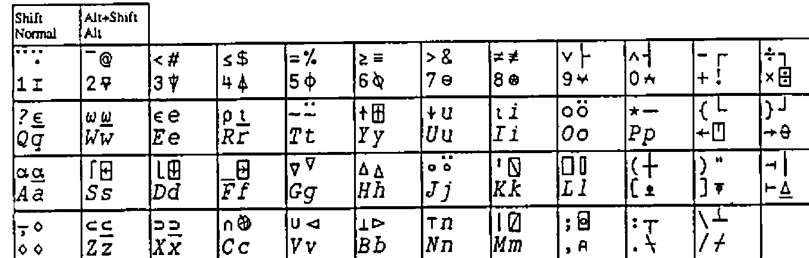
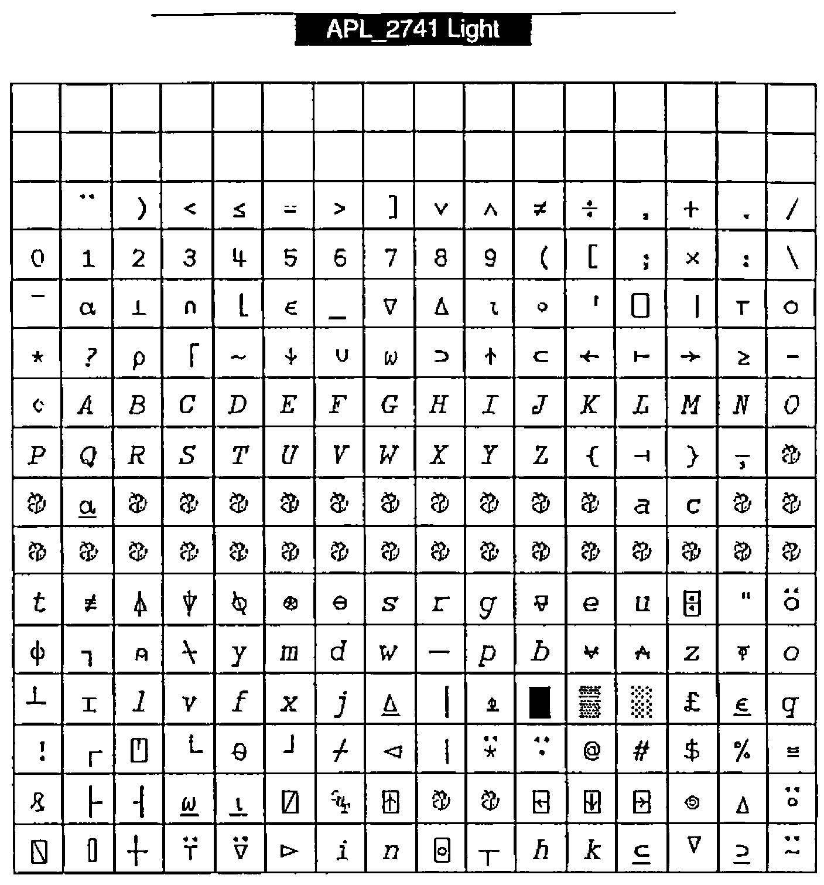

*by F.H.D. van Batenburg*
{ .byline }

It was a pleasant surprise to read Bill Chang’s paper [1] and to learn that WWW uses 8 bits for file transfer which would enable us to transmit APL characters. If only we could agree over a proper APL character set and mapping.

His proposal to agree on a common positioning of the APL characters seems very important to me. I wish we could all agree quickly on this so we can exchange code electronically and read it easily. This might raise the discussion how "easy" an ASCII transliteration scheme is. I think that an agreed ASCII transliteration is very useful and will remain so as long as people work with hardware or software that cannot display any particular chosen font. And that will still be the case quite a few years from now. However for me the APL characters are the easiest to read and any ASCII transliteration is a second best choice that is forced upon me by the hardware or software. So when my hard- and software allow it, I prefer the APL symbols.

In his comments in *Vector* 12.2 [2], Adrian Smith stresses his need to cut and paste between his Web browser, word processor and APL program (Dyalog and Manugistics). Again a plea for a quick decision for a universally agreed mapping of APL characters.

However much I can agree over the importance of such a "universal agreed-upon mapping" of APL characters, I would like to bring up another requirement that might conflict with the above-mentioned cut/paste requirement. ***I want to enter APL in my word processor just as if I am using the APL 2741 keyboard.*** This means that by pressing key &lt;3&gt;, I would like to see "3" in my text, by pressing &lt;Shift+3&gt; I would like to see "&lt;", pressing &lt;Alt+3&gt; should display "#", and pressing &lt;Alt+shift+3&gt; should display "⍒".

As far as I know, on the PC (Windows 3.1) the position of the characters in the fontfile determines their particular keys. There is no user-definable mapping table to associate a particular character in the fontfile to a specific Alt/Shift/key combination. So there is no way to tell Word that pressing key &lt;A&gt; or key-combination &lt;Shift+A&gt; should bring anything else forward but character 96 in fontfile APL, respectively character 66 (origin 1). Or is there?

The same holds true for the Macintosh; yes, I can switch to another generic mapping (for example "German-mapping" instead of "USA-mapping") but this will work for all subsequent fonts and is not specific to a particular APL font, or within a particular application. I know that Unix enables font-keyboard mappings, and that Dyalog APL does so, but I don’t know of any way to do that in Word for Windows or in Word on my Macintosh.

So based on the assumption that there is a 1:1 relationship between the character position in the font file and the position on the keyboard, I defined a TTF font mapping on the Macintosh, using Fontmonger with the font that Vector provided (thank you Adrian) that makes it possible for me to type in all APL text as if it was a real 2741 typewriter, using &lt;Alt&gt; and &lt;Alt+Shift&gt; combinations for "overstrikes".

Figure 1: Keyboard mapping of Macintosh TTF font APL_2741.
{ .caption }

The figure shows that typing is mostly according to the "APL keyboard". Lowercase keys yield APL capital characters, uppercase yield APL non-overstrike functions (yes, I know that the word "overstrike" has lost its meaning since we do not overstrike any more, but I still use it to indicate the more complex characers), and &lt;Alt+...&gt; yields the normal APL overstrikes. All very regular, in accordance with the APL keyboard specification.

Only the &lt;Alt+Shift+...&gt; combinations are a bit irregular. As you can see there are several places that map to the same character. For example "i" is associated with &lt;Alt+I&gt; as well as with &lt;Alt+Shift+I&gt;, and the same &lt;Alt+...&gt; and &lt;Alt+Shift+...&gt; convergence holds for "e", "n" and "u". This is a particular quirk of the "USA-keyboard" font-mapping of the Mac-O.S., so I have to put up with it. For this reason I could not place the underscored epsilon "⍷" at &lt;Alt+Shift+E&gt;, underscored iota "⍸" at &lt;Alt+Shift+I&gt; nor "⍗" on the same key alongside the "↓", much as I would like to.

Furthermore &lt;Alt+Shift+6&gt;, &lt;...+8&gt;, &lt;...+9&gt; and &lt;...+10&gt; do not yield "^", "\*", "(" and ")". The reason was that I did not want to put one character on two positions in the font. For example "\*" is already defined by key &lt;Shift+P&gt; and the corresponding character is placed in position 81. Associating &lt;Alt+Shift+8&gt; also with an asterisk would result in another asterisk placed in font position 162. Searching in text for an asterisk would either bring forward the one in position 81 or the other one in position 162, but not both. This is of course not acceptable in text processing, unless the two asterisks have a very different appearance. Similarly for searching on caret "^" (yes, that one looks a bit different from APL’s and-function "∧", but not that different as you can see) and opening and closing parentheses.

The &lt;Alt+Shift+...&gt; also includes the framing characters and four arrowheads (at &lt;Alt+Shift+G&gt;, &lt;...+H&gt;, &lt;...+V&gt; and &lt;...+B&gt;) that connect to the lines made by the framing characters.

With this font, typing a manual or a paper (this one for example) is very easy. As mentioned before, on the Mac one can apply the 2741 key-mapping in any text processor: Word, ClarisWorks, BBEdit, SimpleText or whatever. I don’t need to run a parallel APL session from which to cut and paste into my text, so I can also give a manuscript to an "APL-phobic" secretary and ask her to type it in for me.

Although I have not yet ported this font to the PC, such an approach will work as well on the PC. The normal and shifted keys will yield APL caps and APL non-overstrike functions in all text processors. Unfortunately Word for Windows does not allow one to use &lt;Alt+...&gt; and &lt;Alt+Shift+...&gt; to access a particular character. However for this I used to apply utility *COMPOSE* (a utility that DEC put into the public domain) and typed &lt;Specialkey&gt;+∇+| in order to get "⍒" and &lt;Specialkey&gt;+○+\ to get "⍉". Here the overstrike concept came to life again.

What is the mapping that makes this work? **See Figure 2 opposite.**

This shows the character positions in font APL_2741 on the Macintosh. It is different from Bill Chang’s proposal, unfortunately, but also has much in common. Positions 1–33 are not used, and positions 128–169 are used sparingly. The first 128 positions are very much in line with most other proposals. Positions 170–256 are different, however. This is done to agree with the Macintosh key-mapping; as the PC has no &lt;Alt+..&gt; and &lt;Alt+Shift+..&gt; mapping in Word, I do not expect this mapping to disagree with any Word for Windows on the PC.

Figure 2: APL_2741 Light
{ .caption }

Are all APL characters included?

- Yes. All characters that are mentioned in the ISO extended standard are included.
- No. Many APL characters that are entered in the UCS2 standard [5] and [6]) are not included. All non-overstrike APL characters are there, but many overstrikes such as quad-equal, quad-diamond, down-tack-underbar, quote-underbar, circle-underbar, leftshoe-stile, downshoe-stile and many others are missing. All of them are without meaning in the current APL systems that I know of (but my knowledge is limited in this respect).
- Yes. All *APL characters* that Jim Brown proposed in [3] and Bill Chang in [1] and Adrian Smith in [4].
- No. Not all the *non-APL* characters that Jim Brown, Bill Chang and Adrian Smith proposed. They included national characters like the pound and the yen character and many, many accented characters.

My proposition with respect to national characters and accented characters is: ***do not include those characters in the APL character set.*** If inclusion would be easy, like the relatively small load cf 11 framing characters, we could include them, but as it is a big problem we should exclude them. All accented characters are simply too much to expect to live together with a full APL character set in a file of 265 minus 64 reserved positions. This does not mean that those characters are unimportant, but only that they create a problem that can easily be circumvented by asking the user to use his ordinary text font if he/she wishes to use special accented or national characters. Those fonts are particularly suited for the national characters. These characters just don’t belong to the APL character set.

As long as the UCS2 character set (a proposal where each character is represented by 16 bits) is not implemented everywhere it would be useful to agree on one character set mapping with all the current APL characters. And even after general acceptance of the UCS2 such a characterset configuration could be useful as the APL characters in UCS2 are spread out over several tables [5] and I suspect that one derived table that contains just the APL characters will often be used internally.

Is this an answer to Bill Chang’s proposal? Unfortunately not. The alternative mapping and different reasoning presented here do not solve the problem of "what mapping" to choose, but rather enlarge the problem. My purpose was to put forward another criterion for font-mapping: typing in a text processor.

It seems that we now have several alternative suggestions that are not compatible, and even mutually exclusive. Let me finish with those questions and ask the APL users to think (and write) about an answer.

1. What characters do we want in a set of 256 (minus 64)? Live APL characters? Also the "dead" ones? National characters? Accented characters? frame (single and double) characters? (My suggestion is to take the live APL characters and framing characters only as shown in Figures 1 and 2.)
2. Do we choose a mapping such that we can cut/paste between Windows text processors (I assume this implies any Windows Web-browser) and Dyalog APL?
3. Do we choose a mapping such that we can cut/paste between Windows text processors and Manugistics APL?
4. Do we choose a mapping such that we can cut/paste between Macintosh text processors and 68000 APL?
5. Do we choose a mapping such that we can type APL in our Macintosh text processors? (This would be my preference.)
6. Do we choose a mapping such that we can type APL in our Windows text processors?

I have no answer to these questions that is satisfying for everybody. On the contrary, some alternatives seem mutually exclusive to me. We could ask ISO to choose a character mapping. This would hand over this Gordian knot to the ISO committee to unravel, but I do think that it is better if we could come to an agreement together. So I am anxious to know your opinion.

Dr F H D van Batenburg 
Section Theoretical Biology, E.E.W. of Leiden University 
Kaiserstraat 63 
2311GP Leiden 
The Netherlands

## References

[1] Chang, Bill; *My Computers are APL Machines*. Vector Vol 12 No.2 October 1995, pp. 7–8

[2] Smith, Adrian; *Some Comments*. Vector Vol 12 No.2 October 1995, p.9

[3] Brown, Jim; *IBM APL2 Unicode Character Mapping*; 1993

[4] Smith, Adrian; *One Font to Rule Them All*. Vector Vol 11 No.2 October 1994, pp. 105–106

[5] ISO/IEC 10646-1; Table 1 2 39 40 41 42 46; 1993

[6] Clayton, L.; internal discussion paper N93-14 regarding APL characters in UCS2; 1993
