*by F.H.D.(Eke) van Batenburg, Jasper van Dijk and Dirk-Jan van Leeuwen, Theoretical Biology, Inst. Ecological & Evolutionary studies, University Leiden, The Netherlands*
{ .byline }

## Abstract

This paper demonstrates a gui-quad primitive that should be added to APL. This gui-quad is a logical successor of quad and quoted-quad for a windowing environment.

The right argument of gui-quad is a vector with data-items that are to be presented to the end-user and the result is the same vector with these data items modified as the user saw fit. The left argument specifies the layout. So the right argument specifies what should be presented and the left argument specifies how.

The functional repertoire of this gui-quad is not so extensive that it can supplant the `⎕WI` primitive. However, this gui-quad primitive is far easier to use and also satisfies most of the programmer needs for a gui-like interaction with the user.

## Introduction

A good thing in my opinion is that most APL vendors have, despite some undeniable differences, an APL that is very similar with regard to the primitive functions, syntax and basic primitive variables. For this reason when I switch from my PC where I use APL2C or APL2000 to the Mac where I use APL68000 (now APLX) most of my coding still works. And even when I would move to Unix, a lot (I refrain from saying most) of my APL coding still works in SAX APL. And this is more or less codified in the newest ISO standard [1]. You could make an argument as to whether it was the ISO standard that standardized APL, or whether the vendors adhered to common principles that made an ISO standard possible or a bit of both, but I do not intend to raise that discussion here. The fact remains that I can work without too much mental juggling in many different APLs.

The thing that is not codified in the ISO standard is the graphical user interface in APL. And in the beginning this used to be very different in different APL implementations. Despite the initial differences I noticed that this initially wide variety of approaches seemed to have grown towards each other in the last decade. The first one with a nice graphical user interface was APL68000 before the DOS-world even heard of the words graphical user interface. Then APL\*PLUS came with a graphical user interface using `⎕WGET` and `⎕WPUT` that was very nice taking into account the primitive DOS environment of that time. When Dyalog introduced their `⎕WI` using an object-oriented programming approach they initiated a new and powerful gui for APL. First APL\*PLUS adopted this (I leave it to the reader to pronounce APL\*PLUS as APL/Manugistics, Cognos, APL/Win or APL2000) and now APL68000 (today to be pronounced as APLX of MicroAPL) adopted it too. This "organic" standardization is something that I am very happy with.

## User Interface.

Having said that I am happy with the standardization of `⎕WI`, I must add that as a programmer I have mixed feelings about the `⎕WI`. On the one hand it is an extremely powerful tool for a programmer. On the other hand unfortunately it is indeed true that `⎕WI` means "Window Interface". My point is that as a programmer, I do not want to interface with Windows (imagine how my students laugh when I work on my Mac and I explain to them that I am interfacing with "Windows"). I do not want to interface with Windows, I want to interact with the User.

Now APL used to have perfectly good primitives to interact with the user: the quad and the quote quad. It is clear that in the current operating systems the quad and the quote quad are inadequate for a modern user interface. But rather than a Windows Interface I think there is a need for a "Graphical-User-Interaction-Quad", in short a gui-quad.

Such a gui-quad should take the information that the programmer wants to present to the end-user, show it in a nice way, let the user change it as he or she sees fit, and return the modified result. For this I do not want to "interact with Windows", I do not want to make forms, to create objects nor do I want to assign properties.

## Basic interaction

So let me be more concrete in what I do want, in other words how I want the gui-quad to work. In its simplest form I just want to say something like:

```apl
⌼ ⊃'This is simple' 'user interaction.'
```

and I expect to produce something like:[^3]

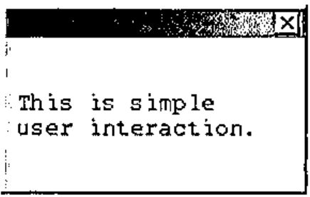

```apl
0 ⍝ the explicit result that will be explained later
```

You see? No forms, no `⎕WI`, no `⎕WCALL 'MessageBox'`, no more programming overhead than just that one symbol for graphical user interfacing.

Now as you see this is a very basic thing. We only have to supply the information that we want to present to the user. Just like in the old days when we said:

```apl
⎕ ← ⊃'This is simple' 'user interaction.'
```

If we want to enhance the layout we should give slightly more information to `⌼` . For example we could specify that we would like to display this information in a query-box, or a proper info-box. For this we supply layout information as a left argument. For example:

```apl
'?'⌼⊃'This displays in' 'a query box.'
'i'⌼⊃'This displays in' 'an info box.'
```

For real interaction you want information back from the user. The simplest way would be to enable him to answer by clicking on appropriate exit buttons. Of course you do not want to be restricted to Yes/No or OK/Cancel. What about specifying these options at the left? Something like:

```apl
⎕ ← '?' 'Yes' 'LetMeThink' 'No'⌼ 'Are you happy?'
```

which generates:

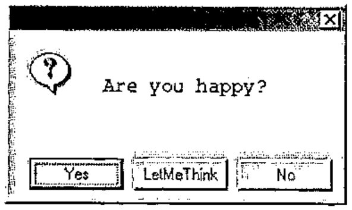

and returns:

```apl
2
```

Now we have a more solid interaction. I presented a question, and the user reacted by clicking one of the exit buttons. The result was a number; 1 for [Yes], 2 for [LetMeThink], 3 for [No] and 0 if the user clicked the top-right button [X]; you see that the user clicked [LetMeThink] because the result was 2.

Summarizing, I would like a "graphical-user-interaction-quad" that does not require me to specify all kinds of Window objects, but permits me to supply my information to its right (and if necessary some minimal layout specification at its left) and which returns to me the user response.

## More subtle user interaction

The previous example, although rather basic, illustrated the basic principle. Now a graphical user interaction needs subtler interaction than by simple exit-buttons. Often I have some (default) data that I want to present to the user and give him the opportunity to change those parts that he disagrees with. And I do want to present the data in a gui-type way, for example as radiobuttons, clickboxes, number or text fields, or sliders. Again, we would like gui-quad to take the information to its right, get layout specifics at its left, and return the presented information back with modifications if the user changed it. For example:

```apl
⎕ ← '#'⌼ 'Is your mental age...' 12  ⍝ number field
```

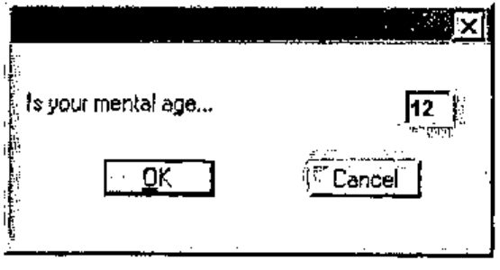

```apl
1 64 ⍝ the user disagreed with 12 and entered 64

⎕ ← '×'⌼ 'Coffee' 1 'Tea' 0 'Milk' 1 ⍝ click boxes
```

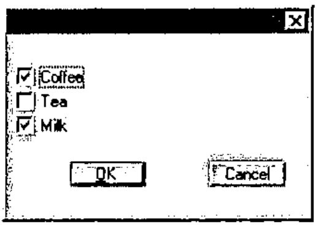

```apl
1 0 1 0 ⍝ the user only liked tea
```

This example showed that a more complex question may need a general introductory text. For this we supply a nested array with two elements, the first one with the general text and the second element with the detailed information. For example:

```apl
⎕ ← 'o'⌼'Do you crave for...'('Chocolate'1'Sugar'0'Meat'0)
```

The left argument `'o'` is a radio-button specification so we get:

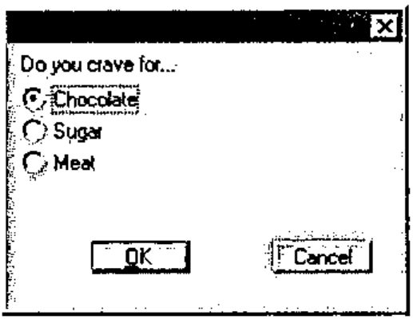

```apl
1 2 ⍝ the user was a sugar lover
```

All the previous examples only queried the user for one single set of alternatives. Would it not be nice if we could ask the user several sets of questions? As you see in the examples each basic unit is a text and a value. Upto now, we used several of such pairs in a vector, but we can also ask the user his or her opinion on several sets of alternative pairs. Instead of a vector with questions (which is handled similarly to a double column of text-value-pairs) we can offer a matrix with several column-pairs. For example:

```apl
⎕ ← '×'⌼'Do you like...'(2 4⍴'TV'1'Drinks'0'Radio'0'Sweets'0)
```

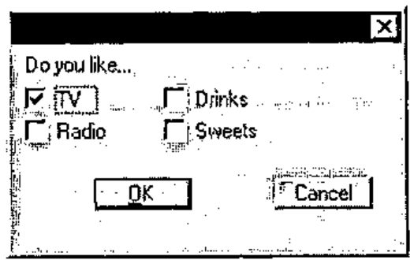

```apl
1 1 0 0 1
```

The result is a vector with first (as always) a number that indicates how the dialogue ended (1 for [OK], 2 for [Cancel] and 0 for [X]), followed by the user response on each of the four clickboxes.

These examples sufficiently show how you can present numbers to the user for modification with a layout specification at the left.

Text is very similar to numbers, for example

```apl
⎕ ← '⍞'⌼'Name' '          ' 'Street' ' ' 'Town' ' '
```

results into (notice that for sufficient size I gave street a suggestion of 10 blanks):

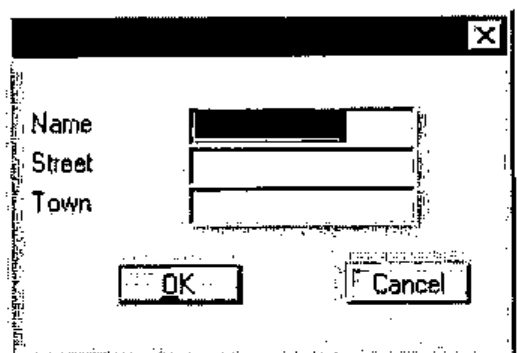

And of course, if you are not satisfied with the standard [OK] and [Cancel] buttons, you can specify your own in the left argument. For example:

```apl
⎕ ← '#' 'OK' 'Sssssst'⌼'Your income is' 100000
```

to get:

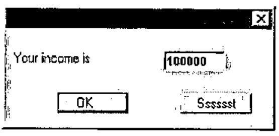

## Detailed layout

My experience is that the capabilities of the above gui-quad is quite satisfactory and is sufficient for most of my needs. Nevertheless there are occasions when I want more control over the layout. Now I can resort to `⎕WI` but I still have to specify more nitty-gritty than I care for.

When I learned Fortran and PL/I (long, long ago) layout specifications for output were much simpler. For example to set three numbers on the printer in a field of size 10, I specified 3F10; for a text of size 12 I specified A12, for two empty lines I specified SKIP(3) (meaning 1 for next line and 2 more for 2 empty lines) and to position something, text or numbers, at position 35 I specified COL(35). Now is this so very different from how I want to "print" my dialogue box? Of course the needs were simpler at that time, but is the complexity of `⎕WI` really needed? Wouldn’t the simple Fortran or PL/I-like formatting be able to handle the majority of the graphical layout requirements sufficiently? I found that this type of layout specification could be used for gui layout rather well. Let me show you how to do this.

Again, the gui-quad gets its information on the right and returns it modified. We concentrate on the left argument that will have the Fortran-like specifications to describe the layout of each of the items in the right argument. As in Fortran, the specification will be in one vector (ehhhh, statement) separated from each other by a comma. But of course we will use compact symbolic and suggestive notation.

For example:

```apl
      ⎕ ← ',×I am off,-10,≡.one.two.three,#'⌼ 0 1 2 3
0 1 0.4 2 3
```

This displays the values 0, 1, 2 and 3 in layout-elements…<br>
`×`: a clickbox with value off (describes layout for value 0) and text "I am off"<br>
`-`: a slider of size 10 (describes layout for value 1)<br>
`≡`: a list with alternatives "one"/"two"/"three" where "two" is on (describes layout for value 2)<br>
`#`: a number field (describes layout for value 3)

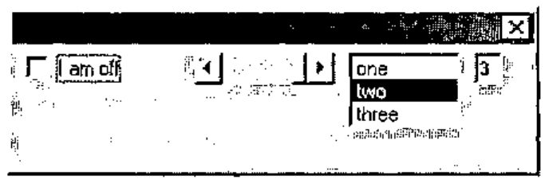

As you see, this dialogue does not look very good, because without much instruction, gui-quad places all the elements next to each other. Now in Fortran and PL/I we also had positional instructions. In contrast to the other layout specifications that were associated with a value, positional instructions were self-reliant and not related to an input value. For example I could skip 4 positions using X4, and go to column 35 using COL(35). Apparently gui-quad also needs positional instructions. Of course, in APL we do not want the specifications as verbose as in Fortran or PL/I. We will use single-character symbols instead. The following 6 positional instructions take care of this:

`>#`: # positions to the right (here # stands for any number for example "`>3`")

`<#`: # positions to the left

`∧#`: # lines up (this would be PL/I magic on the printer)

`∨#`: # lines down

`/`: to the beginning of next line

`∘#.#`: to position #.#.

Positions are expressed in characters. For example "`∘5.9`" will place the next item at line 5, column 9. The size of a character is an average; for proportional fonts, the character "i" takes less space than character "m".

Now if we apply our new specifications we might specify

```apl
⎕ ← ',×I am off,∨3,-10,∘1.20,≡.one.two.three,∨,#'⌼ 0 1 2 3
```

and the result looks much better.

One important feature is still missing: exit buttons. As with the positional instructions, exit buttons are not associated with information items from the right argument. They can be inserted in the left argument wherever it is convenient. They are characterized by the arrow (the suggestion is that they "jump"away). We use `→` for normal exit buttons, `↑` for the default button (pressing [Enter]), and `↓` for the [Esc] button. So…

```apl
⎕←',×I am off,∨3,-10,∘1.20,≡.one.two.three,∨,#,/2,↑ OK ,↓Cancel'⌼0 1 2 3
```

will generate the following dialogue box:

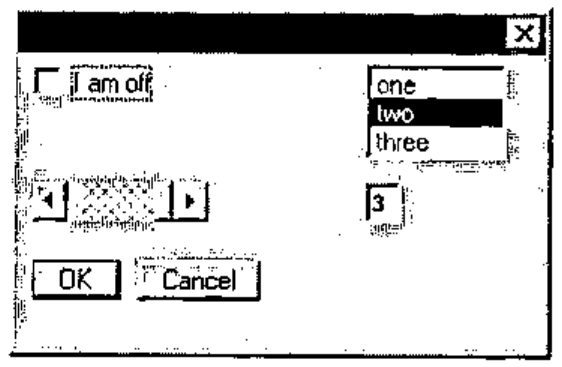

and may return:

```apl
2 0 1 2 3
```

When you want a very complicated box, the left argument of gui-quad is relatively more complicated, of course. For example to get the box…


I had to make a matrix `DEMOvar2` with the following text:

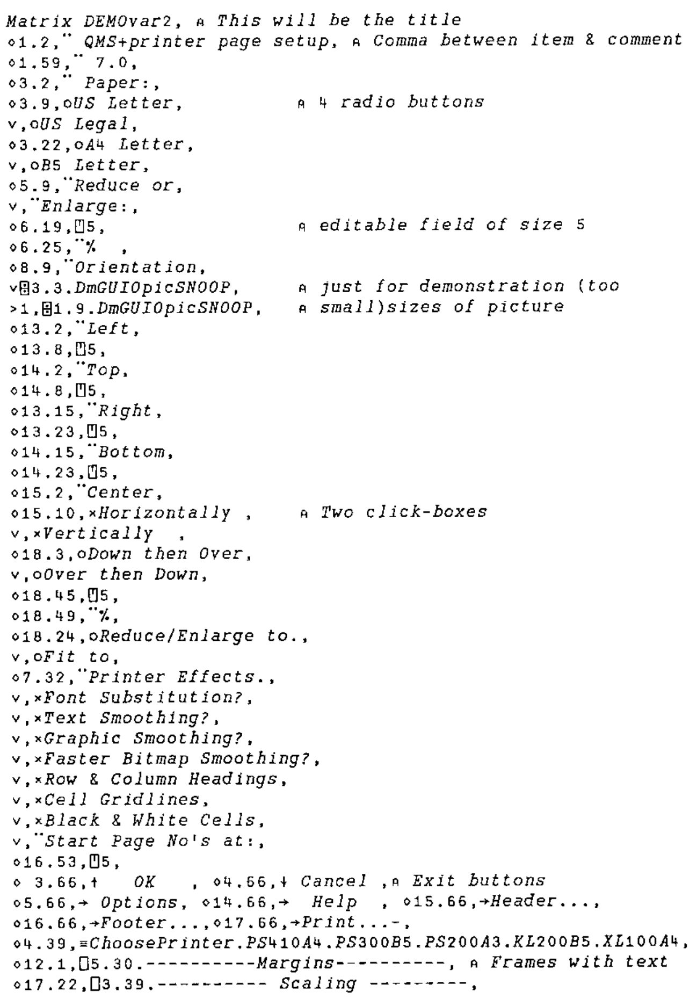

```text
Matrix DEMOvar2, ⍝ This will be the title
∘1.2,¨ QMS+printer page setup, ⍝ Comma between item & comment
∘1.59,¨ 7.0,
∘3.2,¨ Paper:,
∘3.9,oUS Letter,           ⍝ 4 radio buttons
∨,oUS Legal,
∘3.22,oA4 Letter,
∨,oB5 Letter,
∘5.9,¨Reduce or,
∨,¨Enlarge:,
∘6.19,⍞5,                  ⍝ editable field of size 5
∘6.25,¨%  ,
∘8.9,¨Orientation,
∨⌼3.3.DmGUIOpicSNOOP,      ⍝ just for demonstration (too
>1,⌼1.9.DmGUIOpicSNOOP,    ⍝ small)sizes of picture
∘13.2,¨Left,
∘13.8,⍞5,
∘14.2,¨Top,
∘14.8,⍞5,
∘13.15,¨Right,
∘13.23,⍞5,
∘14.15,¨Bottom,
∘14.23,⍞5,
∘15.2,¨Center,
∘15.10,×Horizontally ,     ⍝ Two click-boxes
∨,×Vertically  ,
∘18.3,oDown then Over,
∨,oOver then Down,
∘18.45,⍞5,
∘18.49,¨%,
∘18.24,oReduce/Enlarge to.,
∨,oFit to,
∘7.32,¨Printer Effects.,
∨,×Font Substitution?,
∨,×Text Smoothing?,
∨,×Graphic Smoothing?,
∨,×Faster Bitmap Smoothing?,
∨,×Row & Column Headings,
∨,×Cell Gridlines,
∨,×Black & White Cells,
∨,¨Start Page No's at:,
∘16.53,⍞5,
∘ 3.66,↑   OK    , ∘4.66,↓ Cancel ,⍝ Exit buttons
∘5.66,→ Options, ∘14.66,→  Help  , ∘15.66,→Header...,
∘16.66,→Footer...,∘17.66,→Print...-,
∘4.39,≡ChoosePrinter.PS410A4.PS300B5.PS200A3.KL200B5.XL100A4,
∘12.1,⎕5.30.----------Margins---------, ⍝ Frames with text
∘17.22,⎕3.39.---------- Scaling ---------,
```

and used it:

```apl
⎕←DEMOvar2⌼ 1 2 3 4 5 6 0 0 9 10 11 0 0 0 0 0 0 0 19 0
```

You see in this example that gui-quad accepts a matrix as well as a vector as left argument. You can also see that I can give a comment in the specifications. Now you might think that this matrix is fairly complex. However, keep in mind that it defines a dialogue box with 57 items and that only 57 short lines are sufficient to define this dialogue box.

## Progress bars

Frankly speaking, at this point I have explained everything that should be known about the basics of my proposed gui-quad. I could describe a few more features that are available (such as the `¨`-specification that you can sprinkle around in the left argument to put explanatory texts in the dialogue box, or the `⎕`-specification for frames). Or I could clarify more details of the functions mentioned (such as the number right after the `≡`-specification that instructs how many lines are available). This I will not do. For those that are interested I refer instead to the example function and the description that I wrote.

Unfortunately I could not resist extending the functionality of gui-quad in a new way. This was based on my observation that for progress bars the simple dialogs were no problem, but as the need for more sophisticated progress-bar-dialogs grew, the required functions for those dialogs were always purely gui-quad functions. For that reason I finally decided to put the progress bar functionality into the gui-quad .

Now, using the gui-quad for progress bars differs in one aspect essentially from its normal use. Normally the quad-gui is called only once; it waits for the user to make its changes and only after the user clicks an exit button it gives back control.

For progress-use however, the gui-quad relinguishes control immediately; therefore it requires three different types of invocation:

Initially a one-time call that brings up the window. This first call fully describes the window layout in the normal gui-quad way using the initial values of the right argument in a way that is specified in the layout description of the left argument. For example:

```apl
      ⎕←'Example,¨Bar1:,"15,/,¨Bar2:,"15,//,↑Pause,→Stop'⌼ 0 1
¯1 0 1
⍝ ¯1  means no buttons clicked
⍝ 0 1 are values of progress bars
```

Next, the gui-quad is called repeatedly to show the new, updated values in its window. Now there is no layout at the left because the layout was already specified in the initial call. At each such call the new progressbar values will update the progressbar and the program checks the other gui-items (if present) to see if the user changed them. In our example the user could have pressed the Pause-button or the Stop-button or the [X] in the top-right corner.

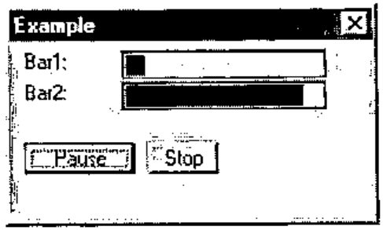

For example

```apl
      ⎕"'"'⌼ 0.1 0.9           ⍝ call one
¯1 0.1 0.9
      ⎕"'"'⌼ 0.2 0.8           ⍝ call two
2 0.2 0.8                    ⍝ 2 means "second exit button"
      ⎕"'"'⌼ 0.3 0.7           ⍝ call three
0 0.3 0.7                    ⍝ 0 means [X] was clicked on
```

In this example you see that the result in the second call reports that exit button 2 was pressed (2 instead of `¯1`) and the last call reports that the upper-right close button [X] was pressed.

Finally a call that removes the dialogue. Its syntax is:

```apl
'⍋'⌼ ⍳0
```

In this example we only applied the exit buttons, but as you might expect, you can use all the previously mentioned gui-items that are available in gui-quad.

## Discussion

The biggest forte of this gui-quad is that its arguments concentrate on the essentials. There is no programming "fuzz" that you need with `⎕WI`. No forms, no opening, closing, showing, waiting, window sizing, deleting, on-methods, and no properties stuff.

As a consequence the gui-quad arguments are very compact. A vector of one or two lines easily specifies a dialogue that needs one or more pages of code using `⎕WI`. Therefore it is quickly programmed, read fast by the programmer and quickly debugged or reprogrammed. Probably you might not see this as a beginner because the funny symbols in the left-argument specifications could look a bit daunting at first, but using gui-quad for a while will convince you of its advantage.

Of course the layout specification of variable `DEMOvar2` was a lot more complicated than the other examples. This is not surprising as the generated dialogue is more complicated too. The essential question is of course: are the specifications for complicated windows easier with `⎕WI`?

My answer is: no. The reverse is true: both for simple and for complicated windows the gui-quad is much easier than the `⎕WI`. You only need to provide a minimum of layout specifications. If your dialogue is very complicated, the specifications are more elaborate, but the amount of overhead is very small.

Of course gui-quad can not replace `⎕WI` altogether. There are luxury features that are available in `⎕WI` and not in gui-quad. So for an occasional really sophisticated window you have to "fall back" to the `⎕WI`. Or use CAUSEWAY [2] which is also much more powerful than this gui-quad and still takes care of a lot of nitty-gritty that is needed with `⎕WI`. However my experience is that for most applications I am quite happy with the available functions in the gui-quad.

## Conclusion

Several times I have spoken about my experiences with gui-quad. So you might wonder where gui-quad is implemented. Unfortunately nowhere, yet. My experience is based on a user function that we wrote and which acts like the proposed gui-quad.

As I hope to have shown, the gui-quad is a very powerful, useful and relatively easy way to interact with the user. So I plead for adding it to the APL primitives.

As long as the gui-quad is not available as a primitive we have to resort to a user function. Such a function, called mGUIO (Graphical User Input Output), is currently written for APLX/Win, APLX/Mac, APL2000 and APL2C. If somebody is interested he or she could contact the first author.

## Literature

ISO (1997): Programming languages, their environments and system software interfaces – Programming language APL, extended. ISO13751.

A.Smith (1995): Causeway workshop: Pitkospuut GUIsuon Yli. Vector 11(5)60-64. See also: http://www.causeway.co.uk/

[^3]: Personally I would have preferred to use another symbol, but unfortunately this is already used for component files in APLX. So instead I selected the symbol `⌼`, where the `⎕` suggests input/output and the "`∘`" inside suggests the gui object "option" or "radio-button".
