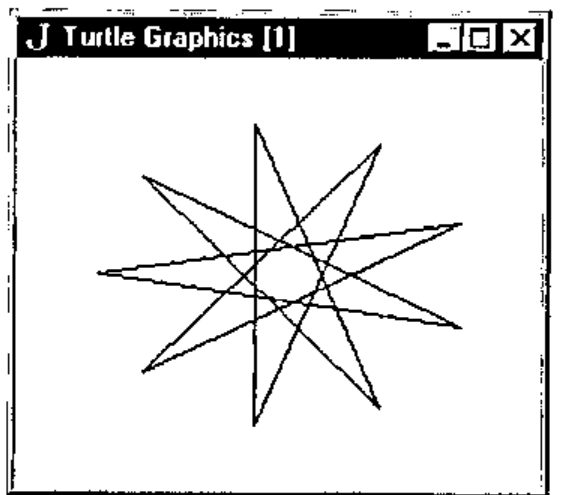
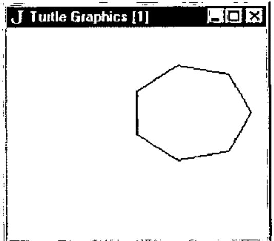
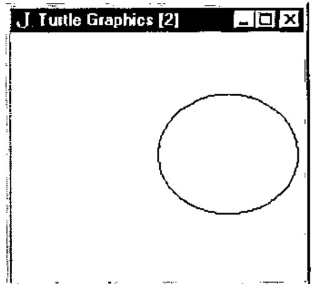
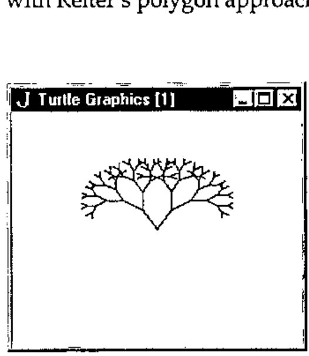
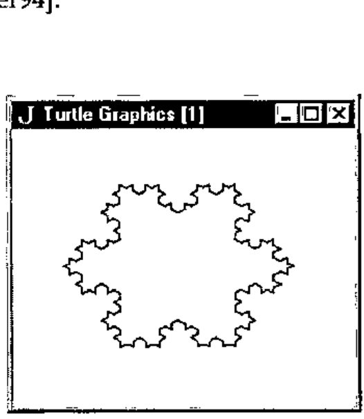
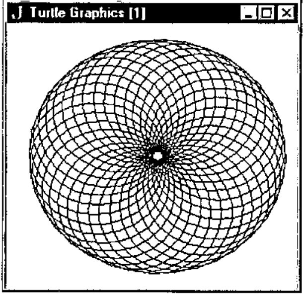
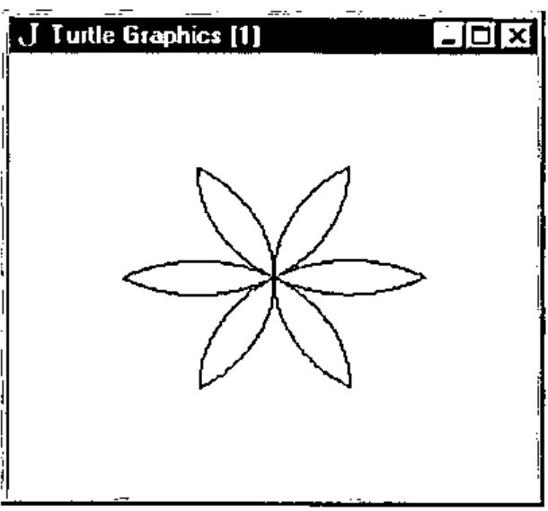

*by David J. Benn*
{ .byline }

## Introduction

Soon after starting to learn J in earnest, I encountered a book called *Fractals Visualisation and J* [Reiter95]. Having long held a fascination for chaos theory and fractals, I was interested - and somewhat relieved - to note that J had been seriously used for the creation and exploration of fractal geometry, at a time when I was sceptical about the benefits of J over other languages.

Having studied J in the context of a coursework Masters unit on numerical computation, I have glimpsed something of the power of the language. It is an uncommon thing to find a powerful functional language which does not require exorbitant resources and at the same time provides good support for system-level programming in general and the Windows API and Macintosh Toolbox in particular. Indeed, I have moved from outright scepticism, to grudging respect, to admiration of J in only a few months of working with the language.

While looking through a number of issues of *Vector* recently, I came across Reiter’s paper on fractals and J. [Reiter94]. Upon seeing a picture of the Koch curve (fractal snowflake) I was reminded of a Turtle Graphics program I had written to render this appealing shape. It occurred to me that it might be interesting - and even useful - to provide some means for doing Turtle Graphics in J.

## Turtle Graphics

Turtle Graphics (TG) has its origins with the Logo language, created in the late 1960s by a team led by Seymour Papert [Papert80]. Logo was invented as a vehicle to help children think about problem solving [Wilson93] and for the interactive exploration of mathematics [Abelson92].

Logo can be considered to be a dialect of Lisp [Wilson93] and implementations are characterised by the following:

> Logo is highly interactive, organises programs as collections of procedures, includes lists as first-class data objects, and has built-in turtle graphics.
>
> Imagine that you have control of a little creature called a turtle that exists in a mathematical plane or, better yet, on a computer display screen. The turtle can respond to a few simple commands: FORWARD moves the turtle, in the direction it is facing, some number of units. RIGHT rotates it in place, clockwise, some number of degrees. BACK and LEFT cause the opposite movements. [Abelson92]

While some early Logo systems used a dome-shaped robot (attached to a computer) which moved about on the floor, drawing on a large sheet of paper, most Logo systems represent the turtle as a triangle on a computer screen. In some systems, there is no turtle of any kind, merely the *notion* of one, for example [Benn95]. Where speed of rendering is important, in TG systems which do provide a visual turtle, the turtle may be hidden.

More recent versions such as Berkeley Logo take advantage of the windowing capabilities of modern operating systems (Windows, Macintosh) [Harvey93].

## Turtle Procedure Notation

Abelson and DiSessa have the following to say in Appendix A to their book *Turtle Geometry*:

> "Turtle Procedure Notation is meant to be a consistent and readable way to describe turtle programs independent of the quirks, details, and limitations of common computer languages, yet in such a way that the programs can be readily translated into whatever computer language is available." [Abelson92]

The authors used Logo for all the TG work done in developing the material for their book and in fact suggest that Logo is, except for minor variations in syntax, an actual implementation of Turtle Procedure Notation.

They discuss the basic operations and language features necessary for TG. These include features common to all programming languages, such as expression evaluation, integer and real data types, variables, procedures/functions, conditional evaluation (if...then...else), iteration and recursion.

Other language features such as a list datatype and delayed evaluation while arguably useful are not essential. Having said that, delayed evaluation *was* found to be useful when creating the **repeat** command for the current J implementation, while lists (vectors) were of great help in the maintenance of information about TG activity. Both are detailed below in the section entitled *Turtle Graphics Extension for J*.

They also discuss the relative merits of a number of commonly available programming languages as platforms for TG.

Circa 1980 BASIC is dismissed by the authors of *Turtle Geometry* as being unsuitable for TG due to a lack of support for modularisation, local scope, and recursion. This indicates that while the book has been reprinted several times, it has not been updated to consider modern BASIC dialects which *do* support such features. In fact, circa 1990 BASIC has more in common with Pascal and other modern imperative languages than with these early offerings.

One such example [Benn95] includes inbuilt TG commands, C-like structures, recursion, and sub-programs which double as procedures and functions. It is in any case encouraging to see that the authors of J for Windows recognise the need for inter-operability with languages such as Visual BASIC. [Pountain95]

Lisp, Smalltalk and APL all receive high marks from Abelson as languages which are well suited to the implementation of TG as language extensions. In particular:

> APL is quite suitable for turtle geometry. It is procedure-oriented, with inputs and outputs. It allows "environment building" in the way Logo does. Furthermore, it is recursive and handles compound data, such as vectors, in the cleanest fashion of any language mentioned here.
>
> We...know of at least one major installation that has turtle commands built into APL. [Abelson92]

The parallels to J in the above commentary are obvious.

## Turtle Graphics Extension for J

Procedure definitions can be thought of as a way of extending the set of operations in a programming language [Abelson92], and since J provides the means by which functions can be defined and stored in scripts, such extension is supported by J. But at least as important is the degree to which a language permits interactive environment building in an experimental fashion, as opposed to the edit-compile-test cycle of languages such as Pascal and C (since programs written using them are most often compiled). Like Logo, J is quite suitable for this style of programming.

In setting out to implement Turtle Procedure Notation in J, it was determined that greater use would have to be made of J’s control structures and explicit function definition than is perhaps customary. Purists who believe these to be largely unnecessary may consider the extent to which they have been used here excessive, but in reality the primitive commands and operations required for TG are essentially procedural in nature.

It should come as no surprise that J’s Window Driver was also used extensively. A close examination of the code will however reveal smatterings of more traditional J code. The code was implemented and tested under J FreeWare for Windows. It was later also tested under the Standard edition (v2) of J for the Macintosh.

The current J implementation, hereafter referred to as JTG, supports multiple windows with one imaginary turtle per Window. Up to MAXWDW (currently defined as 10) windows may be open at once, allowing one to have multiple images in various stages of completion. TG operations are therefore directed at particular windows. This is facilitated by making the first parameter of each command or operation a number from 1 to MAXWDW indicating the window-id.

The following information is maintained about each window via J lists: whether or not the Nth window is open, whether the pen is up or down in each window (presumably stemming from the original turtle robots which lifted a pen up and down so that drawing would occur only when desired, but nevertheless useful), the heading in degrees for the turtle in each window, and the current x,y coordinates for each window’s turtle. J verbs such as *head, behead, tail, amend* and *from* are used extensively for the maintenance of these lists.

JTG consists of a number of functions intended for internal use by a set of "public" interface functions. The internal functions will not be discussed here but can be found in Appendix 3, with comments. The interface commands/functions with the necessary parameters are as follows:

> **openwdw** wdw<br>
> **closewdw** wdw<br>
> **wait** wdw<br>
> **clear** wdw<br>
> **home** wdw<br>
> **setxy** wdw x y<br>
> **xycor** wdw<br>
> **penup** wdw<br>
> **pendown** wdw<br>
> **setheading** wdw degrees<br>
> **heading** wdw<br>
> **left** wdw degrees<br>
> **right** wdw degrees<br>
> **forward** wdw distance<br>
> **back** wdw distance<br>
> n **repeat** commands

This list constitutes the essential commands and functions found in the specification for the Turtle Procedure Notation of [Abelson92] in addition to commands for handling windows. For a more detailed description of each of the above, see Appendix 1.

## JTG Example Interaction

Here are some examples of the kind of interaction possible with JTG. What follows assumes that you have executed the functions in Appendix 3 on a suitable J system.

Consider what happens when typing the following code one line at a time. A space will be left between each line by JTG. After the **openwdw** command has been issued you will need to reselect the *jx* window into which the commands are being typed:

```text
openwdw 1
forward 1 300
right 1 90
forward 1 300
right 1 90
forward 1 300
right 1 90
forward 1 300
```

![A window titled “J Turtle Graphics [1]” containing a square](art10000940/fig1.jpg)

Figure 1 - humble beginnings with JTG.
{ .caption }

This opens a window called "Turtle Graphics [1]", moves the turtle forward 300 steps, rotates the turtle right by 90 degrees, and then repeats the last two steps 3 more times. By this time there is a 300x300 square in JTG window 1. For such repetition, JTG provides the **repeat** function, which is essentially the same as that provided by Logo, differing only in syntax. Try the following sequence:

```text
clear 1
4 repeat 'fd 1 300' then 'rt 1 90'
```

This clears the previously opened window, and draws a square in it, this time with a single line of code. The results are the same as in Figure 1. Note that all windows were resized before being copied and pasted so as to take up less space in the body of this paper.

Next, try the following code:

```text
clear 1
penup 1
setxy 1 _50 _350
pendown 1
9 repeat 'fd 1 700' then 'rt 1 160'
closewdw 1
```



Figure 2 - A star is born.
{ .caption }

The window is cleared again, the turtle is repositioned and a star is plotted. The last command closes the window. Figure 2 shows the star.

It is also instructive to examine the return values of the **xycor** and **heading** functions at various stages, although no examples of this are shown here.

Appendix 2 contains more JTG examples, via explicit function definitions. Example usages are:

```text
polygon 1 7 200
polygon 2 50 20
```

which open two windows - one after the other, these do *not* run concurrently however - creating a pentagon and a circle (or a polygon with enough sides to *look* like one, but try increasing the length of each side) respectively. The **wait** command is used to await window closure via the window close-box, and finally the window is closed automatically by the **closewdw** command. Figures 3 and 4 show these polygons.



Figure 3 – a 7-sided polygon.
{ .caption }



Figure 4 – a circle, almost.
{ .caption }

Two TG favourites are the fractal tree and the fractal snowflake (Koch curve). Try the following:

```text
tree 1 100           and
                     openwdw 1
                     penup 1
                     setxy 1 150 300
                     pendown 1
                     snowflake 1 3 600
                     closewdw 1
```

Notice that both the tree and snowflake procedures make good use of recursion. Figures 5 and 6 show the result of executing the above code. These fractals are described in [Abelson92] and a variety of other sources. Note the difference between the approach taken in the creation of the snowflake via TG as compared with Reiter’s polygon approach [Reiter94].



Figure 5 – a fractal tree.
{ .caption }



Figure 6 – a fractal snowflake.
{ .caption }

For something a little different, one can easily create what appears to be a 3D torus by drawing a series of circles around a common centre. This is shown in Figure 7 and the code to do this is as follows:

```text
36 repeat '24 repeat "fd 1 60" then "rt 1 15"' then 'fd 1 3' then 'rt 1 10'
```

and assumes the existence of window 1.



Figure 7 - what appears to be a 3D torus.
{ .caption }

Last but not least, executing the following code: **flower 1 5** and assuming the existence of window 1 gives the result shown in Figure 8. The code for this can be found in Appendix 2. The flower function calls **petal** and **arcr** (arc right).



Figure 8 - beginnings of a flower.
{ .caption }

## Future Enhancements

A number of improvements are possible. For one thing, even on a 100 MHz 486DX4 running Windows 95, J Freeware for Windows executes JTG code quite slowly. Using the commercial Windows version might result in faster execution. JTG was also tested using the Macintosh Standard edition (v2) of J running on a Mac Centris 660AV, and approximately the same execution speed was noted.

As a rough comparison, the tree algorithm above takes several seconds to complete with JTG, while in ACE BASIC - a compiled language admittedly - on a 50 MHz 68030 Amiga 1200, the drawing takes less than a second.

Other reasons for the slow execution speed are:

- Each JTG interface function’s first parameter is a window-id which is checked for validity each time the function is called. Enforcing the use of a **selectwdw** interface function (which already exists internally) and having JTG commands act upon the last window selected would remove much of this overhead. However, the beauty of having to specify a window for each JTG command/function is that it is immediately obvious which window will be targeted.
- There is a certain amount of overhead involved in the maintenance of lists as outlined above, which would not exist if multiple windows weren’t allowed.

A further overhead could be *introduced* if the number and nature of all parameters (not just the window-id) for each JTG command/function were to be checked before use. As it now stands, J will produce errors if the formal and actual parameters don’t match.

One problem that should be attended to is that if a window is closed via its close-box, and no **closewdw** command is issued for the window subsequently, the window lists will contain incorrect information for that window.

Other possible enhancements include:

- A function which returns TRUE if a mouse button is depressed, or the close-box of a window has been activated. These would be useful for cutting a program’s execution short.
- The repeat command could be enhanced to allow a test for a condition (e.g. mouse press) as well as just a count. [Abelson92]
- Being able to change a turtle’s pen colour.
- Having JTG display error messages instead of just "beeping" when an error occurs (e.g. when a non-existent window is targeted).

Other possibilities (albeit probably less useful) include displaying the turtle, and multiple turtles per window. The latter would permit turtle interactions [Abelson92]. Such additions would be likely to slow execution even further.

One advantage of the current slow execution is that it is possible to watch images being drawn at a reasonable pace, so making it possible to understand the algorithm being carried out more easily than if the drawing were to be all over in a flash. In a faster compiled language, the rendering can of course be slowed by inserting delays between certain commands.

## Deficiencies Noted in J

While the author is in general very impressed by J, a few problems were noted in creating JTG:

- Logical operators (eg. and (`*.`)) are not short-circuit operators. This means that instead of being able to say:

  ```text
  if. inrange wdw and windowactive wdw do.
     .
  ```

  one is forced to write:

  ```text
  if. inrange wdw do.
     if. windowactive wdw do.
        .
  ```

  or risk a run-time error, say, if the window-id is not in range. This may impact upon performance and increase the level of control-structure nesting required.

- Explicitly defined functions seem to be permitted only if parameters are supplied. This was a problem when attempting to make some functions/commands parameterless for the purpose of removing the requirement of having each operation specify a window explicitly, as mentioned in the previous section, e.g.

  ```text
     xycor
  instead of
     xycor wdw
  ```

  This may very well amount to no more than a deficiency in the author’s understanding of J however.

- No support for concurrency. It would be nice to have multiple TG programs running at once, to test out more than one idea at a time. Note that this is different from having multiple windows open, only one of which can be in use by the programmer at a given time.
- No programmer-controllable user-break mechanism. Something like an event trapping or exception handling mechanism would be useful when there is reason to think that a program might migrate to fairy land.

## Conclusion

Despite a few problems, J was found to be a most suitable platform on which to base TG. This exercise has served to reinforce the author’s belief that J is a language to be reckoned with, a serious functional language which deserves recognition for its innovations, and serious consideration by software engineers who find themselves involved with numerical computation but also require inter-operability with the OS and other languages.

TG is a fun, powerful vehicle for understanding mathematics (in particular, geometry and certain fractal algorithms) which encourages an interactive, experimental approach, and like Logo, J provides a means - via appropriate extensions - to do this.

## References

[Abelson92] H. Abelson and A. DiSessa, 1992, *Turtle Geometry: The Computer as a Medium for Exploring Mathematics*, MIT Press: USA.

[Benn95] D.J. Benn, 1995, *ACE Programmer’s Guide and Language Reference*, http://www.appcomp.utas.edu.au/users/dbenn/

[Harvey93] B. Harvey et al, *1993, Berkeley Logo*, Regents of the University of California.

[Iverson95] K. Iverson, 1995, *J Introduction & Dictionary*, Iverson Software Inc.

[Papert80] S. Papert, 1980, *Mindstorms: Children, Computers and Powerful Ideas*, Basic Books, Inc.

[Pountain95] D. Pountain, September 1995, *The Joy of J*, BYTE Magazine, p 267.

[Reiter94] C.A. Reiter, October 1994, *Fractals RYIJ*, Vector, vol. 11 no. 2, p 86.

[Reiter95] C.A. Reiter, 1995, *Fractals Visualisation and J*, Iverson Software Inc.

[Wilson93] L.B. Wilson and R.G. Clark, 1993, *Comparative Programming Languages*, Addison-Wesley.

## Appendix 1: JTG interface command/function syntax and description

Each command or function is presented with the required syntax, and is followed by a brief description. This information was extracted from the commented code in Appendix 2. The command or function name is in **bold** print.

**openwdw** wdw
: Open TG window (1000x1000 pixels) with specified numeric ID in the range 1..MAXWDW. The TG grid x,y range is -500..+500, -500..+500. The window contents are auto-scaling when window size is changed.

**closewdw** wdw
: Closes specified TG window, amending lists.

**wait** wdw
: Waits for some kind of message from the current window, typically a close-box click.

**clear** wdw
: Clears specified window, resetting turtle position and heading to the defaults.

**home** wdw
: Returns turtle to the home position, resetting turtle position and heading to the defaults. If the pen is down a line is drawn from the current to the home position.

**setxy** wdw x y
: Sets the x,y position, drawing a line if the pen is down.

**xycor** wdw
: Returns current x,y coordinate of turtle in specified window as a list.

**penup** wdw
: Retracts the pen of the specified window’s turtle.

**pendown** wdw
: Lowers the pen of the specified window’s turtle.

**setheading** wdw degrees
: Changes the heading of the specified window’s turtle.

**heading** wdw
: Returns current heading of turtle in specified window.

**left** wdw degrees
: Rotates turtle left by number of degrees specified. Note: a negative value will result in a right turn! (**left** may be abbreviated as **lt**).

**right** wdw degrees
: Rotates turtle right by number of degrees specified. Note: a negative value will result in a left turn! (**right** may be abbreviated as **rt**).

**forward** wdw distance
: Moves turtle forward by specified number of steps. Note: a negative distance will result in backward motion! (**forward** may be abbreviated as **fd**).

**back** wdw distance
: Moves turtle back by specified number of steps. Note: a negative distance will result in forward motion! (**back** may be abbreviated as **bk**).

n **repeat** commands
: Repeats the specified commands N times. The commands are expected to be laminated character strings. For example: *4 repeat 'fd 1 100' then 'right 1 90'*.

## Scripts available via FTP!

I have just placed the files tg.js and tgeg.js (along with 2 readme files) in:

> /pub/ACE/otherlang/J/tg

on:

> ftp.appcomp.utas.edu.au

*[message received on CompuServe 5th January 1996 – thanks, Ed]*

## Appendix 2: Example JTG Programs (tgeg.js)

Note: The script *tg.js* (Appendix 3) must be executed before this code is used.

```text
NB.
NB. Examples of using TG from J.
NB. David Benn, Semester II, 1995.
NB.
NB. Execute the script tg.js before running
NB. the following code.
NB.

NB. SYNTAX: polygon wdw sides length
NB.
NB. eg. polygon 1 4 200     [square]
NB.         polygon 1 50 20     [circle]
NB.
polygon =. 3 : 0
wdw =. head y.
n =. head behead y.
length =. tail y.
degs =. 360 % n
i =. 0
openwdw wdw
while. i < n do.
  forward wdw , length
  right wdw , degs
  i =. i + 1
end.
wait wdw
closewdw wdw
)

NB. SYNTAX: tree wdw length
NB.
NB. eg. tree 1 100
NB.
drawtree =. 3 : 0
wdw =. head y.
length =. tail y.
if. length >: 20 do.
  right wdw , 30
  forward wdw , length
  drawtree wdw , length*0.75
  back wdw , length
  left wdw , 60
  forward wdw , length
  drawtree wdw , length*0.75
  back wdw , length
  right wdw , 30
end.
)

tree =. 3 : 0
wdw =. head y.
openwdw wdw
drawtree y.
wait wdw
closewdw wdw
)

NB. SYNTAX: snowflake wdw depth side
NB.
NB. eg. snowflake 1 3 600
NB.
NB. This assumes that window 1 is open and the
NB. turtle has been suitably positioned.
NB.
koch =. 3 : 0
wdw =. head y.
depth =. head behead y.
side =. tail y.
if. depth = 0 do.
  forward wdw , side
else.
  koch wdw , depth-1 , side % 3
  left wdw , 60
  koch wdw , depth-1 , side % 3
  right wdw , 120
  koch wdw , depth-1 , side % 3
  left wdw , 60
  koch wdw , depth-1 , side % 3
end.
)

snowflake =. 3 : 0
wdw =. head y.
depth =. head behead y.
side =. tail y.
koch wdw , depth , side
right wdw , 120
koch wdw , depth , side
right wdw , 120
koch wdw , depth , side
right wdw , 120
)

NB. SYNTAX: flower wdw size
NB.
NB. eg. flower wdw 200
NB.
arcr =. 3 : 0
wdw =. head y.
r =. head behead y.
degs =. tail y.
i =. 1
while. i <: degs do.
  fd wdw , r
  rt wdw , 1
  i =. >: i
end.
)

petal =. 3 : 0
wdw =. head y.
size =. tail y.
  arcr wdw , size , 60
  right wdw , 120
  arcr wdw , size , 60
  right wdw , 120
)

flower =. 3 : 0
wdw =. head y.
size =. tail y.
i =. 1
while. i <: 6 do.
  petal wdw , size
  rt wdw , 60
  i =. >: i
end.
novalue
)
```

## Appendix 3: Complete Source Code for JTG (tg.js)

```text
NB.
NB. Turtle Graphics and J (JTG).
NB. Author: David Benn, Semester II, 1995.
NB.

NB.
NB. Global values.
NB.

TRUE =. 1
FALSE =. 0
novalue =. ' '
RADCONV =. 57.295779      NB. to convert degs to radians.

hx =. 500
hy =. 500           NB. Turtle's x,y home position at center of 1000x1000 grid.

DEGS =. 90          NB. Turtle's home heading.

MAXWDW =. 10

UP =. 0
DOWN =. 1
FREE =. 0
TAKEN =. 1
FORWARD =. 0
REVERSE =. 1

penlist =. MAXWDW # DOWN
wdwlist =. MAXWDW # FREE
degslist =. MAXWDW # DEGS
txlist =. MAXWDW # 0
tylist =. MAXWDW # 0

NB.
NB. Miscellaneous functions.
NB.

wd =. 11!:0         NB. Window driver foreign conjunction.
head =. {.
behead =. }.
tail =. {:
from =. {
amend =. }
and =. *.
not =. -.
sin =. 1&o.
cos =. 2&o.
execute =. ".
count =. #
then =. ,:          NB. See 'repeat' definition.

NB. SYNTAX: beep n
NB.
NB. Sound the bell N times.
NB.
beep =. 3 : 0
wd 'beep ',(":y.),';'
)

NB.
NB. Internal turtle graphics functions.
NB.

NB. SYNTAX: inrange wdw
NB.
NB. Is specified window-id in the range 1..MAXWDW?
NB.
inrange =. 3 : 0
(y. >: 1) and (y. <: MAXWDW)
)

NB. SYNTAX: windowactive wdw
NB.
NB. Is specified window active (open)?
NB.
windowactive =. 3 : 0
((<: y.) from wdwlist) = TAKEN
)

NB. SYNTAX: penactive wdw
NB.
NB. Is pen of turtle in current window down?
NB.
penactive =. 3 : 0
((<: y.) from penlist) = DOWN
)

NB. SYNTAX: move x y
NB.
NB. Move to x,y in currently selected window.
NB.
move =. 3 : 0
wd 'gmove ',(":hx + head y.),' ',(":hy + tail y.),';'
wd 'gshow;'
)

NB. SYNTAX: line x y
NB.
NB. Draw a line from current location to x,y
NB. in currently selected window.
NB.
line =. 3 : 0
wd 'gline ',(":hx + head y.),' ',(":hy + tail y.),';'
wd 'gshow;'
)

NB. SYNTAX: selectwdw wdw
NB.
NB. Make specified window the target for TG commands.
NB.
selectwdw =. 3 : 0
wd 'psel TGparent',(":y.),';'
wd 'csel TG',(":y.),';'
)

NB. SYNTAX: changedegslist wdw degrees
NB.
NB. Change degslist entry for specified window.
NB.
changedegslist =. 3 : 0
degslist =: (360 | (tail y.)) (<: head y.) amend degslist
)

NB. SYNTAX: changexylists wdw x y
NB.
NB. Change txlist and tylist entries for specified window.
NB.
changexylists =. 3 : 0
wdw =. head y.
x =. head behead y.
y =. tail behead y.
txlist =: x (<: wdw) amend txlist
tylist =: y (<: wdw) amend tylist
)

NB.
NB. Turtle graphics public interface functions.
NB.

NB. SYNTAX: openwdw wdw
NB.
NB. Open TG window (1000 x 1000 pixels) with specified
NB. numeric ID in the range 1..MAXWDW. The TG grid x,y range
NB. is -500..+500, -500..+500. The window contents are auto-scaling
NB. when window size is changed.
openwdw =. 3 : 0
if. inrange y. do.
  if. not windowactive y. do.
    wd 'pc TGparent',(":y.),';'
    wd 'pn "Turtle Graphics [',(":y.),']";'
    wd 'xywh 0 0 180 150;'
    wd 'cc TG',(":y.),' isigraph;'
    wd 'csel TG',(":y.),';'
    wd 'gmove ',(":hx),' ',(":hy),';'
    wd 'pas 0 0;'
    wd 'pcloseok; pcenter; pscale; ptop; pshow;'
    wdwlist =: TAKEN (<: y.) amend wdwlist
       novalue
  else.
    beep 1
  end.
else.
  beep 1
end.
)

NB. SYNTAX: closewdw wdw
NB.
NB. Closes specified TG window, amending lists.
NB.
closewdw =. 3 : 0
if. inrange y. do.
  if. windowactive wdw do.
    wd 'psel TGparent',(":y.),';'
    wd 'pclose;'
        Nth =. <: y.
    wdwlist =: FREE Nth amend wdwlist
        penlist =: DOWN Nth amend penlist
        degslist =: DEGS Nth amend degslist
        txlist =: 0 Nth amend txlist
        tylist =: 0 Nth amend tylist
    novalue
  else.
    beep 1
  end.
else.
  beep 1
end.
)

NB. SYNTAX: clear wdw
NB.
NB. Clears window, resetting turtle position
NB. and heading to the defaults.
NB.
clear =. 3 : 0
if. inrange y. do.
  if. windowactive y. do.
    selectwdw y.
    wd 'gclear;'
        move 0 0
        changedegslist y. , DEGS
        changexylists y. , 0 , 0
    novalue
  else.
    beep 1
  end.
else.
  beep 1
end.
)

NB. SYNTAX: home wdw
NB.
NB. Returns turtle to the home position, resetting turtle
NB. position and heading to the defaults. If the pen is down
NB. a line is drawn from the current to the home position.
NB.
home =. 3 : 0
if. inrange y. do.
  if. windowactive y. do.
        selectwdw y.
        if. penactive y. do.
          line 0 0
    else.
      move 0 0
    end.
        changedegslist y. , DEGS
        changexylists y. , 0 , 0
    novalue
  else.
    beep 1
  end.
else.
  beep 1
end.
)

NB. SYNTAX: setxy wdw x y
NB.
NB. Sets the x,y position, drawing a line if the pen is down.
NB.
setxy =. 3 : 0
if. inrange head y. do.
  if. windowactive head y. do.
        selectwdw head y.
    if. penactive head y. do.
      line behead y.
    else.
      move behead y.
    end.
        changexylists y.
    novalue
  else.
    beep 1
  end.
else.
  beep 1
end.
)

NB. SYNTAX: xycor wdw
NB.
NB. Returns current x,y coordinate of turtle in specified window.
NB.
xycor =. 3 : 0
if. inrange y. do.
  if. windowactive y. do.
        Nth =. <: y.
        x =. Nth from txlist
        y =. Nth from tylist
        x , y
  else.
        beep 1
  end.
else.
  beep 1
end.
)

NB. SYNTAX: penup wdw
NB.
NB. Retracts the pen of the specified window's turtle.
NB.
penup =. 3 : 0
if. inrange y. do.
  if. windowactive y. do.
    penlist =: UP (<: y.) amend penlist
    novalue
  else.
    beep 1
  end.
else.
  beep 1
end.
)

NB. SYNTAX: pendown wdw
NB.
NB. Lowers the pen of the specified window's turtle.
NB.
pendown =. 3 : 0
if. inrange y. do.
  if. windowactive y. do.
    penlist =: DOWN (<: y.) amend penlist
    novalue
  else.
    beep 1
  end.
else.
  beep 1
end.
)

NB. SYNTAX: setheading wdw degrees
NB.
NB. Changes the heading of the specified window's turtle.
NB.
setheading =. 3 : 0
if. inrange head y. do.
  if. windowactive head y. do.
        changedegslist y.
        novalue
  else.
        beep 1
  end.
else.
  beep 1
end.
)

NB. SYNTAX: heading wdw
NB.
NB. Returns current heading of turtle in specified window.
NB.
heading =. 3 : 0
if. inrange y. do.
  if. windowactive y. do.
        (<: y.) from degslist
  else.
        beep 1
  end.
else.
  beep 1
end.
)

NB. SYNTAX: turn wdw degrees
NB.
NB. Rotate turtle by number of degrees specified.
NB.
turn =. 3 : 0
if. inrange head y. do.
  if. windowactive head y. do.
        currdegs =. (<: head y.) from degslist
        changedegslist (head y.) , (currdegs + tail y.)
        novalue
  else.
        beep 1
  end.
else.
  beep 1
end.
)

NB. SYNTAX: left wdw degrees
NB.
NB. Rotate turtle left by number of degrees specified.
NB. Note: a negative value will result in a right turn!
NB.
lt =. left =. turn

NB. SYNTAX: right wdw degrees
NB.
NB. Rotate turtle right by number of degrees specified.
NB. Note: a negative value will result in a left turn!
NB.
rt =. right =. 3 : 0
turn (head y.) , (- tail y.)
)

NB. SYNTAX: moveturtle wdw radius direction
NB.
NB. Move current window's turtle by specified amount
NB. (radius) forwards or backwards. The turtle starts
NB. at the center of a circle and moves to the perimeter.
NB.
moveturtle =. 3 : 0
wdw =. head y.
if. inrange wdw do.
  if. windowactive wdw do.
    radius =. head behead y.
    direction =. tail y.
    degs =. (<: wdw) from degslist
    if. direction = FORWARD do.
      theta =. degs % RADCONV
    else.
      angle =. 360 | (degs+180)
      theta =. angle % RADCONV
    end.
        curr =. xycor wdw
        currx =. head curr
        curry =. tail curr
    x =. currx + (radius * cos theta)
    y =. curry + (radius * sin theta)
    selectwdw wdw
    if. penactive wdw do.
        move currx , curry
      line x , y
    else.
      move x , y
    end.
    changexylists wdw , x , y
        novalue
  else.
    beep 1
  end.
else.
  beep 1
end.
)

NB. SYNTAX: forward wdw distance
NB.
NB. Move turtle forward by specified number of steps.
NB. Note: a negative distance will result in backward
NB.       motion!
NB.
fd =. forward =. 3 : 0
moveturtle y. , FORWARD
)

NB. SYNTAX: back wdw distance
NB.
NB. Move turtle back by specified number of steps.
NB. Note: a negative distance will result in forward
NB.       motion!
NB.
bk =. back =. 3 : 0
moveturtle y. , REVERSE
)

NB. SYNTAX: wait wdw
NB. Wait for some kind of message from the current
NB. window, typically a close-box click.
NB.
NB.
wait =. 3 : 0
if. inrange y. do.
  if. windowactive y. do.
        selectwdw y.
        wd 'wait;'
  else.
        beep 1
  end.
else.
  beep 1
end.
)

NB. SYNTAX: n repeat commands
NB.
NB. Repeats the commands N times.
NB.
NB. The commands are expected to be laminated
NB. character strings. For example:
NB.
NB.          4 repeat 'fd 1 100' then 'right 1 90'
NB.
repeat =. 3 : 0
:
i =. 1
while. i <: x. do.
  cmdlist =. y.
  while. (count cmdlist) > 0 do.
    execute head cmdlist
    cmdlist =. behead cmdlist
  end.
  i =. >: i
end.
novalue
)
```
