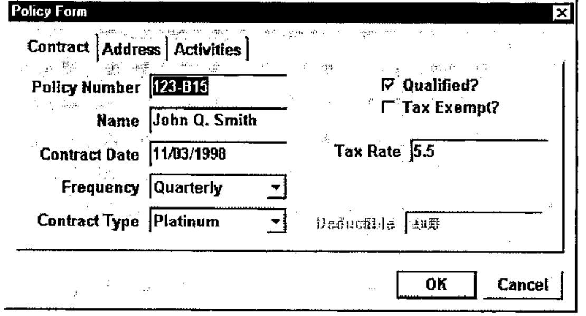
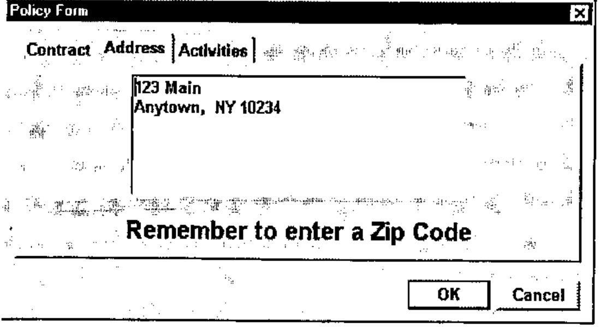
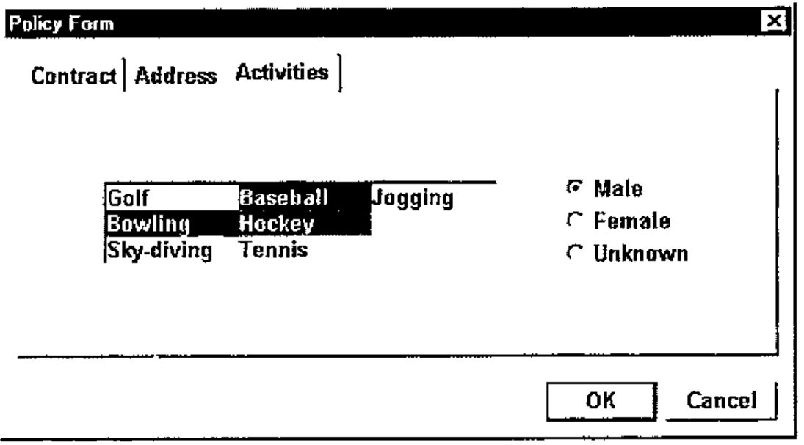

*by Gary A. Bergquist*
{ .byline }

*This paper was presented at the APL2000 Users’ Meeting, Orlando, Nov. 1999*

**Summary:** ZarkWin is an application development tool developed in APL+Win for building Windows-style user interfaces. The mission of ZarkWin is to enable you to build user interfaces as quickly as you can design them. The author believes that a disproportionate amount of time is being devoted to implementing fancy user interfaces. ZarkWin shortcuts the implementation process by fighting fire with fire. A robust full-screen interface is used to build robust full-screen user interfaces. Naturally, ZarkWin was built with ZarkWin.

## The Concept

Experienced APL programmers tend to take for granted the magic of APL. Sure, they appreciate the power and productivity of APL, and enjoy working with it, but they don’t often stop to wonder *why* it works so nicely. Is it because of its mathematical orientation? Its symbolic nature? Its array-handling? Its immediate execution mode? Its obsessive consistency?

Yes to all of the above. But, more generally, what gives APL its glow is its similarity to a straight line: it *is* the shortest distance between two points. The two points, of course, are the start and end of the job. APL is the shortest distance from the statement of the problem to the implementation of the solution.

This is no accident of nature. Rather it is APL’s simple adherence to the laws of nature. In particular, APL abides by what we might call nature’s Law of Abstraction:

> *If you can devise a reasonable abstraction of reality (vectors, matrices, nested arrays) and of the needs of the real world (reductions, selections, sorting, relations, inner products), you can design a mechanism (symbols, arguments, results, operators, defined functions, immediate execution mode) that allows you to solve real world problems rapidly because of the direct translation from reality to the mechanism, by way of abstraction.*

In other words, the more closely the mechanism reflects the characteristics of the problem, the more rapidly you can solve the problem.

## The Reality

Frankly, I miss the days when the user interface was implemented in APL like this:

```apl
[1]   'Enter name:'
[2]   NAME←⍞
[3]   'Enter age:'
[4]   AGE←⎕
```

There was no excess baggage. You could implement the "user interface" as quickly as you could imagine it.

No longer.

Now we talk about classes, properties, styles, events, and so on. We converse in a jargon that has nothing whatsoever to do with NAME and AGE. We become intimately familiar with a system function named `⎕WI`, which has a vast syntax and which is pronounced "Quad-we" (as in, "We submit") but which should be pronounced "Quad-why" (as in, "Why me?"). Clearly, the line from problem to solution is not a straight one.

Don’t get me wrong. I don’t think `⎕WI` should be abolished. On the contrary, since we live in a world of Windows, and since `⎕WI` is our doorway into the jungle of Windows functionality, such a mechanism is a necessity. It’s just not a necessity I want to look at every day. It’s too tedious. Using `⎕WI` slows me down and detours me from the straight line.

Instead, we should let `⎕WI` be the foundation upon which our straight-line abstraction is built. Just as APL is built in assembler, or C, or whatever other language is currently appropriate for implementing APL in the real world, let our tools be built in `⎕WI`. But let’s begin the design of these tools by evaluating the user interface at a higher level, from the point of view of what we want it to do, not from the point of view of the system-level functions available to do it.

## The Plan

Compared to the simple interfaces of yesteryear, such as the quote-quad and quad code above, the user interfaces of today are quite complex. They look so much nicer and do so much more. This is great for the user but is a major headache for the programmer.

The concept of defining an interface via a function editor is inadequate. With a function editor, you take these steps:

1. Imagine how the form should look.
2. Translate that picture in your mind to the needed commands, and type them into the function editor.
3. Run the application, or at least the interface part of it, to see whether the commands are doing what you want.
4. If it’s not quite right, return to step 1 and repeat.

While these steps get the job done, they are too round-about. A more direct approach is to use a visual form editor instead:

1. Imagine how the form should look compared to the form you are looking at on the screen.
2. Use your mouse to drag, click, or double-click the form into shape.

## The Design

If it is possible to edit a form, as described above, it is possible to define it. By "define," I don’t mean define it in terms of the `⎕WI` commands required to build it. I mean define it as an array of parameters that have nothing to do with *how* it will be built. For example, here are some form parameters:

- The caption on the title bar, if any;
- The colour of the form;
- The font used on the form;
- Whether or not the form can be resized by the user and, if so, how the objects on the form will respond to the resizing;
- Whether the form will have menu items and, if so, what their captions and shortcut keys will be and what they will do if clicked;
- What objects, such as buttons, edit fields, labels, check boxes, options, lists, and so on, will appear on the form, and where, and how they will behave.

If you are familiar with `⎕WI`, you are probably contemplating the syntax you would use to set each of these parameters.

Please don’t.

Instead, imagine yourself sitting with a user as he describes the desired form. With a piece of paper in front of you, make a sketch of the form and annotate it with all the necessary details. Once you have the form’s complete specifications in front of you, design a nested array that contains all of these specifications. For example, the first item can be the form’s title bar caption; the second item can be the form’s colour, or empty if the default colour is to be used; the third item can be a nested list of the parameters that describe each of the objects on the form, one item per object, where you define the object’s parameters any way you want; and so on.

In the process of designing this nested array, try to keep the structure general so you can use the same design for other forms. As you do this, you will find yourself making assumptions and establishing restrictions so you can keep the design simple. By simplifying, you will be limiting the capabilities of forms that can be defined within the confines of this nested structure. Nevertheless, you will likely be surprised at how few those restrictions are and how easily they can be eliminated by tweaking the design of your nested array.

Once such a nested array is documented, it is possible to write a function (using `⎕WI` of course) that constructs and presents the form defined by that array. Here’s how it would work:

```apl
zwShow formDefn
```

The argument of the `zwShow` function is the nested array that contains everything there is to know about the form. `zwShow` does the tedious work for you. It figures out what `⎕WI` calls are needed to build the form and make it respond appropriately to the various possible user actions.

Unfortunately, even with such a function, the task that remains is formidable. You must construct the nested array. Since the definition of such a nested array is non-trivial, building or modifying it will be difficult, time-consuming, and fraught with mistakes. However, it is possible to write a function that presents a set of forms that allow you to interactively modify the contents of the nested array:

```apl
zwDef 'formDefn'
```

The argument of the `zwDef` function is the name of the nested array. The argument is provided as a name rather than as the nested array itself so that `zwDef` can reassign the named variable. The aim of `zwDef` is to present the form as it is currently defined in its named argument, and to allow you to use the mouse to move form items or to trigger pop-up forms that enable you to add, delete, or modify form items.

This, then, is the design principal of ZarkWin: Design and document a nested array that can contain the definition of any conceivable (reasonable) form. From that documentation, write a function (`zwShow`) that will build and present the form, and a function (`zwDef`) that will allow you to easily modify the nested array. Once `zwShow` and `zwDef` are written, you never again need to get sucked into the intricacies of `⎕WI`. Furthermore, since forms can be held in your hand as independent nested arrays, you can easily manage them, copying them into the workspace, erasing them from the workspace, or saving each one as a file component.

## The Specifics

Up to this point in the description of the ZarkWin approach, the comments have been kept general. When the Zark folks sat down to discuss the design of the nested array form definition, specific assumptions and decisions were made. The resulting design reflects the mental model of what a form is to us. The remainder of this section describes the salient features of that model. The details of the nested array definition are too lengthy to be included as part of this paper.

### Control Objects

A form consists of a set of rectangular user controls, called "Control Objects." These objects are defined for the convenience of the ZarkWin user, and don’t necessarily correspond to APL+Win control objects. For example, a set of six options (radio buttons) and their captions can be viewed as a single Control Object in ZarkWin, though they are six control objects in APL+Win. A group of three buttons (perhaps labelled OK, Cancel, and Help) can be a single Control Object in ZarkWin, though they are three control objects in APL+Win. A set of three edit fields and their labels (say, Name, Age, and Salary) can be a single Control Object in ZarkWin though they are six control objects in APL+Win (three edit fields and three labels).

### Values and Reference Names

Each Control Object is generally defined to have a "value" and is given a reference name to refer to that value. The reference names are like APL variable names. For example, a Control Object of six options is defined to have a value that is the scalar index (origin 1) of the selected option. The reference name might be, say, DEPT or MARITAL. A Control Object of six check boxes is defined to have a value that is a six-element bit vector, flagging the boxes that are checked. The reference name might be CHKS or BITS. Here again, the ZarkWin meaning of "value" doesn’t necessarily correspond to the APL+Win meaning. This is an advantage, since you don’t have to remember whether you want the "text" property, the "caption" property, or the "value" property, as you do when working with `⎕WI`.

### Subsets

A Control Object can have "subsets." For example, suppose the Control Object whose reference name is EMP contains three edit fields labelled, respectively, Name, Age, and Salary. The "value" of EMP is a three-item nest (e.g. ‘John Smith’ 35 25000). You may provide reference names for each of the three edit fields (e.g. NAME, AGE, and SALARY), so you can refer to the value of each field individually. In this event, the fields are called "subsets" of the Control Object. If you do not provide subset names, you can still refer to the subsets one at a time by using "pick notation" (e.g. `2⊃EMP` for AGE).

### Datatype Conversion and Field Validation

When you refer to the value of a Control Object or one of its subsets, you can expect it to be in whatever form is natural for that Control Object. For example, the value of the AGE field will be a numeric scalar, even though the value is presented in what you know to be an APL+Win Edit field whose ‘text’ property is the character vector representation of the age. Likewise, the value of a date field will be an integer scalar in the form yyyymmdd (e.g. 19981103). Datatype conversions and field validations are handled automatically by the Control Objects. If the user tries to enter a non-numeric age or an invalid date, he sees an error message appear and is required to provide valid input. You do not have to do any programming to enable this datatype validation.

You do, however, have to provide validity checks that go beyond datatype validation. For example, if the employee’s salary must be under $100,000 when the employee is single and male, you must say so within the form’s definition. In ZarkWin parlance, you would say something like this:

```apl
(SALARY≥100000)∧(MSTATUS=1)∧SEX=1 ⍝ Single males can't earn
more than $100,000
```

Other than such application-specific validations, ZarkWin handles the field validation process on its own, without programming or further specification by you.

In general, the field validation process does not take place at each keystroke or when tabbing to the next field. Rather, ZarkWin waits until the form is closed.

### Closing the Form

There are two ways to close a form: the OK-close and the Cancel-close. In the former (OK-close), all field validation checks take place. If any checks fail, an error message displays, the focus moves to that field, and the form remains open. In the latter (Cancel-close), the form is immediately closed, whether or not the values are valid. The closing of a form can be triggered by a user (e.g. closing the form by clicking on the system menu), by user action on a Control Object (e.g. clicking on the button labelled "OK"), or under program control, given any condition the programmer deems worthy of closing the form.

### Event Handlers

While the aim of ZarkWin is to minimize the amount of APL programming required to implement the form, you may still include any amount of special code by providing expressions that are executed in response to various events. For example, you can provide an expression that is run after the form is constructed and just before it becomes visible. You can use this expression for any last-minute modifications to the form, such as disabling (greying out) certain fields based on the values in other fields, or for resetting lists of available choices, and so on. Another expression is run after the form is OK-closed and the fields have been validated, but just before the form is removed from the screen. You can use this expression to read the data from the form and file it or to do other processing. The result of the expression tells ZarkWin whether or not to go ahead and close the form. Likewise, you can provide expressions to be executed when buttons, or options, or checks, or list items, or menu items are clicked or double-clicked or changed, and so on. In general, the result of the expression should be 1 to have ZarkWin OK-close the form, or –1 to have ZarkWin Cancel-close the form, or 0 to leave the form open.

### Program Control of Control Objects

There are three common ways to pass values into the form, and to retrieve them back from the form.

1. Via global variables:

    ```apl
    AGE←35 ⋄ NAME←'Smith'
    R←zwShow formDEFN
    ```

    If the left argument of zwShow is omitted, zwShow uses the values of all existing global variables whose names match those of Control Objects or their named subsets. The global values are used to initialize the values of these objects on the form. Conversely, when the form is OK-closed, the form assigns the values of its Control Objects to the like-named APL variables. The result of zwShow is 0 if the form is Cancel-closed, or 1 if it is OK-closed.

2. Within expressions executed at certain events, while the form is open:

    ```apl
    'AGE NAME' ∆zw 'value' (35 'Smith')
    (AGE NAME)←'AGE NAME' ∆zw 'value'
    ```

    The first expression writes the values given in the second item of the right argument of `∆zw` to the Control Objects or subsets named in the left argument. This expression could be included in the expression that is run just before the form displays. The second expression reads from the form and explicitly returns the values of the Control Objects or subsets named in the left argument. This expression could be included in the expression that is run just before the form is removed from the screen.

    The `∆zw` function can also be used for setting or retrieving or otherwise controlling other properties of Control Objects. Its left argument is always a list (vector, matrix, or nest) of the reference names of the Control Objects or subsets being manipulated. Here are some examples:

    Grey-out the second and third subsets of the CHKS Control Object:

    ```apl
    '2⊃CHKS' '3⊃CHKS' ∆zw 'enabled' 0
    ```

    Set the choices for the COLORS Control Object to Red, Green, and Blue:

    ```apl
    'COLORS' ∆zw 'list' ('Red' 'Green' 'Blue')
    ```

    Make the SALARY Control Object invisible; make the DEPT Control Object visible:

    ```apl
    'SALARY DEPT' ∆zw 'visible' (0 1)
    ```

3. Via arguments and results:

    ```apl
    N←'AGE NAME'
    R←(N ('value'(35 'Smith'))) N zwShow formDEFN
    ```

    When the left argument of zwShow is provided, it has two items. The first item is a nest with an even number of items. The first item of each pair is a suitable left argument to `∆zw`; the second item is the corresponding right argument. These pairs are passed to `∆zw` by zwShow prior to displaying the form. When the form is OK-closed, the zwShow function explicitly returns the values of the Control Objects named in the second item of its left argument. The result of zwShow is the scalar 0 if the form is Cancel-closed, or is a vector of Control Object values if it is OK-closed.

    The result of zwShow is empty (`0 0⍴0`) if the form is presented non-modally, i.e. if processing continues without waiting for user interaction.

### ZarkWin Implementation

The behaviour of each ZarkWin Control Object is defined entirely by a single pre-defined APL function. For example, the function `zw∆Buttons` defines how sets of Buttons will behave; `zw∆Checks` defines how groups of check boxes will behave. These functions are written to respond appropriately to a variety of possible arguments. Such functions always begin with `zw∆` (e.g. `zw∆List`, `zw∆Options`, `zw∆Form`, …). If certain Control Objects are not needed in a particular application, the corresponding functions may be erased from the workspace. Likewise, new Control Object functionality comes from simply copying in the new `zw∆___` functions.

### Parents and Children

Some Control Objects can contain other Control Objects. For example, the Control Object known as a Selector can contain Control Objects known as Pages. Likewise, Pages can contain any Control Objects except Pages, including Selectors. A Control Object that can contain other Control Objects is called a parent. The Control Objects contained within a parent are called children. A form is always considered a parent.

In general, children inherit certain traits from their parents. For example, the colour and font style used by the text on a Control Object is the same as that of its parent unless you specify otherwise. Likewise, if a parent is disabled (greyed out) or made invisible, all of its children are disabled or invisible. If an input field on a Control Object is modified, the parent of the Control Object is also considered modified.

Parent Control Objects have reference names, just as their children do. The "value" of a parent is a nest of the values of its children. As such, you may set or retrieve all of the values of the children Control Objects of a parent by referring to the parent’s reference name.

### Groups

One of the most interesting of the parent Control Objects is the Group. A Group is defined as a set of Control Objects that are each positioned relative to one another. For example, suppose we have a Group that contains three Control Objects. The first is a large-font bold label; the second is a set of three one-line edit fields centred below the label and separated from it by two lines; and the third is a set of two buttons centred below the one-line edit fields and separated from them by three lines. The Group derives its size from the sizes and relative positions of its children.

What makes Groups interesting and powerful is that they remove much of the burden of placing Control Objects on the form. For example, suppose you decide to decrease the size of the big bold label mentioned above. After doing so, you will probably have to move the other two objects to maintain the aesthetics of the form. However, if all three objects are "glued" together as children of a Group, when one object changes size or shape, the others quickly hop into place to maintain their relative positioning (e.g. "centred and below by two lines").

Groups can contain any Control Objects as their children except Pages (since only Selectors can have Pages), including other Groups or Selectors.

Because of a Group’s ability to keep its children automatically positioned to look good, it is not uncommon for a Form or Page to contain all its Control Objects in a single Group. Once that Group is defined, it is then natural to want the Form or Page to derive its size from the size of the Group, being just large enough to contain its children. When this is the case, you can take a shortcut by simply declaring the Form or Page to be an "implicitly grouped" Form or Page. Then, you don’t have to define an explicit Group. Instead, you place the Control Objects directly on the Form or Page and define their relative positioning. The size of the Form or Page is automatically derived from its children.

### Resizing

By specifying the type of border a form has, you can determine whether or not the user can "resize" the form by dragging its borders. Forms that can be resized may have any one of the following "resize behaviours:"

- *Remain* – The Control Objects on the form stay the same size and remain at the same location (from the upper left hand corner of the form).
- *Stretch* – The Control Objects, including any text, grow or shrink in height and width by the same proportions the form grows or shrinks. This can result in short-fat or tall-skinny objects.
- *Grow* – The form maintains the original proportion of its height to its width. For example, if the user makes the form 50% wider and 30% taller, the width of the form snaps back to just 30% wider. The Control Objects, including any text, grow or shrink by the same proportion in both directions.
- *Keep Centred* – The Control Objects remain the same size and the same relative distance from one another. As the form grows or shrinks, the extra space is added or subtracted from both edges of the form equally.
- *Realign* – The Control Objects realign themselves independently in any way they see fit. For example, the Buttons might remain the same size and distance from the bottom right edge of the form, while the List, Tree, or Multi-line Edit objects might grow to allow more lines/columns to display. The text sizes do not change, in general.

## Miscellaneous

ZarkWin functionality tends to expand as APL+Win provides additional Windows functionality and as users demand more from their user interfaces. Here are some additional ZarkWin capabilities:

- **Status Bar support.** A status bar can be requested at the bottom of a Form. The status bar may be defined to include CapsLock, NumLock, and/or ScrollLock panes, which are placed to the far right and which use the text ‘Caps’, ‘Num’ and ‘Scroll’. In addition to these panes, you can define the status bar to contain any number of standard panes, one of which can be designated to display a different message when the focus is located in each Control Object. In addition to CapsLock, NumLock, ScrollLock, and standard panes, you can enable an "overlay" pane which (temporarily) replaces the entire status bar and which you can use, for example, to display messages that tell the user the status of lengthy processing.
- **Shortcut keys.** Within a ZarkWin form, you can define any number of "shortcut" keys. For each specified keystroke (e.g. Ctrl-T or Ctrl-Alt-R), you can provide an APL expression.
- **Context-sensitive help.** You may provide a "help" document for each Control Object on a form. If the user presses F1 or Ctrl-H, the help document for the Control Object that currently has the focus is displayed in a pop-up window.
- **Menu bar.** ZarkWin allows you to easily construct a menu bar of arbitrary complexity. The menu items can be checkable or not, enabled or not, visible or not, can have shortcut keys or not, can have associated APL expressions or not, and can be changed dynamically at will.

## Illustration

Suppose we want to implement the following input form:







With ZarkWin, the first step is to name each of the input fields. Let’s use the following names:

| | |
|---|---|
| PNUM | Policy number (character vector) |
| NAME | Policyholder name (character vector) |
| CDATE | Contract date (yyyymmdd) |
| FREQ | Payment frequency (1=Monthly, 2=Quarterly, 3=Semiannually, 4=Annually) |
| CTYPE | Contract type (1=Premium, 2=Gold, 3=Platinum) |
| CHKS | [1] Qualified? (1=Yes, 0=No)<br>[2] Tax exempt? (1=Yes, 0=No) |
| RATE | Tax rate as a percent (*if* not tax exempt), e.g. 5.5 |
| DED | Deductible amount in dollars (*if* a Gold contract) |
| ADDR | Policyholder address (newline-delimited character vector) |
| ACTIV | Activities (vector of any of these: 1=Golf, 2=Bowling, 3=Sky-diving, 4=Baseball, 5=Hockey, 6=Tennis, 7=Jogging) |
| SEX | Sex (1=Male, 2=Female, 3=Unknown) |

The second step is to write a companion function for this form. The purpose of the function is to gather the needed information for the initial presentation of the form, to present the form, to handle any other call-backs from the form, and to save any changes made to the information by the user. If the information displayed on the form is being saved on file, it is the job of this function to read it from the file when presenting the form, and write it back to the file when the form is OK-closed.

The following is a typical companion function for the above form:

```apl
    ∇ Z←L POLICY R;ACTIV;CHKS;D;DATA;RATE;SEX;T
[1]   ⍝ Presents the "Policy" form.  Used like this:
[2]   ⍝    formPOL POLICY 'Go'
[3]   ⍝ Other right arguments are callbacks:
[4]   ⍝    POLICY 'Exempt'     if Exempt check box is clicked
[5]   ⍝    POLICY 'Contract'   if Contract Type is clicked
[6]   ⍝    POLICY 'ErrChk'     for error chks when OK-closed
[7]   ⍝
[8]   ⍝ Branch by right argument:
[9]    →('Go' 'Exempt' 'Contract' 'ErrChk'∊⊂R)/L1,L2,L3,L4
[10]   ⎕ERROR 'Unknown argument'
[11]  ⍝
[12]  ⍝
[13]  ⍝ Initial call; read data from file; present form:
[14]  L1:'8 DATAFILE' ⎕FSTIE 9 ⋄ DATA←⎕FREAD 9 1 ⋄ ⎕FUNTIE 9
[15]   T←'PNUM NAME CDATE FREQ CTYPE CHKS RATE DED ADDR ACTIV SEX'
[16]   D←(T ('value' DATA 1)) T zwShow L ⍝ 1=Trigger onClicks
[17]   →(D≡0)/0 ⍝ Exit if Cancel-close; else file data:
[18]   '8 DATAFILE' ⎕FSTIE 9 ⋄ D ⎕FREPLACE 9 1 ⋄ ⎕FUNTIE 9 ⋄ →0
[19]  ⍝
[20]  ⍝
[21]  ⍝ Click on 'Exempt'; make tax rate invisible if exempt:
[22]  L2:'RATE' ∆zw 'visible' (~'2⊃CHKS' ∆zw 'value')
[23]   →Z←0 ⍝ 0=Don't close form
[24]  ⍝
[25]  ⍝
[26]  ⍝ Click on 'Contract'; enable Deductible only if type 2:
[27]  L3:'DED' ∆zw 'enabled' (2='CTYPE' ∆zw 'value')
[28]   →Z←0 ⍝ 0=Don't close form
[29]  ⍝
[30]  ⍝
[31]  ⍝ Error checks at OK-close:
[32]  L4:(CHKS RATE ACTIV SEX)←'CHKS RATE ACTIV SEX' ∆zw 'value'
[33]   Z←'RATE:10% is the maximum rate' ⋄ →((RATE>10)∧~2⊃CHKS)/0
[34]   Z←'SEX:Only males play hockey' ⋄ →((SEX≠1)∧5∊ACTIV)/0
[35]   Z←'' ⋄ →0 ⍝ Empty if all is well
    ∇
```

The final step is to construct the form as a nested array. This process is begun by typing: zwDef ‘formPOL’. Then click, drag, and type until the form looks right.

To run the application, type: formPOL POLICY ‘Go’.

## Final Comments

This the fourth generation of ZarkWin. While the software continues to evolve, it seems to have reached its final form. As such, it has become everything we hoped for, and more. Our aim was to develop a tool that can be used to implement a user interface in something comparable to the time it takes the user to define and describe it. In other words, we wanted to be able to sit with our fingers poised over the keyboard as the user describes the desired interface. While we knew we could never return to the simple and speedy development of the quad/quote-quad interface, we nevertheless wanted to return to a time when we could wait for the user to make up his mind, rather than the user waiting for us to "program" the interface.

We also wanted to bury our Windows programming knowledge as deeply as possible within sub-functions, so we could purge if from our brains and go back to being the APL programmers we prefer to be.

With ZarkWin, we’re pretty close.
