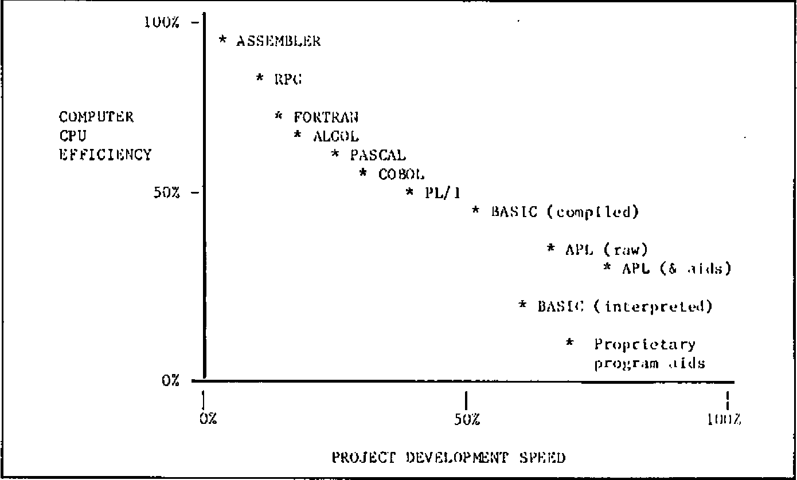

Robert Bittlestone
{ .byline }

## What is APL?

APL is a general purpose computer language that many people have heard about relatively few use, at least compared to languages such as BASIC or COBOL. It has a reputation for being rather mathematical, for using funny symbols that look incomprehensible, and for attracting a lunatic fringe of dedicated converts who turn their back on using any other language. Computer experts say that it breaks all the rules in the book; it has no control structures, it has a bewildering number of ways of doing the same thing; it encourages anarchic programming; it’s the “marijuana in the programmers’ garden”; its a “mistake carried out to perfection”.

Why then do people use it at all? The answer is very simple. In nearly all the cases I have seen where APL can be used instead of another language, it generally cuts project development time down dramatically. Jobs that typically take several weeks in other languages are developed in a few days in APL. If that kind of productivity is of interest to you — and if you would like to know how APL suppliers are reacting to the (in some cases justifiable) complaints about APL by “civilising” the language — read on.

## Packages vs. Languages

If you have a job that you think would benefit from computerisation, then you have a set of decisions to take which I have tried to summarise in Figure 1. Your first action is to determine whether a suitable package exists or whether you need to develop something specific. You may know that your needs are so specialised that no package is likely to have been developed for them, or you may have surveyed the marketplace already and determined that the packages which are available are unsuitable. Let me just say in passing that APL itself is not a package (although packages can themselves be written in APL) and consequently if you can find the right package “off the shelf”, you probably won’t have to get involved in the choice of language anyway. I might perhaps add that if there is any possiblity of having to modify a “standard” package, the rest of the chart may have some bearing on the ease of such modification.

So you’ve decided to develop something specific. Will you write it within your department, will you contract the job our to the data processing department or other external team , or will you use a mix of internal and external people? The problem with contracting jobs out in their entirety is that you are the one who know broadly what you want to be done, whereas the outside people only know how the computer works. To quote a price they have to analyse your sytem. This is not straightforward because your needs are most unlikely to be well defined at this stage — at least they shouldn’t be. Many observations of this principle at work led me some years ago to coin the following aphorism:

> “The requirements of a project are a result of the experiences you gain during its implementation.”

If this is true for you, I think you’re likely to find it difficult or impossible to specify your needs in advance. It may be quicker and more efficient for you to consider spending the time and money (whether real or as an internal charge-out against your departmental budget) that you were going to allocate to the outside team on training your own people on how to use the computer instead. Let the transfer of information go the other way for a change. Let yourself be the one to ask all the questions this time. That way your department will acquire very valuable skills which will be useful for all sorts of future jobs.

*Fig.1 — Packages vs Languages*

![Flowchart. Project to be computerised: either Use existing package (Can you find a suitable package? Yes: Test it before you buy it! No: develop instead) or Develop specific solution, by one of Develop solution yourself in-house, Use both inside & external staff, or Put the job out to a contract (Negotiate tough terms etc.). The first two lead to Choose your programming language by trading off fast project development against CPU efficiency, with three outcomes: High machine efficiency, slow project development; Medium machine efficiency, medium project development; Low machine efficiency, fast project development](art10001000/packages-vs-languages.png)

*Fig.2 — The Programming Language Trade-off*



A mix of in-house and external staff can be a very useful compromise. Instead of using the external people to write the whole system, you employ them to design the “architecture” of the computer suite and to train your own team on how to write the programs themselves. That way you don’t get a large bill for many man-months of project development. You also find that your own people can maintain the system, make modifications and add new features to the system without incurring any more costs.

## Efficiency vs. Flexibility

Now you have to choose what kind of programming language to use. Your choice may of course be restricted by what’s on offer on the hardware that is to be used — but you should still take a decision based on an “ideal” set of resources at this stage. If you have to compromise, at least make sure you realise it. If instead you are expecting to acquire hardware specifically for this project, then your choice is completely unconstrained and you should certainly choose the programming language before you choose the computer.

There are really two kinds of programming language. There are Type A languages that were developed for the benefit of computers, and Type B languages that were developed for the benefit of people. Programs that are written in Type A languages take forever to develop, but once they’re finished the computer eats them for breakfast. Programs written in Type B languages get finished nice and quickly, and then give the computer a hell of a job to run them within a given space of memory, with a given allocation of CPU time and so on.

Figure 2 illustrates this proposition. The scales I use and the positioning of the languages on them are based on my own empirical experiences, not on any glossy PhD papers; you may find that people dispute the exact placing of the different languages, but most of them accept the existence of the tradeoff.

You now need to decide what’s important to you. Does it matter to your that your computers are used as efficiently as possible? That you don’t waste any more CPU (central processor unit) cycles than you need in doing each job? That a machine of a given size can run the maximum number of simultaneous users? Or do you think that the goal of fast project development and business relevance is more important than these things? Are you primarily concerned that the job is finished on time, within budget, and that the response is fast enough for the user’s needs? Will you lose sleep worrying about wasted CPU cycles? Because one thing’s for sure; you won’t get 100% efficiency and 100% flexibility in the same language.

## The Inherited Philosophy

I shall leave you to take that decision by yourself. However, you ought to be aware of the unconscious bias that almost all computer people have towards machine efficiency. Machine efficiency traditionally ranks next after cleanliness in its proximity to Godliness, and there’s a good reason. Until the late 1970’s computers were correctly viewed as large, expensive lumps of machinery whose utilisation had to be maximised. If you are planning to use a large central computer for your next job, you will undoubtedly discover that this continues to be true. The Data Processing manager has a large chart up on the wall which indicates % utilisation; everyone gets very relieved so long as it stays near 100%. If you want to be popular, try asking him (or her) the following question:

> “What % utilisation did you get on your ball-point pen last week?”

If you survive the response, remind him that when the ball-point pen was invented (for pilots flying at altitudes where fountain pens would not operate) it cost about thirty pounds (a lot of money in 1932) owing to the precision low-volume manufacture of the tiny ball-bearing in the nib. Anyone who expected to use that particular resource made sure that their ball-point pen utilisation factor was as high as possible; pens were kept in a central locked store and withdrawn under signature. However, after some years a revolution took place in which mass production techniques drove down the price of the pen to a few pence. A few diehards were still left muttering about inefficient usage of the central resource.

The point is that it now makes sense to regard the provision of extra processing power as to all intents and purposes free. If that is not the case for your own company’s data processing installation, that isn’t a reason for failing to adopt user-efficient languages like APL: it’s a reason for changing your data processing installation.

Given the advent of the microprocessor, the arguments in favour of user-efficient but machine-inefficient languages for most commercial applications have become virtually insuperable. If you don’t agree, ask yourself whether you’re arguing about the principle or merely the timing. I think you’ll find that:

> “The issue is when, not whether.”

Depending on how much change you like to embrace at any one time, you may find that by pursuing this line of reasoning you end up with some rather interesting conclusions. Some of my own are summarised in Figure 3. I shan’t comment on them here: let’s leave them as food for thought.

*Figure 3: Ten New Rules for Computer Projects*

1. Systems cannot be specified until they have been implemented.
2. No single program should take longer than a day to write.
3. There is no such thing as the end of a project.
4. If the requirement does not change, the system is not being used.
5. All systems should be physically developed in the users’ office.
6. The user is in charge of the computer project.
7. Lineprinters are forbidden.
8. Fields in files should change as frequently as records.
9. Databases were invented to employ system analysts.
10. If it moves, it will break this year. If it doesn’t — next year.

## The Three Computing Loops

In Figure 4 I have tried to set out the main steps that occur when a computer application is generated using a language organised by a “compiler”. Compilers expect to be given the whole program (or the main module anyway) at one time, which they turn into machine code (binary digits) in its entirety. This process may identify programming errors, which will be notified to the programmer, who has to go back to the program, find the problem, correct it and resubmit the program to the compiler. Depending on the size of the program, compilation may take anything from a minute to an hour or more. Any change at all in the program — even one mis-spelling on an output report — requires a complete re-compilation. I call this process “The Programming Loop”.

Once the computer confirms that the machine code version contains no errors of a “grammatical” nature, it is given the input data and it produces whatever output report it is designed to create. This process may identify errors in the input data, which I haven’t bothered to show on the chart since the solution is simply to modify the input data and run the job again. I call this stage “The Execution Loop”.

The next thing that’s probable is that the report isn’t quite the right format, or the calculations aren’t quite what was intended — in other words, there’s no error in the programming, but there’s a mismatch between the program specification and the user’s current needs. These needs may themselves have changed as a result of seeing the output. That doesn’t imply wickedness or sloppy thinking — it’s a perfectly reasonable and sensible kind of learning process. So the system analyst revises the specification and submits a new request to the programmer. I call this third activity “The System Analysis Loop”.

*Fig.4: The Programming, Execution and System Analysis Loops*


It turns out that languages exhibit intrinsically different efficiency in these three loops. Traditional languages typically maximise efficiency in the Execution Loop. However, the price that one pays for that extreme is that the Programming and System Analysis loops take a long time. Historically this didn’t matter very much, because programmers’ time was cheaper than machine time, and because users’ requirements didn’t change very often.

By contrast, the new generation of user-oriented languages such as some dialects of interpretive BASIC, some proprietary programmer productivity aids, and APL itself (particularly when enhanced with development utilities) believes that the Execution Loop is relatively unimportant, whereas the other two loops are vital. Consequently such languages are usually organised by “interpreters” rather than “compilers”. Interpreters merge the process of compilation with that of execution. The advantage is that errors can be much more precisely identified and far more quickly corrected, and that minor modifications can be introduced almost instantly without having to recompile the whole program.

The disadvantage is that in most cases the result is less efficient for the computer. In many commercial applications, this kind of efficiency loss means a response in one-tenth of a second instead of a response in one-hundredth. How do you feel about that?

Actually, APL happens to have a rather crafty way of cheating in this respect and producing results via interpretation which surprisingly often match or even surpass compiled program response. This is because a large number of frequently encountered cases are already “hard wired” into the APL interpreter on a hand-coded basis, which is generally more efficient than the result of a compilation. However, it looks too suspicious if I start trying to win all the arguments for APL, so let’s agree to concede this one. It really doesn’t matter very much anyway.

*Figure 5: The APL Workspace*

**This workspace is called FRED**

```
PROFIT                                  PROGRAM1
123 456 235 246 334 234                 [1] Do this...
                                        [2] Now do that...
SALES                                   [3] Do PROGRAM2
2345 4456 3456 3456 3457 2233           [4] Do the other...
1353 5676 2356 5677 3356 6788
3456 3356 6434 2443 3454 2356           PROGRAM2
                                        [1] Try this...
PRODUCTS                                [2]Try PROGRAM3
spangleworp Mark 3                      [3]Try again...
defibrillicator
gudgeon sprocket                        PROGRAM3
                                        [1] Last chance...
                                        [2] Give up.
```

It has variables PROFIT, SALES and PRODUCTS in it, and programs called PROGRAM1, PROGRAM2 and PROGRAM3 (they could be called anything).

Oops — it’s lunchtime, so: SAVE FRED saves all the programs and all the data on the disc, ready for me to start this afternoon with LOAD FRED to get them back again.

Hmmm — that program called SMARTONE that Joe developed the other day could be handy here. Let’s borrow it. I have permission to read his workspaces? Great: COPY JOE SMARTONE gets me a copy (leaving the original with Joe).

Ahhh — I’d like to browse through my data, looking at elements of that table called SALES as I go and changing some entries. No need to write a program: APL desk calculator mode lets me do all that as standard.

I can use all the built-in APL operations to experiment with my data in desk calculator mode. When I’ve got the sequence right, I can type them all in as lines of a program.

Subroutines? Any program in APL can be called by any other program without prior arrangement. You don’t have one big program in an APL workspace; you have lots of small ones with links between them.

## The real advantages of APL

In most of the articles about APL which I have seen, the author starts rhapsodising at this point about all the amazing symbols that exist and all the wonderful things that you can do with them. Doing wonderful things is fine, but the use of special symbols apparently dissuades as many users as it encourages, not least because a special screen or printer is required. Somewhat belatedly the APL community is waking up to this fact, and several projects are in hand to enable effective use of APL from standard non-APL screens (ASCII or EBCDIC etc.). So please don’t regard these non-standard symbols as an inherent part of the APL philosophy.

Figure 5 shows one of the APL advantages: the workspace. Until you’ve used it, you simply can’t imagine how flexible it can be. A short summary of the real benefits of APL runs as follows:

a. The Workspace
: Everything is done in the APL workspace. Even with micros, this is at least 200,000 bytes (characters) or more. Your data is independent of your programs and it can be generated and edited without using a program at all. You can save them, load them, copy all or part of them, and you develop all your programs in them.

b. Data variables
: These can be text or numeric and can have almost any “dimension”. Zero-dimensional variables contain a single number or character. One-dimensional variables are lists or “vectors”. Two-dimensional variables are tables or “matrices”, and so on, up to 8 or more dimensions if you want them. See Figure 6 for details.

c. Built-in operations
: These are numerous. All the standard arithmetical functions, all the algebraic and trigonometric ones you’re ever likely to need (plus a few more), all the comparatives (greater than etc.), the logicals (and, or etc.)… There’s a built in numeric (and usually character)sort; there’s text and numeric searching, finding minima and maxima, random number generation, array indexing and manipulation, numeric formatting, number base changes, even matrix inversion. And the great advantage is that nearly all these built-in operations apply directly to arrays of data without the need to write loops.

d. Programs
: APL programs have a unique architecture; the nearest equivalent is a little-used language called FORTH. In APL you very rarely write a long program. A given project is usually implemented by a workspace consisting or twenty or more programs. Each does some small part of the job, rather like a subroutine in other languages. But the subroutines in APL are completely freestanding and have their own identity. So a very well organised control structure emerges in APL by arranging for one program to call another to do some appropriate job. Phrases like IF…THEN…ELSE or DO… WHILE are hardly ever needed in APL; partly because loops themselves are not needed for operations on arrays, and partly because the concept of having many programs operational at one time makes these phrases unnecessary.

*Figure 6: Examples of APL Variables*

(To avoid confusing the reader and the typesetter with the traditional APL symbols, I have used a close ASCII equivalent. Various alternate forms of ASCII-type syntax for APL expressions are currently on trial by different APL suppliers and undoubtedly a standard will emerge to bring the benefits of APL to those who do not wish to modify existing hardware or acquire new terminals.)

```
    LIST 15
1 2 3 4 5 6 7 8 9 10 11 12 13 14 15

    fred_3 5 SIZE LIST 15

    fred
 1  2  3  4  5
 6  7  8  9 10
11 12 13 14 15

    fred [3;]
11 12 13 14 15

    fred [;2]
2 7 12

    fred [3;2]
12

    fred [3;2]_999

    fred [;1]_fred [;1] - 1

    fred
 0   2  3  4  5
 5   7  8  9 10
10 999 13 14 15

    joe
apples
ORANGE
tomato

    joe [;3]
pAm

    joe [2;4 5]_'CL'

    joe
apples
ORACLE
tomato
```

## Stumbling on APL via BASIC

Everyone knows the boring old joke about the Irishman who, when asked how to get from A to B, replied “I wouldn’t start from here if I were you”. It’s a bit like that if you start considering APL from a background of knowing any other language. I’m frequently asked how long it takes to master APL if you’re being trained by, for example, a computer-based APL self-teaching course. My response is always:

> “Do you already know another computer language?”
>
> “Yes — BASIC and a bit of FORTRAN.”
>
> “About a fortnight then.”
>
> “And if I didn’t”
>
> “Oh, not more than a week.”

Part of the battle if you’re already computer numerate it to:

| FORGET ABOUT: | AND START USING: |
|---|---|
| Loops | Array syntax |
| Big Programs | Small program modules |
| DATA statements | Independent variables |
| Control structures | Program nesting |
| Operations on single numbers | Operations on arrays |
| File design | Workspace operations |
| Specifying the whole system | Prototyping techniques |
| Sequential processing | Parallel processing |
| Code names for data | English descriptive names |
| Accessing data from a program | Desk-calculator access |
| Integers vs. floating point | Transparent data conversion |
| Man-months | Man-days |

It gets easier after a little practice, and you’ll never look back.

## Files and Inverted Data Structures

In most languages, file design is a constant headache. You don’t seem to be able to do anything much without sitting down and specifying a whole lot of boring file formats; and once they’re fixed, they’re bastards to change. In APL you often find that you can implement a whole project without using a file at all. This is because the data that you specify starts by living in memory, and if there’s enough room and if nobody else wants to update it simultaneously, you might just as well leave it there. When you load the system each morning, you load all the data as well.

However, files certainly play their part in APL. You can create files which look just like the sort of files you get in COBOL or BASIC if you want to — the facilities are there for that sort of thing. But APL makes it delightfully easy to standardise on a so-called “inverted” (I would rather call it “transposed”) format for your files, as illustrated in Figure 5. The advantages are enormous; the example of Figure 7 should make that clear. APL can effortlessly perform the kind of job that in other languages you’d need a relational database or a context-addressable memory for. In fact in some ways APL already is a relational database.

*Figure 7: File Structures in APL*

**CONVENTIONAL FILE STRUCTURE**

```
0001  FOSTER   JOHN F.  32  ACCOUNTS  1981  16500
0002  CARTER   ERIC P.  37  SALES     1976  18900
0003  BLOGGS   CHARLES  45  H. OFFICE 1965  25000
.................................................
.................................................
.................................................
2000  TOMLINS  JULIA H. 25  RESEARCH  1982  19000
```

Files are organised by rows. Each row contains all the data on a particular person. Access is sequential or by row number or ‘key’ (ie. a nominated attribute of a person, such as Name). Requests for information such as:

“Average age where salary above 18000 and department is accounts”

require a sequential scan through the entire file with as many disc accesses as there are rows. This is measured in minutes even for files with only 2000 entries.

**TYPICAL EQUIVALENT APL FILE STRUCTURE**

```
    1      |    2     | 3  |     4     |   5    |   6
FOSTER     | JOHN F.  | 32 | ACCOUNTS  | 1981   | 16500
CARTER     | ERIC P.  | 37 | SALES     | 1976   | 18900
BLOGGS     | CHARLES  | 45 | H. OFFICE | 1965   | 25000
.......... | ........ | .. | ......... | ...... | ......
.......... | ........ | .. | ......... | ...... | ......
.......... | ........ | .. | ......... | ...... | ......
TOMLINS    | JULIA H. | 25 | RESEARCH  | 1982   | 19000
```

Files are organised by columns. Each column contains all the data on a particular attribute. Access is by column number; the whole column is read in with a single file access, and it can be scanned using APL array operations to find matches, select entries based on some criterion and so on. A question like:

“Average age where salary above 18000 and department is accounts”

requires three files accesses, for columns 3, 4 and 6, and the question will typically be answered in a few seconds.

## APL Program Development Aids

APL is good, but it’s an even better idea to employ pre-written programs in your own APL applications. There are two main types of development aid or “utility program” as they are frequently called.

There are utilities that you could write yourself if you had the time, and there are fast machine-coded added features which you probably couldn’t unless you happen to be an expert in the Assembler dialect used on your hardware. These last are usually called “auxiliary processors”, although they refer to software, not to hardware. Typical useful utility library items include:

- General purpose program development aids, data input routines etc.
- Full-screen program or variable editors
- Full-screen forms design and data entry systems
- Communication links to other computers or non-APL file formats
- Screen handling primitives for device-independent control
- Automatic documentation facilities
- Graphics routines for colour screens and flatbed plotters
- Specialised file access routines for specific purposes
- CAI (computer-aided-instruction) APL self-teaching programs
- Spreadsheet “front-end” modules for use under APL control
- Specialised interfaces for on-line inter-user communications
- Printer handling features such as spool queue management

APL suppliers differ in their ability to supply this kind of library software. Furthermore the APL interpreters themselves, although adhering for the most part to a common language ‘core’ defined by IBM, differ considerably in terms of the number of optional enhancements that they provide. Of course, most APL users don’t require every APL facility that’s ever been thought of, but it’s surprising how quickly a user matures to a point where a feature such as programmed error control, for example, becomes mandatory rather than desirable. The moral is to shop around!

## Conclusions

APL programmers take for granted the kind of capability which leaves most other languages gasping. Not surprisingly, very few people who know APL ever become disillusioned and turn to another language. Until recently, however, APL was somewhat inaccessible to many potential users, either because of the need for a large mainframe or because of an initial reaction against its special character set. The first problem has been solved since 1981 with 16-bit microcomputer versions of APL; the second is on its way. So you really have no more excuses. Good luck and good programming!
