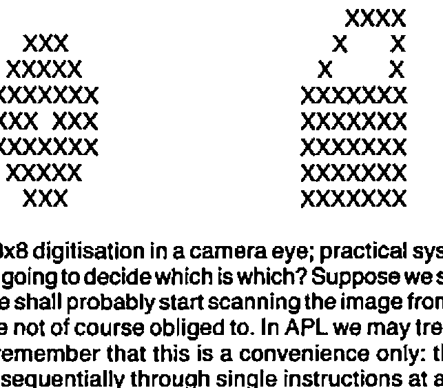
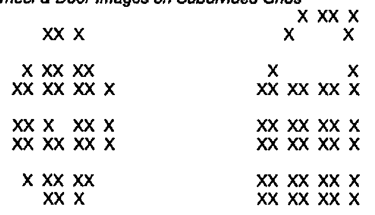
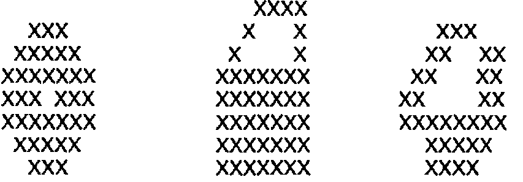

by Robert Bittlestone
{ .byline }

The first half of my title is borrowed from a recent and very remarkable book (1), written by Igor Aleksander and Piers Burnett. The reference to John von Neumann depicts our continuing and almost total dependence for almost all current computer architectures on the model which he laid down nearly 40 years ago. Ever since then we have been waiting for a radical departure from this architecture. It is now evident that Igor Aleksander has made this breakthrough, although curiously this fact is almost buried in his new book.

Such a claim demands some justification and for this I need your indulgence for a few paragraphs of background, without which the importance of Aleksander’s work cannot be conveyed. My apologies to those who are familiar with the following outline.

Why are computers made the way that they are? How are they made anyway? For those of you who have never opened the bonnet, this is the basic structure of almost all current machines:

*Figure 1: Clocked Sequential Digital Computer Architecture*

```
+----------+               +-------+               +----------+
|          |               |       |               |  INPUT   |
|  MEMORY  |= = = = = = = =|  CPU  |= = = = = = = =|    &     |
|          |               |       |               |  OUTPUT  |
+----------+               +-------+               +----------+
```

Of course there are exceptions, such as direct memory access by high data rate peripherals, but these don’t tend to change the fundamental truth, which is that at any one instant, only one thing is happening.

Admittedly the instants are very short. The most recent 32-bit microprocessor designs are expected to clock at 20 Mhz, ie. twenty million times per second. This implies one clock cycle every 50 nanoseconds, and a nanosecond is a thousand-millionth of a second. It sounds impressive, and it is. That’s the kind of approach which works well for WORDSTAR, for example, as I type at this screen. But WORDSTAR doesn’t understand anything at all about what I’m writing, and despite spelling checkers and style correctors, neither does any current assemblage of CRAY supercomputers. Nor, irrespective of the current volume of work in expert systems development, is the prospect even remotely on the horizon. Why not?

Computers are made the way they are at present primarily as a result of John von Neumann taking up and elaborating the concept of a digital clocked architecture, which was first proposed by Turing in his famous exploration of Godel’s incompleteness theorem. Godel’s theorem states, roughly, that every formal system must contain some proposition that cannot be determined within that system: in other words, a formal system cannot be closed with respect to its set of axioms and consequent proofs. Turing chose to investigate Godel’s theorem with the aid of a logical machine: an infinite strip of paper tape passing bidirectionally under a tape reader. But here was the crucial feature: the direction of the tape was determined by the pattern of the data itself. This reflects a tangled hierarchy in which objects at one level seem to reach out and interact with objects at a higher, or meta, level; objects which we do not expect them to be able to access.

At the time this was an absolutely extraordinary notion: that the same set of binary numbers could represent instructions as well as data. John von Neumann was instrumental in converting this idea into a viable specification, although those who knew Turing himself believed that had he lived longer he would have been the first to carry the concept through to reality. Unfortunately Turing committed suicide instead, almost certainly as a reaction to persecution because of his homosexuality. I suppose it is a measure of social progress that this particular fate is now becoming improbable, but in case any readers are contemplating the option sympathetically let me cheer you up instead with an anecdote about von Neumann, the leading mathematician of that era.

A female journalist at a cocktail party asks von Neumann the well-known brainteaser about the two cars and the fly. A car leaves London for Brighton travelling at a constant 80 mph. Simultaneously a car leaves Brighton for London at a steady 40 mph, and a fly, travelling at 90 mph (killer flies were a real problem in those days) leaves in the same direction. The fly encounters the Brighton-bound car somewhere on the road and immediately reverses its flight. On meeting the London-bound car again it reverses once more, and so on in an ever decreasing zig-zag until the unfortunate insect is finally crushed between the radiators of the two equally unfortunate vehicles.

“So, Dr. von Neumann, the question is, supposing the distance from London to Brighton to be 60 miles: how far does the fly fly?”

“45 miles”.

“You’re right of course, but how unusual. Most people quickly see that the cars collide after half-an-hour, and that therefore the fly must fly for the same time irrespective of his route. But mathematicians usually miss this short cut and use the much harder techniques of integral calculus to arrive at the same result.”

“But that was precisely my approach”.

Evidently there were no flies on our John. But his energy and emphasis were crucial; they defined the direction of computing from then on. Despite the work of cybernetician of the time such as Norbert Weiner, Ross Ashby and Warren McCulloch, and the subsequent explorations of their present-day counterparts such as Gordon Pask and Stafford Beer; despite even the convincing findings from neurophysiology, the issue of computer architecture was to all intents settled. The new machines worked well, and they worked even better when the invention of the transistor and subsequently the integrated circuit allowed the clumsy ferrite cores of computer memory to be replaced by bistable logic circuits. The momentum was unstoppable.

The most fervent adherents of digital architectures are now busy working on parallel processors, transputers, data flow logic and other layouts in an effort to accelerate processing yet further. So WORDSTAR will end up right-justifying a whole book in a microsecond. So what? This is not at all how our brains work. Can a machine recognise a human face? Can it penetrate a disguise? Can it detect emotion in an expression? Astoundingly, since 1981 the answer to all these questions has been yes, but the machine concerned is not a computer and it probably never will be. It is a neural net designed specifically for pattern recognition, but its components are memory chips not neurons. It is called WISARD and it is the architecture we have been waiting for. It is going to make the computer obsolete.

“Reinventing Man” is subtitled “The Robot becomes Reality” and much of the book is taken up in describing approaches to robotics, including limb movement and artificial vision. It is a fascinating mixture of down-to-earth engineering detail and an almost apologetic bouleversement of the entire computing establishment. The core is contained in Chapter 10, “The Silicon Neuron”, which I shall try to summarise.

Suppose we want a robot to distinguish between shapes on a production line. The conveyor belt contains two kinds of object: car wheels and car doors. How can we train the robot to distinguish between the two? Ignoring the question of scale and orientation, the shapes appear thus:

*Figure 2: Images of a Wheel and a Door*



This assumes 8x8 digitisation in a camera eye; practical systems are of course far larger. Now, how is the robot going to decide which is which? Suppose we sit down to write a computer program to do the job. We shall probably start scanning the image from left to right and from top to bottom, although we are not of course obliged to. In APL we may treat the pixels in most unusual ways, although let’s remember that this is a convenience only: the processor which does the work is still clocking sequentially through single instructions at a time. It’s not entirely obvious how best the program should be written, except that one may make the observation that provided the shapes are always identical and each element is either on or off, the problem reduces to the trivial one of matching against a pre-specified 64-bit binary word.

But the shapes will not remain They will move around in the field of view: they will compress and expand as the camera zooms: they will be obscured as von Neumann’s fly crawls over the lens; they will, in short, exhibit the fabric of reality. Since the two shapes are topologically identical (a surface with a single hole in it), how shall the program draw the line? What is the essential closure of a door: what is the rotundity of a wheel? Suddenly we are searching for Platonic gestalts and we really aren’t about to find them in our algorithms.

And if we succeed? We have written a program, at great cost of time and effort, for one paltry distinction. We have to start all over again for separating apples and pears.

Now consider the amount of processing of this nature required by an activity that human beings perform almost effortlessly: driving a car. I can only guess at the data rate consistent with survival; let us suppose that in critical manoeuvres such as overtaking, an update of all information at least twenty-five times a second is required. This should be about right since it corresponds to the rate of persistence of vision - i.e. the cinema effect at which individual frames become continuous. Let us also suppose that only a few thousand shapes need to be discriminated each instant.

I believe I hear some of you protest at this mention of those thousands. Surely it’s just the road, the other car, a traffic light or two? But wait a minute: what’s so special about the traffic light that isn’t contained in one of the leaves of the tree you’re passing? In that split second in which motion has been frozen on the robot’s digitised eye, who is going to distinguish the boundary
of the car from the road? If we perform a first differential on the pixels of the scene - i.e. detect all contours at which a string of 0’s or 1’s in any angular direction changes, then we shall certainly find thousands of such boundaries on even a minimally resolute picture. As humans we discard the unimportant ones - and that’s the problem in a nutshell.

Supposing our computer program is surveying a three-dimensional scene of resolution 1024 points on each axis, which is typical of current medium-to-high resolution computer graphic applications, although very coarse-grained indeed by human optical standards. Supposing also that 256 levels of colour are distinguishable per picture element (pixel). The eye can actually detect far more subtle nuances of colour, but we’ll let this pass. These 256 colour levels may be represented by the permutations of 8 bits, so in computer terms the scene therefore contains 1024x1024x1024x8 bits, which is conveniently 8 Gigabits or 1 Gigabyte, a gigabyte being approximately one thousand million 8-bit characters.

All this is of course changing 25 times a second, which means a continuous data rate of 25 Gigabytes per second. Current computers cannot even read data in at speeds much above one-thousandth of this rate, and even that is for short bursts only rather than over a sustained period. Computers are of course getting faster, but even if this data rate could be matched they would be building up storage at a rate of 90,000 Gigabytes per hour, so they would soon run out of places to put it. After such considerations, to imagine that they could possibly run algorithms in real time to distinguish several thousand elemental objects is simply ludicrous. And don’t you also talk to your passengers while you’re watching the road?

The problem is not just with the computers. It is evident that the whole way of thinking about this problem in conventional digital terms is completely unhelpful. Nobody really believes that the brain is handling data like this. Digitising everything into a single serial data path and applying a single program to it is an absurdity, a classic example of the perils of reductionist thinking. We have to be sufficiently bold and brave to abandon the obsession for writing computer programs for everything. We have to be prepared to go back to school and to learn about the properties of neural nets and automata theory. We must expect that it will take some time before the benefits make the effort worth while. Meanwhile, listen to Igor Aleksander as you would have listened to von Neumann thirty years ago, at his 1956 lectures in which he squashed the options by pointing out the unarguable implications of the hardware economics of the time. If you only have valves, you had better forget about neural nets: your circuits will be too expensive.

But the pursuit of digital architectures has given us high-density RAM chips, and it looks as if this will be judged by our descendants as the serendipitous sensation of the century. Aleksander uses RAM chips, but in an utterly different way from their deployment in your friendly microcomputer. Now that we have the silicon neuron, let’s look at the kind of architecture that von Neumann might have pointed to had this been the hardware of the 1950’s.

*Figure 3: Wheel & Door Images on Subdivided Grids*



Here are the same two shapes - the wheel and the door - but each is now broken up into 16 4x4 grids. If a grid sees the pattern which it has been taught, it will fire: if not, it will fail to fire. For convenience let’s assume equal weighting per grid, so that if all 16 grids fire we score 16, and if none fires we score 0.

If we show the door discriminator a view of the wheel, a total of six grids will fire. If we show the wheel discriminator a view of the door, the answer is of course the same: an overlap is symmetric. So the wheel discriminator says that a door is six-sixteenths or 37.5% like a wheel, and vice-versa. If the same image is offered to both discriminators simultaneously and another network (not so far described) interprets the result, we are getting somewhere interesting. We have a real-time pattern analysis system that uses simultaneous majority voting among parallel elements to detect shapes that it has been taught. We also have particular chunks of neural circuitry that recognise particular objects.

What about a shape that is genuinely ambiguous?

*Figure 4: A wheel, a door and a ???*



Before you read on, try deciding for yourself which the image might be. There’s the angular slope of the door, but the cut-out at the bottom resembles that of the wheel. Well, how would Aleksander’s discriminators behave? If you count the 4x4 sub-grids you find in fact that they both score 4 out of 16, ie. 25% recognition. Interestingly I drew the picture first: the coincidence of an identical score was unplanned, although I tried to maximise the ambiguity in the drawing.

There is more, far more of course, in Aleksander’s book (I must not forget to acknowledge Piers Burnett’s achievement as a freelance technical writer in helping to bring this work to the general public). The notions of synaptic weighting and of multiple levels of neural nets cause one to realise that this simple example is just the tip of the iceberg. For those who wonder how it all started, there is a fascinating account about the progression from small beginnings at the University of Kent - the SLAMs (stored logic adaptive modules) one read about many years ago, to the present day sophistication of WISARD. Some of you may have seen WISARD briefly in action on a Horizon television programme last year, recognising Aleksander’s face despite the grimaces.

Please resist the temptation to reflect on how you could program all this in FORTRAN, PASCAL or even APL. No doubt you could. Take time out to read the book instead. It will change your life, as it will eventually change all of ours.

A final observation. In their reflection at the end of the book in the chapter entitled “The Millenial Machine”, the authors make use of personal construct theory and in particular Kelly’s work in this area (2). However attractive the theory, this seems a major betrayal of the cybernetic profundity of the rest of their opus. It seems to me that there is a wonderful opportunity here to marry their work on pattern recognition with the extraordinary advances made by Powers on the nature of perception and the multi-level character of human thought (3).

Like Aleksander, Powers takes us through designs that are empirically testable in his search for a model of the human process. Where Powers is weak - on the detailed circuitry of each stage - Aleksander is outstandingly strong. By contrast, Powers shines in the area of the grand design, the multiple levels of hierarchy required to integrate the perception of Cartesian space and to progress from low-level perception and neuromotor control through the ability to reason right up to the instinct for survival. This is a region in which Aleksander has not yet trodden, or if he has he is keeping the results to himself. But Powers’ own model of speech recognition fits Aleksander’s nets so beautifully that one almost suspects collusion. I have referred to Powers’ work in more detail elsewhere (4) and it would be magnificent if the marriage of these two relatively little-known innovators’ extraordinary accomplishments provided the ultimate synthesis.

## References

(1) Reinventing Man: The Robot becomes Reality, by Igor Aleksander and Piers Burnett. Kogan Page 1983.

(2) The Psychology of Personal Constructs, by G.A.Kelly. Norton, New York, 1955.

(3) Behaviour: The Control of Perception, by W.T.Powers. Wildwood House, 1973.

(4) XPL: A Framework for Expert Systems In APL, by R. Bittlestone. VECTOR Vol. 1 No. 2, pp.65-72. Oct. 1984 (BCS).
