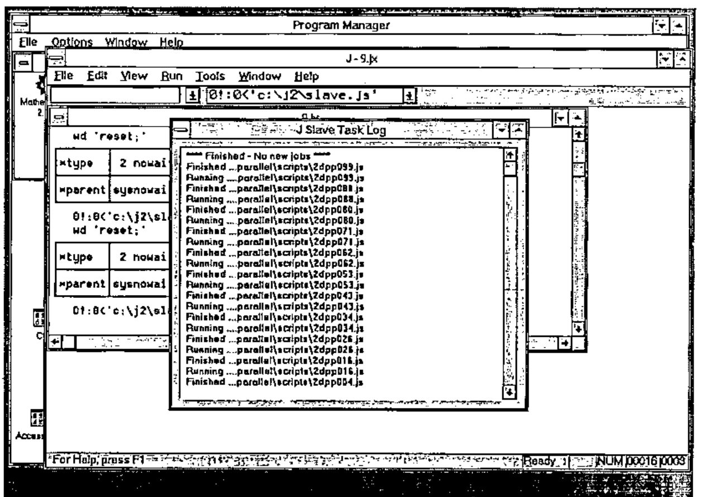
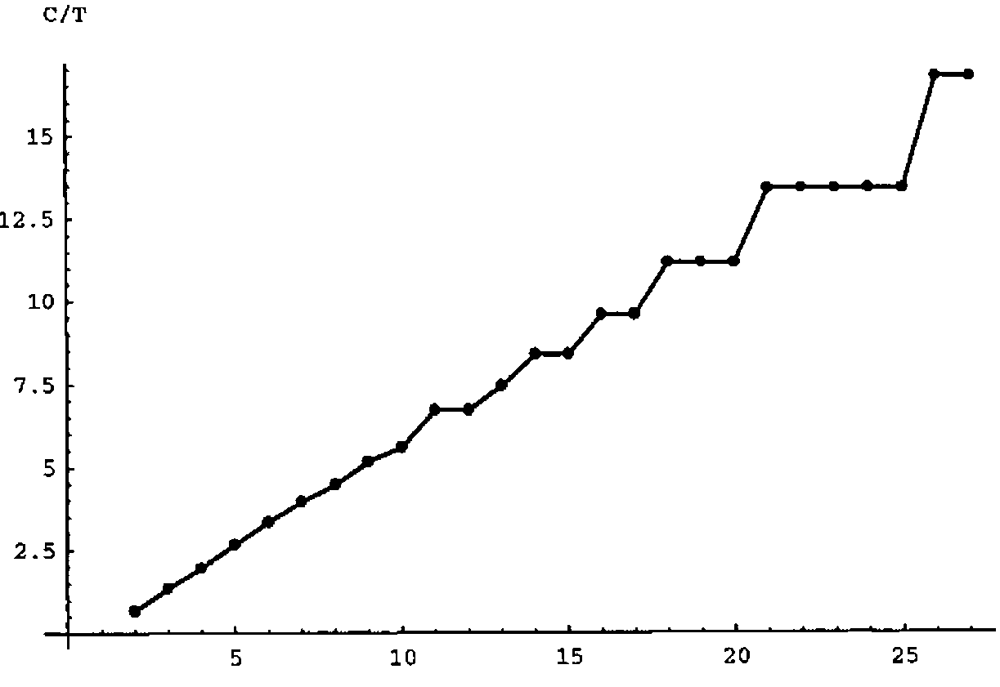
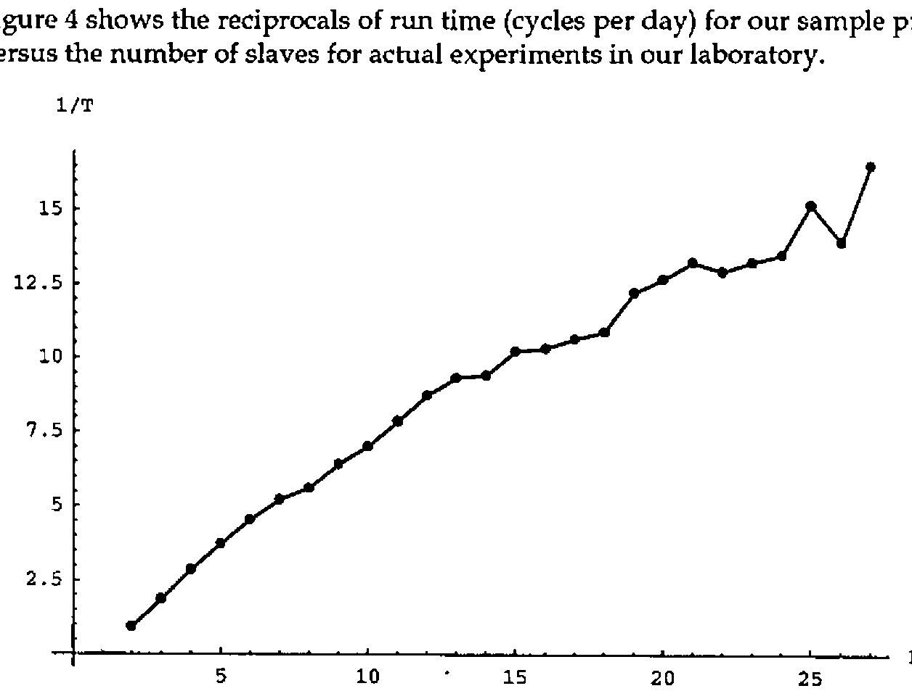
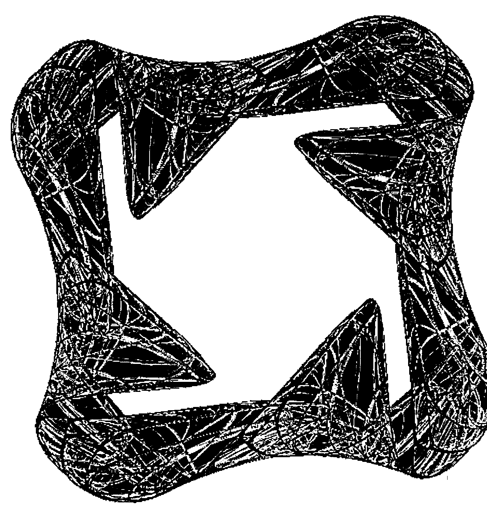

*by Gabriel F. Brisson and Clifford A. Reiter*
{ .byline }

During the summer of 1995 a student research project at Lafayette College focused on the construction of attractors with the symmetry of the cube in 3 dimensions and later this was generalized to the symmetries of the *n*-cube in any dimension [1,7]. Experiments resulting in images of these attractors were implemented in J 2.06 [5] and run in parallel in order to be able to compute a large number of iterations in a timely fashion. This note describes the simple parallel processing scheme we used which is applicable to much more general problems.

The design of our distributed computing scheme was, of course, heavily influenced by the fact that we wanted to solve the particular problem of creating images of attractors. The study of nontrivial attractors is often traced back to Lorenz who discovered a "strange" attractor associated with a model he was using to study weather [6]. More recently there have been several examples of the construction of attractors in the plane that are forced to have certain symmetries [2,3,4]. The images they created typically showed the results of several million to billions of iterations of the functions they utilize. Since the attractors we planned to investigate were more complicated we wanted to have the flexibility of the programming language J but we expected to need to use a large number of iterations and so we planned to run the iterations in parallel in order to get results "rapidly".

In addition to scripts that ran the experiments, we developed two J scripts to accomplish the parallel computing: one that creates a "master" computer which allocates J scripts that need to be run, the second creates slaves that run the allocated scripts. Below we will describe the scripts and then we will give a performance profile that shows how the system of parallel machines worked in practice as the number of slaves was varied.

## A Simple Parallel Processing System

Our parallel processing system assumes that we can break our problem up into separate scripts and that there is a shared file system available to all the computers being used. The computers we used were all running Windows under DOS and hence the system had the full stability one would expect of that platform. We did not attempt to use any sophisticated network communication — we simply read and wrote to the shared file system in a manner that avoided conflicts and minimized the impact of a single computer crashing.

One computer is dedicated as the master computer and it simply polls certain files on the shared file system to see if any slave computer has indicated it is ready to accept a task. If so, the master assigns a script to be run to that slave. The script *master.js* is given in the appendix. Running that script creates a display window containing 30 radio buttons which are used to indicate which computers are active as slaves. The display also contains a log "stack" that indicates which tasks have been assigned to which computer and how many tasks remain to be assigned.

![The master computer’s screen: a J session with qnumslaves and allocate q, and the Master Log window with 30 radio buttons c00–c29 and a stack of messages “Computer 14 assigned ...scripts\2dpp099.js[ 0 to go.]” and so on](art10001230/master.jpg)

Note that since this is a stack, the most recent messages are on top. The main functions in the script are `createmasterlog` which creates that log window and `allocate` which is used to allocate tasks. In particular, if `tasklist` is an array whose items are character strings that are file names, then `allocate tasklist` would be the command used to allocate that list of scripts. Utilities for writing to the log stack, turning on/off specified radio buttons and giving shortened file names are also included. With this design the tasks need not be related. Moreover, the master need not be running continuously; in particular, the master can be interrupted in order to add additional tasks to the task list without interrupting other processing.

The script *slave.js* also appears in the appendix. Running this script causes the computer to indicate it is ready for a task and then it polls for a task assignment. After running a script, the slave cleans the workspace of variables defined by running the assigned task and then indicates it is ready for another task. If no new task is assigned after a designated `TimeOut` period, the slave assumes no new tasks are forthcoming and halts polling. A sample screen from a slave computer is shown in Figure 2.



Organizing our parallel computations in this way provides a fairly general scheme that was suitable for solving our problem. The biggest shortcoming was the lack of error recovery capabilities. Most of the errors we encountered fell into 3 categories.

- Numbers blew up during the number crunching: the solution was to rerun the script with new initial conditions — we automated this as needed.
- The file server filled up: we could have avoided this by testing for free space before writing to the server though one needs to consider simultaneous writes from several slaves — in practice we developed experience that allowed us to time our writing/erasures to avoid this.
- Machines hung for no apparent reason (a feature of Windows) or were turned off by careless visitors to the laboratory: this meant that a script that had been allocated was never completed. We could usually recover manually since the allocation log provided adequate information to determine what script was running when a machine was prematurely terminated. However, it would have been more convenient to have a separate ordered display of completed tasks shown on the master.

While it is possible to trap errors in this version of J, it was difficult to distinguish between different errors that would require different responses. This kind of error analysis ought to be far easier in J3.

## Performance Profile for an Application

In order to test the performance of this scheme as the number of slaves varies we selected one of the simpler images that we created and ran the same image with a varying number of slaves. In particular, the functions we want to iterate can be conveniently defined via a conjunction `H` that gives a function with certain symmetries of the *n*-cube where *n* is the number of parameters given on the right of `H`. For our test problem, we use the function `f` indicated that has the symmetries of the square.

```text
H=:2 : 0
p=.(i.!#y.)A.i.#y.                  NB. all permutations of i.n
s=.x.*_1^(1{y.)*+/@<:@:(#&>)@C."1 NB. signs of terms
k=.i.&0"1 p                         NB. coordinate keys
(+/ . *)"1&(k]/.s)@((*/ . ^)&(0 1|:k]/.p{y.))
)

f=: 1 H 1 0 + 1 H 0 1 + _0.5 H 2 1 + _0.65 H 3 2
```

Each script iterates `f` one hundred thousand times and then creates a 600 by 600 bitmap image of the attractor where colour is used to indicate the number of times each pixel is visited. Other examples of creating bitmaps and images of attractors appear in [8] though the key to efficiently doing the frequency counting (`#/.~`) required for colouring does not appear there. For this application, each script results in one of these bitmaps which are stored on the shared file system. The final result is created by adding together the arrays in all these bitmaps. Our sample project consists of 100 scripts each running 100,000 iterations (amounting to 10 million total) along with a single script that accumulates the results of all the 100 others. The 100 task scripts are created in an automated fashion and they differ from one another only in the initial seed and the file name to be used for storing the image created by that script. The accumulator is assigned as the first task and runs the entire time the project is running. Thus, we dedicate one slave to accumulating the results of the others. The accumulator times out after no new images have been created for a specified time and then creates a final image based on the accumulated results. Thus, our sample project consists of 101 scripts, one of which runs the entire time.

The timing tests we ran consisted of timing the accumulator’s run time. This is the actual time to a final image and it includes about 25 minutes required for the accumulator to time out and create the final image. The ideal situation for this type of distributed computing would be for the run time to halve when the number of processors doubled. Thus one would expect the running time to be inversely proportional to the number of processors. Alternately, this means that the reciprocal of run time (cycles or number of "runs" per unit time) would be linear in the number of processors. However, because each process takes roughly a fixed amount of time and there are 100 tasks to be distributed on the *N*-1 nonaccumulating slaves we expect performance plateaus. For example, if 100 tasks are distributed on 20 processors, each processor is expected to run 5 tasks. If 100 tasks are distributed on 21 processors, each processor is expected to run 4 or 5 tasks, but the final result needs to wait for the processors that run 5 tasks and hence there is no benefit in increasing to 21 machines.



Figure 3 shows the expected performance profile taking this into account. It shows the number of cycles (runs of the 101 tasks) per unit time versus the number of slaves, where the vertical scale is chosen to be compatible with the actual measurements described next. Notice the plateaus.

Figure 4 shows the reciprocals of run time (cycles per day) for our sample project versus the number of slaves for actual experiments in our laboratory.



One expects there to be noise in the data since we had no control over network loading from other users (though we tried to mitigate this by running our experiments during holidays). Nonetheless, there is some evidence of plateaus and a roughly linear appearance though one might also observe some general concave down appearance that would be expected from network overloading. We take this performance profile to be surprisingly close to the optimal model shown in Figure 3.

The results of these timing experiments, along with some additional runs, were accumulated into a single image resulting from a billion iterations. The image is shown in Figure 5. Notice the two combatting tendencies in the image: the structure of the symmetry that is preserved by 90° rotations and chaotic appearance of the underlying attractor.



## Acknowledgement

This work was supported in part by NFS REU grant DMS-9424098.

## References

[1] G. Brisson, K. Gartz, B. McCune, K. O’Brien and C. Reiter, *Symmetric attractors in 3D space*, submitted.

[2] M. Field and M. Golubitsky, *Symmetric chaos*, Computers in Physics, 4 (1990) 470-479.

[3] M. Field and M. Golubitsky, *Symmetry in Chaos*, Oxford University Press, New York, 1992.

[4] M. Field and M. Golubitsky, *Symmetric Chaos: How and why*, Notices of the AMS 42 (1995) 240-244.

[5] K. Iverson, *J Introduction and Dictionary*. Iverson Software, Inc., Toronto 1995.

[6] E. N. Lorenz, *Deterministic nonperiodic flow*, Journal of Atmospheric Science, 20 (1963) 130-141.

[7] C. Reiter, *Attractors with the symmetry of the n-cube*, submitted.

[8] C. Reiter, *Fractals, Visualization, and J*, Iverson Software, Inc., Toronto, 1995.

## Appendix

The scripts *master.js* and *slave.js* are given below. These scripts, along with scripts that can be used to duplicate Figure 5 using this parallel processing system are available in electronic form from Prof. Reiter.

```text
NB. %%%%%%%%%%%%%%%%%%%%%%%%%%%%%%%%%%%%%%%%%%%%%%%%%%%%%%%%%%%% NB. The script
master.js
NB. Create the master log and prepare to allocate tasks
NB. Modify flagpath to point to a shared file system directory
NB. %%%%%%%%%%%%%%%%%%%%%%%%%%%%%%%%%%%%%%%%%%%%%%%%%%%%%%%%%%%%

flagpath=: 'j:\users\mathlab\parallel\flags'
fmt=:2&fmt : (({&'0123456789'@(] #:~ [ # 10"_))
flags=:(flagpath,'\flag'),"1 (fmt i.30),"1 '.txt'
NS=:30  NB. number of slaves

delay=:6!:3
shortfn=. 0&shortfn : ([: }:@; -@>:@[ {. <;.2@(,&'\')@])

log=: 3 : 0
logtext=:' ',y.,CRLF,logtext
if. 20000<#logtext do. logtext=:_1000}.logtext end.
wd 'psel Gabe;csel thelog;ctext "',logtext,'";'
)

createmasterlog=: 3 : 0
wd 'reset;' wd 'pco Gabe;pcloseok;'
wd 'pn "Master Log";'
ids=. fmt i. NS    NB. button numbers
pos=.":,. 5*i.NS   NB. button positions
wd ,'xywh 1 ',"1 pos ,"1 ' 50 5;cc c',"1 ids,"1' button
                                       bs_autoradiobutton;'
wd 'xywh 25 4 200 150;cc thelog edit es_multiline ws_vscroll;'
wd 'pas 0 0;pscale;pmove 200 0 200 300;pshow;'
logtext=:''
log y.
)

hitbutton=: 3 : 0
1 hitbutton y.
:
wd 'csel c', (fmt y.), ';ccheck ', (fmt x.) ,';pshow;'
)

allocate=. 3 : 0
log 'Seeking Slaves'
n=.0
while. (#y.)>0 do.
  status=.fread n{flags
  if. 'ready'-:status do.
    (>{.y.) fwrite n{flags
    hitbutton n
    log 'Computer ',(fmt n),' assigned ...',(1 shortfn >{.y.),'[
                                  ',(":<:#y.),' to go.]'
    y.=.}. y.
    end.
  if. 'quit' -: status do. 0 hitbutton n end.
  n=. NS|>: n
  delay 1
end.
y.
)

'test' fwrite"1 flags
createmasterlog ''

NB. %%%%%%%%%%%%%%%%%%%%%%%%%%%%%%%%%%%%%%%%%%%%%%%%%%%%%%%%
NB. The script slave.js
NB. Create the slave Log and run allocated tasks
NB. Modify first line to give each computer a
NB. unique flag file in a shared file system directory
NB. %%%%%%%%%%%%%%%%%%%%%%%%%%%%%%%%%%%%%%%%%%%%%%%%%%%%%%%%

flag=: 'j:\users\mathlab\parallel\flags\flag02.txt'
TimeOut=:60*15     NB. seconds without new job until timeout
wd 'reset;'
delay=:6!:3
shortfn=: 0&shortfn : ([: }:@; -@>:@[ {. <;.2@(,&'\')@])

log=: 3 : 0
logtext=:' ',y.,CRLF,logtext
wd 'psel Arno;csel thelog;ctext "',logtext,'";'
)

slave=. 3 : 0
logtext=:''
t=.0
namesinuse=.'status';'namesinuse';;:,names ''
wd 'pco Arno;'
wd 'pn "J Slave Task Log";'
wd 'xywh 5 5 200 150;'
wd 'cc thelog edit es_multiline ws_vscroll ws_border;'
wd 'pas 5 5;pcenter;pshow;'
log y.
'ready' fwrite flag
while. t<TimeOut do.
  status=. fread flag
  if. '.js'-: _3{.(' '&~: # ])status do.
    log 'Running ....',(2 shortfn status)
    0!:0 <status
    erase (;:,names '')-.namesinuse
    'ready' fwrite flag
    log 'Finished ...',(2 shortfn status)
    t=.0
    end.
  if. 'test'-: status do.
    'ready' fwrite flag
    end.
  delay 10
  t=.t+10
end.
log '**** Finished - No new jobs ****'
)

slave 'Running.'
```
