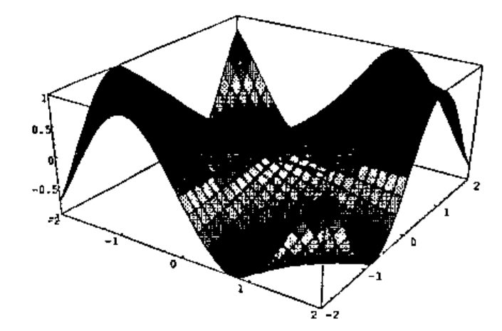
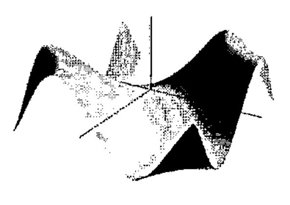

*by Chris Burke*
{ .byline }

OpenGL is an industry-standard 3D graphics and modelling library originally developed by Silicon Graphics for its high-end graphics workstations, and used for applications such as CAD, medical imaging, and film special effects.

The OpenGL libraries have been ported to Windows 95/NT and are now included with the Windows distribution. With a fast PC and graphics adapter, you can have exactly the same facilities that were once available only on expensive workstations.

J Release 3.04 provides a complete interface to the OpenGL API allowing us to create high quality 3D graphics that were simply not possible with the standard Windows GDI. To see examples of this, download J3.04 for Win95/NT from `www.jsoftware.com` and run menu item `Extras/Demos.../opengl`.

## Why Bother?

J and APL are great languages for specifying graphics output, and OpenGL provides us with a high quality 3D graphics facility for the first time on PCs.

An immediate use for OpenGL will be for the Plot system, which currently uses the Windows GDI. Plot has not yet been fully converted, but we intend to have this ready in time for APL97.

Another use is for the visualization of mathematical curves and surfaces, for which several examples are given in the J3.04 OpenGL demo. One of these examples can be seen in our ad in this Vector, showing a surface with a wood-grain texture.

## Why OpenGL?

OpenGL is widely used and supported, and available on a variety of platforms. It is one of only two such languages that can be called directly by Windows programs. The other is Microsoft’s DirectX (a.k.a. Direct3D), which has been devised specifically for game developers, but this is only available on PCs. Microsoft has its feet firmly planted in both camps, much to the annoyance of OpenGL zealots.

For us, OpenGL seems clearly the better choice - for example, we could port our interface to UNIX - but of course there is nothing to prevent us supporting any other graphics API in future.

## OpenGL System

The system is provided by various DLLs (e.g. OPENGL32.DLL, GLU32.DLL) that are included in Windows NT 3.5, and in recent Windows 95 distributions. For those with earlier versions of Windows 95, the DLLs are freely available from `www.microsoft.com`.

OpenGL has a library of core functions for 3D graphics operations. These basic functions are used to manage object shape description, matrix transformation, lighting, coloring, texture, clipping, bitmaps, fog, and antialiasing. The names for these core functions have a `gl` prefix.

Another library (GLU) has utilities to manage texture support, coordinate transformation, polygon tessellation, rendering spheres, cylinders and disks, NURBS curves and surfaces, and error handling. These functions have a `glu` prefix.

## J Interface

The J interface consists of a set of foreign conjunctions that allow direct calls to the underlying API.

The names used match the OpenGL names, except that many of the OpenGL commands have several variants differing in the number and type of their parameters, which are typically replaced by a single J function. For example, there are 30-odd OpenGL functions of the form `glColor3f` (specify colour, using 3 floating-point parameters), `glColor4ui` (use 4 unsigned integers), etc. - and one corresponding J function `glColor`, that takes care of all parameter and storage type conversions. Also, some OpenGL commands have a parameter that is a pointer to data, in which case the corresponding J parameter is given as a boxed data item.

The close correspondence between the underlying OpenGL command and the equivalent J function means that OpenGL examples, which are invariably provided in C, can be keyed directly into J. In fact the implementation was largely tested by keying in examples from the *OpenGL Programming Guide*.

All the OpenGL verbs (in fact, all windows verbs) in J have rank 1. For example, this means you can give a matrix argument to any verb, and have it evaluate each row in turn. This considerably reduces the amount of looping needed for drawing graphics.

As well as the standard `gl` and `glu` functions, there are an additional set of utilities prefixed `gla`, which provide facilities needed by the J programmer, but which are not part of standard OpenGL. For example, the function `glaRC` creates a render context for drawing into an isigraph window. These utilities, and the underlying J system, take care of most of the tedious details of creating and writing to a graphics window that have to be provided by the C programmer.

As well as the direct API facilities, the J system includes supporting utility scripts, tutorials and demos.

## Efficiency

An interesting aspect of OpenGL is that using J is almost as efficient as using C. This is because all the compute-intensive work such as lighting and hidden-surface elimination is done by the API. Moreover, OpenGL can store commands in an internal form, called Display Lists, which once created, can be reused to draw a graphic. I have compared exactly the same graphics created in J and in C, and found no discernible difference in the speed of the initial display or any subsequent redrawing.

Nevertheless, the speed of OpenGL on today’s hardware can be a little disappointing. Films like *The Lost World* give the impression that detailed graphics can be created and animated at high speed, but in practice a few seconds of film make have taken several hours to produce, even on the fastest machines.

Suppose, for example, that you draw a cube of a single colour, and switch on lighting so that its faces are properly visible (without lighting, you can only see the outline of the cube, and not distinguish each face). If the cube is displayed in a window occupying a quarter of the screen, it will appear to rotate smoothly when pressing and holding down a key that gives it a 5-degree turn. Now, maximize the window to full screen, and the cube rotation is noticeably slower and jerky. To get a smooth rotation you have to reduce the degrees turned in each key press, and therefore slow down the display even more. The bottleneck here seems to be the graphics card. The good news is that 3D graphics hardware is improving rapidly, largely in response to the availability of 3D graphics APIs for the PC.

## Display Lists

Typically, you draw a graphic by creating several Display Lists. For example, the first basic OpenGL demo creates a graphic showing a dodecahedron in a box, with the program:

```text
demo=: 3 : 0
stdlist''
drawviewbox makenewlist RED
drawdodecahedron makenewlist ''
)
```

(Here, the box is coloured red, while the dodecahedron is colored at random, since no colours were given.)

This code creates six Display Lists, the first four created by `stdlist`, which:

- initialize the viewing area
- specify the viewpoint (where the observer is)
- specify the translation amounts (movements away from the origin)
- specify rotation angles (rotations around local axes)
- draw the box
- draw the dodecahedron

You then display the graphic by running the OpenGL command `glCallLists`.

Now suppose you want to rotate the graphic. All you have to do is to redefine the Display List that specifies the rotation angles and call `glCallLists` again. This is a trivial operation for J, and is completely independent of the complexity of the graphic.

The J utilities include a paint event handler that invokes `glCallLists`. This means that the graphic is drawn automatically when the window is first painted or needs repainting.

## Double Buffering

OpenGL supports *double buffering* which allows you to draw a graphic to one buffer, while displaying the other. Then a swap command displays the new graphic instantly. This means that complex graphics are displayed at one go, and animations appear much smoother. The paint event handler therefore swaps the buffers after calling the Display Lists.

## Plot and OpenGL

OpenGL allows us to solve display problems that became apparent when creating 3D plots in our current Plot system, which uses the Windows GDI.

Actually, it is amazing what you can do with the GDI, given its primitive drawing functions. Practically all the plots in the Plot demo use only straight lines and polygons (which in Plot are always 4-sided). You can draw 3D surfaces by tessellating them into polygons, colouring by height, and then drawing the polygons in order of their distance from the observer, to allow for hidden surface elimination. Here is an example from the Plot demo (the polygons are brightly coloured by height):



Graphics of this type are typical of PC graphics systems. However, there are a number of problems with it.

In practice, surfaces are not covered with a wire mesh, but if you try to remove it (Plot command `mesh 0`), the surface looks blotchy.

Also, surfaces are not in general coloured by height, in fact are usually of a single colour. However, if you draw the plot using a single colour (e.g. Plot command `color green`), you lose all sense of shape.

Notice the axes are drawn in a box around the graphic. This is done for good reasons. Quite apart from making it easy to show the axis labels, if you tried to draw axes through the origin, it would be almost impossible to get hidden surface elimination correct. You would either see too much of the axes, or too little.

While the simple hidden surface elimination algorithm used in Plot works well for a smooth surface such as the one shown, it can go wrong and show sides that should be hidden. To do it properly, you need to examine each pixel in the display. The graphic makes no recognition of lighting. It would be very hard to set up a light source and shade the graphic accordingly.

If you wanted to rotate the graphic, then on each movement the graphic would have to be drawn in place, and the movements would be very jerky.

With OpenGL, all these problems disappear. Here is an OpenGL version, using a single colour, with lighting, and with the axes drawn through the origin.

## NURBS



The OpenGL graphic was drawn by providing a mesh of control points, then using 2D-spline interpolation to create the smooth surface. The interpolation routines are called NURBS (Non-Uniform Rational B-Splines) and are provided as part of the GLU utilities. You can adjust the interpolation by specifying the order of the spline, and the knot values that determine the influence each control point has on the surface. In practice, the default values work pretty well.

Interestingly, NURBS typically requires much fewer control points than Plot. In the examples shown, both graphics were based on a 31 × 31 matrix of control points. Plot typically needs a matrix of at least this size in order that the surface appear smooth. If instead, a 16 × 16 matrix were used, the surface would appear noticeably chunkier, and at 6 × 6, the surface loses its characteristic shape. Using NURBS, there is essentially no difference when reducing to 16 × 16, while the graphic looks good even at 6 × 6, though there is some crinkling of the surface where the curvature is greatest.

## OpenGL for APL

While we have implemented an OpenGL interface in J, it could just as well be done in APLW or APL+WIN. An enterprising programmer could probably create the interface from APL using DLL calls, though I suspect a great deal of work would be involved.

## References

The official reference is the *OpenGL Reference Manual (Second Edition)*, and the official learning guide is the *OpenGL Programming Guide (Second Edition)*; both published by Addison-Wesley. The second editions of both were released this year. The Programming Guide is highly recommended, and largely dispenses with the need for the Reference Manual. Also, the contents of the reference manual are available online, with a great deal of other OpenGL material from the SGI web page *www.sgi.com/Technology/openGL*, and the OpenGL web page *www.opengl.org*. There is an Internet newsgroup: *comp.graphics.api.opengl*.
