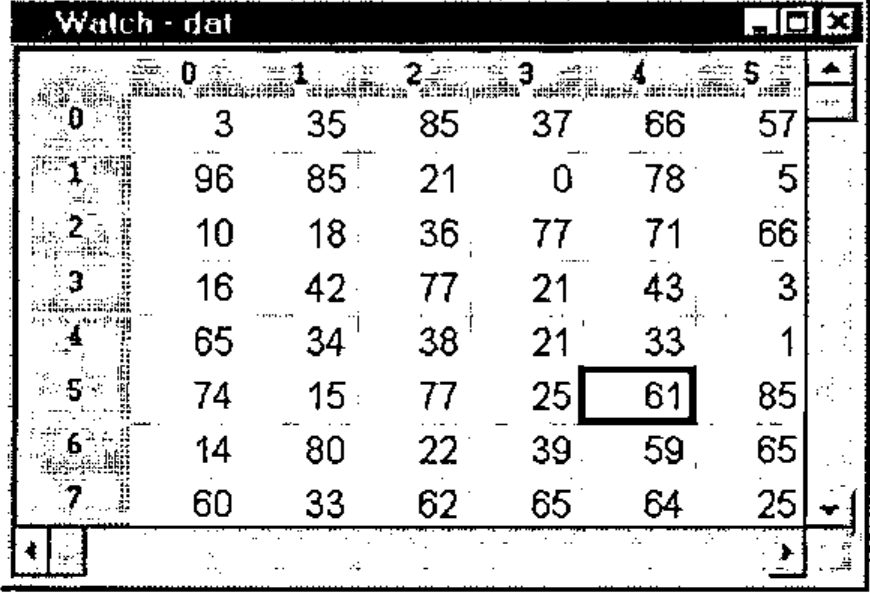
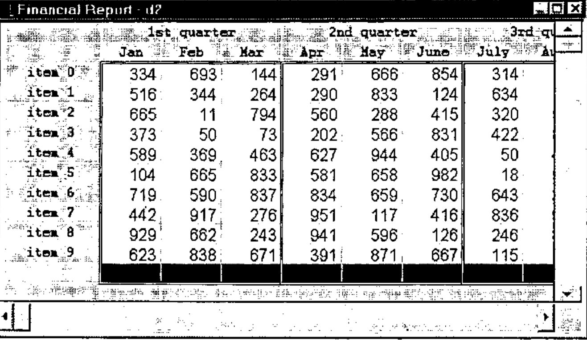

*by Chris Burke*
{ .byline }

J release 4.01 has extensions to locales that not only enhance their utility in general, but in particular make OOP easy in J.

A prime motivation for the new extensions was the development of the new Grid Control. The underlying primitives in J4 allow you to follow the OOP model exactly, as has been done for the Grid Control. However the new facilities are of general applicability, and so powerful and easy to use that we expect them to dramatically change the way we build systems in J.

For a good introduction to the ideas behind the new locale extensions and OOP, see the labs *Locales* and *Object Oriented Programming* included in the J4 system.

The design of the new locales, and the development of the Grid Control, was largely the work of Eric Iverson.

In this article, I will illustrate with a simple example, then discuss the new language facilities, and finally show how they are used in the Grid Control.

## Example: Plot Package

Let’s begin with a problem: how to create multiple plot windows with the plot package.

Suppose you draw a plot, as follows:

```text
load 'plot'
plot i.10
```

Even a simple plot like this generates a host of globals describing the plot - the labels, the axis placements and so on - in fact, about 140 of them. In J3, in order to avoid name conflicts, the code is run in a single locale, which has about 500 definitions in total for the plot system.

If you now try a different plot, with:

```text
plot sin i.10
```

this redraws the plot in the same window. The code is run in the same locale and simply overwrites the plot globals.

What if, instead of redrawing the plot, you wanted to create another plot window? In J3, you would have to load the entire plot system into another locale and run it from there; and similarly if you wanted to attach a plot to your own form.

Clearly, the use of locales helps - without them you would have to draw both plots in the same namespace - but there is unnecessary duplication of code in the two locales.

J4 permits an easy solution to this. You can still draw plots in exactly the same way as in J3, but if you want to draw two plots, you can now do so by creating two plot objects, as follows:

```text
load 'jzplot'          NB. load the plot class
                       NB. load 'plot' works just as well
                       NB. since it also loads the plot class
```

(Read jzplot as "j" meaning a J system facility, followed by "z" meaning a basic class, followed by the name "plot".)

```text
a=. conew 'jzplot'     NB. create plot object a
b=. conew 'jzplot'     NB. create plot object b
```

(The `co` prefix stands for class/object. In J, you can use the OOP term *class* to refer to the script defining the class, or to the definitions once the script has been loaded in; and use the OOP term *object* to refer to the locales created by `conew`, i.e. *numbered locales* as described below.)

```text
plot__a i.10           NB. draw plot in a
plot__b sin i.10       NB. draw plot in b
```

The objects `a` and `b` contain only the globals specific to each plot; while the main plot code is stored elsewhere, in `jzplot`. Thus J4 trivially permits more than one plot to be created, while not duplicating the main plot code.

Now, the problem solved relates only to the separate sets of globals defining the plots. But exactly the same mechanism permits customization of the code for one plot, leaving the other unchanged.

For example, the verb `drawlines` specifies the lines to be drawn; if you wanted to create a customized version for the plot in `a`, you could define, for example:

```text
drawlines__a=:         NB. new definition...
```

and this definition would be used when you next called `plot__a`.

Of course a problem of this type (creating multiple plot windows) can be solved in other ways. But the point is that in J4, it is completely trivial, whereas before, a fair amount of work would be involved in setting up a suitable mechanism.

## New Locale Facilities

There are essentially three new facilities, which are upward compatible with J3:

- the ability to create a locale, returning a reference to the locale as a result
- the ability to specify locale paths
- the ability to switch the current locale under program control

In contrast, in J3:

- locales were created automatically by defining a name in one. There was no concept of returning a result from creating a locale
- the only locale structure was that there was a single parent locale (the z locale), and a path from any other locale to the parent
- you could only switch the locale under program control, by making a name reference to that locale.

Locales in J3 had a simple definition that worked surprisingly well; and the new facilities are in turn, pretty simple, and fit nicely on top of the old structure.

I was amused to see that in my previous *Vector* article on Locales in J (Vol.11 No.4), I specifically mentioned two of the new facilities (locale paths and switching locale under program control); and said they could be provided as an extension to the current system, but seemed more trouble than they were worth! But it is just as well that we did not add them then - likely without a compelling reason such as the OOP definition of the new Grid Control, we would have got it wrong!

Now let’s see how these new facilities are used in the plot example above:

```text
load 'jzplot'
```

This loads the plot definitions from a script file. At the beginning of the script is a command to switch the locale to `jzplot`, and the plot definitions are then loaded into that locale. In J3, you could load a script into a specific locale (giving the locale name as the left argument to `load`), but in this case, it only makes sense to load `jzplot` into a locale of that name, hence it is better to specify the locale in the script itself.

In common with all new locales, the `jzplot` locale has a path that points to the `z` locale only.

```text
a=. conew 'jzplot'
```

This creates a new locale (object), sets its path to point to `jzplot` and then to `z`, and returns the locale reference in variable `a`. Locales created by `conew` have a single definition `COCREATOR`, which identifies the creator locale, but otherwise they are empty.

```text
plot__a i.10
```

The name `plot__a` (with 2 underscores) can be read "plot in a", or "plot in *indirect* a". Informally, we can talk of locale `a`, with the understanding that this is the locale referenced by `a`.

In evaluating the expression `plot__a i.10`, the system searches the locale path, finds the plot definitions in `jzplot`, and executes them in locale `a`. All global definitions created will then be defined in `a`.

Note that the name of the locale created by `conew` has not been used, only its reference. To make this clear, compare this with what you have to do in J3, where the name itself had to be used. First, you would have to create a suitable name for the temporary locale. Then to use it, you would need an execute statement, for example:

```text
a=. 'temp0'                NB. temporary locale name
". 'plot_',a,'_ i.10'      NB. execute to use the locale name
```

Clearly, the indirect reference is better!

Since, in general, the names generated by `conew` are not used directly, they are chosen to avoid any likely name conflict, and in fact are simply character representations of the integers. Thus in a new session, `a` would be `'0'` and `b` would be `'1'`. We call these *numbered locales*. The numbers are never reused in a session.

## Grid Control

The new Grid Control in J4 is for the most part written in J. The display is an *isigraph* control, and there are some extra `wd` (Window Driver) facilities to enable drawing a grid in the control.

There is a great deal of J code, and it needs to be organized. As with other facilities, it should be defined in a locale to avoid name conflicts. But it also must be easy to extend and customize; and easy to run multiple grids. The new language extensions are a natural for this, and the definition exactly follows the OOP model.

The Grid Control is more complex than Plot, in that there is much greater use of event handlers (e.g. for scrolling and keyboard entry), and we would expect a much greater customization of the basic facilities. To that end, the control is implemented in several classes.

The basic grid class is `jzgrid`, and this provides facilities that should be required for any grid, including:

> scrolling<br>
> mouse events<br>
> keyboard events<br>
> setting attributes, e.g. font, colour, border, cell size

While the `jzgrid` class could in theory be used directly (for a very simple grid), there would typically be another class on top of the basic grid class that provides a specific type of grid, for example class `jwgrid`. This would include data-related definitions such as providing formatted data for the grid and support for copying and editing. Also, yet another class is needed for the Windows form definition.

For example, provided with J4 are three specific grids:

- a Watch Control (class jwatch), to display and edit a matrix in a global variable.
- a Table Control (class jtable), that displays a function table. This grid is unlimited in size - as the grid is scrolled, new values for the grid are calculated as required.
- a Report Control (class jfreport) is a demo form that displays a report, with multi-row headers, and automatic totalling.

The following is a typical session:

```text
dat=. ?30 30$100           NB. data to be watched
load 'jwatch'              NB. load the jwatch class
a=. conew 'jwatch'         NB. creates a watch object
create__a 'dat'            NB. displays dat in the watch
```



Let’s examine what happens in detail.

```text
load 'jwatch'
```

This loads the script (class) jwatch into the jwatch locale, which in turn loads the scripts jwgrid and jinput, each into their own locale. jwgrid in turn loads the basic grid script, jzgrid. At this stage, all that has happened is that these scripts have been loaded, and the locale namelist looks like:

```text
   conl''
┌────┬─┬──────┬──────┬──────┬──────┬─┐
│base│j│jinput│jwatch│jwgrid│jzgrid│z│
└────┴─┴──────┴──────┴──────┴──────┴─┘
```

No locale path settings have been made, so each locale has a path of z, as is the case with all new locales.

```text
a=. conew 'jwatch'
```

This now creates a new locale, referenced by a and named `'0'`:

```text
   conl''
┌─┬────┬─┬──────┬──────┬──────┬──────┬─┐
│0│base│j│jinput│jwatch│jwgrid│jzgrid│z│
└─┴────┴─┴──────┴──────┴──────┴──────┴─┘
```

The new locale is empty, but has a locale path that includes jwatch and z.

```text
create__a 'dat'
```

`create__a` is called in the new locale, and gets its definition from jwatch. This verb creates a new form to display the grid, and then itself calls `conew` to create a jwgrid object and sets its path to include jwgrid and jzgrid:

```text
grid=: ''conew'jwgrid'
```

Therefore the locale list now includes two numbered locales:

```text
   conl''
┌─┬─┬────┬─┬──────┬──────┬──────┬──────┬─┐
│0│1│base│j│jinput│jwatch│jwgrid│jzgrid│z│
└─┴─┴────┴─┴──────┴──────┴──────┴──────┴─┘
```

The paths in these two numbered locales are:

```text
   copath a                NB. locale '0'
┌──────┬─┐
│jwatch│z│
└──────┴─┘

   copath grid__a          NB. locale '1'
┌──────┬──────┬─┐
│jwgrid│jzgrid│z│
└──────┴──────┴─┘
```

The structure of numbered locales is returned by `costate`:

```text
   costate''
┌────┬──┬───────┬───────────────┐
│refs│id│creator│path           │
├────┼──┼───────┼───────────────┤
│a   │0 │base   │jwatch z       │
├────┼──┼───────┼───────────────┤
│    │1 │0      │jwgrid jzgrid z│
└────┴──┴───────┴───────────────┘
```

Now suppose the mouse is clicked on one of the grid cells. The form is defined in locale `a`, so the mouse event handler `watch_grid_mbldown` will be called there. Since this locale has no event handlers of its own, the definition in the `jwatch` locale is used. This is defined as:

```text
watch_grid_mbldown=: 3 : 'mbldown__grid sysdata'
```

Therefore the actual handler called is `mbldown` in the `grid` locale, which will pick its definition up from either `jwgrid` or `jzgrid`, whichever it sees first.

At first sight, these may seem like a lot of mechanism to set up a form with its event handlers. But the point is that each of the classes loaded can be customized independently (except perhaps for jzgrid which should work for all grids). Therefore, this provides a simple and effective way of utilizing code modules in a variety of applications, and avoiding name conflicts between two instances of an application.



Example Report Grid
{ .caption }

OOP is easy in J!
