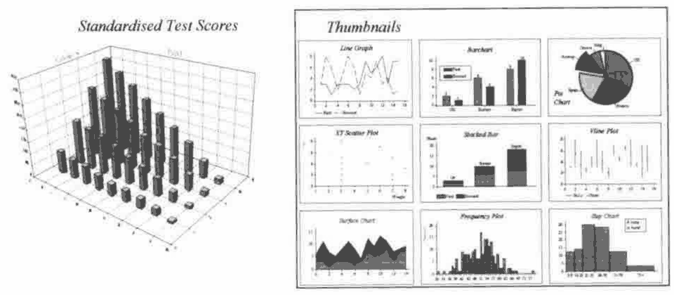
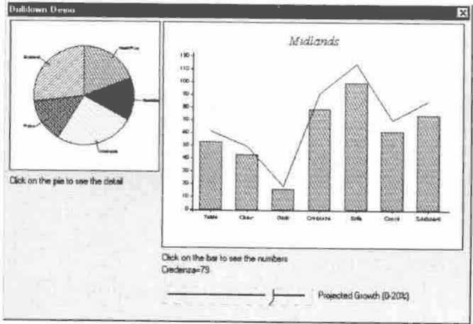
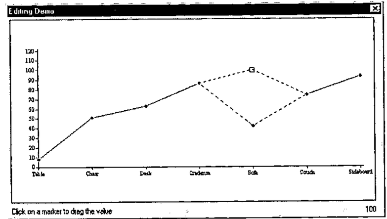

by Robert Byers (73043.1745@compuserve.com)
{ .byline }

A natural extension to data analysis is to be able to graph it. Your audience will, rightly or wrongly, be more impressed with fancy graphs than just tables of information. If this is true, hopefully, you will end up showing something useful. APL is great for data analysis but most vendors do not include a native graphics sub-system with the interpreter. If you get any graphics support it is probably not as full-featured as you need. As a result, I am willing to wager that most APLers will resort to exporting data to a graphics-only software application or a popular spreadsheet to get the job done.

So what about using APL graphics packages? There are some APL tools worth consideration. The ones I know about are AGSS (A Graphical Statistical System) and Graphpak which are available for the APL2 family, APL\*PLUS (DOS version) has some built in graphic capability and for APL/W there is Fresco from Lingo Allegro and RainPro which is the subject of this review. In a recent issue, *Vector* ran an article on a port of APL2’s AP207 and Graphpak to Dyalog APL/W. Because I am largely unfamiliar with these other packages I am unable to do a comparative review. Alternatively, if you use APL/W or APL+Win you can integrate a non-APL solution, namely one of the many OCX/ActiveX graphic tools available.

When evaluating a product like RainPro it has to fulfil many requirements and provide performance. Everybody has different needs, some of which get overlooked during the review process. Creating a list of requirements involves thinking in very specific terms about chart types, chart properties or characteristics as well as performance. RainPro fits most of my needs.

Causeway Graphical Systems Ltd. distributes *RainPro*. It was developed by Adrian Smith, one of the principal owners of Causeway, who is very familiar to most *Vector* readers. RainPro is a commercial APL add-in workspace designed primarily for business graphs. A shareware version, simply called *Rain*, ships with each copy of Dyalog APL/W.

The history of Rain dates back to 1992 and was first available for APL\*PLUS/PC . The Dyalog version first appeared in 1993 and incorporated PostScript language support. The result of PostScript was publication quality output from your Windows printer. RainPro is also available for APL+Win. RainPro made its debut in September 1996. RainPro extends Rain primarily for its 3D graphics capability, documentation and support. The current production release is 4.2. The next release 4.3 is now in beta and Adrian sent me a copy of it. I will touch on the new features in 4.3 later in this review.

In the Dyalog version, all the code is contained in two namespaces `ch` and `PostScrp`. Namespaces are a Dyalog APL/W feature that allow you to sub-divide your workspace into self-contained partitions. The benefit of namespaces really shows off with an add-in product like RainPro. Just copy the two RainPro namespaces into your workspace, and you now have all the functions required to produce high-quality graphs. Later, if you do not want to keep the code around just erase the two namespaces.

RainPro contains the functionality to satisfy most graphical needs. For example, RainPro will create any of the following types of charts: Area, Bar, Pie, Step, Line, HiLo, Gantt and a number of 3D types.

To use it effectively you must learn its syntax. To assist you, both Rain and RainPro have many examples that show the many types of graphs possible. Use these examples to learn and to get ideas to produce your own graphs. You can choose to produce graphs interactively from within the APL session or store RainPro code in defined functions. Graphs produced in RainPro can be displayed and printed using the supplied viewer function or you can integrate graphs onto an object in the Dyalog GUI. Other options include saving your variables in the workspace or in a component file. You can also export graphs to other applications in encapsulated postscript (EPS); direct PostScript; or windows metafile format.

RainPro does not come with a pre-defined GUI. You must be prepared to do some programming. If you want you can develop your own GUI front-end and use RainPro code as your callback functions as long as you acknowledge Causeway in your list of credits. Adrian warns the user about this and states: “Note that Rain is a language, and is intended for APL techies, not end-users!”

I found that learning the syntax is not difficult and can be fun as you experiment a bit with the code. Each graph is coded in the same sequence. First, you start by setting up your graph using the function `ch.Init` (*i.e.* Initialization), `ch.New` sets up the chart area, `ch.Set` sets properties, then plot the graph (*i.e.* fns `ch.Plot`, `ch.Bar`, `ch.Cloud` , `ch.Tower` ), finally finish up with `ch.Close`. This last function produces the PostScript code which you can now view or print.

Simple graphs can be created with just a few lines of code. The more detailed or complex your graph, the more code you need to write. Setting properties and positioning things like labels, notes, legends, titles, font size take the most time to get it right. Occasionally, an error happens. When it does, you usually get a number of edit windows opened of RainPro code and the error can be quite difficult to determine. Sometimes only trial and error can solve the problem. Usually the problem is simple like a statement is out of order. Bug fixes and enhancement releases are distributed from Causeway’s website.

RainPro syntax is very similar to the syntax used in NewLeaf, an APL reporting package also from Causeway. Graphs produced in RainPro are directly supported in NewLeaf. If you use both packages together, as I do, you have a powerful reporting and graphic capability from within APL.

To show how easy it is to create a graph, examine these two examples. The “Thumbnails” graph, on the right, shows the variety of graphs. Note the number of graphs you can combine on one form. The “Standardised Test Scores” graph, on the left, and function is shown below.



```
 r←Tower
⍝ Play with tower charts
⍝ Gap is set to 2×tower base with GGap here (try 0 for fun)
 ch.Set'Head' 'Standardised Test Scores'
 ch.Set('Ycap' 'Category')('Xcap' 'Pupil')('GGap' 2)
 ch.Set'Grid'
⍝ Best to get the bigger numbers to the back!
 ch.Tower⊖+\+⍀?9 4⍴20
 PG←ch.Close
 r←'View PG'
```

RainPro contains many features but non-APL solutions like OCX/ActiveX controls offer more features and functionality. Adrian would probably call most of this extra functionality chart junk and he is probably right, however, you have to make up your own mind. I have found OCXs sometimes frustrating if you cannot get the control to work properly. OCX documentation is written for Visual Basic users and you can forget about phone support if you tell them you are using APL. On the other hand, RainPro is written in and for APL.

An exciting new feature that will show up in the next release is support for event-driven code. This means that you can now write code and be able to interact with your graph once you view it on screen. I have had a brief look at a beta version of 4.3 and I like what I see. Two sample functions were provided for me to look at called `Drill` and `Edit`.



The `Drill` function shows two graphs drawn as static objects on a form. One was a pie chart – when you click on a section of the pie up popped another graph showing a combined bar and line graph with the underlying detail of the selected pie portion.

You can also drag the line up and down interactively on the combined chart with the slider bar.



The `Edit` function shows a simple line chart. You can again move the line up or down. Being able to interact with a graph narrows the functionality gap between RainPro and OCXs. This is a great new feature for doing what-if scenarios. Another new feature is to be able to display hints when the mouse pointer hovers over a graph object. Hopefully, in the final release, you will also be able to edit/change properties like legends, labels axis names etc.

What follows now is few thoughts for possible future releases. Although purposely not provided, I still would like to see a GUI interface on top of RainPro that can be integrated into `⎕SE` and therefore always available to do some simple graphs in any workspace. I remember that APL/W, version 7, distributed a sample workspace that creates a 2<sup>nd</sup> level toolbar that worked with MS Chart VBX graph control. I think it would be a good demonstration and a useful tool to modify this workspace to use Rain or RainPro code to generate these simple graphs. Graphs and statistics go hand in hand. There are many APL statistical libraries that have been produced over the years. It would be a useful add-on to RainPro to integrate a statistical library. Another possibility is OpenGL, a 3D graphic standard for scientific charting, which is gaining in popularity on Windows and is perhaps something that a future RainPro release could incorporate.

In summary, RainPro provides a solid graphics package to the APL user. If you are looking for an APL-based solution, RainPro should fit the bill. But before you buy try the (Dyalog only) shareware version, Rain. It provides plenty of functionality to let you know if RainPro is for you. For more information and to purchase, contact Causeway by visiting their web site at www.causeway.co.uk.
