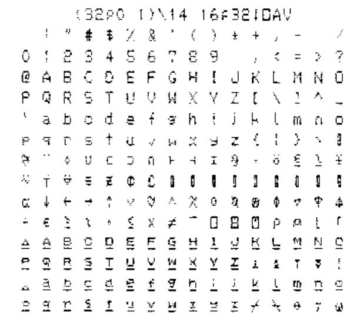
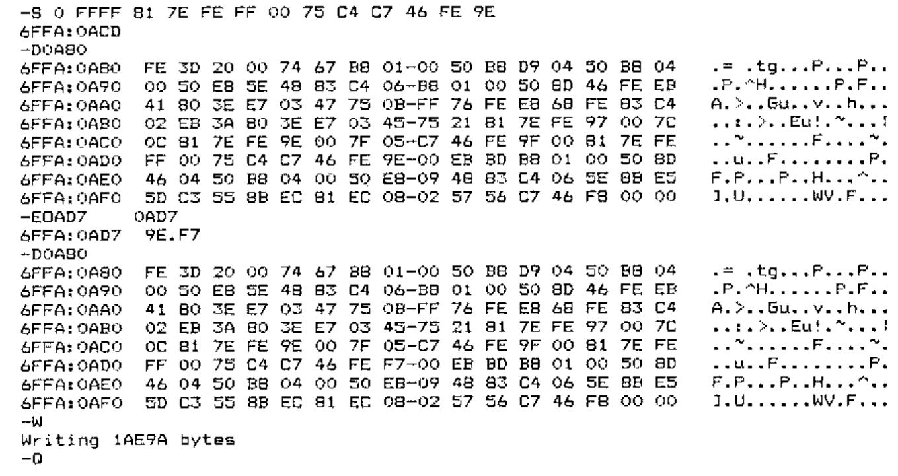

*by Anthony Camacho and Tom Goodman*
{ .byline }

This issue: how to print from I-APL/PC using graphics or download characters on a **Star LC-10**. In the next Education Vector: how to print from I-APL/BBC using graphics on a Star Radix-10.

## First the LC-10

1.  A complete solution is provided by the graphics output option.<br>
    Start I-APL with the /G option (among others maybe)<br>
    Switch on printing with `⎕HC←1`<br>
    Demonstrate it by outputting a character table with<br>
    `(32⍴0 1)\14 16⍴32↓⎕AV`<br>
    Here is the result:

    

2.  Only a limited solution is possible using downloads because the Star does not allow characters coded from 128 to 159 (inclusive) or 127 or 255 to be downloaded to.

    The experiments I did with the Star LC-10 were done with all DIP switches ON except for 2-1 which must be OFF to allow downloads to be used. The printer must be in draft mode before downloading (see manual, page 82). It is possible that other DIP switch settings may work: I haven’t tried them and they may cause complications (e.g. with the coding of the pound sign).

3.  To use downloads gives the advantage that more than one size of print may be used (but only in draft mode) and that printing is faster. For I-APL to use the download set it must be started with the /E option.

4.  I-APL provides a workspace `EPSON` with which to download characters. When this is used the underlining of the last two alphabets is not reproduced (see the I-APL manual or the graphics printout above). The last two alphabets are copied from the built-in character set using the command ‘Copy standard characters from ROM into RAM’ which is explained on page 82 of the Star manual.

5.  The workspace `EPSON` contains a variable `FONT` which consists of the numeric values of the characters required to be sent to the printer to download characters for APL. In I-APL the command `2 ⎕TX FONT` sends these values as characters to the printer without ‘interpretation’. (Interpretation means that when output is sent to the printer some characters may be used to control the process and others may be converted from an internal code to something different on output. For example on daisy-wheel APL printers the lower case letters are printed as capital letters underlined and so each is sent as ‘letter, backspace, underline’).

6.  The `FONT` variable is very easy to analyse or amend. It contains 839 codes. Here is a rough analysis of it. It is an APL vector (APL allows ‘strings’ of numbers) and below I have inserted new lines and comments for clarity.

```apl
27 64                     ⍝ Resets the printer
27 58 0 0 0               ⍝ Copies ROM characters to RAM
27 38 0 128 150           ⍝ Says download of chars 128-150 follows

⍝ Each downloaded character is sent as 12 bytes; a mode byte is
followed by 11 dot image bytes as explained in the Star LC-10
manual on pages 82 and 91.

140 80 136 20 130 81 34 20 40 80 0 0

⍝ The first downloaded character (⍒)

⍝ After 23 sets of 12:
27 38 0 158 192           ⍝ Says download of chars 158-192 follows

⍝ Later downloads are for chars 219-224 and 251-254
```

7.  So `2 ⎕TX FONT` defines all the characters needed by I-APL. It seems to define the characters permitted by the Star printer even though some of the characters specified fall outside the permitted range. After `2 ⎕TX FONT` the following APL command will print out a table replacing the control characters with asterisks (they perform actions like form feed which waste paper).

    ```apl
    (32⍴0 1)\16 16⍴(32⍴'*'),(96↑32↓⎕AV),(32⍴'*'),160↓⎕AV
    ```

    You will notice that the delete character (at the end of the eighth row) and the last character show as blanks. The characters on the two rows after the eighth would have been defined as shown in the graphics output. The only characters in this set that might be needed are the pound sign and the omega. Only the omega is essential for APL.

8.  The `FONT` tries to define the omega character in position 158 (hexadecimal 9E). This was done because difficulty was found in downloading to position 255 and so the internal code 255 is converted ‘interpreted’) on output to 158. Unfortunately 158 is not definable on the Star. To provide an omega printable on the Star LC-10 it is therefore necessary to choose another character code to be defined as omega and to change the I-APL interpretation so that instead of changing 255 to 158 it changes it instead to the code we choose. I suggest that the lower case underlined alphabet is very rarely used and that we could afford to put the omega where that alphabet has its w (code 247 or hexadecimal F7).

9.  To create a `STAR` workspace with a download `FONT` which will do this follow the steps below:

    ```apl
    )LOAD EPSON
    )WSID STAR
    FONT←FONT,27 38 0 247 247 140 28 34 0 2 12 2 0 34 28 0 0

    ⍝ It is good practice to amend the comments so in the QLX
    function delete 'EPSON FX' and insert 'STAR LC-10'

    )SAVE
    )OFF
    ```

    Now the file `IAPL.EXE` must be amended by changing the character that 255 (FF hexadecimal) is converted to from 9E to F7. The instructions below assume that you are working on I-APL/PC version 1.1 (as shown at sign on). Everyone gets a copy of `DEBUG` with DOS so I give the sequence to follow using DEBUG below. As DEBUG refuses to write back to disk a file of type EXE or HEX you must make a copy of the IAPL.EXE file with a different extension. Below I have not included disk drive letters or shown the DOS prompt which depends on the configuration of your machine. To do all this on a single drive machine you should make a disk with a copy of `IAPL.EXE` plus `debug.com` and `fc.com` and put it in the A> drive.

```text
copy iapl.exe iapl.tmp  Now we can amend iapl.tmp with debug
debug iapl.tmp          Load debug with IAPL.TMP. Debug prompts with '-'
                        the minus sign

-S 0 FFFF 81 7E FE FF 00 75 C4 C7 46 FE 9E

6FFA:0ACD               The S 0 FFFF command searches from 0 to FFFF for
                        the string of hexadecimal bytes that follow. The
                        position found is 6FFA:0ACD. The first four
                        hexadecimal characters may vary depending on where
                        debug loads itself in memory

-D0A80                  D<loc> displays the block beginning <loc>. Choose the
                        hex value ending 80 or 00 just less than the location
                        found; it will contain the 9E we want (end of search
                        string 81 7E FE FF 00 75 C4 C7 46 FE 9E).
                        This is the instruction to replace FF with 9E.

-E0AD7                  Enter E 0AD7 (the location of the 9E)<return>;
                        debug gives location and contents & waits for input
2AF0:08D7 9E.F7         Enter the new value F7 after the dot and <return>
-D0A80                  Check that the change is made in memory
-W                      At the minus W writes IAPL.TMP back to disk
Writing 1AE9A bytes     and reports the number of bytes written
-Q                      Quit debug
fc iapl.exe iapl.tmp    Use file compare (fc) to check the only difference is
                        the one we want

000009D7: 9E F7         And it is. (Incidentally if I fc iapl.tmp iapl.exe
                        fc found no difference; use something else).

del iapl.exe            Delete the original program (have you kept a copy?)
ren iapl.tmp iapl.exe   Rename the amended file
```



Now you can run I-APL with the /E option, `)LOAD STAR`, `2 ⎕TX FONT` and then proceed to load and use other workspaces which will now print everything correctly (except the pound sign).

Since writing this I have heard from W H Davies to say that his printer stops at the DEL character (ASCII 127) so it won’t print the complete `⎕AV` unless you remove this character. He also points out that the download font works if the printer is set to PICA but is imperfect if it is set to ELITE.
