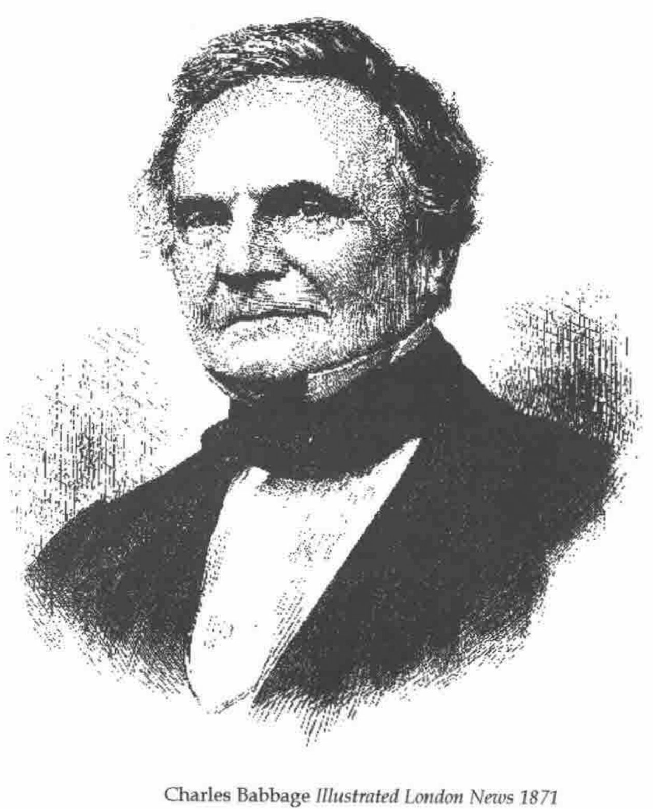

*reviewed by Anthony Camacho*
{ .byline }

The history of computing is full of dead ends and new developments that are, as Clive Sinclair would be glad to hear, a quantum leap on from their predecessors.

**Charles Babbage** *Illustrated London News 1871*

In the 18th and 19th centuries tables of any kind from logarithms to tide tables were calculated by human computers and then typeset. Many errors crept in as a result. Charles Babbage (1791-1871) was convinced that mechanical devices could be made to do the whole task, including printing out the results or producing a ‘stereo’ (a printing master) which would allow many copies to be printed of perfect tables.

I have been interested in Charles Babbage since 1960 or 1961 when I saw a replica of part of Difference Engine No 1 in the IBM offices in Wigmore Street. I saw Doron Swade’s book advertised and I had to read it. It is partly a biography of Charles Babbage with emphasis on the work on the calculating machines and partly an account of the building of a replica of Difference Engine No 2. Doron Swade was appointed curator of computing at the Science Museum in 1985 and took up a suggestion, made by Allan Bromley of the Basser Department of Computer Science at Sydney, that a replica be built as a celebration of the bicentenary of Babbage’s birth (26th December 1791).

In the 1820s Babbage worked on Difference Engine No 1 and succeeded in getting the Treasury to agree to contribute to construction of it with a first payment of £1500 in 1823. [The wages of a labourer in 1825 were the equivalent of 45 to 60 pence a week in today’s money!]

Apart from the problem of persuading people that the task was possible and worth the effort, Babbage had to solve some very difficult problems of how to make machinery reliable enough do do the task. No-one before had tried to make a thousand toothed wheels which were so similar as to be interchangeable. If the cylinder of a steam engine of the time was bored so accurately that a sixpenny piece would not pass between piston and cylinder at any point, it was exceptional. Whitworth, who first standardised screw threads, was an apprentice working for Babbage’s engineer, Clements, in the 1830s. The first toothed wheels made for Babbage came back with the wrong number of teeth! As Babbage worked he would sometimes find a better way to do something and would backtrack, changing the design to incorporate the improvement. Some marvellous demonstration pieces were made but he never finished any of the machines he designed. He didn’t pay enough attention to contracts and in 1833 and 1834 work stopped for sixteen months because the manufacturing engineer claimed ownership of the drawings and parts so far produced.

By the time the dispute was settled the Treasury had paid £17,478 towards the Difference Engine. Babbage, frustrated by having to stop work on No 1, designed No 2. Because no-one ever tried to make No 2 the drawings were complete and unmarked by use in a workshop and this was a reason for choosing this to build as a replica.

The builders soon discovered that the drawings contained designs that could never work; perhaps as an insurance against the ideas being stolen, but perhaps plain errors. They had to make many amendments before a practical replica was possible.

The early design for No 1 has six columns of 12 wheels (six twelve digit registers). By the time the dispute with Clements was settled it had seven columns of sixteen digits. Difference Engine No 2 was designed with eight columns of 31 wheels. These were both comparatively simple machines which calculated tables by adding successive differences. The Analytical Engine of the 1840s was a multi-function calculator with a program of operations on a pack of punched cards with the capacity to branch between multiple courses of processing according to results so far. It was, in principle, not far from the universality of a modern computer. Babbage thought big. One design had 100 columns of 50 wheels and a store of 1000 fifty digit numbers. If it had ever worked it would have had far greater precision and more digits in its store than the first commercial electronic computer to sell 1000 copies - the IBM 650 - which had three registers and 2000 ten digit numbers on its drum store. But the IBM 650 could transfer a number between registers in 0.96 of a millisecond, add two registers in about 7 milliseconds and the longest it could take to read a number from, or write a number to, the drum was 48 milliseconds. Babbage was aware of the need to operate the machine as fast as possible and was proud of the invention of a carry mechanism that, by ‘foreseeing’ where carries would be needed, greatly reduced the time it would take - if forty-nine wheels held a nine and were to have a one added to them it would take forty-nine times the carry time to complete the operation. Apart from this it raised great problems in keeping the rest of the machine synchronised. He reckoned that the machine would be able to do sixty additions or subtractions a minute.

Before reading Doron Swade’s book I had not realised the extent to which Babbage was engaged in polite society, giving and attending dinner parties, going to theatre and opera, entertaining and being entertained. The list of his friends reads like a who’s who of the great and the good of London society. He also, as a Fellow of the Royal Society, was acquainted with the foremost inventors, chemists, engineers of his time - for example Herschel, Sir Humphry Davy, Sir Marc and Isambard Brunel, Stevenson, Maudsley, Laplace, Fourier, Poissson.

On the other hand I did know that Babbage was an arrogant, obstinate and irascible man who grew crankier as he aged and waged a bitter war against barrel organs and noise. Perhaps, because it is so colourful, this facet of his character is over-emphasised.

When I read *Longitude* (an account of Harrison’s chronometers and how he won the prize for an accurate method of navigation with the fourth of them) I was disappointed to be told so little about the differences between the four chronometers and how each improved on its predecessor. Doron Swade is not so disappointing, but still gives too little for me. For example he does not explain how the wonderful carry mechanism works.

The last third of the book is the account of the building of the replica of Difference Engine No 2. It is a fascinating story. Swade, like Babbage, had to persuade people the job could be done, solve all manner of technical problems (with the added *anachronism* problem that no solution was allowed which could not have been used by Babbage), persuade people the effort was worthwhile and raise the money. Swade succeeded where Babbage failed.

The book ends with a 13 page bibliography. Apart from a couple of memoirs by Major General H P Babbage (his son) there is no entry between the 1860s and the 1960s. After his death Babbage and his machines were forgotten. Only *after* modern computers were well on their way did the modern enthusiasm for Babbage arise.

But Babbage did a great many other things. He invented and ran machinery for recording the state of the permanent way (a dozen pens recording on a reel of paper at 44 feet of paper per mile travelled); he invented the system of occulting lights to distinguish between lighthouses; he proposed a system of mechanical notation for describing machinery’s moving parts; he did original work on ciphers - and much besides.

In short, I recommend the book; it is well written and full of interesting things.

The Cogwheel Brain *by Doron Swade*: published by Little, Brown & Co. 2000, ISBN 0 316 64847 7.
