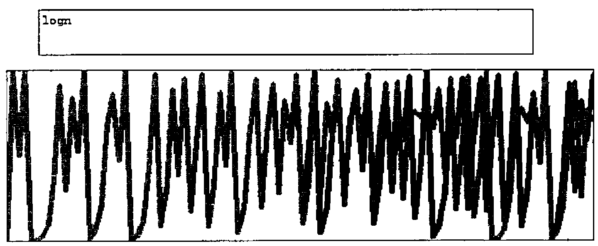

*by Sylvia Camacho*
{ .byline }

In *Chaotic Behaviour Revisited* (see Vector 11.2 p82) Gérard Langlet refers to the Verhulst or logistic equation which is commonly expressed:

<p>x<sub>n+1</sub> = kx<sub>n</sub>(1-x<sub>n</sub>) where 0 ≤ k ≤ 4</p>

Note that Langlet only quotes the equation with k = 4.

If y = kx(1-x) is plotted for values of x between 0 and 1, the graph is a parabola of a steepness determined by the value of k. If, on the other hand, one creates a vector of results by iterating the calculation for a given value of k and an initial value for x<sub>n</sub> between 0 and 1; the graph of the result vector will reduce to zero, will oscillate with varying amplitude around an average or will be apparently chaotic dependent upon the value of k. The force of Gérard’s paper is that iterated results are unreliable because the precise value calculated when multiplying the two fractional numbers x and 1-x will depend upon the number of places to which the results are worked. Any x may result in a fraction which cannot be represented in a finite number of digits but, more importantly, a computer using IEEE standard floating point arithmetic will lose significance after about the fiftieth iteration. As a consequence an expression which mathematically always gives a result of 1, if iterated on a computer, may appear chaotic and Gérard provides an example for calculating a determinant to demonstrate his point.

Gérard does not make explicit the contribution that decimal to binary conversion may make to this problem but it is easy to demonstrate by setting Quad PP to 17 (normally the maximum precision) and then entering:

```apl
7×0.5×0.2
0.5×7×0.2
0.2×7×0.5
```

which with Sharp (APLIWIN) gives three different answers. This seems to suggest that, for Sharp, multiplication has ceased to be associative. With APL\*PLUS v8, on the other hand, all three answers are the same although different from any given by APLIWIN. This, dare we call it *peccadillo*, of APLIWIN makes a very convenient laboratory to test the consequences of a difference in the 15th place after the point. I have set up functions to test this using k=4 and a starting value of x=0.51. The difference between the two result vectors exceeds the default comparison tolerance after 6 iterations and has reached 5% at iteration 50. Within 100 iterations there are examples where function *logistic* gives iteration[n] &gt; iteration[n+1] but function *logistic2* gives iteration[n] &lt; iteration[n+1]. These discrepancies are completely eliminated if the result of each iteration is rounded to 13 places after the point before calculating the next generation.

Are we seeing here the spoor of a real dragon or is Gérard just frightening us with speculative doodles in the less well explored parts of the computer-world map? Donald McIntyre has also crossed this territory and he reports feeling hot dragon-breath (see *The Perils of Subtraction* in this issue). Donald shows that iterations of 1-x will become unreliable earlier than Gérard suggests.

## The Devil is in the Detail

Chaos Theory, and in particular the Mandelbrot set, by showing that the ‘image’ is enlargeable to an unlimited extent while remaining self-similar, shows the absurdity of the continuum. It is plainly not true that the real world contains objects with the complexity of, say, the Earth of a size 10<sup>-1,000,000</sup> of the diameter of an atom. If the continuum is an inadequate model of the real world and our notation implies a continuum then our notation must be inadequate even though it is marvellously convenient for practical purposes. Mathematicians and physicists will have to re-appraise (and are already doing so) the limitations of the concept of a space-time continuum and the notation used to describe it. If new models are required of a granular space-time then, as Penrose suggests, integer arithmetic will be needed and with integer arithmetic it will be possible to program computers to calculate everything to full accuracy.

> "The normal picture that one has is that between any two points one can find others and that one can go on subdividing ad infinitum……..When you think of it this is really an absurd idea………So we have this complex continuum arising in quantum mechanics and we have the real continuum arising in the structure of space-time……..if we are going to get rid of it in the one place we have to get rid of it in the other. So I tried to develop a theory where one builds up the idea of space and of quantum mechanics simultaneously, starting from combinatorial ideas — pure counting ideas to begin with. I always have had the feeling that counting and other combinatorial concepts are more likely to lie at the root of physics than concepts which depend on the idea of the continuum."
>
> Roger Penrose in Buckley & Peat, *"A Question of Physics"* pp42 & 43, Routledge & Kegan Paul 1979.

Langlet, of course, wishes to take this argument much further and to use Integer Modulo-2 Algebra (see *Binary Algebra Workshop Foils* in Vector 11.2). Gérard has been developing this approach for well over a decade and is producing very significant results, only a small part of which are seen by the APL community. Do not be deceived by his mischievous bilingual puns; he is out there in strange country trying to charm the dragons (see Vector 11.2 Editorial *Monsieur Langlet’s Enterprise*).

The complacency with which mathematicians and physicists accept the limitations of number representation ought to be a concern to anyone using iterative algorithms. For instance, I have a textbook for final year and graduate students published in 1992 by Cambridge UP entitled *Nonlinear Systems* by P G Dazin. Not being a mathematician, I do not understand most of its 300 pages but I am disturbed by Chapter 3, *Difference Equations*, which has under the heading *Numerical and Computational Methods* the following:

> "Most computers are digital rather than analogue, using discrete rather than continuous variables. So no fixed or floating point variable, however accurate the computer is, can represent a real variable exactly. This leads to round-off errors."

This is followed by a few lines of BASIC to calculate and plot, on a y axis of 1000 ticks, successive values of x = a\*x\*(1-x). There is no code to retain the values of x calculated and the first 65 values are not plotted, although they are converted for output to a loudspeaker (audible chaos?). Presumably the later values are felt to be more spectacularly chaotic. If Gérard and Donald McIntyre are right they are anyway well beyond the reliably computable range. The suggestion that an analogue might be preferable to a digital computer in order to avoid *truncation errors* is evidence that the author assumes that an analogue computer, constructed of non-infinitely-divisible materials, can emulate an infinitely divisible space or time; ignoring the fact that infinite, infinitesimal and irrational numbers are mathematical abstractions which cannot participate in any algorithm which is required to produce a numerical value expressible in a finite number of digits.

Teasingly, Langlet has chosen to present his paper as a paradox by introducing the logistic equation as *non-linear* and then recasting it in a form which he maintains is obviously *linear*. He often makes a play on words but this is a play on mathematics. Consider the following definitions taken from James & James *Mathematics Dictionary*, ed 5 1992, Van Nostrand Reinhold NY:

> "**LINEAR**, *adj.* (1) In a straight line. (2) Along or pertaining to a curve. (3) Having only one dimension."
>
> "**linear equation or expression.** An algebraic equation or expression which is of the first degree in its variable (or variables);"
>
> "**DIMENSION**, *n.* Refers to those properties called length, area and volume….."

Well, well; this is a dragon of a different colour. None of the graphs or expressions we are talking about are linear by definition (1). The graph of the parabola is linear by definition (2) and, by definition (3) *et al*, the mathematical expressions used for the logistic equation can slither (remember dragons used to be called Worms) between *linear* and *non-linear* by a suitable application of equivalences. Interestingly the textbook from which I took the quotation about analogue computers also quotes the equivalences used by Langlet for the case of k=4 and refers to a paper by von Neumann way back in 1951 where he points out that the case k=4 is rather special because it enables us to ‘solve’ the difference equation (*Collected Works 5* (1961) ed A H Taub, pp768-70, Oxford: Pergamon). However, for a much more penetrating analysis of the issues surrounding this topic see the paper by Joseph Ford, *What is chaos, that we should be mindful of it?* in *The New Physics* ed Paul Davies, Cambridge University Press, 1989.

The logistic equation, when iterated, is an example of *feedback* and the way that this is affected by a constant multiplier. It is of interest because it demonstrates that, at certain values of the multiplier, no equilibrium is established: there is an *attractor* around which the values *hunt* but always in vain. To avoid the logical problems that arise from loss of precision the equation ought to be studied in integral form. 1-x must be expressible as an integer and so the result of kx(1-x) *must be rounded*. The equation will only apply to non-continuous phenomena: any result requiring that a woman give birth to 3.4 children is not acceptable; maybe it was 3 maybe it was 4 but, as Gérard said at APL 94, *"Nature always decides"*. The consequence is that the hunt for the attractor will be different for every different population size as well as being sensitively dependent upon the constant and the initial value of x.

I can remember as a child being impressed when I was told, "a difference in size may be a difference in kind". For instance a set of 22 people, if appropriately fit and skilled, is compatible with a game of hockey. Three people are not. Any large number of people is compatible with simultaneous games of hockey: providing the number is a multiple of 22. All numbers have a unique factorisation and for some purposes that may be a crucial *quality*.

Suppose we want to represent a no speed limit sign or a circle-bar with people. Take our 22 players and arrange them in a circle. What number of extra people do we need to draw the bar to the same ‘point-density’? Well now, what a nice number 7 would be: for 22÷7 is 3.142 and that is as near to π as the number in the player population will allow. In this case the problem is easily solved with very little inaccuracy introduced by the integers. It is important to remember as we play with the logistic equation and others connected with Chaos Theory that, however seductive the patterns may be, some applications of them are limited to integers. For example predator-prey population studies. In Chaos Theory we are investigating the *qualities* of numbers and only numbers.

The trouble with people is that they want to work in decimal notation and the trouble with computers is that they are fundamentally binary. Both notations lose precision when handling fractions and conversion between the notations exacerbates the problems. That is why Gérard is drawn to a Boolean notation to implement an algebraic calculus. That is why Integer Modulo-2 Algebra shows such promise as a way to model, without loss of information, a world full of non-continuous phenomena.

```apl
      ⎕io←0
      ⎕pp←17

      7×0.5×0.2
0.69999999999999994

      0.5×7×0.2
0.69999999999999996

      0.2×7×0.5
0.69999999999999998

      ∇logistic[⎕]∇
    ∇ r←k logistic vec
[1]   ⍝ vec is initial value, number of iterations
[2]    r←,vec[0]
[3]   l1:→(vec[1]=⍴r)↑0
[4]    r←r,k×(¯1↑r)×1-¯1↑r
[5]    →l1
    ∇

      ∇logistic2[⎕]∇
    ∇ r←k logistic2 vec
[1]   ⍝ vec is initial value, number of iterations
[2]    r←,vec[0]
[3]   l1:→(vec[1]=⍴r)↑0
[4]    r←r,(¯1↑r)×k×1-¯1↑r
[5]    →l1
    ∇

      ∇rounded[⎕]∇
    ∇ r←k rounded vec;s
[1]   ⍝ as logistic but
[2]   ⍝ rounds each generation assuming
[3]   ⍝ a maximum population of one million
[4]    r←,vec[0]
[5]   l1:→(vec[1]=⍴r)↑0
[6]    s←k×(¯1↑r)×1-¯1↑r
[7]    r←r,⍎ 9 7 ⍕s
[8]    →l1
    ∇

      ∇rounded2[⎕]∇
    ∇ r←k rounded2 vec;s
[1]   ⍝ as logistic but
[2]   ⍝ rounds each generation assuming
[3]   ⍝ a maximum population of one million
[4]    r←,vec[0]
[5]   l1:→(vec[1]=⍴r)↑0
[6]    s←(¯1↑r)×k×1-¯1↑r
[7]    r←r,⍎ 9 7 ⍕s
[8]    →l1
    ∇

      ∇integer[⎕]∇
    ∇ r←c integer vec;pop;k
[1]   ⍝ logistic but calculating in integer
[2]   ⍝ assuming maximum population of approximately
[3]   ⍝ one million or less
[4]   ⍝ c is constant for logistic equation
[5]   ⍝ vec is 0<seed population<1,
[6]   ⍝ 2*n which is maximum population size &
[7]   ⍝ number of iterations
[8]    r←,⌊vec[0]×2*vec[1]
[9]    k←⍎ 7 3 ⍕c×128
[10]  l1:→(vec[2]=⍴r)↑end
[11]   pop←k×vec[1] nextgen ¯1↑r
[12]   r←r,⌊pop÷128×2*vec[1]
[13]   →l1
[14]  end:
    ∇

      ∇nextgen[⎕]∇
    ∇ r←n nextgen pop
[1]   ⍝ assumes maximum population of 2*n
[2]   ⍝ n←20 will give max pop of 1048576
[3]   ⍝ returns max pop less current pop
[4]    r←pop×(2*n)-pop
    ∇

      ∇hicjacet[⎕]∇
    ∇ r←c hicjacet vec
[1]    r←c×((1○vec)*2)×(2○vec)*2
    ∇
```



The above graph shows vector *logm* which was created using the function *logistic* overlaid by vector *logn* created using the function *logistic2* both with k=4 and starting value 0.51. Each vector is catenated to 0,1 in order to scale the vertical axis. The display function is APLIWIN utility function `gfx ''`. The first fifty or so values are sufficiently similar for the colour of the second vector to overlay the first completely, thereafter there is a substantial discrepancy.
