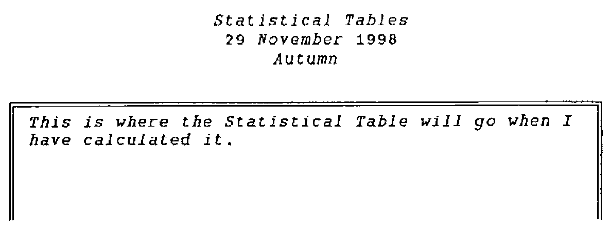

*by Sylvia Camacho*
{ .byline }

Granddaughter Gemma (2 years old) is usually full of sweetness and light but occasionally, at the second time of being told she may not have or may not do, she issues her 2-second warning:

> ‘I CROSS NOW!’

before casting herself to the ground, drumming her heels and screaming at maximum volume.

Anthony and I were not able to go to Rome this summer (two more grandchildren imminent) so I looked forward to reading *Vector* 15.1 to get a feel for how the Conference went. I was very cheered by Stefano’s upbeat Editorial and then by David Crossley’s enthusiastic account of the optimistic news in the first two Plenaries. David continued, ‘Then we had the Panel Session and a grey cloud descended.’ How well I remember that cloud from all the Conferences I have been to: a series of whines that someone must be found to blame because APL does not have a mass following. Unbidden, into my head came the 2-second warning:

> ‘I CROSS NOW!’

but at 65 years old, kicking and screaming is inappropriate. I decided that as a Grandmother with 40 years in The Computer Trade, I must write something SEVERE to go in *Vector*. Here it is.

I knew nothing of computers before 1957 when I started to work for a manufacturer. In those days choices between programming languages were easily resolved: there were no programming languages. The programmer encoded machine instructions, perhaps with the help of a mnemonic translator. The machine I first worked on was priced at £40,000 and I was valued at £500 p.a.

During the 1960s programming languages such as ALGOL, FORTRAN, PL1 and COBOL were developed and refined. IBM just missed the boat with the release of its own product PL/1 and so most mainframes were shipped with FORTRAN and COBOL. COBOL was written by the US Military and IBM was supported by the US Military. IBM could perhaps have made a commercial success of APL but only against competition from COBOL and by taking on the Academic Establishment in the teeth of the prejudice of mathematicians and IT departments.

During the 1970s machines became larger and faster without commensurate increase in price. I was trained in COBOL by my employer and learned the hard way that the requirement changes faster than the coders can work. At the end of the 70s and in the 80s I was using mainframe APL\*PLUS to give key Tesco staff interactive access to critical retail information distributed over private landlines but APL was constantly under attack for being too ‘machine hungry’ and expensive to rent. It was used only where there was support from Managers outside the Computer Department who were able to show a good return from fast development and flexible data access.

I retired a year and a bit early, in Spring 1992. I was still writing APL and earning £30,000 p.a. which would have valued the computer I started on at £2.4m at the same inflation rate. I now work freelance to support a PC-based ‘legacy’ system.

So I have been employable since 1957 despite using only COBOL and APL for ‘serious’ work. During these years I have seen many other much advertised database packages and so-called languages come ......... and go. The major selling point for all of these has been that development times will be massively reduced. In no case have I found this claim to be justified. I have seen great benefit derived from word processors, spreadsheets and mailing networks but I have yet to find staff without programming experience able to set up anything but the simplest database system.

So my question for all the whingers is, ‘What would be the advantage in making APL more like COBOL or PASCAL or PCEXPRESS or SMALLTALK or ......?’ It has already shown itself to be more durable than any of these, perhaps with the exception of COBOL. I know that the source of the frustration expressed in these recurring ‘Panel Sessions’ has nothing to do with the rival merits of programming languages. It is a consequence of the Management structure of most large and medium sized companies. Expensive mainframes came to be managed by a Computer Department commonly divided between Operations and Programming. Success for Operations is to get the maximum throughput of programs and for Programming it is to produce systems error-free, to specification and to often arbitrary deadlines. Neither has any experience in assessing value for money in terms of the work to be done by the programs and both will measure their importance in terms of their budget and number of staff. Expertise in assessing value for money is held in the various user departments which generate profits for the business but it is extremely rare for a company to make computer personnel subservient to such users. APL threatens this common management structure and the Computer Department empire because it encourages a close co-operation between programmer and user.

It would be nice to think that the astonishing reductions in price and increase in power and data capacity of PCs will at long last give the whingers their quietus but this would be to misunderstand the relationship between hardware price and programmer salary. Small employers (say £1m turnover or less) can easily afford a network of desktop machines and can make good use of word processor, spreadsheet and some graphical packages. The rub is that sophisticated systems incorporating databases can only be set up by professional programmers and their price is as high as or higher than 40 years ago. This is the challenge that ought to be addressed by Panel Sessions. If APL could be made as accessible to PC users as spreadsheets, freelancers like me would have a harder time. I have tried many times to introduce APL to those I hope will not be prejudiced by its reputation. I have had very little success. I-APL tried to popularise it in schools with a similar disappointing result. Why is it that children taught themselves BASIC when they found it distributed free on their home computers? I decided that with APL I was looking to persuade and that it would be better to imply that what I offer is simply ‘there’ for the reader or listener to take it or leave it - as is the case with a natural language: an apologetic or ingratiating tone is never going to intrigue. What follows is my latest attempt to answer the question, ‘What is APL?’. *Vector* readers, I think, will find it too verbose but why not try it out on your non-APL friends?

## Thinking, Speaking, Reading, Writing & Computing in APL

APL is a language. It is for thinking in. It can also be spoken and read and written. It is used to give instructions to a computer. Many different computers can interpret APL. Suppose I sit at a computer with an APL interpreter running. I am able to type and edit APL instructions. What will be going through my mind as I think APL?

Just now, for instance, I want to create pages of print. I have decided the paper size and the font (fixed space) I shall use so I know the maximum number of lines and the maximum number of characters per line that I can print on the page. I do not intend to calculate any other numbers in my head: I have a computer to do that.

The text for any particular page will be drawn from many different sources having varying numbers of lines and line lengths. Typically a page will have a Title above a Date above a Sub-title above a Statistical Table. I wish to arrange these components so that the horizontal centre of each is above the midpoint of all the others and the total composition is centred on the page.

I know that when I have set up an APL function to create such a result that I shall have something which can be used in innumerable other contexts for components of any number of lines and line lengths. Here I have only to think in simple terms about arranging one thing symmetrically over another thing. I need a name for this function. I shall call it COVER which I think of as shorthand for ‘Centre Over’. The Heading line of this function will read ‘R gets A COVER B’ written

```apl
R ← A COVER B
```

The next line I shall start with the comment symbol and type

```apl
⍝ R is variable A centred over variable B: SMC 4 Nov 1998
```

The comment symbol is called ‘lamp’ because comments should be illuminating.

A and B, left and right arguments to COVER, are set when the function is used. They are variables and APL variables are arrays and may contain any number of characters (or numbers) arranged in any number of dimensions. In a simple case such as COVER, A and B could be ‘V’ or ‘9’ or ‘@’ or ‘+’ or a string like ‘Statistical Tables’ or could be a matrix of rows and columns of characters such as a statistical table itself might be. The job of COVER is to find out which of A and B is wider then to put spaces on either side of the other to make it equally wide and then to put one above the other.

In APL the shape (`⍴`) of a variable is held in addition to its contents. The APL response to the instruction `⍴'Statistical Tables'` will be the number 18 because ‘Statistical Tables’ is a one dimensional object of 18 characters. However, if a variable T contains the table itself and supposing the table is a matrix of 22 rows each having 51 characters, the APL response to `⍴T` will be 22 51, this response itself being a 2-element numeric array of which one can also ask the shape. The response to `⍴⍴T` (‘what is the shape of the shape of T?’) will be 2 which is the rank of T: that is to say T is a 2-dimensional array, a matrix.

A singleton, called a ‘scalar’, has no shape but it can be redefined to have a shape. `⍴,'@'` will be 1 because `,` ravels it to be a one-element string (known as a vector) whereas `1 1⍴'@'` (read ‘1,1 reshape of at’) will turn it into a 1 row 1 column matrix.

In order to compose R, the result of COVER, both A and B must be forced to be 2-dimensional: they must be reshaped as matrices. I think or say ‘A gets negative 2 take of 1 catenate 1 catenate shape A reshape of A’. I write

```apl
A ← (¯2 ↑ 1,1,⍴A)⍴A
```

The instruction inside the parentheses takes the rightmost 2 numbers of 1,1 and `⍴A` and uses these two numbers to reshape A. Thus, if the shape of A were 18, A would be redefined as a 1 18 reshape of A: that is to say a single row matrix of 18 characters. Whereas if A were a scalar like ‘@’ so that the result of `⍴A` is null the numbers inside the parentheses will be just `¯2 ↑ 1 1` which will turn ‘@’ into a 1 row 1 column matrix as we have seen.

COVER needs to compare the width of A with the width of B. A and B have now both been reshaped as matrices so their width (number of characters in a row) is the last dimension of each. In APL this is ‘WA gets the negative 1 take of the shape of the variable A’ written `WA←¯1 ↑ ⍴A` and, of course, `WB←¯1 ↑ ⍴B`. So what is the difference in width between A and B? Obviously it is WA-WB.

If WB is greater than WA the response to WA-WB will be negative. This is inconvenient so I shall use the absolute value of this number, written `|WA-WB`. This is the number of spaces we must add to the width of the smaller of A or B, half to the left hand side and half to the right hand side which is `(|WA-WB)÷2` but the difference may not be an even number and so the result may not be a whole number. If so we must be content with a slight asymmetry and put one less space at either the beginning or end of the rows of the smaller matrix. So we write

```apl
N←⌊(|WA-WB)÷2
```

which is read ‘N gets the floor of the absolute value of the difference between WA and WB divided by 2’ where ‘floor’ gives the next integer less than the result of the division. If instead I choose to write

```apl
N←⌈(|WA-WB)÷2
```

N will be the value of the integer next above the result (the ceiling, naturally). The extra space will then come on the left.

This is the point at which the function must decide which variable width is to be enlarged. The test is simply WA>WB to which APL will respond 1 if it is true and 0 if it is false. The action consequent on the test is written `→(WA>WB)↑L1` which reads ‘Go to label L1 if WA is greater than WB’. By default, if WA≤WB the next instruction to be obeyed is taken from the next line.

The instructions on the line labelled L1: begin by transferring A unchanged to the result R. Then the width of B is adjusted to equal the width of A by adding trailing spaces to all its rows. N of these trailing spaces are then rotated (`⌽`) to the left hand side of B and the new B is catenated to the bottom of R. As always with APL the fact that the shape of the variables can be queried is crucial to the method of adjusting the shape of B. Being a matrix B has a shape of two elements, number of rows, number of characters (columns). The number of rows is to remain the same so this is `1↑⍴B` but the number of columns must match A and this is `¯1↑⍴A`. Therefore, to make width A match with B we write

```apl
((1↑⍴ B), ¯1↑⍴A)↑B
```

where `↑B` is read ‘take of B’. Thus the whole action is

```apl
 L1: R←A
R←R⍪(-N)⌽((1↑⍴ B), ¯1↑⍴A)↑B
```

The default where A is less than B is similar

```apl
 R← (-N)⌽((1↑⍴A), ¯1↑⍴B)↑A
 R←R⍪B
→0
```

where go to zero ends the function.

The function which I have written is therefore as follows. I would not normally include quite so many lines of comments. WA, WB and N are named in the Header line which means they are localised variables which are only included in the symbol table so long as the function is open which is from when it is invoked until its last instruction is complete or until `→0`. This has the advantage that the same variable names can be used in other functions. Variable names may be long and meaningful: there are no reserved words in APL. Below an example of the function in use follows the print of the function itself.

```apl
∇ R←A COVER B;WA;WB;N
[1]  ⍝ R is variable A centred over variable B: SMC 4 Nov 1998
[2]  ⍝ force A and B to be matrices
[3]   A←(¯2↑1,1,⍴A)⍴A
[4]   B←(¯2↑1,1,⍴B)⍴B
[5]  ⍝ get widths A and B and floor of half the difference
[6]   WA←¯1↑⍴A
[7]   WB←¯1↑⍴B
[8]   N←⌊(|WA-WB)÷2
[9]  ⍝ if width A greater than width B go to L1
[10]  →(WA>WB)↑L1
[11] ⍝ R gets A as wide as B with N of its trailing spaces rotated left
[12] ⍝ B is then catenated beneath R and the function ends
[13]  R←(-N)⌽((1↑⍴A),¯1↑⍴B)↑A
[14]  R←R⍪B
[15]  →0
[16] ⍝ R gets A, B is made as wide as A with N trailing spaces rotated left
[17] ⍝ B is then catenated below R
[18] L1:R←A
[19]  R←R⍪(-N)⌽((1↑⍴B),¯1↑⍴A)↑B
    ∇
```

Now test it out. *BOX* is a function which does just what you might expect it to do.

```apl
   T←BOX 22 51⍴(22×51) ↑ 'This is where the table will go when I
have calculated it. '
   PAGE←'Statistical Tables' COVER '29 November 1998' COVER
'Autumn' COVER T
      ⍴PAGE
27 51
```

This is a somewhat narrow page: if I want a wider one I can play a very pretty trick.

```apl
      PAGE←(0 78⍴'')COVER PAGE
```

What I have done is to centre over *PAGE* an empty variable of zero lines and 78 columns thus forcing the page width to be 78 while leaving the number of rows unchanged.

```apl
      ⍴PAGE
27 78
```


