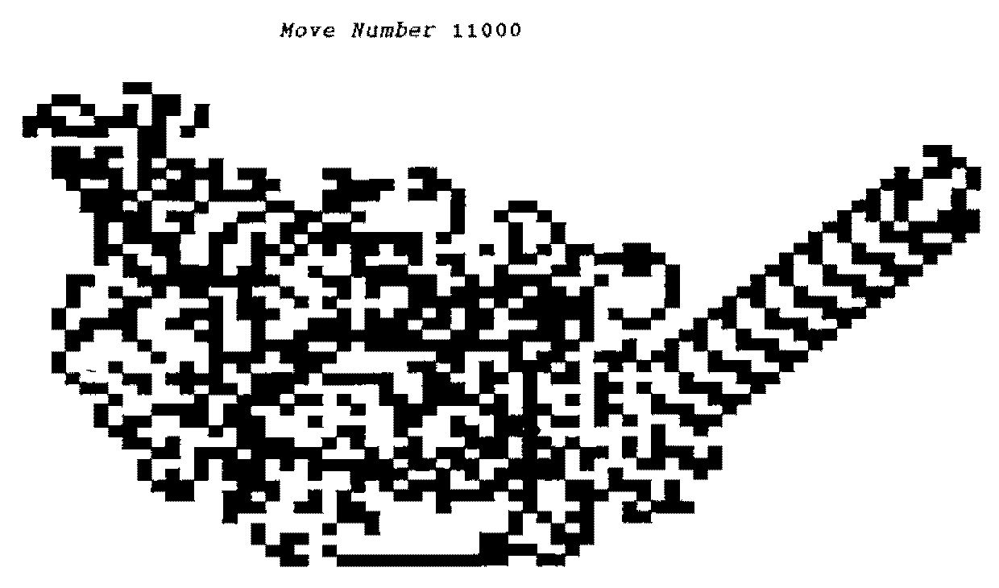
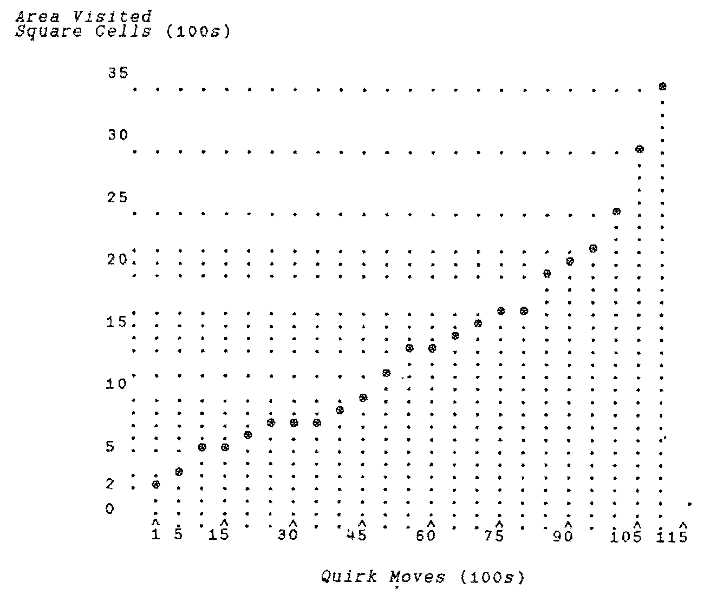

by Sylvia Camacho<br>
Email: 100612.1057@compuserve.com
{ .byline }

The Christmas 1997/1998 Royal Institution Lectures were given by Ian Stewart, Professor of Mathematics. For *Vector* readers not based in the U.K., I should say that these lectures are broadcast every year over 5 days during the Christmas holiday. They are superbly presented by BBC TV incorporating many demonstrations with much audience participation to a packed lecture theatre of eager children. During one of these lectures my attention was caught by Professor Stewart’s demonstration of a cellular automaton of extreme simplicity and totally unexpected behaviour. Having asked a child to make a few moves using a manually operated model, Professor Stewart turned to a computer and demonstrated the result of running for over 10,000 generations. Naturally this whetted my appetite to set the model up for myself. This is the sort of plaything for which APL is an ideal tool. I hope Vector readers, if asked, ‘What is APL good for?’ will turn to this example and answer, ‘Very good for having fun’.

The model has two parts: a two-dimensional array of cells and a ‘Something’ which in Ian Stewart’s case was a plastic beetle but I have decided to call my virtual something a ‘Quirk’. Chambers Dictionary defines ‘quirk’ as ‘… a trick or peculiarity of action … to turn sharply …’. The Quirk has a head and tail and it may point (and move in the direction it is pointing) in one of the four orthogonal directions of the matrix of cells, it moves one cell for each generation. After each move it rotates 90 degrees clockwise or anticlockwise. Each cell of the array may be in one of two states, let us say colour zero or colour one. All cells are zero to begin with and Quirk is placed somewhere about the middle of the array. I began my experiment with a 100×100 matrix but 76×76 will suffice. The rules for moving Quirk are:

- 1\. Move Quirk one cell in the direction in which it is facing.
- 2\. Turn Quirk 90 degrees anticlockwise if the cell to which it moves is colour zero or 90 degrees clockwise if it is colour one.
- 3\. Change the colour of the cell which Quirk has just left.

One expects to see zero-coloured cells changing to colour one and some reverting to zero as Quirk twists its way around its Universe. How far from its starting point will Quirk wander in a given number of generations? I arranged for the limits of its travel after each 100 generations to be reported as the reult of my function `DANCE`.

I am using an old version of APL\*PLUS in a DOS window under Windows 95. For this reason I use quadWPUT to display the array. This has the disadvantage that the screen is only 25x80 characters and I found I needed approximately 70x50 to reproduce Professor Stewart’s display. My decidedly jury-rigged solution to this problem is contained in the function `REHASH`. Vector readers who command powerful GUI Tea-Clippers or East Indiamen will be able to explore the model without this inelegant lash-up. If any reader sets up a version with exciting bells and whistles (or should I say ‘dressed overall’) I am sure the Editor will be happy to publish it.

I suppose the best known cellular automaton is LIFE, invented by John Horton Conway long before we played with computers on our desks. He was challenged to devise rules which would give rise to a self-reproducing pattern and his invention acquired a cult following as people explored the characteristics of various starting patterns. (Some years ago Paul Chapman wrote a superb implementation of LIFE for the Archimedes and the PC but not unfortunately for SVGA monitors.) The reason that Professor Stewart’s model took my eye is the extreme simplicity of his rules and the unexpectedness of the sudden change of behaviour after about 10,300 unremarkable generations. On seeing this the first thought that came into my head was ‘How about that for a phase change?’. The next was ‘a track-laying vehicle steered by its tracks’, which I have always admired as a nice definition for a tank. However Quirk lays its track after it has moved forward, so it is only on the second time of moving to a cell that it is steered by its track previously laid. On the other hand, of course, we could change the rules so that Quirk changes the colour of the cell immediately before moving into it.

There are two aspects of this automaton that I think are notable. The first is that the change to a repeating pattern dancing inexorably towards the edge of the universe can be described as ‘emergent’ behaviour. The second is that the progress of Quirk is the result of an interaction with the environment and thus is an example of feedback. It leads me to wonder what change of the rules would be needed to handle more than one Quirk and how about modifying Quirk twists after two visits to the same cell – perhaps marking its passage with a cycle of colour changes.

For those of you with the energy to key it in here are my two functions and a picture of the screen after 11,000 generations. Have fun!

```
    ∇ RES←DANCE GEN;⎕IO;AREA;C;COL;FIN;NWSE;OBJ;R
[1]   ⍝ display the Dance of the Quirk: SMC  2 March 1999
[2]    ⎕IO←0 ⋄ RES← 0 4 ⍴0
[3]    U← 76 76 ⍴0 ⋄ AREA← 35 22 35 22 ⍝ U is global
[4]   ⍝ controls movement of Quirk North, West, South, East
[5]    NWSE← 2 4 ⍴ ¯1 0 1 0 0 ¯1 0 1
[6]    R←35 ⋄ C←22 ⋄ FIN←0
[7]   L1:→(FIN=GEN)↑END
[8]   ⍝ record minimum and maximum row/column visited by Quirk
[9]    AREA←(AREA[0 1]⌈R,C),AREA[2 3]⌊R,C
[10]  ⍝ change the colour of the cell currently occupied by Quirk
[11]   U[R;C]←~U[R;C]
[12]  ⍝ move Quirk one cell
[13]   R←R+NWSE[0;0] ⋄ C←C+NWSE[1;0]
[14]  ⍝ go to END if edge of Universe reached
[15]   →((R<0)∨(R=76)∨(C<0)∨C=76)↑END
[16]  ⍝ record the colour of the new cell and rotate Quirk accordingly
[17]   COL←U[R;C] ⋄ NWSE←(¯1×COL)⌽NWSE ⋄ NWSE←(0=COL)⌽NWSE
[18]   OBJ←REHASH⍉U ⍝ jury-rig character matrix to fit the screen
[19]   FIN←FIN+1
[20]   →(0=100|FIN)↓L3 ⍝ record area covered after every 100 moves
[21]   RES←RES⍪AREA
[22]  L3: 0 0 24 80 ⎕WPUT 24 80 ↑('Move Number ',⍕FIN)COVER OBJ ⋄ →L1
[23]  END:
    ∇

    ∇ RES←PLAYGOD GEN;⎕IO;A;AREA;B;C;COL;FIN;NWSE;OBJ;R
[1]   ⍝ provoke repetitive pattern by pre-setting Universe: SMC 2 March 1999
[2]    ⎕IO←0 ⋄ RES← 0 4 ⍴0 ⋄ A←35 ⋄ B←25
[3]    U← 76 76 ⍴0 ⋄ AREA← 35 25 35 25
[4]   ⍝ play God by giving Quirk a favourable environment
[5]    U[A+0;B+3]←1 ⋄ U[A+1;B+ 2 3 4]←1 ⋄ U[A+2;B+ 5 6]←1
[6]    U[A+3;B+6]←1 ⋄ U[A+4;B+ 6 7]←1 ⋄ U[A+5;B+ 7 8]←1 ⋄ U[A+6;B+7]←1
[7]    NWSE← 2 4 ⍴ ¯1 0 1 0 0 ¯1 0 1
[8]    R←40 ⋄ C←33 ⋄ FIN←0 ⍝ any of these starting points will serve
[9]   ⍝ R←39 ⋄ C←32 ⋄ FIN←0
[10]  ⍝ R←39 ⋄ C←31 ⋄ FIN←0
[11]  ⍝ R←38 ⋄ C←31 ⋄ FIN←0
[12]  ⍝ R←38 ⋄ C←27 ⋄ FIN←0
[13]  ⍝ R←36 ⋄ C←27 ⋄ FIN←0
[14]  L1:→(FIN=GEN)↑END
[15]  L2:AREA←(AREA[0 1]⌈R,C),AREA[2 3]⌊R,C
[16]   U[R;C]←~U[R;C] ⋄ R←R+NWSE[0;0] ⋄ C←C+NWSE[1;0]
[17]   →((R<0)∨(R=76)∨(C<0)∨C=76)↑END
[18]   COL←U[R;C] ⋄ NWSE←(¯1×COL)⌽NWSE ⋄ NWSE←(0=COL)⌽NWSE
[19]   OBJ←REHASH⍉U ⋄ FIN←FIN+1
[20]   →(0=50|FIN)↓L3
[21]   RES←RES⍪AREA
[22]  L3: 0 0 24 80 ⎕WPUT 24 80 ↑('Move Number ',⍕FIN)COVER OBJ ⋄ →L1
[23]  END:
    ∇

    ∇ R←REHASH U;⎕IO;N;ROW
[1]   ⍝ returns decode of global Universe as block characters: SMC 2 March 199
[2]   ⍝ argument U is a flip of global Universe so that rows convert to column
[3]   ⍝ take rows of U in pairs & convert to ⎕AV block chars
[4]    ⎕IO←0
[5]    ROW←0
[6]    U← 48 76 ↑U ⍝ screen limits
[7]    N← 24 76 ⍴0 ⍝ convert in pairs to give 24 screen rows
[8]   L1:→(24=ROW)↑END
[9]    N[ROW;]←2⊥U[0,1;]
[10]   ROW←ROW+1 ⋄ U← 2 0 ↓U ⋄ →L1
[11]  END:R←(⎕AV[32 220 223 219])[N] ⍝ decoded version of U
    ∇
```



The function `COVER` is included in my article in Vector 15.3, ‘Forty Years On’.

This graph is what I made of the result from `DANCE 11000` but those of you with four-mast GUIs with no barnacles and a spinnaker set will be able to make a plot ship-shape and Bristol fashion.


