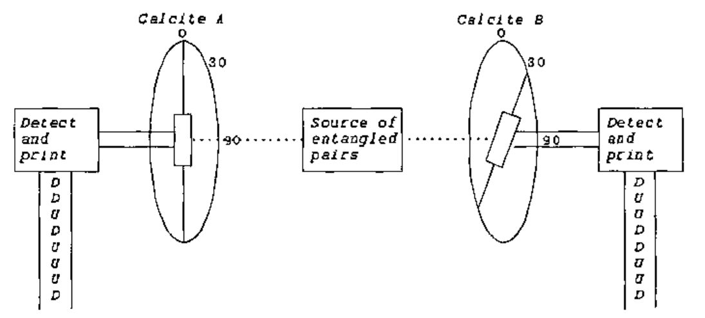
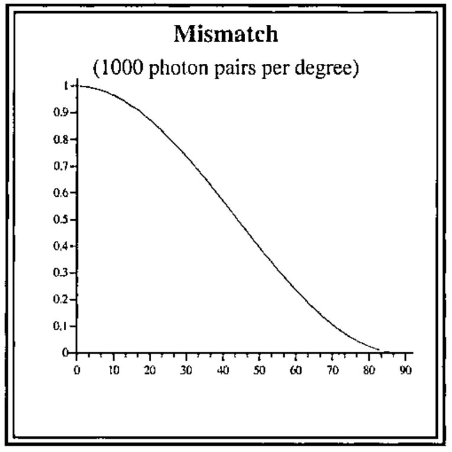

*by Sylvia Camacho*
{ .byline }

### Prologue

Stefano, our Editor, told me of one place where I was wrong, even before going to press, so I am very happy with the effect of my Title although shamed by the mistake in simple arithmetic which he spotted.

## Bell’s Inequality

Oldtimers will wonder why I am revisiting this topic which I wrote about way back in Vector 4.1, a text somewhat flawed because at the end an advertisement was printed over the table created by the code. However I said in that paper that I would continue puzzling and so I have, intermittently, over the last 14 years and now at least I know what I do not understand.

In 1964 John Stewart Bell described a thought experiment which, if a real experiment could be based upon it, he believed would test the correctness of Einstein’s contention that orthodox Quantum Theory implies non-local action at superluminal speeds. At some time before 1985 at least two such tests were made by John Clauser and Alain Aspect and apparently supported the orthodox view against Einstein and in accordance with the interpretation attributed to Niels Bohr. I have an account of Bell’s proposal in "Quantum Reality" by Nick Herbert (1985) (which is the popularising account without heavy mathematics which I reviewed in 4.1) and another in a paper "Conceptual Foundations of Quantum Mechanics" by Abner Shimony with mathematics that leaves me puzzled. I have no formal training in either physics or mathematics although my interest in both was aroused many years ago by the philosopher Karl Popper. I do know, however, that there are many Vector readers who do understand both the physics and the maths and I am hoping that some of you will be interested to show me what it is that I have misunderstood.

Einstein thought that he could demonstrate a limitation of Niels Bohr’s ‘Copenhagen’ interpretation of quantum physics. He proposed that particles prepared in an ‘entangled’ state allow a simultaneous measurement of position and momentum because the position of one of the pair of entangled particles can be measured at A while the momentum of its partner is measured at B. This is the ‘thought experiment’ which is called EPR after Einstein, Podolsky and Rosen who devised it. This experiment being very difficult to realize, David Bohm devised an equivalent based upon polarisation correlated photons. Photon polarisation is measured with a calcite crystal which splits the beam into up and down channels depending on whether the photon is polarised along or across the calcite’s optic axis. The experiment assumes that the entangled beam of photons is completely unpolarized which means that measurement at any calcite angle results in 50% leaving by the up channel and 50% by the down channel in apparently random sequence. It is assumed that a pair of calcites can be set up such that they have the same orientation to each other in the X Y plane and that either can be rotated in this plane to establish a known angle between them. Further assumptions are that two beams of entangled photons can be generated and each made to impinge perpendicularly upon the X Y plane of one of the calcites. It is further assumed that measuring equipment can be associated with each calcite to record the channel (UP or DOWN) by which each photon leaves the calcite. A test for quantum correlation is based upon the MATCH to MISMATCH statistics of the two photon streams for different relative angles between the two calcites. According to the Copenhagen interpretation the measured correlation supports the view that there must be interaction between the twin photons from start to finish of the two measurement events, no matter how distant in space and time these are.

It is well established that if both calcites are set to the same angle the UPs and DOWNs of the two beams of photons will always match. It is also agreed that if the second calcite is set at an angle 90 degrees displaced from the first the two beams will exactly mismatch. For every UP at stream A there will be a DOWN at stream B as though the up and down channels had been reversed. It is also agreed that if the difference is set at 45 degrees there will be a mismatch in 50% of the photon pairs, some will read UU some will read DD but 50% will read either UD or DU as though each twin’s path between up and down channels was equiprobable. If only these three angles, 0 45 and 90 were known we might assume a smooth transition from perfect correlation at 0 degrees to perfect anti-correlation at 90 degrees – a nice straight line. This is not what we get and the discrepancy is said to prove that there is a superluminal connection between the photons until one of them has been measured (the so-called ‘collapse of the wave function’). I find it difficult to formulate any arguments to make good this claim other than those which beg the question by assuming the Quantum Theory formalism which they claim to be putting to the test.

Up to the equilibrium angle of 45 degrees the correlation lessens by cos<sup>2</sup>θ where theta is the angle between the calcites. At 45 degrees there is no excess of MATCH over MISMATCH. Beyond 45 degrees the anti-correlation increases by 1-cos<sup>2</sup>θ until there is complete mismatch at 90 degrees. I note that the finding for the very similar classical experiments with light beams and polaroid filters is that the ratio of the intensity of the light passed through two polarisers is cos<sup>2</sup>θ where theta is the angle between the axes of the polarizers. Now cos<sup>2</sup>30 is 0.75 and cos<sup>2</sup>60 is 0.25 which Herbert in his *Quantum Reality* shows as the correlations obtained in the Bell type experiments. It is agreed that the entangled beams are completely unpolarised which means they will measure 50% up and 50% down at any angle. So as measured at calcite A its sequence of UP and DOWN marks will constitute the only standard by which the match/mismatch ratio is established when compared with the results at calcite B. The percentage mismatch will be cos<sup>2</sup>θ whatever rearrangement of the calcites is made before the first measurement is taken or however the second calcite is subsequently rotated. The two beams are identical until they pass through the calcites. Each photon has, in Popper’s terms, a set of *propensities* (or ‘superposition of probability amplitudes’, as the physicists call it) to interact with a calcite such that it will be deflected through the UP or DOWN channel. The same applies to its twin in the other beam. The propensities are realized as each is measured. Each outcome is contingent upon the interaction between the photon and its calcite (the ‘entire experimental arrangement’, as Bohr said). After a sufficiently large set of paired measurements have been made we can deduce, from the MATCH/MISMATCH statistics, the relative angle between the calcites although we cannot learn anything about the photons constituting the entangled beams. Wherein here lies the evidence for non-local action?

What, if any, correlation should we expect from purely local action? That is the assumption that there is no interaction between the photons in a pair after they have parted company. We should allow for the fact that we know there will be an orientation of the two calcites that will yield a perfect correlation and that an orientation of one of them at 90 degrees from this will yield a perfect anti-correlation. Herbert’s popularising book explains that it is only the relative angle between the calcites which is significant. I take this to mean that after the initial set up either calcite may be rotated through any angle positive or negative (clockwise or anti-clockwise). His demonstration of Bell’s inequality is very simple. Starting from the perfect match position rotate calcite A through an angle (say 30 degrees) and make a set of measurements. This yields a correlation of 75%:25% MATCH/MISMATCH of UP/DOWN readings. Reset to the perfect correlation orientation. Then rotate calcite B through an angle of minus 30 degrees and repeat the measurement run. This yields the same correlation of 75%:25% MATCH/MISMATCH of UP/DOWN readings. So, Herbert argues, that if an angle of 30 degrees yields a 25% MISMATCH and an angle of minus 30 degrees also yields 25% MISMATCH, an angle of twice this (i.e. 60 degrees) should yield a MISMATCH of not more than 50%. When the experiment is made, however, it will be found that setting calcite A to plus 30 degrees and calcite B to minus 30 degrees yields a MISMATCH of 75%. This difference between 50% and 75% is, he says, an example of the Bell inequality.

This leads me to consider a slight variation of Herbert’s argument. Suppose we set calcite A to plus 45 degrees and calcite B to minus 45 degrees, what do we expect? The correlation MATCH/MISMATCH at 45 degrees is 50:50. Twice 50 being 100 we should have – what? Twice 45 degrees being 90 degrees we know we shall have 100% MISMATCH. Why not 100% MATCH? Because only the relative angle is significant. If we rotated both calcites to plus 45 degrees we know we should get a perfect correlation but we could equally well describe this as ‘resetting our zero orientation’. To summarise: given two identical sets of photons we can pass one set through calcite environment A and the other through calcite environment B and compare the results and note that we get a correlation cos<sup>2</sup>θ dependent upon the relative angle θ between the environments. What is so non-local about that? The problem according to quantum orthodoxy is that a measurement ‘collapses the wave function’ so that the photon, until then in a state of ‘objective indefiniteness’, takes on a definite characteristic which closes off possibilities which until then were open to it and by extension to its twin. If by this is meant that the result of a measurement cannot be known until it is made, I have no problem. If it means that making the measurement fixes half of the conditions that will define the relative angle between the calcites, I have no problem. If the measurement of the second photon of the pair demonstrates that its response has been limited by the other’s measurement it must be because there is some form of interaction despite the fact that they are moving apart faster than seems reasonable to support a signal between them. My problem is that I do not know what would be evidence for this.

I am puzzled to know why the evidence for non-locality is said to be made stronger if the distance between the calcites is made large and the two sets of measurements are demonstrably not co-incident in time (ignoring the complications of establishing co-incidence in a relative world!) It is suggested that, even while calcite A is performing its measurements, calcite B can be rotated and the voodoo communication will still work its magic to produce cos<sup>2</sup>θ correlation when the B stream reaches its calcite and the UPs and DOWNs are printed. So, I ask myself, "At what angle is A being measured in the absence of B or during its rotation?" The diagrams of these experiments show lines superimposed on the calcites and marked ‘optic axis’ but no procedure is suggested for establishing this as a preferred axis and, indeed, the purely relative character of the angle theta is several times emphasised. Nevertheless in his demonstration Herbert suggests taking initial measurements using this optic axis as the standard for establishing the correlations to be expected at plus and minus 30 degrees (this optic axis thus standing for zero degrees). We know, however that this ‘optic axis’ does not have any favoured status because we are told that if calcites A and B are both set to plus 30 degrees the correlation will be a perfect match. So we know that there is no equivalence between zero and plus 30 and zero and minus 30 – if there were this would yield a perfect match instead of giving, as it does, the value for 60 degrees. The only reasonable conclusion is that the first photon stream to be measured establishes zero degrees (for the purpose of this experiment only) against which the measurements at the second calcite will be correlated and that it is as meaningless as one-handed clapping to refer to either calcite as having an angle in isolation. What is being measured is two different aspects of the photon’s waveform and this does not have any preferred orientation, the photon streams being completely unpolarized. So the measurements can be made – just as Einstein said they could be. There, I have delivered myself of the ultimate blasphemy.

So now I come to the paper by Abner Shimony and his definition of Bell’s Inequality. He says, "We shall now give in a few steps an outline of a simple derivation of Bell’s Inequality invented by J. Clauser and M. Horne. First, it is a fact of elementary algebra that any four real numbers r′,r,s′,s lying between 0 and 1 satisfy the following inequalities:

> -1 ≤ r′s′ + r′s +rs′ - rs - r′ - s′ ≤ 0

……………………The quantum mechanical probabilities for + outcomes in an X-test on 1 and in a Y-test on 2 (i.e. of passage through polarisation analysers oriented in the X and Y directions, respectively) are easily calculated to be

> p<sup>1</sup><sub>Ψ</sub>(X)=p<sup>2</sup><sub>Ψ</sub> (Y)=½

and the quantum mechanical probability for joint passage through the two polarisation analysers is

> p<sub>Ψ</sub>(X,Y) = ½cos<sup>2</sup> (Y-X)

where Y and X are taken to be the angles which the optical axes of the two polarisation analysers make with a fixed axis in the plane orthogonal to the propagation direction of the photons. If the values x′, x, y′, y are, respectively, chosen to be 45°, 0°, 22.5°, 67.5°, then

> p<sub>Ψ</sub>(x′y′) + p<sub>Ψ</sub> (x′y) + p<sub>Ψ</sub> (xy′) – p<sub>Ψ</sub> (xy) - p<sup>1</sup><sub>Ψ</sub>( x′) - p<sup>2</sup><sub>Ψ</sub> (y′) =0.207

which conflicts with the upper limit in Bell’s Inequality."

Having worked out the values for the example above I get:

> 0.427 + 0.427 + 0.427 – 0.073 – 0.5 – 0.5 = 0.208

which demonstrates that I know how Shimony gets to this result. Any value greater than zero, of course, violates the upper limit of Bell’s Inequality. This exposition implies that 0.427 is equivalent to the product r′s′ in the ‘elementary algebraic’ expression although it is not a product but the squared cosine of the difference between two angles. However, if r′ and s′ were each a probability expressed as a number between 0 and 1, the product r′s′ would express their joint probability and it is presumably this analogy that is intended. As quoted r′s′ is ½cos<sup>2</sup> 22.5 degrees and Shimony’s choice of angles is such that r′s and rs′ are also ½cos<sup>2</sup> 22.5 degrees. The equivalent for the product rs, on the other hand, is ½cos<sup>2</sup> 67.5 degrees which gives a value of 0.073. So we are asking whether the sum of the probabilities for 3 contiguous angles of 22.5 degrees is equal to the value of the probability for an angle of 67.5 degrees. This seems to be the same as asking if 3×½ cos<sup>2</sup>θ = ½ cos<sup>2</sup>3×θ. As we know this equation cannot be valid, the Bell inspired experiments seem like a difficult to realise and probably expensive, physical demonstration of a mathematical inequality.

I note that Shimony defines X and Y as the angles which ‘the optical axes of the two polarisation analysers make with a fixed axis in the plane ….’. This implies that the fixed axis has a function and it is not only, as Nick Herbert insists, the relative angle that is significant. The problem that I face is that the Bell formula assumes 4 values, corresponding to 4 angles, and tests some relationship between them. It is not clear to me what relationship is being tested and therefore what bearing this might have on the question of the independence of the results of the measurements which are made at calcites A and B; which concerns only one, not four, angles. This single angle is only established when both measurements have been made and we presumably rule out any superluminal influence after the second measurement. A superluminal influence following upon the first measurement could consist of one of only two possibilities, to leave the twin photon unchanged or to increase its propensity to switch exit channel but this would have to happen before the conditions for such a switch (the chosen angle) could have been encountered. I know, of course, that the quantum orthodoxy is that the photon does not have a polarity until it is measured but I see this as a logical consequence of polarity being defined in terms of orientation and therefore meaningless outside this angular context. Either measurement will necessarily establish this context for the other set of results but the subsequent correlation is the consequence of a logical not a physical connection. The orthodox view that the photon does not have a polarity until it is measured remains true because orientation is part of the definition of polarity. It seems to me that the propensity of a photon to exit a crystal by one of two possible paths is likely to depend upon the internal calcite angles combined with the wave characteristics of the photon and there seems no reason to suppose this relationship will be linear, for we might expect that the more different the calcite environments the more likely it is that the photon path will be switched. This indeed is what is found. Dear Reader please tell me where I am going wrong.

The very simple code below generates the values for the graph which would be obtained by generating 90 streams of 1000 entangled photon pairs and passing them through calcites opposed at angles from zero through 89 degrees. The variable called ‘mark’ is a table of the propensities for a given photon to switch output channel in response to a changed environment, the change being expressed as an angle and the probability of the switch being the squared cosine of the angle.

```apl
     ∇ r←run pop;⎕io
[1]   ⍝ produce values for graph: smc 1 Sep 2001
[2]   ⍝ pop is number pairs entangled photons in
[3]   ⍝ each stream and r is 90 values showing the
[4]   ⍝ fraction of pop where the pairs mismatch
[5]   ⍝ at each setting of the calcites' angle
[6]   ⍝ between zero and 90 degrees
[7]    ⎕io←0
[8]    cossqtheta ⍝ create global vector 'mismatch'
[9]    setmarks pop ⍝ create global boolean matrix 'mark'
[10]   r←simulate pop
     ∇


     ∇ cossqtheta;⎕io;radians
[1]   ⍝ create global 'mismatch': smc 1 Sep 2001
[2]   ⍝ uses global value for radian 0.0174532925
[3]    ⎕io←0
[4]    radians←radian×⍳90
[5]    mismatch←⍎,('f6.4' ⎕fmt⌽(2○radians)*2),' '
     ∇


     ∇ r←entangle n;⎕io
[1]   ⍝ return random boolean vector: smc 1 Sep 2001
[2]   ⍝ emulates entangled UP/DOWN photon stream
[3]    ⎕io←0
[4]    r←?nρ2
     ∇


     ∇ setmarks pop;⎕io;c;cols;flips;rl
[1]   ⍝ propensity to switch exit channel: smc 31 Aug 2001
[2]   ⍝ 'mismatch' vec is mismatch fraction at each degree interval
[3]   ⍝ pop is number of photons in this entangled stream
[4]   ⍝ global 'mark' is a propensity table for this size pop
[5]   ⍝ holding the random link constant simulates propensity as
[6]   ⍝ opposed to chance: once flipped an individual photon would
[7]   ⍝ not revert at increasing angles. The population statistics
[8]   ⍝ are not affected either way.
[9]    ⎕io←0 ⋄ mark←(90,pop)ρ0 ⋄ rl←⎕rl
[10]   flips←⌊mismatch×pop ⍝ number of flips for each degree
[11]   c←0 ⍝ at zero degrees is no mismatch
[12]  L1:→(90=c←c+1)↑end
[13]   ⎕rl←rl
[14]   cols←flips[c]?pop ⍝ these photons will flip channel
[15]   mark[c;cols]←1
[16]   →L1
[17]  end:mark[89;]←1 ⍝ at 90 degrees is certain mismatch
     ∇


     ∇ r←simulate pop;⎕io;c;photons
[1]   ⍝ r is match/mismatch correlations: smc 31 Aug 2001
[2]   ⍝ r is vector for 90 entangled streams of pop photons
[3]    ⎕io←0 ⋄ c←0 ⋄ r←pop
[4]   l1:→(90=c←c+1)↑end
[5]    photons←entangle pop
[6]   ⍝ flip photons in the stream for degree c held in 'mark'
[7]   ⍝ then catenate total matches to r
[8]    r←r,+/photons=2|mark[c;]+photons
[9]    →l1
[10]  end:r←⍎,('f6.4' ⎕fmt r÷pop),' '
     ∇
```





## References

Feynman, Richard P et al ‘Lectures on Physics’ Volume 1, 33-4 ‘Polarizers’ Addison-Wesley 1963 ISBN 0 201 02116 1 P

Herbert, Nick ‘Quantum Reality’ Rider & Co. 1985 ISBN 0 7126 1083 9

Popper, Karl R ‘A World of Propensities’ Thoemmes 1990 ISBN 1 85506 000 0

Shimony, Abner ‘Conceptual foundations of quantum mechanics’
ed Davies, Paul ‘The New Physics’ Cambridge U.P. 1989 ISBN 0 521 30420 2

http://www.roxanne.org/epr
