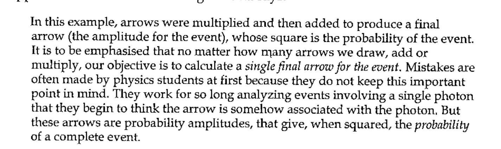

*by Sylvia Camacho*
{ .byline }

**Dedicated to the memory of Gérard Langlet who might not have agreed with my arguments but would have greatly enjoyed the fight.**

## Being a third attempt to understand Bell’s Inequality [0]

Other than the website [1] which Stefano Lanzavecchia was kind enough to tell me about when he published *Can Anyone Tell Me Where I’m Wrong* in October 2001, no one offered to enlighten me until Graeme Robertson sent me a letter and a book [2] in August 2003. Our subsequent exchange of e-mails provoked me to examine my perplexities yet again and energetic web-surfing brought to light some intriguing recent papers which encourage me to pursue the analysis.

I first became interested in this field when Karl Popper [3] directed my attention to a completely outrageous quotation from Werner Heisenberg who is considered one of the founders of quantum theory. He is describing an experiment with a semi-transparent mirror and assumes that the probability that light will be reflected by it is ½. Thus the probability that light will pass through will also be ½, and so, if the event ‘reflection’ is *a*, and the experimental arrangement *b*, then *p(a,b)* = ½ = *p(-a,b)* where ‘*-a*’ stands for the event ‘passing through’ or ‘transmitted’. Now supposing the experiment is carried out with one single photon then this ‘probability wave packet’, as he calls it, standing for the photon will be split yielding two ‘wave packets’, *p(a,b) and p(-a,b)*, for which the equation *p(a,b)* = ½ = *p(-a,b)* still holds. Heisenberg writes:

> By the experiment [i.e. the measurement by which we find the reflected photon], a kind of physical action (a reduction of wave packets) is exerted from the place where the reflected half of the wave packet is found upon another place – as distant as we choose – where the other half of the packet just happens to be … this physical action is one which spreads with super-luminal velocity. [4]

He draws this conclusion because his photon *p(a,b)* = ½ = *p(-a,b)* has ‘collapsed’ into two photons for which *p(a,b) = 1* holds here and *p(-a,b) = 0* holds there. So if my eye is in line to receive a reflected photon it will collapse on my retina, (becoming *p(a,b) = 1*) and ‘exert a kind of physical action’ upon your eye should that be in line to receive the transmitted (*p(-a,b) = 0*) photon. But why should the action be this way round? Can the transmitted photon not collapse the wave function in your eye and ‘exert a kind of physical action’ upon my eye, so causing me to observe the reflected photon? This would be acceptable in probability calculus, where a null observation can certainly change the odds, but how does your eye know when it has gambled and lost? I apologise for the frivolity of this last question but am delighted (with thanks to Graeme for the reference) to find my irritation shared by a real mathematician who says:

> … it is not at all unusual, when it comes to quantum philosophy, to find the very best physicists and mathematicians making sharp emphatic claims, almost of a mathematical character, that are trivially false and profoundly ignorant. [5]

This tendency to objectify mathematical expressions may not be confined to quantum theorists but it is certainly very commonly found in their field. It was familiar to Richard Feynman who realised that his students were in danger of confusing the notation they used to quantify probabilities connected with the particles they were modelling with the particles themselves. He had devised a diagrammatic notation involving arrows of differing lengths, representing amplitudes, which are rotated according to the relationship between distance and wavelength and represent possible interactions between photons and test apparatus. He draws such a diagram and says:



Feynman adds a footnote:

> Keeping this principle in mind should help the student avoid being confused by things such as the “reduction of the wave packet” and similar magic. [6]

Feynman is explaining to his audience what experiment has established about partial reflection by glass. First is that the percentage reflected is affected by the thickness of the glass and the colour of the light. For red light with very thin glass or glass of a particular thickness no light is reflected but otherwise the reflection varies between 4% and 16% as the thickness is increased. He emphasises that the photons are interacting with electrons within the glass although the word used to describe the effect is ‘reflection’. The relationship between the wavelength of the light and the thickness of the glass is the critical factor although the clicking photomultiplier is apparently detecting photons and the result will be expressed as a simple percentage. Elsewhere Feynman describes the increased diffraction seen when light is directed through a narrow gap between blocks as follows:

> So when you try to squeeze the light too much to make sure it’s going only in a straight line, it refuses to cooperate and begins to spread out.

and then he adds a footnote:

> This is an example of the “uncertainty principle”: there is a kind of “complementarity” between knowledge of where the light goes between the blocks and where it goes afterwards – precise knowledge of both is impossible. I would like to put the uncertainty principle in its historical place: … If you get rid of all the old-fashioned ideas and instead use the ideas that I am explaining in these lectures – adding arrows for all the ways an event can happen – there is no need for an uncertainty principle! [7]

Unfortunately despite Feynman’s robust realism Heisenberg’s malign influence is still with us.

Reading the explanation of an implementation of Bell’s thought experiment in reference [1] it is not clear to me what outcome would be expected from what is described as the ‘deterministic point of view’. The statistical argument analysed suggests that there will be no correlation but the inequality, if satisfied, is compatible with a particular linear correlation and this is what is illustrated in some other texts. This is perhaps because there is experimental justification for correlation = 1.0 for identical detector settings and for correlation = 0.5 (i.e. no correlation) at settings differing by 45 degrees. Bell’s ‘inequality’ is an algebraic expression which cross-correlates the proportions of matching pairs over experiments run with different detector orientations. Bell says that this will decide for or against Einstein’s claim that Bohr’s quantum theory is ‘incomplete’. The two postulated outcomes, where y is the fraction of matched pairs and x lies between zero and 90 degrees, are:

> *y=1 - Φ ÷ 90* or *y=cos² Φ*, where *Φ* is the relative angle between the detectors.

Both cases could be expressed in words by: ‘as the angle between the detectors increases the match between the outcomes decreases.’ The second outcome looks more plausible because it has family resemblances with formulae describing diffraction and interference and other such trademarks of light waves. It is reported that this is what is found when Bell’s test is realised. So I looked again at Stef’s reference [1] and this is what I wrote in an e-mail to Graeme:

> I gather that the proof offered by the experimental design is in the form of a *reductio ad absurdum*. It is assumed that if the equality is violated by the measured correlations then ‘the hidden variable theory’ will have been shown to be untenable and this will constitute a proof of the quantum alternative. This form of proof is completely persuasive when used, for instance, to prove the unique factorisation theorem but it depends upon there being exclusive alternatives: either this theorem is true or it is not; assume it is not and show that this has absurd consequences. In the Bell case I do not see what these exclusive alternatives are. I do not see what part ‘hidden variables’ might play and why it is so important to exclude them and, for that matter, how the design does exclude such elusive factors. Specifically I do not understand why it should be surprising to find that correlations between tests on wave type phenomena can be expressed in terms of sines and cosines. [8]

Pursuing a web reference I found I was not alone in my opinion: [9 10]

![Quotation from Aerts [10]: the Einstein Podolsky Rosen reasoning is a reasoning ex absurdum, since it uses quantum mechanics as correct and complete to describe the two separated entities.](art10001720/aerts1.jpg)

In other words they ‘beg the question’ which is the essence of the ad absurdum technique but it must be used with a care for its consequences:

![Quotation from Aerts [10]: from the proof of the implication it can be concluded that quantum mechanics is incorrect or incomplete.](art10001720/aerts2.jpg)

So if we hold to the hypothesis that quantum mechanics is a correct theory, the EPR reasoning proves that quantum mechanics is incomplete:

![Quotation from Aerts [10]: the steps of a proof ex absurdum have no truth value, so the EPR reasoning gives no hint of the nature of the incompleteness it reveals.](art10001720/aerts3.jpg)

Or, as my tutor in logic taught me, ‘any proposition whatsoever is implied by a contradiction’.

This is all good knockabout fun but we should remember that Bell’s thought experiment has been converted into a real experiment, with the expenditure of considerable trouble and expense which should not go to waste. There are several such experimental realisations, some more and some less close to Bell’s proposals and all of which have been attacked on various grounds connected with their design or the reliability of their results [11,12]. I am no physicist and not qualified to judge them on these grounds so I propose to accept that they do as they claim to do and that the predictions of the quantum formalism are confirmed.

So what was the Null hypothesis? None is mentioned but we can speculate that it should be that ‘pairs of non-entangled photons tested by the same apparatus will give significantly different results’. Or as Aerts expresses it:

![Quotation from Aerts [10]: the experiments show that quantum nonlocality can be retained over macroscopic distances, but this has little to do with the EPR reasoning, which needs entities that do get separated.](art10001720/aerts4.jpg)

Let us assume that experimental results such as described above, supporting the expectation *y=cos² Φ*, have been shown to be statistically robust for sets of photons generated by the ‘entanglement’ procedure. For these photons, at least, a non-local attribute can be claimed and this is defined by Bell as:

> … a mechanism whereby the setting of one measuring device can influence the reading of another instrument, however remote. Moreover, the signal involved must propagate instantaneously … [12]

What ‘mechanism’ or ‘signal’ might this be? It seems to me that there is an obvious candidate: a pair of photons. What we are told about them is that they can be considered identical for the purposes of this experiment and that when they interact with differently oriented detection equipment a predictable, statistically quantifiable, result is obtained. Now in other contexts the finding of a correlation spurs most of us to look for a causal connection. In practice we are so ready to make this assumption and statistical procedures are so much abused that the vital step of explaining the correlation is often left out. But in this simple case why is the presumed identity of the photons not accepted as the common factor explaining the correlation? It seems that, in the absence of a model for the interactions of the photons with the detectors (dare I call them ‘hidden variables?), the mathematical formalism has been accepted as complete in itself and then, as in the case of Heisenberg’s half-silvered mirror, misinterpreted. This defeatism did not include Richard Feynman, de Broglie or David Bohm and the latter’s alternative model was apparently fully accepted by Bell:

![Quotation from Bell [5]: de Broglie showed how the motion of a particle could be directed by a wave; the idea seems so natural and simple that it is a mystery it was so generally ignored.](art10001720/debroglie.jpg)

So much for the wave/particle dilemma but Bell still thinks there is a problem:

> The difficulty is not created by any such picture or any such terminology. It is created by the predictions about the correlations in the visible outputs of certain conceivable experimental set-ups. [5]

So his problem, like Heisenberg’s, is still with probability. Identical photons measured at identical angles give identical results: a 0% mismatch. If detector A is set to 0 degrees and B to 45 degrees the mismatch is 50% i.e. there is no correlation. With A at 45 degrees and B at 22.5 degrees the mismatch is 14.6%. With A set to 45 degrees and B set to 67.5 degrees the mismatch is 14.6%. If A is set to 0 degrees and B to 22.5 degrees the mismatch is 14.6 %. If A is set to 0 degrees and B is set to 67.5 degrees we get a mismatch of 85.4% (or a match of 14.6%). Now we have to look at the graph of our results and make a guess at the function which expresses the correlation. It is not too difficult. Despite this Bell decided that an application to these results of tests for a linear correlation, if the tests failed as given this evidence they must, would be sufficient to close down all further scientific speculation in the quantum field. The ‘spooky action at a distance’ was to be explained by the ‘collapse of the wave function’ describing both photons. All we computer buffs know functions can collapse pretty damn quick but in the real world we do not expect to stub our toes against their shards. So let us reason together.

## ‘Collapse’: Collective Noun for Quantum Mechanical Functions

> All correlation of material objects which are space-like separated are in a sense “non-locally” interrelated. [13]

> … all that is needed to demolish Bell’s logic is the observation that the correlations are invested in the past light cones of both detection events, … [13]

There is no such phenomenon as the collapse of a function. Functions are abstract, mathematical concepts which may be better or worse models but they do not collapse, particularly not with causal effect. If they model a real world situation which suffers an abrupt change, for instance an interaction with detection equipment, this may correspond to a particular solution of the function describing it. It is misleading to describe this as a ‘collapse’. The set of possible solutions, perhaps infinite, of a probability function is also abstract. It is not a set the members of which have a property of ‘objective indefiniteness’ whether super- or sub-posed. It may moreover have mathematically acceptable solutions that cannot be realised empirically.

The nature of the entanglement procedure combined with the design of the Bell experiment is such that the polarity of the pair of photons, although disimilar at creation is registered as matching if put through polarisers oriented in parallel and facing each other. It is therefore convenient to refer to such photon pairs as ‘matching’ because they give identical outputs at the calibration angle. This causes less confusion than trying to correlate using +/- or 1/-1 nomenclature and is therefore used throughout this analysis. Moreover it is implicit in the Bell thought experiment that the result of passing a stream of photons through a polariser can, at least in principle, be recorded for each individual photon. Therefore it should be possible using two entangled beams to bring the opposed polarisation meters into coincidence and record two sets of results showing for each which of the upper or lower photomultipliers detected each photon. The resulting set of matched up/down alternatives is then an example of the ideal raw statistical data to be correlated.

If one of the meters is rotated with respect to the other, it is found that the recorded coincidence no longer holds. This is a clear demonstration that the up/down outcome is a relational property of the event detected. If we assume that the two photon streams are identical in all relevant respects this allows us to conclude that the output path of a particular photon has been changed by the re-orientation of the meter with which it has interacted. A change of path is all that we can speak for; we have no warrant for claiming that there has been any fundamental change in the characteristics of the photon itself.

There is only one re-orientation which changes the path of every photon in a stream. This is when the B meter is rotated 90 degrees with respect to the A meter. In all other circumstances only a proportion of the stream is diverted and this proportion can be predicted from the relative angle between the meters calculated with respect to an orientation at which the outputs were coincident. At such a calibration orientation (parallel polarisers) the recorded outputs will show no mismatched photon pairs. If meter B is then turned through 45 degrees the resulting mismatch will be 50%. One can speculate that 1) at least half of these photon pairs have not retained their created polarity or, 2) that this expected pairing is only manifest when the meters are identically oriented and every possible orientation manifests a distinct and not necessarily compatible pairing of polarity or, 3) that for some photons and not all, the change in meter angle causes them to register at a photomultiplier which does not match that encountered by their twin. Whatever the explanation the resulting correlation demonstrates that measured polarity is mutable. Bell does not offer any reasoning to support his contention that these results imply:

> there must be a mechanism whereby the setting of one measuring device can influence the reading of another instrument, however remote. Moreover the signal involved must propagate instantaneously, so that such a theory could not be Lorenz invariant. [13]

What is not spelled out is the respect in which the reading at the remote location is influenced but, as we are concerned with only two possibilities, the choice is limited to a switch from ‘up’ to ‘down’ or vice versa. Is there any way in which this could be incontrovertibly established? Bell seems to think this is shown because the gross statistics for correlations over four angles show that the relationship is not linear but if there is an argument showing the rationale of this I have not found it. The most convincing demonstration would be to obtain detailed results for several streams of pairs of entangled photons created and tested simultaneously. One would then look for examples of individual photons showing discrepancies in behaviour between a photon and its twin. This is not a practical experiment but it can be simulated to model the precise circumstances for which non-local instantaneous influence could be claimed.

The graph which represents Bell’s expected outcome shows a balance point at 45 degrees. The proportions of matching pairs between relative angles of zero and 45 degrees are balanced by the proportions of pairs which record as mismatches between 45 and 90 degrees. The appearance on the curve of this fulcrum at 45 degrees is easily misinterpreted to suggest that the correlations for an angle defined between a nominal 22.5 degrees and 45 degrees should differ from an angle defined between a nominal 45 degrees and 67.5 degrees. It must be remembered however that the labels ‘22.5’, ‘45’, ‘67.5’ and so on are not significant except as an aid for the laboratory assistant: only relative angles, however set up, affect outcomes. The axes of the graph show the correlation for any relative angle each of which can be defined by any pair of nominal settings. Thus the expected outcomes for 0/22.5, 22.5/45 and 45/67.5 must be read from the same point on the curve: that is the y reading for a relative angle of 22.5 degrees. It is not, of course, the same point as the y reading for 67.5 degrees. The Bell inequality is thus seen to be an (inappropriate) test for linearity, nothing more. The choice of three pairs of labels for contiguous angles which together add to 67.5 is window dressing and without significance.

In keeping with one of the published realisations of the Bell experiment the angles chosen for the simulated comparisons here are between zero and 22.5 degrees, zero and 67.5 degrees, 45 degrees and 22.5 degrees and 45 degrees and 67.5 degrees. The population simulated is 8x1024 in 4 pairings. The table shows which of the Up or Down photomultipliers responded for each of the first 30 pairs in each stream. All outputs are compatible with the A and C populations. The B, E and H outputs are identical as are F and G. A detailed breakdown of the correlations for each angle is shown below. A is the random alternative from which the others are derived by application of *cos² Φ* where *Φ* is the angular difference shown for each stream.

### Simulated simultaneous readings (random link constant)

```text
Stream 1:angle 22.5
A 0     D D D U U D D U D D U D U D D D U D D D U U U D U U U D D U
B 22.5  D D D U U D U U D U D D U U U D U D D D U D U U U U U D D U
Stream 2:angle 67.5
C 0     D D D U U D D U D D U D U D D D U D D D U U U D U U U D D U
D 67.5  U U U D D U U D U U D U D U U U D D U U D D D U D D D D U U
Stream 3:angle 22.5
E 22.5  D D D U U D U U D U D D U U U D U D D D U D U U U U U D D U
F 45    D D D U U D D U D D U D U D D D U D D D U U U D U U U D D U
Stream 4:angle 22.5
G 45    D D D U U D D U D D U D U D D D U D D D U U U D U U U D D U
H 67.5  D D D U U D U U D U D D U U U D U D D D U D U U U U U D D U
```

| A compare B | | C compare D | |
|---|---|---|---|
| matching up | 0.4121 | matching up | 0.0723 |
| matching down | 0.4424 | matching down | 0.0742 |
| mismatch up/down | 0.0762 | mismatch up/down | 0.4160 |
| mismatch down/up | 0.0693 | mismatch down/up | 0.4375 |
| correlation | 0.8545 | correlation | 0.1465 |

| E compare F | | G compare H | |
|---|---|---|---|
| matching up | 0.4121 | matching up | 0.4121 |
| matching down | 0.4424 | matching down | 0.4424 |
| mismatch up/down | 0.0693 | mismatch up/down | 0.0762 |
| mismatch down/up | 0.0762 | mismatch down/up | 0.0693 |
| correlation | 0.8545 | correlation | 0.8545 |

The overall correlation conforms well with the Abner Shimony figures [2] but the UP/DOWN split is uneven, probably because 1024 is a very small population.

The simulation has, of course, to use the pseudo random number generator which requires a ‘seed’ value known as the random link which normally changes whenever it is invoked so that no two selections are the same. However the random link can be held constant and I have used this facility above. Careful scrutiny of the first-30-outputs table will show that the random link has been held constant for all applications of *cos² Φ*. This leads to a correlation between individual photon events. If a photon is selected at an angle of 22.5 it will also be selected at angles 45 and 67.5. It behaves as if, for specific photons, the tendency to change path is progressive over increasing angles. It is as though a given photon has a critical angle at which it will change path. This cannot be considered compatible with quantum theory because it could suggest a hidden variable and so it is only included here as an interesting speculation.

If the random link is released to vary with every use the split between UP and DOWN is different over the four tests and still rather far from the theoretically ideal 50/50 split, as can be seen below.

| A compare B | | C compare D | |
|---|---|---|---|
| matching up | 0.4150 | matching up | 0.0664 |
| matching down | 0.4395 | matching down | 0.0801 |
| mismatch up/down | 0.0732 | mismatch up/down | 0.4219 |
| mismatch down/up | 0.0723 | mismatch down/up | 0.4316 |
| correlation | 0.8545 | correlation | 0.1465 |

| E compare F | | G compare H | |
|---|---|---|---|
| matching up | 0.4229 | matching up | 0.4277 |
| matching down | 0.4316 | matching down | 0.4268 |
| mismatch up/down | 0.0645 | mismatch up/down | 0.0762 |
| mismatch down/up | 0.0811 | mismatch down/up | 0.0693 |
| correlation | 0.8545 | correlation | 0.8545 |

### Simulated simultaneous readings (random link varying)

**Of course, in this case the tendency to change path is not progressive.**

```text
Stream 1: angle 22.5
A 0     D D D U D U D U D D D D U D D D U D U D D D D D U U U D D D
B 22.5  D D U U U U U U D D D D U D D D U D U U D U D D D U U D D D
Stream 2: angle 67.5
C 0     D U U D D D U D D U D U U U U U U D D D D D U U D U D U U U
D 67.5  U U U U U U U U U U U U D D D U D U D U U U U U D D D U U U
Stream 3: angle 22.5    #     # #         # #               #     #
E 22.5  D D U U U U U U D D D D U D D D U D U U D U D D D U U D D D
F 45    D D U D U U U U U D D U D D D D U U U U D U D D D U D D D U
Stream 4: angle 22.5
G 45    D D U D U U U U U D D U D D D D U U U U D U D D D U D D D U
H 67.5  D D U U U U U U U D D U D D D D U U D U D U D D D U D D D U
```

So whereabouts in this simulation should we point the accusing finger and say, “this correlation is unreasonable”? The pattern followed is the same as that for Malus’ Law so one would not be inclined to say that the proportions are unexpected. What then of the behaviour of individual photons? The only candidates for anomalous behaviour are Streams 3 and 4 in the case of photons marked #. Here the behaviour of the E stream does not match that of the H stream although the F and G streams are identical and the angular difference is the same. However this difference in behaviour cannot give rise to total correlations higher or lower than would be expected by Malus’ Law so where is the spook?

Why is it thought that the entangled photons are so touchy/feely that they change their hidden polarity in mid-flight to make the numbers at the counters come out right? How many times must it be said? The click in the photomultiplier is registering the relationship between the photon and the detector on this occasion under these conditions. There is a pattern to such relationships which can be predicted probabilistically but probability is **not a property** of any **thing** not even a quantum particle. At lunch I may sit on your right, at dinner on your left but neither of us has a **‘handedness’** property; it applies only to the seating arrangement (lunch) or the seating arrangement (dinner). I may look down on a spinning ball and say, “it is spinning clockwise” or up at it and say, “it is spinning anti-clockwise”. That does not mean the ball has a property of superposition of spin clockwise and spin anticlockwise. Correlations measure relationships and are the business of probability calculus, the functions of which have tended, wrongly, to be objectified since the earliest days of quantum theory. There is an amusing analogy drawn in reference [12]. Consider the colour of a chameleon: when it is measured on a leaf it is green but measured on a log it is brown, unless it is a mutant when ……! There is, I am happy to find, a much more respectable reference which presents something close to the case I have been making. It is in a site devoted to Kochen-Specker under the heading:

![Quotation from the Stanford Encyclopedia of Philosophy entry on the Kochen–Specker theorem [14], under the heading ‘Causal Contextuality’, with a note defining FM as ‘Faithful Measurement’.](art10001720/sep.jpg)

Notice that according to this definition I am a causal contextualist subject to the caveat that the concept of Faithful Measurement is irrelevant. Kochen and Specker are still talking about ‘a property in an object being brought about via interaction with another one’. I am saying that where I happen to sit at table does not change my properties but it does change the relational properties of the seating arrangement. Similarly if I say “the ball is spinning clockwise” it will be uninformative unless my point of view is taken into account.

R.I.P. Bell’s Inequality?
{ style="text-align: center" }

## References

[0] Sylvia Camacho, *Bell’s Inequality*, Vector Vol.4 No.1, *Can Anyone* Tell Me Where I’m Wrong?, Vol.18 No.2

[1] http://www.roxanne.org/epr

[2] Graeme Robertson, Unity Consciousness & The Perfect Observer, Robertson (Publishing), 1995 ISBN 09524167 0 0

[3] Karl R. Popper, Quantum Theory and the Schism in Physics, Hutchinson, 1982 p76, ISBN 0 09 146170 7

[4] W. Heisenberg, The Physical Principles of Quantum Theory, 1930, p39

[5] Sheldon Goldstein, Quantum Philosophy: The Flight from Reason in Science, Dept. Math., Rutgers Univ., NJ 08903, 1996 – see www.arXiv:quant-ph/9601007 v1

[6] Richard P. Feynman, QED, Princeton University Press, 1985, ISBN-691-08388-6, p75

[7] ibid. p55, footnote

[8] e-mail of 8 August 2003

[9] D. Aerts, The Einstein Podolsky Rosen paradox and its solution http://www.vub.ac.be/CLEA/aerts/publications/EPR-paradox.html

[10] ibid. A solution of the Einstein Podolsky Rosen paradox

[11] Caroline H. Thompson, The Tangled Methods of Quantum Entanglement Experiments, Dept. Comp. Science, Univ. Wales – http://users.aber.ac.uk/cat/

[12] http://uk.arxiv.org/list/quant-ph/recent from which I found, Locality and Bell’s Inequality at arXiv:quant-ph/9601007v1 10 Jan 1996

[13] A.F.Kracklauer, Exclusion of correlation in the theorem of Bell, arXiv:quant-ph/0210121 v3

[14] www.plato.stanford.edu/entries/kochen-specker/#background
