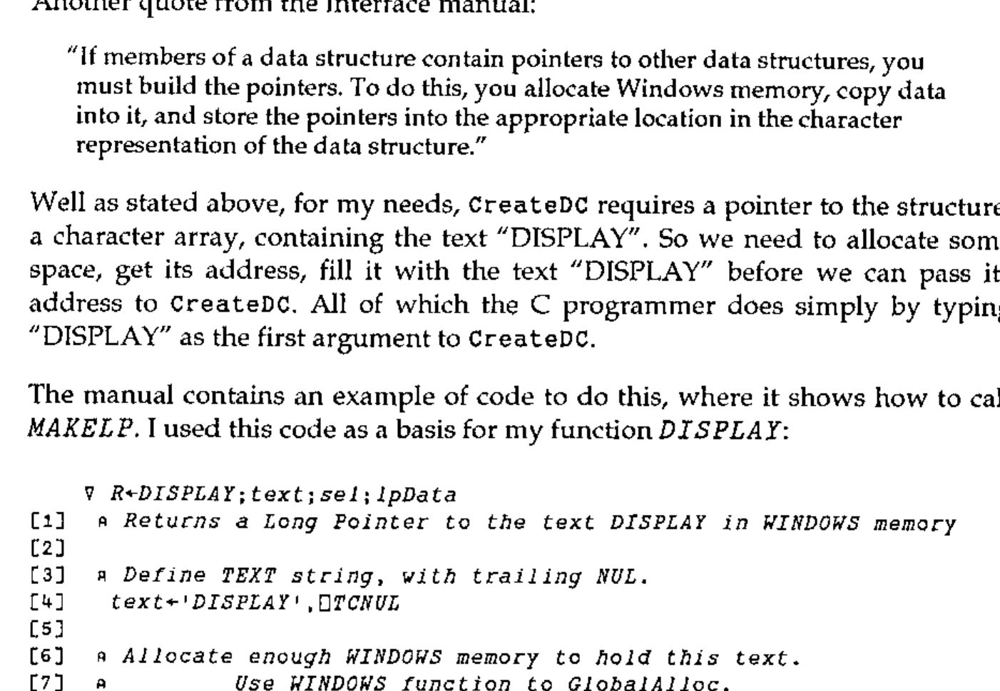

*by Ray Cannon*
{ .byline }

This review concentrates on the Windows interface supplied with Version 4 of Manugistics’ (formally STSC) APL\*PLUS II/386. The main review of the product, by David Crossley, was published in Vector 9.1, July 1992.

Over the past few months I have been converting my program which displays the Mandelbrot set to run under Windows. The majority of the program is written in Borland’s C++, but assembler has to be used for the dirty bits because even C is not fast enough! Programming Windows in C is tedious, and I offered to do this review as I wanted to see if APL would make Windows programming any easier.

The APL\*PLUS II/386 Windows interface is designed so that the basic Windows functions can be called at the lowest level. Any of the calls available to a C programmer working with Microsoft’s Software Development Kit (SDK) can be called from APL. The comparison between APL and C programming can therefore be made directly, as a workspace of Windows utilities can be compared with an equivalent library of C programs. Unfortunately, I encountered significant problems with the APL\*PLUS interface, and in this instance I think C wins.

While this review was being written, Manugistics announced APL\*PLUS II/386 Version 5. By the time this review is published Version 5 should be "available in the shops". Although I have not used Version 5, I have seen a demonstration of the Beta-test Version (4.9) given by Chris Lee of Manugistics. The Windows interface in Version 5 has been completely revised, and should rectify most of the problems I encountered with Version 4.

## Hardware

I installed the APL on an Elonex 386DX 20MHz with 387 maths chip and 4Mb of memory running Windows 3.0 under DOS 5.0.

Let me state from the outset, 4Mb is not enough. The installation guide says that 4Mb is the minimum required, and recommends 6Mb or more. With 4Mb it worked, but only just. Until I got the installation set-up properly tuned, Windows was taking 8 to 9 minutes just to load APL, from clicking on the APL icon to getting the APL cursor prompt. Once tuned for APL this loading time was cut to 2 minutes 45 seconds. Cocking and Drury, who very kindly supplied me with this review copy, recommend at least 8Mb, and in general the more memory the better. So this reviewer was lumbered with insufficient resources for the task in hand.

## Installation

The installation procedure was atrocious and took hours. The installation manual clearly lays out the steps that you have to carry out, but everything has to be done manually and there is very little that is automated. You need a good text editor to modify many files such as APL .PIF files, APL .INI files, APL .BAT files, Windows system .INI file, and not forgetting CONFIG.SYS. Some of the files are quite large, and I found I could not use the `)EDIT` facility in APL\*PLUS because the workspace was not big enough.

**WARNING**: Be sure to keep a copy of your old files. I had a major problem after editing my Windows SYSTEM.INI file. I found that running Windows SETUP, to change to a different video device driver, crashed part way through. I was unable to run Windows or SETUP, so I had to rebuild SYSTEM.INI by hand to fix the problem. According to the report given at the September BAA meeting by Cocking & Drury, the installation in Version 5.0 has been substantially improved.

## Other Software

To use the APL Windows interface to the full there is some additional software that may be necessary. Obviously, you have to have Windows 3.0 or 3.1. If you want to create icons, bitmaps, menus and other resources then you will need Microsoft’s SDK or Borland’s Resource Workshop. If you want to create Windows-style help facilities in your programs then yet more software will be needed.

## Bookware

The documentation supplied for the Windows interface consists of a single slim volume of about 64 pages. This manual states that you will also require a copy of *Microsoft Windows Programmer’s Reference* and a Windows programming guide such as *Programming Windows* by Charles Petzold. The Version 3 of the *Microsoft Windows Programmer’s Reference* costs about £36, but the *Version 3.1 Reference* is in 4+ volumes at about £30 each. Petzold’s programming guide costs £27.95 for Version 3.0 and about £39.95 for Version 3.1. I can also recommend *Programmer’s Introduction to WINDOWS 3.1* by Meyers and Doner (Sybex £32.95).

## How APL\*PLUS II/386 Works with Windows

APL\*PLUS II/386 V4 is a DOS program that can run under Windows 3.0 or 3.1, and is NOT a Windows program (unlike DYALOG APL/W reviewed by Duncan Pearson in Vector Vol.9 No.2). It does however come with a Windows program, called the *APL Agent*, via which it is able to issue Windows calls and receive Windows messages. It is important to understand how this interface works, for all but the most trivial of applications.

What actually happens is that once Windows is running, APL can be started in the usual way by selecting its icon in Program Manager. Initially Windows gives APL a DOS virtual 8086 machine, but then using a DOS extender APL boots itself into full 32-bit mode via the DOS Protected-Mode Interface (DPMI) feature of Windows. In this mode the APL and Windows environments are isolated from each other. Linking together these two environments is the job of the APL Agent, which is a normal Windows program written by Manugistics, and so has full access to Windows facilities. The Agent communicates with APL via shared memory at every timer interrupt, which occurs 18.2 times per second.

The APL Agent can issue calls to Windows functions listed in an initialisation file. It is driven by commands issued from the APL workspace and also by data from the initialisation file. Each workspace requires its own initialisation file, which has the same name as the workspace but with a .INI extension. If you want to add resources (bitmaps, icons, cursors, menus, accelerators, dialogue boxes etc.) then a workspace also needs its own Agent, and becomes a .EXE file. Agents are started automatically when APL is started.

The Agent can be made to support almost any function available via the Windows dynamic link library (DDL). That is to say, from APL, one can pass a request to the Agent to run Windows Function calls. Thus this interface is at the same level as that available to a C programmer. Each call the C programmer can make can also be made from APL.

In effect the .INI file is APL\*PLUS’s equivalent to WINDOWS.H. In C, WINDOWS.H is the header file which defines lots of macros, constants, and function declarations. It contains about 3480 lines of C code. It is a very important source of Windows programming information, even Manugistics’ slim Windows Interface Manual makes multiple references to it. Windows 3.1 requires additional header files, for which this interface provides no support or mention.

Understanding C and Windows programming is pretty important. Chapter 4 of the APL\*PLUS Interface Manual, *Understanding Windows Application Structure* states:

> "This chapter assumes that you can read and understand C source code, and that you understand the concepts of programming for the Windows environment."

If you don’t, read no further. APL\*PLUS II V4 under Windows is not for you.

Manugistics supply APLWDEF.INI as the default .INI file. It is an ASCII text file containing definitions of the most common Windows functions; 123 functions out of a total of 550 in Windows 3.0, and a lot more in 3.1. If you are going to use any of the less common Windows functions, you are going to have to add their definitions to this file, or to the .INI file for your workspace. The information needed in the .INI file can be obtained from the *Windows Programming Reference*, or from WINDOWS.H, but it will need translating in accordance with the instructions in Chapter 4 of the Interface Manual.

For those of you with Borland C, I found the easiest way of editing the .INI file was from Borland’s IDE editor which has on-line help available for every single Windows function. I could cut and paste information from the on-line help text directly into the .INI file before modifying it.

So far, I have found this the biggest hurdle to using APL\*PLUS under Windows. You need to check if every Windows function call you are going to make is included in the .INI file *before* you use it. Why Manugistics has not supplied a complete .INI file with every documented Windows function included I don’t know. I can only guess that there must be a limit on the size of this file that the system can handle. In fact two default .INI files are really needed, one for Windows 3.0 and one for 3.1. This is a fundamental part of the APL/Windows interface, and as supplied it is incomplete.

The .INI file is bound with the workspace and should contain all the calls required by the workspace. The default file, APLWDEF.INI, is searched at run time for any calls not found in the workspace’s .INI file. It is possible to edit the default .INI file during a Windows APL session, but as it is a large file you have to have plenty of Windows memory available.

As well as passing function calls from APL to Windows, the Agent also passes messages from Windows to APL. However, Windows generates hundreds of messages, most of which an APL program is not concerned with. For example, a message can be produced each time the mouse cursor is moved from one pixel to the next, so moving the mouse from the centre of the screen to a menu box could produce as many as 300 messages, and that ignores the messages produced each time the mouse crosses a Windows boundary. But the APL Agent can only pass these messages to APL at every clock tick, at the rate of 18.2 per second. Fortunately Windows has a method of gathering messages together, so you don’t lose any.

Rather than pass all messages across to APL, you can program filters in the Agent, and only pass those messages that you know you are interested in. The interface manual has 7 pages on this subject, including over a page of C source code. It’s complicated stuff, to quote again the manual:

> "Specifying complicated filtering logic improves application performance and documents the program structure effectively."

The following APL code is an example of this "effective documentation" copied straight from the manual:

```apl
                              W_FP 'WP'
'WM_COMMAND'                  W_FP 'BEGIN'
      201  203                W_FP       'BEGIN'
           'EN_SETFOCUS'      W_FP             'My_In'
           'EN_KILLFOCUS'     W_FP             'My_Out'
           '*'                W_FP             '*'
      ''                      W_FP       'END'
      301                     W_FP       'BEGIN'
           'CBS_SELECT'       W_FP             'My_Sel'
           '*'                W_FP             '*'
      ''                      W_FP       'END'
      '*'                     W_FP       'My_WmCommand'
''                            W_FP 'END'
'WM_PAINT'                    W_FP 'My_WmPaint'
W_CreateFilter w_fp
```

To be fair, this APL code is laid out to look like the equivalent C code it would be replacing.

## Using the Interface

Once I had managed to install APL and the Windows interface and run the demo, I wanted to try out programming the interface myself.

I thought it might be easy to copy an image of the entire screen into the test Window produced by the Demo workspace, using the Windows function `StretchBlt`. If run several times, this function produces a "visual echo". The Front cover of Pink Floyd’s classic LP, UMMAGUMMA, is a good example. The following was produced by copying the screen to the Clipboard, pasting it into Paintbrush, and saving it as a bitmap:



The main Windows function used, `StretchBlt`, is (partially) defined as:

```text
BOOL StretchBlt(hDestDC, X, Y, nWidth, nHeight, hSrcDC, XSrc,
YSrc, nSrcWidth, nSrcHeight, dwRop)
```

This function moves an image from a source rectangle into a destination rectangle, stretching or compressing the image if necessary to fit the dimensions of the destination rectangle. The `StretchBlt` function uses the stretching mode of the destination device context, set by the `SetStretchBltMode` function, to determine how to stretch or compress the image.

Using `StretchBlt`, the task is a simple one. *ECHO* has only 6 real lines of code:

```apl
    ∇ ECHO
[1]   ⍝ ECHO the Windows screen in the TEST window
[2]   ⍝ Get a device context (drawing surface) of the whole screen
[3]    HDCSCREEN←W_Call 'GetDC' 0
[4]   ⍝ Get size of the TEST window
[5]    RECT←C2I W_Call 'GetClientRect' hWnd ''
[6]   ⍝ Get a Device Context for the TEST window
[7]    HDC←W_Call 'GetDC' hWnd
[8]   ⍝ Copy (and squeeze) the whole screen image into the TEST window
[9]    BIN←W_Call 'StretchBlt' HDC 0 0 (RECT[3])(RECT[4])
         HDCSCREEN 0 0 640 480 'SRCCOPY'
[10]  ⍝ Release the DCs
[11]   BIN←W_Call 'ReleaseDC' hWnd HDC
[12]   BIN←W_Call 'ReleaseDC' 0 HDCSCREEN
    ∇
```

It took me over 5 hours to work out what those lines actually were. Luckily I had the source code of a similar C program to help me.

## Why did it take so long?

Well first I did not know what I was doing. I’ve written C Windows programs before, and I have written APL programs before, but I have not written APL\*PLUS Windows programs before. Also, the Windows function `StretchBlt` is not one of those included in APLDEMO.INI or APLWDEF.INI, so that it had to be added.

Next, I kept getting UAEs (Unrecoverable Application Errors). On getting a UAE, the Agent is terminated leaving the APL window stranded. Clicking on the APL icon showed the **Close** option greyed out, indicating that it was not valid. The only way I found I could remove this window, was to select **Settings** from its system menu and run the Terminate option, to which Windows suggested that I must then close down the rest of Windows and reboot the machine.

Originally, I tried to get the Device Context (DC) for the whole screen via the Windows function `CreateDC` as did my sample C program, and as Petzold’s *Programming Windows* recommends. However, I was unable to call this function successfully from APL. In C it would be called via the code:

```text
hDC=CreateDC("DISPLAY",0,0,0);
```

CreateDC requires as its first argument a *Long pointer to a string*; the string being the text "DISPLAY". Remembering that, in C, text between double quotes produces an array of type Character with a terminating Null. When an array is used as an argument to a function, only its address (a pointer) is actually passed.

Another quote from the Interface manual:

> "If members of a data structure contain pointers to other data structures, you must build the pointers. To do this, you allocate Windows memory, copy data into it, and store the pointers into the appropriate location in the character representation of the data structure."

Well as stated above, for my needs, `CreateDC` requires a pointer to the structure, a character array, containing the text "DISPLAY". So we need to allocate some space, get its address, fill it with the text "DISPLAY" before we can pass its address to `CreateDC`. All of which the C programmer does simply by typing "DISPLAY" as the first argument to `CreateDC`.

The manual contains an example of code to do this, where it shows how to call *MAKELP*. I used this code as a basis for my function *DISPLAY*:

```apl
    ∇ R←DISPLAY;text;sel;lpData
[1]   ⍝ Returns a Long Pointer to the text DISPLAY in WINDOWS memory
[2]
[3]   ⍝ Define TEXT string, with trailing NUL.
[4]    text←'DISPLAY',⎕TCNUL
[5]
[6]   ⍝ Allocate enough WINDOWS memory to hold this text.
[7]   ⍝          Use WINDOWS function to GlobalAlloc.
[8]    sel←W_Call 'GlobalAlloc' 'GPTR'((⍳0)⍴⍴text)
[9]   ⍝          GPTR defines GMEM_FIXED and GMEM_ZEROINIT memory.
[10]
[11]  ⍝ Convert the selector into a long pointer. Use with caution.
[12]   lpData←MAKELP sel 0
[13]
[14]  ⍝ Write the text to memory.
[15]   text W_Mem lpData
[16]
[17]  ⍝ Return the pointer to the text DISPLAY
[18]   R←lpData
    ∇
```

However, every time I try to run the example, or my function *DISPLAY*, I get a UAE when it tries to write the text "DISPLAY" via the function `W_Mem` into the space allocated by `GlobalAlloc`. With the help of Dave Phillips of Cocking & Drury, it was found that this bug only occurred under Windows 3.0, running the same code under 3.1 works OK.

Another small problem was that the example in the manual for *MAKELP* has a typographical error. The string had been terminated with `⎕TCNL` rather than `⎕TCNUL`. Strings in C have to be terminated with a NULL.

So because I cannot pass `CreateDC` a long pointer to the string "DISPLAY" I cannot create a DC to the entire screen via `CreateDC`. In *ECHO*, I finally got round this problem by using the function `GetDC` with a NULL parameter. This is an undocumented feature of `GetDC`, normally, you need to pass it a handle to the window for which you wish to obtain the device context. Passing it a NULL causes it to return the handle to the entire screen. This is also very much easier to code in APL\*PLUS.

Linking *ECHO* up as a callback function, so Windows calls it when certain events occur, such as a request to repaint the window, can have some quite interesting effects.

## What the Manual Says

If you feel that I am being a bit negative about this interface, here are a few quotes from the supplied manuals:

> "*You can also run APL\*PLUS II/386 as a windowed application, but performance may be too slow to be satisfactory in most applications.*" Installation Guide page 3-23.
>
> "*Sometimes APL\*PLUS II/386 takes an unusually long time to perform certain operations when running under Windows 3.*" Installation Guide page 3-31.
>
> "*Note: This function is slow already; tracing slows it down even more.*" Windows Interface page 4-8. This is referring to DemoHello1, the "Hello World" program!
>
> "*The primary reason that this program is slow is the interface used to communicate between APL and the Agent.*" Windows Interface 4-11.
>
> "*Caution: Do not run this application [DemoHello1] too many times. A Windows bug causes a UAE if a window class is registered…. more than about 7 times.*" Windows Interface 4-11.
>
> "*The Windows* `GetInstanceData` *function does not accept a far pointer. NEVER use this function. It can crash the Agent or corrupt data.*" Windows Interface 6-11.
>
> "*The fact that callbacks can occur asynchronously…. can cause normal APL name scoping to get tangled up.*" Windows Interface Appendix A-2.

## Limitations of the Interface

The interface is a very clever way of getting a DOS application interacting with Windows. With enough APL/Windows knowledge, other software resources, and plenty of computer memory, it can be used to produce Windows applications.

However, just as APL programmers want large workspaces, Windows wants as much memory as possible. Because APL\*PLUS is a DOS application, any memory it uses is not available to Windows. Effectively, the computer’s memory is split between Windows and APL. On my 4Mb machine 2Mb is available to each. If APL was running as a Windows application, the full memory would be available to Windows (4Mb in my case) to use how it wants to, including giving it all, on demand, to a single application, for example APL. But with APL running as a DOS application, this is not the case.

Another problem with the interface is that Windows functions often require parameters which are pointers to data. These pointers must point to data within the Windows memory area. They cannot point to data in the APL workspace. Hence the need to tell the Agent to allocate memory and fill it from APL. Thus parameters are often built twice, once in the APL workspace, and then again under Windows by the Agent.

So with this interface, you have half the memory available and you must double up on the data. OK, not all APL’s data needs to be duplicated. For example, if you wanted to create a large bitmap such as a screen image in APL, it would have to be duplicated in Windows. The shame of it is that APL would be the ideal language, and far better than C, to manipulate a bitmap.

## What Can it be Used For?

I have been very negative about this interface up to now. However, given that it is a DOS product, running under Windows, with the ability to interactively "program" Windows in C, it is quite amazing that it works at all.

If you have a Manugistics APL II application, which you would like to run under Windows, with a Windows interface, and the interface is only to be used to pass control information, as against bulk data, then Version 4 might be just what you want. This interface can create windows, buttons, menus etc. and pass information around relating to them. When it comes to dealing with bitmaps however, things start to get very tricky. Even so, remember that Dyalog APL/W original version did not support any graphics of this sort, while APL\*PLUS II 386 does.

## Conclusions

As a professional APL programmer, I would not attempt to use APL\*PLUS II/386 Version 4 under MS Windows for any task. If I have to write a Windows program and am given the choice between Borland C++ (I have not tried Microsoft C) and this version of APL, I will choose C++, because it is easier, better documented by both supplier and third parties, faster, cheaper, requires less Windows memory, and is far more robust.

As a tool for an APL programmer to explore the wonders (or pitfalls) of Windows programming, it has some potential, but only if you don’t mind learning quite a bit of C on the way and have a fast machine with 8Mb or more of memory.

Not all is gloom however. I attended a demonstration of Version 5.0’s Windows development interface by Chris Lee of Manugistics Inc. at Cocking and Drury in October 92. Version 5.0 should be available before the end of 1992.

The installation procedure has been improved. Chris Lee said that it took him half an hour instead of the 4 hours for Version 4.0. The Windows development interface requires Microsoft Windows Version 3.1, it will not run under Version 3.0. The recommended minimum memory is 8Mb of RAM. The interaction between the APL Agent and the DOS APL system is no longer via shared memory and clock interrupts. Now, using the Windows 3.1 virtual device driver, the Agent treats the DOS APL as a virtual device. This radically changes (for the better) the relationship between APL and Windows.

In Version 4.0 the default initialisation file APLWDEF.INI is a plain ASCII file which has to be interpreted every time it is used. In Version 5.0 it has been replaced by a "compiled" binary file, which has all the MS Windows 3.1 calls built in. Version 5.0 now includes, in Manugistics’ words, *APLGUI — an Easy-to-Use Windows Development Toolkit.*

## Final Thoughts

The Version 4.0 Windows interface is a working model, but impractical in practice. Version 5.0 looks like the real thing, for real programmers with real computers.

Do you remember the quote about Real Programmers and APL: "*Real Programmers don’t use APL, anyone can be obscure in APL*"? I think the Microsoft programmers who wrote Windows were "Real programmers".
