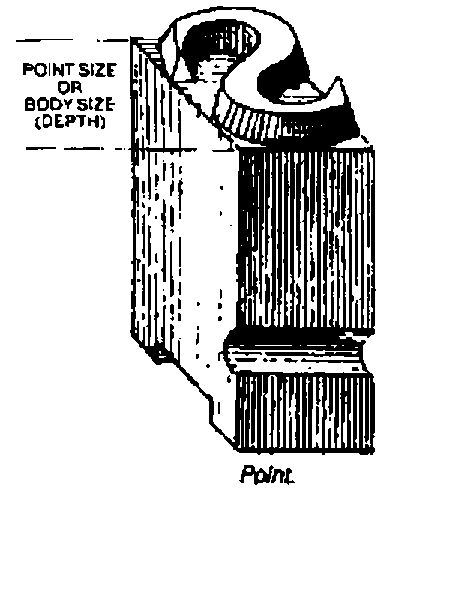

*by Ray Cannon*
{ .byline }

I thought I might have gremlins in a Dyalog APL/W system I recently produced. A letter printed on A4 paper using a standard True Type (TT) font (Times New Roman) would be printed at varying sizes, even though the same font size was requested. This was not winning me any Brownie points.

As a test I would produce a standard printout using Windows WRITE.EXE selecting the Times font with a size of 36 points (approximately ½ inch high characters) as a control, and then print the same output from Dyalog and compare the results.

Upon investigation, this behaviour appeared to be related to the printer driver being used (although now I have found an example where I can produce this behaviour by varying the printer setup for handling TT fonts between downloading as bit image and downloading as graphics).

The problem (and solution) was finally revealed after spending a couple of hours with John Daintree of Dyadic Systems Ltd.



(from *"Basic Typography — a Design Manual"* by James Craig. Published by Watson-Guptill, New York, 1990)
{ .caption }

There are two (common) ways of specifying the height of a font: you can specify the "cell height" or the "character height". To explain the difference, think back to an old-fashioned printing press with lead type. To vary the gap between lines of type, a lead spacer is placed between them. This spacer is called "leading" (as in the metal). In the simple case, the cell height is equal to the character height plus the "leading" height. It is possible to produce fonts with "built in" leading, useful if you want to have line-drawing characters able to produce continuous vertical lines (that is to say the vertical bar character extends to the full extent of the character cell).

Under Windows, True Type fonts’ point sizes specify the "character height" not the "cell height". The parameter specifying the font size that is passed to the utility that creates a (logical) font within Windows can define either the "cell height" or the "character height". This is done by using a positive number of pixels for the "cell height" or a negative number of pixels for the "character height". Under Dyalog, the Size property of the Font object supports this protocol. (When you interrogate the Size of a Font, Dyalog always returns the positive "cell height".)

Armed with this knowledge, I tested a dozen or so printer drivers (there is no need to have the physical printer attached) creating fonts specifying the size in both positive and negative pixel sizes, and then reading the size returned. The results are shown below (Table 1). From this table I surmise that the way the printer driver handles TT fonts determines how it calculates the "leading" height. In particular when the TT font is downloaded as a bit image, the "leading" height is zero.

The difference between the cell height and the character height is the internal leading, as demonstrated by the following diagram:

```text
 ---------   <---------------------------
 |       |              |- Internal Leading  |
 | |   | |   <---------                      |
 | |   | |              |                    |- Cell Height
 | |---| |              |- Character Height  |
 | |   | |              |                    |
 | |   | |              |                    |
 ---------   <---------------------------
```

```apl
    ∇ r←device Points2Pixels pointsize;res
[1]   ⍝ Returns the font "Size" property value required to generate
[2]   ⍝ a True Type font with the specified point size on the
[3]   ⍝ specified device.
[4]
[5]   ⍝ Calculate the resolution of "device"
[6]    res←+/⊃¯2↑device ⎕WG'DevCaps' ⍝  pixels per mm
[7]    res←25.4×res ⍝                  pixels per inch
[8]    res←res÷72 ⍝                    pixels per point
[9]    r←pointsize×res ⍝               pixels for point size
[10]  ⍝ Make negative as TT point size is Character height
[11]  ⍝  not Cell height, and round to integer
[12]   r←-⌊0.5+r
[13]
[14]  ⍝ NOTE Some devices such as screens, work in "logical units"
[15]  ⍝ (e.g. logical inch) rather then physical units (inches) under
[16]  ⍝ MS Windows to cater for their low resolution.
    ∇
```

## Table 1

Cell Height of font returned on requesting creation of font size (default settings):

| Driver | 50 pixels | -50 pixels |
|---|---|---|
| HP LJ II | 50 | 57 |
| HP LJ III | 50 | 50 |
| HP LJ III Postscript | 50 | 59 |
| HP LJ II Postscript | 50 | 59 |
| HP LJ IV | 50 | 57 |
| HP DeskJet 120C | 50 | 57 |
| Generic Postscript | 50 | 59 |
| Epson FX 80 | 50 | 59 |
| Canon BJ10e | 50 | 57 |
| Xerox 4045 | 50 | 50 |
| IBM ProtoPrint | 50 | 50 |
| Brother HL-6V: Download as bit image | 50 | 50 |
| Brother HL-6V: Download as graphics | 50 | 57 |

Note that ALL the fonts created with a size of -50 look the same size. Those created with a size of +50 are of varying size.

## Addendum (from Adrian Smith)

This solves a considerable puzzle for me — in particular I have always had the problem with my RAIN graphics printing that the font size was not predictable across printers. The basic message is very simple — use -ve sizes always, and what you get will be what you want. Thanks Ray!
