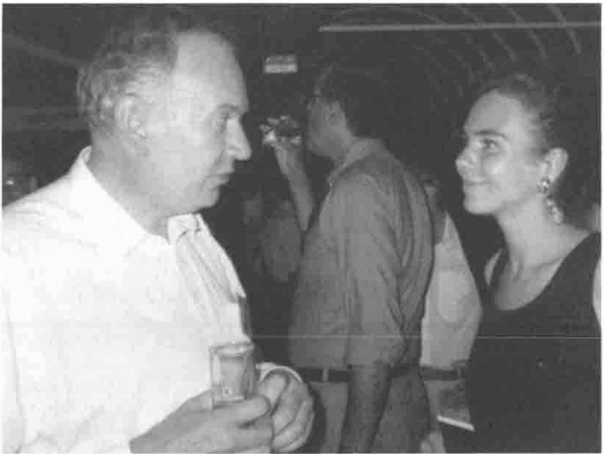
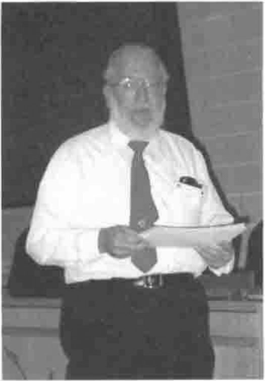
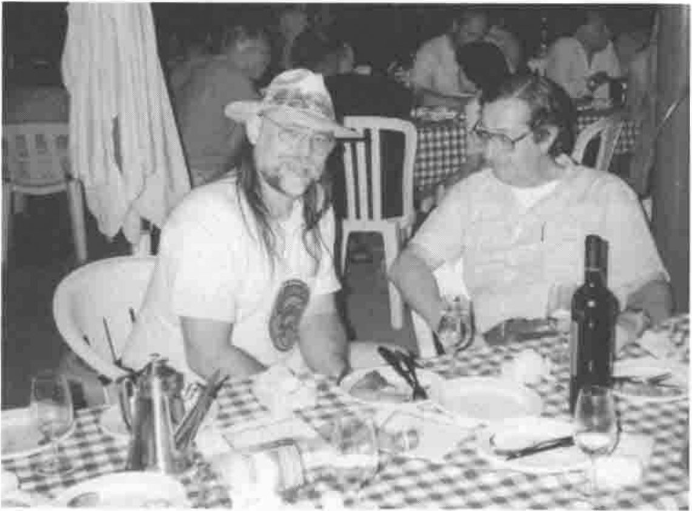

*Observations by Ray Cannon*
{ .byline }

## Work, Rest and Play in Rome, (well 2 out of 3 is not bad)

> **Official Motto "New Gems from Old Roots"** 
> **Unofficial Motto "Just in Time APL"**

## Location

Rome is one of the great cities of the world, even with the temperature in the 90s. The only drawback in holding the conference at Rome’s 2nd University was the daily shuttle bus trip from Hotel to Campus.

Even so, I found the trips interesting both for the views of daily life on Rome’s roads, and for the opportunity the rides gave me in talking to other APL98 attendees. The shuttle buses were usually on time, I never had to wait more than 10 minutes, and considering the traffic in Rome, that was very good going.

Most of the "official" hotels were located near the centre of Rome, with good access to its shops, restaurants and tourist attractions. Many of the rooms had air conditioning, most of which (but not all) worked.

At my first Hotel, the lift up to the 4th floor regularly overloaded the power supply and tripped a cut-off switch. This happened 4 times of the 5 I used the lift. But power was quickly restored, and the lift restarted. (The last time I was trapped in a lift was in St Petersburg, but that’s another conference.)

The Italian food (and wine, I was not driving anywhere) was wonderful and very plentiful, both at conference "do’s" and out and about in the city. I developed a real liking for Italian sea-food, spaghetti and clams, fruits of the sea pizza, squid salad….

## Conference Venue

The conference was held in a modern building, part of the Faculty of Economics, University of Rome "Tor Vergata", about 30 minutes’ drive from the city centre.

The facilities were for the most part excellent and worked well. The workshop room was set out with new computers installed with Windows 95, brought in for the duration of the conference. As usual, the hardest part was using the Unified APL keyboard on an unfamiliar keyboard with Italian driver. Also, getting some of Windows’ error messages in Italian caused some confusion, but that is inevitable at an international conference, unless you take your own keyboard (and drivers) along!

## Timetable

The conference was held over five days, with plenty of slack, and some duplication of items, allowing ample time to attend most of the papers and talks of interest. I think I missed only about 2 items during the conference that I would have liked to attend, due to time-table clashes. For about half the conference, there were up to 3 streams, normally one workshop, one tutorial and one paper (occasionally 2 papers and a workshop). In addition there were Plenary Sessions, Vendor Forums, and Meal breaks which did NOT overlap.

## Workshops

I attended 3 workshops, one on JavaScript and two from Dyadic on OCX and Threads.

The workshop "A Very Gentle Introduction to JavaScript" was given by Moshe Sniedovich, and was more of a tutorial than workshop. In addition to explaining what JavaScript was, it put JavaScript in its place on the web beside HTML, Dynamic HTML, Perl, Java etc. It explained very well when one should use JavaScript (for checking input acquired on web pages) and pointed out that its most common used was to discover which web browser (Netscape or MSIE) was being used to view the web page. He also explained why JavaScript (no relation to Java) should be placed in the Header of HTML rather than the body.

Dyadic tried very hard to keep their twin announcements on OCX and Threads which they made at the first Vendor Forum (Monday lunch) a secret, so the workshops they had planned for them were printed up in the programme as being on "APL as a Web Server" and "OLE revisited".

Peter Donnelly hosted the workshop on "Writing ActiveX Controls in Dyalog APL/W". It was accompanied by a 16-page set of notes which set out to:

- Create an ActiveX Control in Dyalog APL
- Define and Export Properties, Methods and Events
- Include an ActiveX Control in a Visual Basic application
- Run the ActiveX Control from a Web Browser

The workshop appeared to (and in my case actually) achieved all its objectives. It is always very difficult to set the correct amount of work to be undertaken in a workshop. The workshop should be more than just following verbatim a set of written instructions; doing something just once does not teach one the difference between the general requirements and the specifics required in the example. Doing an operation too many times becomes a bore and waste of time. Peter managed the almost impossible, in getting the balance just right. An excellent workshop, thank you very much Peter.

John Scholes hosted the second Dyadic workshop on "Threads in Dyalog APL". Now the version of Dyalog running threads was very much "pre Beta", and although the code was very solid, not all the syntax and constructs had been finalised. So we were warned that the final release version of threads might look quite different. This being the case, the workshop was not aimed at teaching us how to use the current version of threads, but rather the concepts behind threads, and how we might implement multi-tasking within our applications.

John Scholes explains the finer points of Multi-threading …
{ .caption }

Again a very enjoyable workshop, being well prepared and documented. It taught me a lot about threads and multi-tasking issues. I look forward to seeing how they are finally implemented in the next production release of Dyalog APL/W.

## Tutorials

I attended two and two thirds out of the six tutorials on offer, sadly missing the others, all of which I would have liked to attend.

Conrad Hoesle-Kienzlen gave the tutorial entailed "APL, TCP/IP and other Languages". I enjoyed the whole talk and found it in particular very instructive about TCP/IP and Windows 95. In re-reading my notes in order to write up this review, I found it impossible not to go off and try out some of the things I learnt. A very good introduction to TCP/IP.

Alexander Skomorokhov started off the tutorial on "Using OpenGL Graphics in Dyalog APL" which ended with Adrian Smith demonstrating a real application developed in conjunction with the Causeway product.

Bob Armstrong gave a three part tutorial, "CoSy: Yesterday, Today and Tomorrow", the title of which led to the following overheard conversion: "Well, today I am talking about ‘Yesterday’, the day after tomorrow I am talking about ‘Today’, and the day after the day after that, I am talking about ‘Tomorrow’."

(Unfortunately, due to a misunderstanding on my part, I missed the first part on "Yesterday" going instead to the Monday version of a Bob Bernecky paper, which was repeated on the Wednesday without any conflicts. Hence the "two thirds" in the above.)

Bob Armstrong is always worth listening to. For those of you who have never met him (you would not forget if you ever had) Bob is very intelligent and full of life. He lives in New York and travels around Manhattan on a motorised skate-board with his laptop. He very rarely lets himself finish a sentence, but goes off at a tangent as soon as one thought is out. This chaotic style along with some very late nights in the company of (amongst others) some of the Vector working group, led to some amusing talks about CoSy its past, present, and its future.

(At this point I would have liked to include a photo of the three Bobs singing "When the red red robin goes Bob, Bob Bobbing along" which I have in my possession, but this idea was vetoed by somebob in the Vector working group.)

## Papers

As a long term fan of Bob Bernecky, I was disappointed in only being able to attend one of the two papers he gave. However I did manage to attend it twice! In "Reducing Computational Complexity with Array Predicates" Bob discussed some ideas that may allow automated optimisation. The idea is that certain information about data (Array Predicates) can be "tracked" as it is modified as it passes through functions, and that this information can be used to optimise the expression. Without this extra information, the expression has to be implemented in a far more general (and hence inefficient) manner. Now the cost of tracking this information in an interpreter would be far too high to be worth the effort, but it is well be worth the time for an APL compiler and thus has been implemented in "APEX" (Bob Bernecky’s APL compiler).

The title of Enrique Alfonseca’s paper "Writing a Compiler’s Compiler in APL" ensured my attendance. In it, Enrique described a compiler written in APL2 that can (like LEX or YACC) automatically generate a compiler for a given language. The object of this paper TWS (Translator Writing System) takes as its input a "complete description of the language including its grammar in Backus normal form".

Jack Rudd
{ .caption }

Another of my favourites at APL conferences is Jack Rudd "APL’s fastest gun". His paper "Large Scale Space Object Tracking using APL2" (written with Richard Marsh, and Marcus Munger Ph.D.), completed his trilogy ("Roles of APL in Satellite Surveillance" from APL93 and "Real-time APL Prototype of a Wide-area Differential GPS System" from APL96). He describes how a set of 20 satellites in low orbit could keep track (via infrared imaging systems ) of ballistic missile launches and then track them against a background of stars and 7666 other artificial space objects.

In his paper, "Simplifying Array Processing Languages" Neville Holmes put forward some radical but very interesting ideas to simplify APL-like languages. One such idea was to make ALL functions strictly dyadic. This would require the introduction of a C-like "VOID" construct which Neville called "ZILCH". Zilch as the left and right argument would produce a niladic form. Zilch as a left argument would produce a monadic form. Zilch as a right argument would produce a different monadic form. Zilch as the function would be equivalent to a diamond separator.

Walter Spunde and Peter de Voil’s paper "A Web-interfaced Array-based Mathematics Course" gave a fascinating insight as to where education on the web is headed. The idea of a web-based interface giving access to a J server as an integral part of a maths course, allowing a remote student to see the result of an expression plotted on his web browser, is outstanding.

## The Survivors’ Party

Following the formal closing of APL98, with a call for papers and participants and organisers for APL99 in Scranton PA (USA), all the survivors of APL98 were invited to a Bruschetta and Wine party hosted by Bob Armstrong. Here our hard-working hosts got the opportunity to let their hair down and join in the fun. A great time was had by all. On behalf of all the survivors, may I take this opportunity to thank Bob.

Assorted Debris at the Survivors’ Party (Bob Armstrong with Paolo di Chio)
{ .caption }

## One Final Remark

Overheard at APL98 "… It’s a lovely country, except it’s full of APL’ers."
