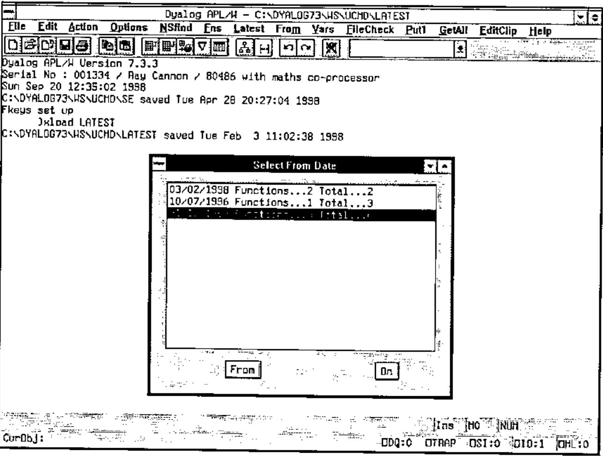
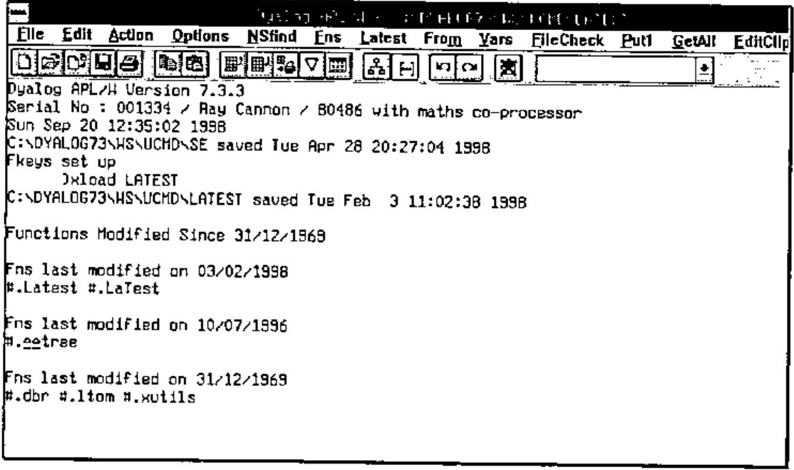
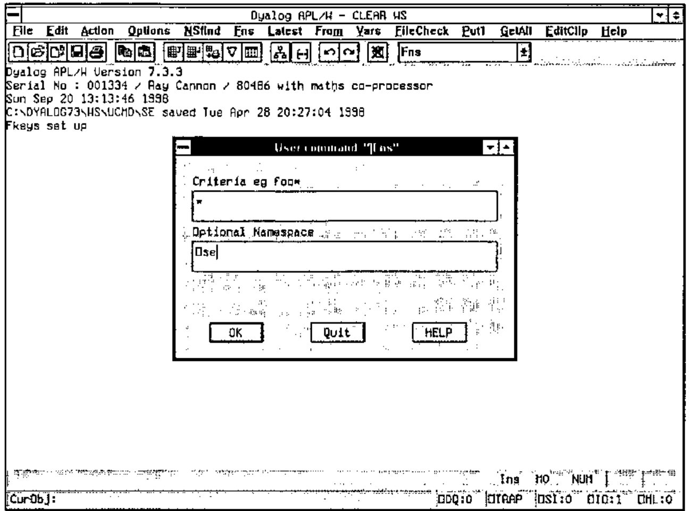
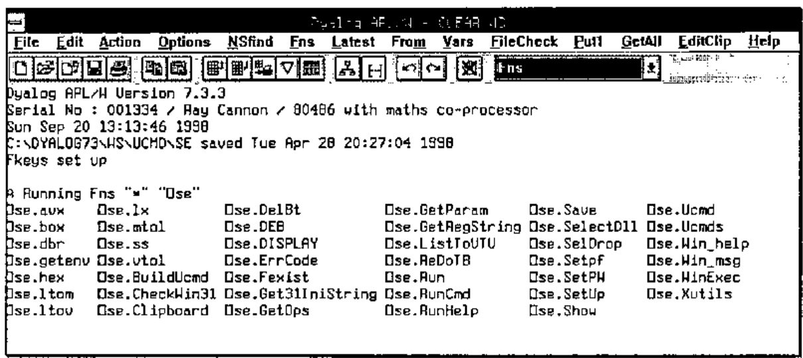

*by Ray Cannon*
{ .byline }

In the first part of this series of articles, I described the code I use to implement pseudo "User Commands" via Dyalog’s `⎕SE` namespace and APL code held in workspaces. In this article I will describe some of the utilities I use via this command processor.

All the Dyalog workspaces described in this series should be available on the *Vector* web site. The on-line versions will be the latest available, and will be added to over time, so may not exactly match what is written here. At the time of writing, the DWS will have been saved from Dyalog 7.3 (Windows 3.1) and have been tested under Dyalog 8.1 (Windows NT 4.0).

## Utility Workspace UCMD\LATEST.DWS

This utility sorts every function (and operator) in the currently loaded workspace by its modified date, and then lists the fully qualified name (i.e. including its namespace path) of only those functions modified on the latest date found.

I find this very useful to show me either what functions I have modified today, or what functions were changed in the workspace when the last set of changes was made. Being a VERY lazy typist, to re-edit a function I have changed today, I will often click on the "Latest" menu option, and select the function to be edited by double clicking on one of the listed functions, rather than type in its name!

The utility uses the `⎕AT` system function to get the last modified date of each function / operator found in each namespace. The utility function "`∆∆tree`" is used to return a vector of namespaces making up the namespace tree.

## Utility Workspace UCMD\FROM.DWS

This is a variation of LATEST. Here again the utility sorts every function by modified date, and then displays (in reverse chronological order) the date and (a) the number of functions last modified on this date, and (b) the total number of functions modified on or later than (from) this date.

The user then selects a date and presses either the "FROM" or "ON" button.





## Utility Workspace UCMD\FNS.DWS

The utility *FNS* is based on the standard APL system command `)FNS` and is available in two forms, the niladic form via the menu bar and an ambivalent form via the drop down box on the tool bar. (Actually I find it more useful to return both Functions and Operators, not just functions.)

Unlike `)FNS`, the functions are listed in columns alphabetically down the page. The number of columns depends on the width of the page and the number of characters in each function name within that column. All rows are filled in every column except for the last.

The niladic form returns a list of all the functions in the current namespace of the currently loaded workspace without any selection. This is the same list as `⎕NL 3 4` would produce.

The ambivalent form requires a criteria selection (using \* as a wild card *e.g.* A\*E would select AGE and AXE but not ASS) and optionally a namespace. Unlike the niladic form, the resulting list is of fully qualified names. (i.e. including the namespace path).





## Utility Workspace UCMD\VARS.DWS

The *VARS* utility is to `)VARS` as the *FNS* utility described above is to `)FNS` (need I say any more?).

Actually I have programmed my PFkey 12 to return :

```apl
⎕SE.Show ⎕SE.UCMD 'Vars dbx_*'
```

I find this useful as I always start the names of my Causeway control variables with leading "`dbx_`" characters; pressing this PFkey will therefore list them all.

## Utility Workspace UCMD\STORE.DWS

The commands *Store*, *Put1* and *GetAll* are related. You may use them to copy functions between workspaces or namespaces via the "store file".

The (menu bar) command *GetAll* retrieves all the objects currently "on file" and fixes them in the current namespace. This action "clears" the "store file".

The (menu bar) command *Put1* takes a copy of the current object and adds it to other objects (if any) already "on file".

The (combo box) command *Store* will add all the (user specified) objects to other objects (if any) already "on file". If no objects are specified, the list is automatically created via a "LATEST" command. (Useful for backing up all the changes made to functions in a workspace.).

## Website address:

www.vector.org.uk/v151/quadse.zip
