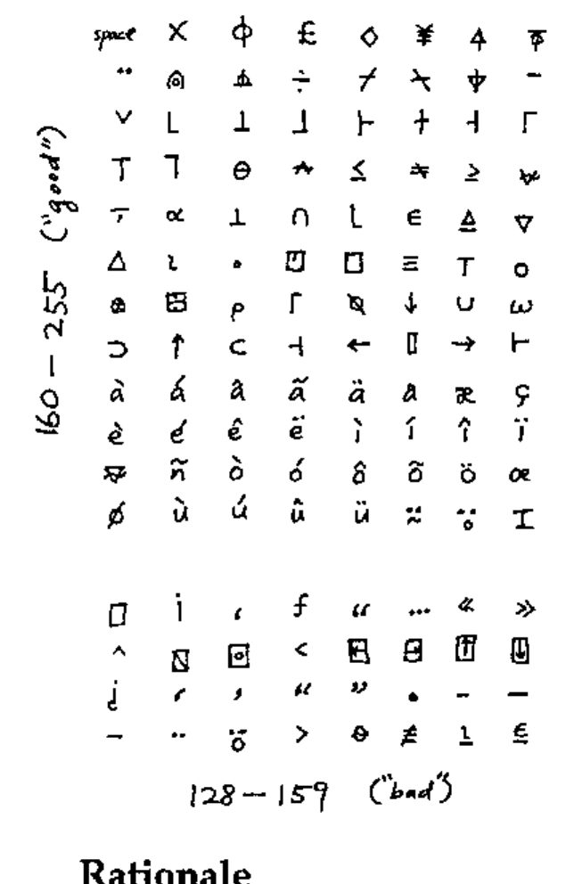

*From: Bill Chang, Recd at APL95*
{ .byline }

## Proposed Common APL Coding

I can view, enter, edit, print APL from just about any application, including the command line; the first version of this note was posted to comp.lang.apl in March 1994.

Here’s my (revised) common APL coding. I’ve implemented it on the Mac and Sun (xterm). I’ve found that WWW’s HTML file transfer protocol passes 8-bit characters (as opposed to &amp;#NNN) just fine, in accordance with documentation. You should see a table of ISO Latin1 (8859-1) characters. Since I already have APL fonts installed on my machines, I see APL characters, both through news (rn) and the web (mosaic and also lynx, a portable character-based web browser that works great). It works for e-mail too, using the MIME protocol.

## Rationale

In the October ’94 issue of Vector (11.2 p. 105) Adrian Smith proposed a common APL encoding for Microsoft Windows that includes (most) lower-case national characters but not upper-case. My major critique of this encoding (compatible with APL\*PLUS) is that it uses the range 128–159 indispensably. While this is fine in Microsoft Windows or the Macintosh (which can even use most of 0–31), many network gateways and modem / terminal programs either treat 128–159 as 0–31 control characters or mis-handle them in other ways. For example, xterm (X windows) refuses to display 0–31 and 128–159. The well-established ISO Latin1 (8859-1) encoding avoids 128–159. Almost all modern computers already support this 8-bit standard, and mail/news/web have come very close as well. As a result, we can expect 8-bit characters (at least 160–255) to be freely usable and transmittable. I believe APL can hitch a ride with very little effort. I have created a new encoding that places "essential" APL glyphs outside the "dead characters" 128–159, as much as possible.

## Software Availability

I can provide the following on request:

- PC/Windows fonts. (DDE keyboard that works in all applications is in progress.)
- Macintosh screen font and custom keyboard mapping (drag-and-drop into system) that work in all applications.
- The popular shareware terminal program Zterm 0.9, patched to use APL font.
- Instructions for making APL the system font (instead of Monaco), so the Mac becomes an "APL machine".
- Sun (X windows) screen font (BDF format) and keyboard mapping (xterm resources) that can be used in all xterm-based programs, such as the command shell, unix utilities, and text editors.
- Simple installation instructions.
- A re-encoding of Adrian Smith’s APL2741 (Type 3) PostScript font.
- Printing instructions and utilities.

(Some are not yet finished but are trivial.)

The custom keyboard is *bona fide* APL — Caps Lock toggles between "unified" and "standard" APL keyboards. The font originated in 1987 as a hand-edited, highly optimised version of Courier/APL\*PLUS that has the same bitmap size as the Mac’s system font (Monaco 9). Over the years it has been revised and re-encoded for APL2 (RS/6000), VAXAPL, and APL.68000. I’m also working on finishing a larger bitmap font and possibly a TrueType font, as time allows.

Please comment. Can someone port this to the PC?

Bill Chang
