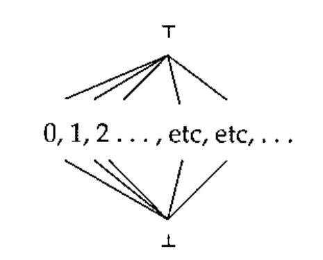
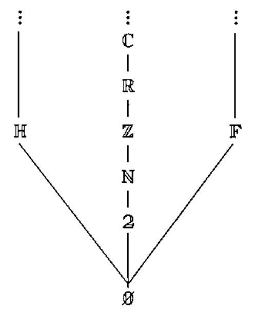
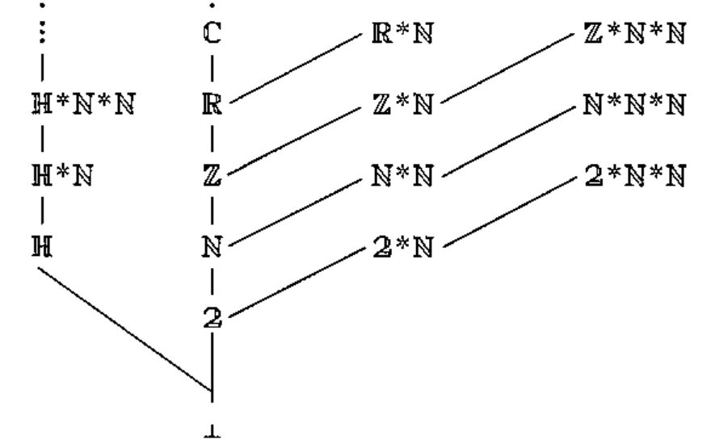
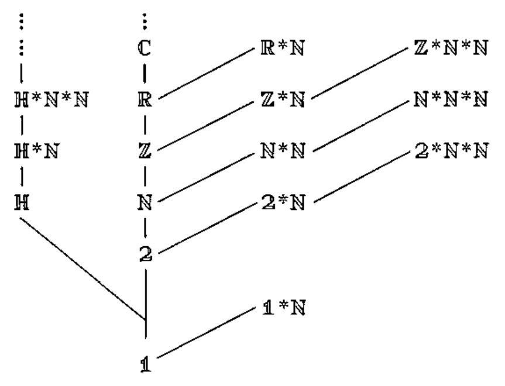

*by Phil Chastney*
{ .byline }

## introduction

What should the fill value be if we overtake a vector of arrays?

One possible answer is to allow the null elements that occur in index lists, so that, e.g,

```apl
3 ↑ (A;B)
```

would return `(A;B; )`, which looks promising, but what is that third value?

Some pointers to an answer came up in the consideration of possible maximal and minimal elements in a domain.

## *top* and *bottom*

**1.1** Thus far, we have had domains, and expressions involving domains, and these have been carefully quarantined from the rest of APL. At the moment, their only point of contact is the membership tests like `x∊ℕ`, where the left argument is an APL expression and the right argument is a domain expression.

There are, however, other interesting attributes of a domain which (sometimes) yield ordinary APL values. Among these is the question of bounds. The concepts will be familiar to many from a study of real analysis, where an interval or a series may have a least upper bound (lub, supremum, or sup) and/or a greatest lower bound (glb, infimum, or inf).

When discussing domains, we shall call these values the **top** and the **bottom** of the domain, and denote the top and bottom of domain D by `⊤D` and `⊥D`. From intervals, we are also familiar with the idea that the glb and lub may or may not be part of the interval. The interval ( 0 ≤ x &lt; 3 ), for instance, includes its lower limit 0 but not its upper limit of 3. Although bounded above, there is no greatest number *within* that interval. A similar situation is found with the natural numbers, ℕ. The natural numbers start with 0, and carry on from there: there is no largest natural number. The series as a whole, however, is bounded above by the first of the transfinite ordinals, commonly denoted by ω. If top and bottom were incorporated into APL, we would be able to write an expression whose result would be an infinite quantity — interesting, perhaps, but not obviously useful.

**1.2** It should be pointed out that the terms "top" and "bottom" are not used here with the same meanings as are employed in mathematical semantics and domain theory. In mathematical semantics, the domain ℕ includes both top and bottom elements, and there is no ordering between the natural numbers, giving a particularly simple type of lattice, thus:



**1.3** The domain ℤ consists of all the integers: …, -3, -2, -1, 0, 1, 2, 3, …, etc, etc, ad infinitum. Clearly, this series too is bounded above by ω. It would also appear to be bounded below by some sort of negative infinity. However, if we re-order the series as follows: 0, -1, 1, -2, 2, -3, 3, … we can see that for every element of ℤ there corresponds exactly one element of ℕ, and vice versa. Ergo, there are just as many elements in ℤ as there are in ℕ.

Perhaps unsurprisingly, the values of top and bottom depend on the way the elements are ordered. At least for numeric domains, there appears little value in permitting user-defined ordering, so we shall use the ordinary arithmetic ordering.

**1.4** The domain of real numbers, ℝ, is a little more difficult. It has been known for a long time that it has a cardinality greater than ω, and is therefore the first uncountable infinite domain most of us encounter. This quantity, usually known as the "cardinality of the continuum", is commonly denoted by *c*.

The domain ℂ, the complex numbers, introduces another factor: its elements can only be partially ordered, there being no obvious sense in which 3j4 can be said to be numerically greater than or less than 4j3, for instance.

## *"fill"* elements

**2.1** We, however, are looking for suitable "fill elements" (or "characteristic values") which can act as "prototypes" or "archetypes". It is desirable, but not compulsory, that a domain should have a fill element defined, something after the fashion of DEFAULT values in SQL. Where one is defined it must be an element of that domain, meeting the type and other constraints of the domain, but leaving other attributes as free as possible.

**2.2** A suitable symbol for the fill element can be made up by combining the symbols for top and bottom, thus:

```text
⌶D
```

which encapsulates the idea that the fill element must be greater than or equal to the bottom limit and less than or equal to the top limit. If it helps, `⌶D` may be thought of as the "initial value" for the domain.

**2.3** Where `(⊥D)∊D`, for a domain D, the bottom value makes a good choice of fill element. This is the case with 𝟚 and ℕ, and for good practical reasons, the same fill element is used for the other numeric domains. To find a suitable fill element for a given domain, we need to look at the ordering (often a partial ordering) within that domain. Strings, for instance, can be ordered lexicographically, and the space character sorts ahead of all others in almost all collating sequences, which makes it as close to a "bottom element" as we are likely to get, making it an excellent choice for the fill element for ℍ.

Note that it is not just primitive domains which can have fill elements. The domain `(ℕ*ℕ*ℕ)` of all rectangular arrays of natural numbers has a bottom element of the scalar 0, the vector domain `(ℕ*ℕ)` has a bottom element of `⍳0`, while for a specifically matrix domain, `(⊥ℕ*ℕ*2)=(0 0⍴ 0)`.

So, if we want to identify a fill element for `𝕌*ℕ` (vectors of arrays), the first question we need to ask is: what is `⊥𝕌`?

## 3. a lower bound for 𝕌

𝕌 is the universal data domain, containing all the admissible values within the language. This includes all the scalar elements from the primitive data domains. The primitive domains themselves are members of 𝔻, and include the character and numeric domains. These primitive domains may themselves be partially ordered: if we use `<` to denote "precedes" in some sense, then we can say `𝟚 < ℕ < ℤ < ℝ < ℂ`. (A totally ordered subset like this is often referred to as a **partial chain.**)

But ℍ does not fit into that chain. Neither does 𝔽, the set of applicable functions. So far, then, our domain 𝔻 looks like this:



although this picture is still incomplete.

The scalar elements of 𝕌 can be ordered[^1] the same way their domains are order in 𝔻. Arrays constructed therefrom can ordered by rank and length of dimension:



and so we see our partially sorted universal data domain growing. But this isn’t helping with the problem at the root. We do not need to grow this tree to see that no ordering relation holds between character scalars and numeric scalars. The same would be true of any other primitive data domains we might introduce (𝔽, for instance, if functions were made first class objects), so that `(⊥𝕌)` cannot have any structure, and cannot be a member of a primitive domain. In short, `(⊥𝕌)` has no type, no shape and no value.

## 4. *null* values in APL

**4.1** Actually, it does have a shape, it is just that its shape vector is empty. For reasons we can go into later, it is perfectly consistent to think of `(⊥𝕌)` as being scalar.

Not unreasonably, `(⊥𝕌)` is called *"null"*. Some care is needed in the use of the term "null": too often it is used as a synonym for "empty", but it is best equated with the adjective "undefined". It is also helpful to treat expressions like "the null object" as oxymorons.

**4.2** So, on to the next question: is `(⊥𝕌)` an element of 𝕌?<br>
To quote Sam Goldwyn, "That’s a definite maybe".

There are no functions which can act on undefined values, and there is no way of defining such functions. In the normal course of events, we cannot even view undefined quantities:

```apl
      A
VALUE ERROR
      A
      ∧
```

and we would expect the same sort of treatment here:

```apl
      ⊥𝕌
VALUE ERROR
      ⊥𝕌
      ∧
```

**4.3** Null values are not admissible values, but they are nonetheless a part of the language, since, in a limited number of contexts, an element of a list may be null – the most interesting instance of this phenomenon being that of index lists.

Each dimension of an array may be indexed by a sequence of non-negative integers: `ℕ*ℕ`, in the simplest case. These indices may also be structured as arrays, which means that each dimension may be indexed by an element of the domain `ℕ*ℕ*ℕ`. If the target array has *k* dimensions, then the index list also has *k* elements, and is therefore of the form `(ℕ*ℕ*ℕ)*k`, which is a member of `(ℕ*ℕ*ℕ)*ℕ`, our first approximation to the domain of all index lists.

But the story does not end there. We are also permitted to write `V[ ]`. The syntactic element between the two brackets is a null string, indicating that this element of the list is null. Now `V[ ]` and `V[⍳0]` deliver different results (for non-empty V). In the latter case, the index list is an empty vector; in the former case, the index list is *null* (or "undefined"), and they are clearly different things.

In `M[ ; ]` we have a 2-element index list, each of whose elements is *null*.

**4.4** Null elements could also occur in right argument to `⎕FMT`, and were ignored, as were null elements in old-style function headers. More interesting, though, is the example of mixed output, where the command

```apl
'→';;'←'
```

used to print out a null string between the arrowheads, back in the good old days, when such things were considered acceptable. These null strings do not have to be part of a list, either. In immediate execution mode, try typing a null string, followed by Return. The interpreter will respond by displaying your null input as null output.

**4.5** It would appear that "explicit" null values (those found in the input at translate time) are treated differently from null values occurring accidentally (those found at run time). This will be because an exception is raised immediately if an undefined value is found whilst dereferencing a variable or initialising an anonymous temporary. (This effectively outlaws `A←⊥𝕌`, which is a pity, because it would have been a nifty way to erase a variable.)

## 5. the "unit domain"

**5.1** Clearly, `(ℕ*ℕ*ℕ)*ℕ` is inadequate as a description of index lists. The problem is: how to extend it? It will be noted that *null* occurs as `⊥𝕌`, while `⊥𝔻` is ∅. But `(⊥𝕌)∉∅` because ∅ is empty, so it must be part of some other, previously unidentified, domain.

A number of different approaches have been taken to this boundary value problem[^2]. Tennent (p36), for instance, says, "we adopt the convention that D<sup>0</sup> = {*null*}, that is to say, the singleton whose only element is *null*", but Bird and Walder (p33) say, "there is no concept of a one-tuple". Watt (p54) defines a domain "Unit – whose only element is the 0-tuple ( )", while Gordon (p15) introduces an unnamed domain {*unbound*}.

APL has always distinguished scalars from single-element vectors, and the language is the better for it. Can we find a candidate for 𝟙, our own "unit domain", which preserves this distinction?

**5.2** The first thing we have to do is resolve an identity crisis. If we use `(νD)` to denote the cardinality of a domain D, we would expect

```text
(νA⊕B) = (νA) + (νB)
(νA⊗B) = (νA) × (νB) .
```

We would also expect

```text
(νA⊗𝟙) = (νA)
```

which means that 𝟙 must have cardinality 1, i.e, the domain must contain a single element.

Likewise, in the domain of pairs, ⟨A;B⟩, the cardinality is `(νA)×(νB)`, and we would expect the domain of triples ⟨A; ;B⟩ to have precisely as many members, given that the middle element is a constant.

For scalar and/or vector domains A and B, in `(A⊗B)` we would expect

```text
(∀x∊A)(∀y∊B)(ρx,y)=(ρ,x)+(ρ,y)
```

If B is the unit domain, then the elements of A are extended in length by 1, by the catenation of an undefined value.

So we know that 𝟙 has a single element, and that single element has a shape of `(⍳0)` or `(,1)`. The candidates, then are the domains {*null*} and {⟨*null*⟩}. Because we want something with no more structure than `⊥ℍ` or `⊥𝟚`, the simpler of these is preferred, making 𝟙 the domain whose only element is an undefined scalar value.

**5.3** Exponentiation (domain repetition) can be applied to 𝟙, thus:

| | |
|---|---|
| 𝟙 | contains an single undefined value |
| 𝟙\*0 | contains a zero-length tuple |
| 𝟙\*1 | contains a unit-length tuple, whose contents are *null* |
| 𝟙\*2 | contains an ordered pair, whose elements are both *null* |
| 𝟙\*3 | contains an ordered triple, with all elements *null* |

(The elements of `𝟙*ℕ` are vectors whose shape has been defined, but whose values have not.)

We can now define the domain of index lists in all its glory:

```text
(𝟙⊕ℕ*ℕ*ℕ)*ℕ
```

which says that an index list is a one-dimensional list each of whose elements is either null or a rectangular array of natural numbers. (Note that this domain contains the element `(𝟙⊕ℕ*ℕ*ℕ)*0`, a 0-length list suitable for indexing scalars – a facility not normally included in APL implementations.)

## 6. a "fill" element for 𝕌

**6.1** To return to our earlier question: is *null* an element of 𝕌?

Assuredly so, but only as an element of an array. It is a permissible right argument to (the indexing part of) the primitive function "`[`", so we can enhance our earlier diagram for 𝕌, as follows:



**6.2** This might seem to imply that null values are a part of the domains of other primitives. A similar situation obtains with the reciprocal function, whose domain is commonly cited as ℝ, when in fact the reciprocal of zero is not defined – there is no requirement that a function be defined for <u>all</u> the values in its domain. The exclusion of *null* from a domain, however, is such a common requirement that it is more convenient to redefine 𝕌. We can exclude scalar *null*, because null elements are admissible values only when they exist as elements of nested arrays. Unfortunately, the simplest rewrite:

```text
ARRAY_OF ← λx∊𝔻:(x*ℕ*ℕ)
SIMPLE   ← (ARRAY_OF ℍ)⊕(ARRAY_OF ℝ)
NESTED   ← (ARRAY_OF*ℕ)SIMPLE⊕𝟙
```

will not work, because `(ARRAY_OF*0)` would admit scalar *null*. We have to enforce a minimum length of 1 for the rank vector of the nested arrays, and ensure that the constructor is applied at least once, thus:

```text
SIMPLE   ← (ℍ*ℕ*ℕ)⊕(ℝ*ℕ*ℕ)
ENCLOSE  ← λx∊𝔻:(x*ℕ⊗ℕ*ℕ)
NESTED   ← (ENCLOSE∘ENCLOSE*ℕ)SIMPLE⊕𝟙
```

Our universal data domain is given by `𝕌=(SIMPLE⊕NESTED)`, and when we want to <u>admit</u> the possibility of a given semantic unit being an unstructured *null*, we can use `𝕌⊕𝟙`.

## 7. treatment of *null*

SQL, which has, after all, been dealing with nulls for years[^3], insists that nulls lie outside the domains of all arithmetic and aggregation functions, and (with one exception) all comparisons. This seems like a reasonable stance to take with APL as well.

In practice, the interpreter traps inappropriate nulls, preventing them from being passed through to most functions. This behaviour is not always convenient, however. Instead of

```apl
      T←¯3↑(B;C) ⍝ so that T ↔ (;B;C)
      A←↑T
VALUE ERROR
      A←↑T
        ∧
```

it would be nicer to be able to detect these things before they blow up in our faces.

There are two similar approaches to this:

(i) testing for nulls explicitly, with an expression like `(x∊𝟙)`, which would mean the interpreter detecting domain membership tests *before* raising an exception — this would be somewhat similar to the SQL predicate "IS NULL" (the space is important);

(ii) adding in a primitive function equivalent to SQL92’s ISNULL function. Its syntax is

> ISNULL( *check_expression* , *replacement_value* )

and it would be employed approximately thus:

```apl
T←¯3↑(;B;C)
A←ISNULL(↑T;⍳0) .
```

## 8. related matters

**8.1** There is a related problem involving another level of detail:

Can we distinguish the following items?

- a numeric vector
- a length-1 numeric vector
- an empty numeric vector
- a numeric scalar
- an uninitialised variable, constrained to numeric values

The answer to that last one is: not yet, but maybe some day soon.

**8.2** There remains a problem with syntax: since *null* is denoted by the null string, how do we interpret the expressions `( )`, `[ ]` and `{ }`? Are they strictly empty, or do they enclose a *null*?

**brackets, [ ]**

> This is the easy case: these are used for indexing, and the length of the enclosed list is always equal to the rank of the left argument. For vector left arguments, then, the brackets enclosed a list of length 1, and therefore cannot be empty.

**parentheses, ( )**

> By analogy with the treatment of strings, `( )` should be used to denote the 0-length vector of arrays, as illustrated below:
>
> | | | | | |
> |---|---|---|---|---|
> | ℍ\*∅ | e.g: `'a'` | | 𝕌\*∅ | e.g: `(A)` |
> | ℍ\*0 | `''` | | 𝕌\*0 | `()` |
> | ℍ\*1 | e.g: `,'a'` | | 𝕌\*1 | e.g: `↓(;A)` |
> | ℍ\*2 | e.g: `'ab'` | | 𝕌\*2 | e.g: `(A;B)` |

**braces, { }**

> Usage here is inherently ambiguous, and could denote either ∅ or 𝟙. It may be that ∅ will ultimately be proved unnecessary, but in the meantime, we can avoid the use of `{ }`, and always refer to the domains by name.

**8.3** More importantly, in the meantime, some of the earlier writings will need amendment, so that 𝟙 is used where ∅ had previously been mis-used.

**8.4** Finally, the problem of finding fill elements has its own lower limit, and this is close to it:

```apl
      THREE←{3}           ⍝ define a domain containing a single element
      ⊥THREE              ⍝ the bottom element of that domain
3
```

If we then, by some method so far unspecified, constrain V3 to vectors of 3s:

```apl
      V3∊THREE*ℕ ⍝ confirm that the constraint is operative
1
      1↑V3←0⍴V3           ⍝ the result of overtaking an empty vector
 3
```

## 9. references

**9.1** Scott’s use of "top" and "bottom" is described fairly informally in the appropriate entry (p.74) of

> ACM Turing Award Lectures, The First Twenty *Years, ACM Press [1987]*

and much more formally in

> C A Gunter, D S Scott, *Semantic Domains*<br>
> [in] J van Leeuwen [ed], *Handbook of Theoretical computer Science, Volume B* North Holland [1990]

**9.2** The full references for the sources cited in §6 are:

> R D Tennent, *Principles of Programming Languages*, Prentice Hall [1981]
>
> Richard Bird, Philip Wadler, *Introduction to Functional Programming* Prentice Hall [1988]
>
> David Watt, *Programming Language Syntax and Semantics* Prentice Hall [1991]
>
> Michael J C Gordon, *The Denotational Description of Programming Languages* Springer-Verlag, New York [1979]

[^1]: note that, in the upper diagram, the elements shown are *members* of 𝔻, while in the lower diagram they are *subsets* of 𝕌

[^2]: the early page numbers indicate that it is a fundamental issue

[^3]: Certain database luminaries, such as Chris Date and David McGovern, have argued against the inclusion of nulls in databases. They may have a point when it comes to relational databases, but database languages do not normally have to deal with dynamically changing type: for them, a value in a column will always be of the same type.
