*by Klaus Klug Christiansen*
{ .byline }

This article is a cut down version of the presentation I did at the FinnAPL Forest Seminar in February 2001. It gives a brief introduction to the basics of handling logical constraints by arrays, which in the world that I am currently part of, we like to refer to as Array-based Logic.

The Ph.D. thesis by my boss Gert Møller "On the Technology of Array-based Logic" covers all that is described in this short article, and conversely this article of course covers only the very fundamentals of Array-based Logic and the contents of the thesis. The thesis as a whole can be downloaded as a PDF-file from the Web: www.arraytechnology.com/technology.asp .

## Basis

Array-based Logic is all about handling variables and relations between these variables. In the basic approach variables are represented by axes and the relations between the variables are represented by the content of the array that is spanned by the axes.

An example says more than many words. Here are some relations, expressed by arrays:

Each axis expresses all possible values of the variable that it represents. The content of these arrays is strict binary, since it expresses whether a combination of variable values is valid or not. 0 means that a particular combination is invalid, 1 means that the combination is valid.

## Combining Relations

But these are all independent relations. Before you can start making conclusions on what will happen, when the same variables form part of more than one relation, you’ll need to be able to combine relations, to put smaller relations together to make bigger relations, or in our terminology: to join relations.

A new array to represent a joined relation is made by combining the axes from the relations that are to be joined. If two relations (arrays) are being joined, and they respectively have 2 and 3 variables (axes), the joined relation will have 5 axes.

The content of the array still represents the relation.

In figuring out how to fill the new array (describe the relation), keep in mind what you are trying to achieve: combinations of variable values should be valid in the joined relation only if they are valid in each of the relations that are being joined. Or in other words: in the new array only combinations that are represented by a 1 in each of the initial arrays should result in a 1. This is easily done with the Cartesian product between the arrays:

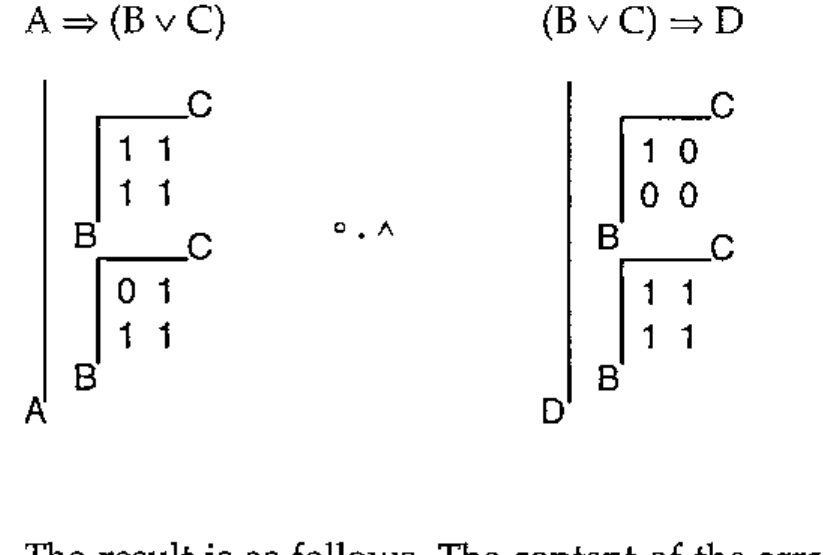

The result is as follows. The content of the array has been left out intentionally, in order to enhance clarity. Also, the order of axes might not be indicative of what the result would be, if this operation were performed in APL.

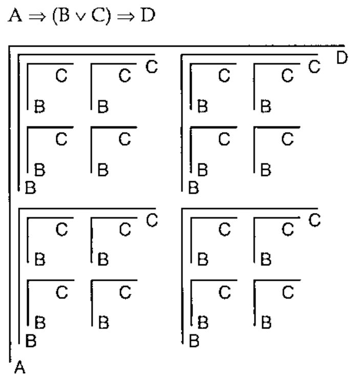

Now we have the joined relation, but the result is not ideal for practical use, since some of the variables in the relation are represented more than once, i.e. there is not a one-to-one mapping between the variables in the relation and the axes in the array. What you would want to do now is to reduce the number of axes in a way that the result has only one axis per variable. How can this be done?

Again you should keep in mind what the trouble is, and what the result is that you are trying to get at: a number of axes (more than one) represent the same variable, and you only want one.

When a variable is represented by more than one axis, some of the content of the array spanned by these axes is superfluous, since it represents combinations of variable values that will *never* occur, which can be best illustrated by looking at it.

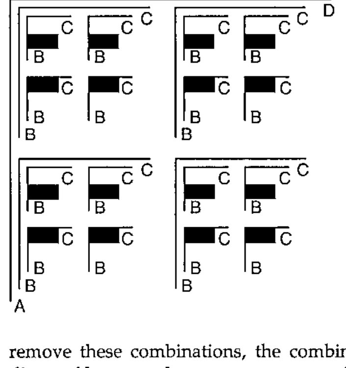

Here an array with six axes expresses the relation between four variables. If you were to look up if a combination of variable values is valid, you would make sure when doing the look-up in the array that you where looking from the same position on all the axes representing the same variable. The same variable can take only one value at a time!

The black boxes in the illustration then describe combinations of variable values that will never exist, with regards to the variable B. If you remove these combinations, the combinations left behind perfectly describe the diagonal between the two axes representing the variable B.

Reducing them by the diagonal thus combines the axes that represent the same variable, leaving this variable represented by only one axis. In Array-based Logic this is known as "colligation".

Here the array has been reduced by the diagonals between the pairs of axes representing the variables B and C:

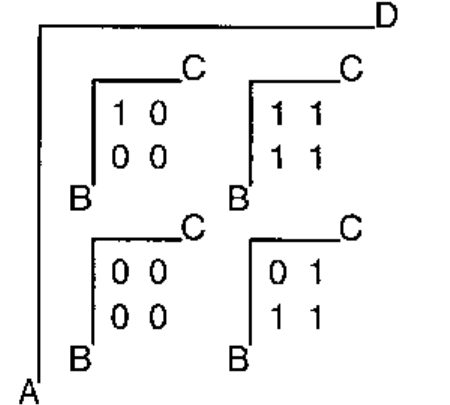

## Deduction

Now that you’re capable of combining relations and describing the relation between many variables, you would want to make use of it. One practical use could be deducing the impact that limiting some variables has on other variables.

Reducing the axis that represents a variable, and thus reducing the entire array that represents the relation, limits the number of valid values for the variable. The remaining array gives the relation between the remaining variables.

An example: what happens to B, C and D if A is bounded to true?

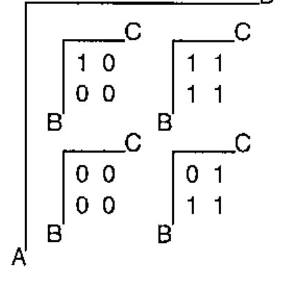

As illustrated, the answer to this question is found by reducing the array by the axis which represents the variable A. Only the value to which A has been bounded is left on the corresponding axis (the non-hatched area of the array).

This is basically an array representing the relation between variables B, C and D in the case where A is **true**. Locating the 1s, which (as mentioned earlier) represent valid value combinations, it becomes obvious that D is bounded to true. This is seen from the fact that there are no 1s in the part of the array representing value combinations, where D is false.

It can also be seen that neither B nor C are bounded to any particular value, except that they cannot both be false. In fact the part of the array, where variables A and D are bounded to true, represents the relation B ∨ C.

In this small example one variable is bounded to only one value. From a more general point of view, it is possible to bound more variables in a deduction, and not all of these variables need be bounded to one element only.

## Affirmative Representation

As you have probably figured out by now, representing variables as axes poses limitations. One is that APL allows a maximum of 15 axes in an array. And 15 variables in a relation is a very small number, if you want to get serious in constraint solving.

And even if APL didn’t stop you, the size of a relation doubles with every variable you add, which quite quickly makes your relation grow out of proportion, even with today’s reasonable density and price of RAM chips.

So far all combinations of variable values have been represented. What if you chose to represent only the valid combinations? If you did this by representing them by their addresses in the array, you’d have broken the unpleasant scaling of a relation and overcome the limitation of 15 variables at the same time.

Representing the relations in the affirmative form looks like this:

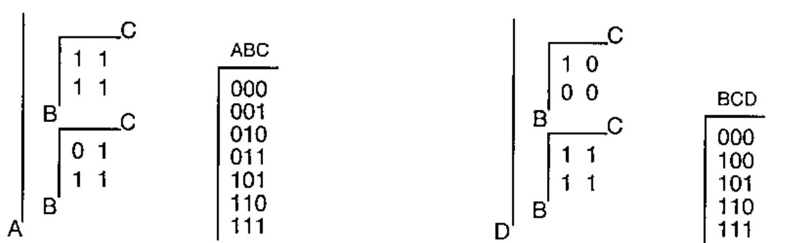

Looking at the addresses you’ll notice that these are actually the values of the variables. This is a natural consequence, since the addresses describe the location on the axes, which again are representations of the variables. This also means that the content of the arrays is no longer limited to being binary, but closely follows the domains of the variables.

With this representation you can have more than 15 variables, and the more relations, you combine, the smaller your array will probably get, since you’re storing only the valid combinations of variable values.

With this new representation, you’ll have to redo the join and colligation operations. Take a minute to think about it, before you read on. Being an APL’er, you’ll most probably be able to figure out how to do the Cartesian product between two relations in the affirmative representation, right?

You have two arrays that contain representations of valid combinations of variable values - combinations that were previously represented by 1s. Previously the array representing the joined relation would contains 1s only at the places that corresponded to 1s in both relations that were being joined. Each of the 1s in the one relation was being matched with each of the 1s in the other relation. Now you do the very same thing, just using the addresses of the 1s:

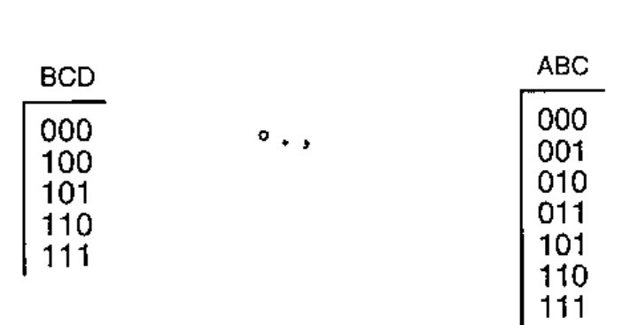

The result will be an array that is too big to display in its entirety, here’s just a small part of it:

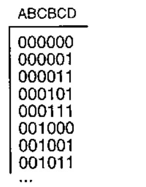

As before, joining the two relations leaves the variables B and C represented twice. Again you would want to colligate the axes, only now the axes have been converted to columns in the array. How do you reduce two axes by their diagonal, working with columns in the affirmative form?

In the diagonal spanned by axes that represent the same variable, the instances of the variable have the same value. Reducing by the diagonal an array in the affirmative form therefore is done by comparing the values in the columns and leaving behind only the rows where the values are equal. Colligation takes out the hatched rows, first with regards to variable B and then C:

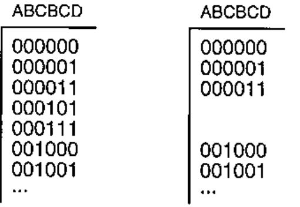

The resulting array has 8 rows. Now that the columns representing the variables B and C are equal, one of each can be removed, leaving only one column per variable:

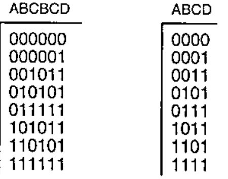

If you compare this result with the result from the join and colligation working with the full array, you’ll see that the rows in the former correspond exactly to the 1’s in the latter.

## Deduction

Now that the building operations have been redone to work with relations in the affirmative form, the deduction needs to be made by the same process.

Taking the example from before, asking what happens to B, C and D if A is bounded to true, have a look at the array:

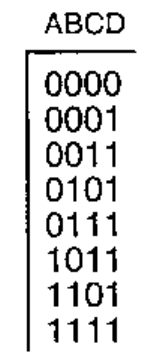

A is bounded to true, meaning that only the rows where A is true represent possible variable combinations. These are the non-hatched part of the array.

Looking at these rows only, it is fairly easy to see that as a consequence the variable D has been bounded to true, and that at least one of the variables B and C must be true.

## Use of Array-based Logic

This concludes a short look at the fundamentals of Array-based Logic. Following the described guidelines, you’re perfectly capable of building your own logic models and doing your own deductions. If you want to go further, the techniques of Array-based Logic are available as an all-in-one application (the Array Database™) that automatically will do all joining and colligation (plus a lot more) for you. The Array Database is a *configurator*, which can handle large-scale configuration problems in real time, due to the intrinsic properties of Array-based Logic.

The Array Database is used in practice as the underlying engine in many different surroundings. Some examples are: e-trade solutions, both Web and business-to-business, railway-interlocking systems, switching in power networks, and configuration in general.

## References

1. Gert Møller: *On the Technology of Array-based Logic*. Ph.D. Thesis, Electric Power Engineering Department, Technical University of Denmark, January 1995.
2. Bo Grave: *Modelling Signal Interlocking Systems using Array-Based Logic and APL*. Paper at APL96, Lancaster, http://www.vector.org.uk/apl96/bograve.htm
3. Bo Grave: *Railways and Array-based Logic*. Ph.D. Thesis, ScanRail Consult and Department of Electric Power Engineering, Technical University of Denmark, February 1998.
4. Morten Christensen: *Array-based Configuration in Power-supply*. Ph.D. Thesis, Department of Electric Power Engineering, Technical University of Denmark, October 1999.
