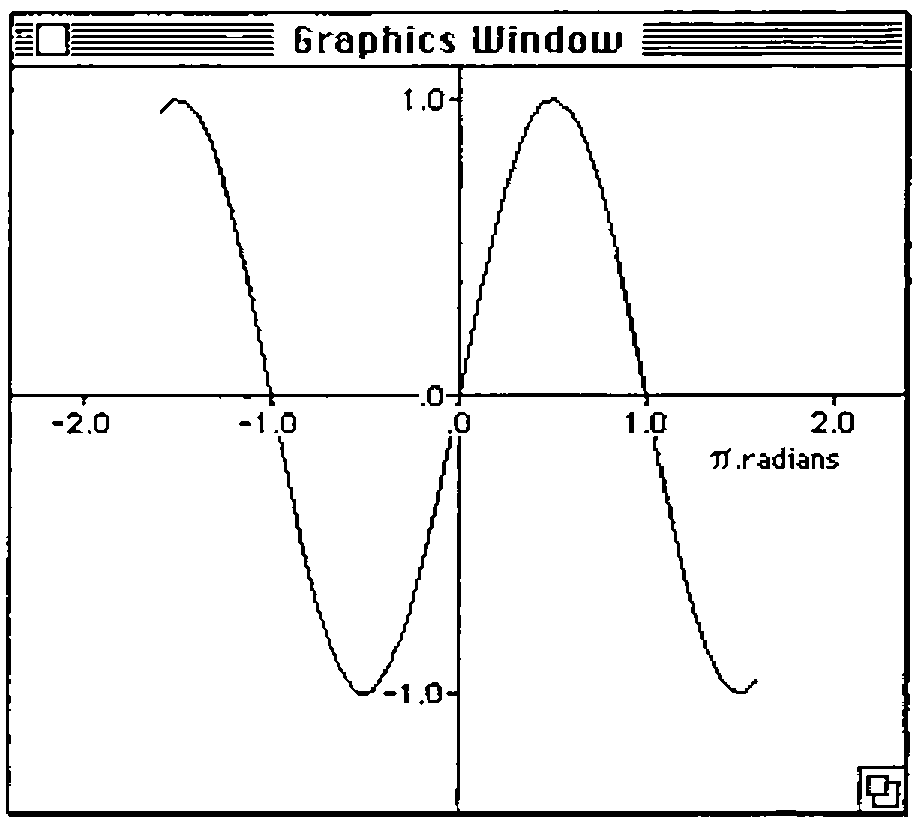

*by Ian A. Clark*
{ .byline }

## Introduction

A "toy" APL with a leisurely gait and a 32K workspace limit sounds like no big deal in today’s high-powered marketplace. So why ever did I undertake to port I-APL to my current favourite machine, the Apple Macintosh? I was attracted to I-APL because:

- It conforms to the ISO standard
- It has direct definition of functions (an ISO-conformant extension)
- It is portable across different vendors’ machines, the different ports being workspace compatible at the byte-level
- I could try out some ideas for mitigating the human-factors shortcomings of the conventional APL interface
- It is non-proprietary.

To me, the last point is the important one. What it means, if you are a teacher, a lecturer or a writer of textbooks, is that you can develop working code as part of your course material and be beholden to nobody for their sufferance to distribute it to your class, together with a free copy of the interpreter bundled in.

No other language of any significant capability allows you to do this, since the days when MS-BASIC was bundled-in with all industry-standard personal computers. If you use a spreadsheet (like a lot of the business studies fraternity these days) or a single-platform development system like Hypercard or Toolbook, no matter how splendid, you are nailing your colours to the vendor’s mast. Your *magnum opus* will sink or swim with the proprietary product and its platform.

In the educational world, it’s risky flirting with a high-performance system which locks you into a single supplier. I’ve known people who were donated fancy new systems as part of some generously funded initiative, but who found themselves marginalised as a result. How they wished they had stuck to some freely-available tool with more modest capabilities.

## Needs

However there is one thing that even the most unassuming APL interpreter aimed at an educational audience needs to do — draw graphs. Pictorial representation of data is something outside the scope of the ISO standard. Anyway to do it well is something highly machine-dependent. It is one thing to labour away for an hour composing a vector of numeric data. A student expects to do that. It is quite another thing to have to sit and wait five minutes whilst a fairly simple supplied graph dribbles onto the screen. Consequently, if I-APL/Mac was to be a serious competitor to one of the many Macintosh spreadsheets (which now include Lotus 123) it had to have a fast built-in graph-drawing facility. Perhaps not as slick or as generalised as Excel or Lotus 123 — after all, I-APL/Mac is only freeware. But as fast.

So, having sung the praises of a truly portable, truly open language interpreter, with all the pressure this entails to keep within the confines of the lowest common denominator of personal computer capabilities, why am I going on about a highly machine-dependent graph-drawer for the specialist’s machine *par excellence*, the Macintosh?

Why? Because of the interface. It’s the best compromise I can achieve between human-factors and machine-factors, intended to be easy to understand, get hacking with and maintain the results of, and it makes the lightest demands on a baby APL. If you, the amateur and beginner, like it, then it won’t be difficult to program for other platforms.

At the last ASL conference at Greg-y-nog, Peter Lewis made a plea for what I understood to be a graph-plotting system in which the data was entirely separated from the format, the said format being storable as an APL object. Whether that was what Peter said or not, it seemed eminently sensible. It supported the teacher’s task of developing by trial-and-error a collection of formats, each of which could be applied to a given set of data, as well as the student’s task of studying a collection of functions or time-series by plotting them in a single given format, or one of a restricted choice of formats. Properly done, it would allow formats to be easily combined, a kind of mathematical mix-’n’-match.

Hitherto (in I-APL/Mac version 1.1) I had followed the "lego set" approach: to offer a more-or-less general function to draw the title, another to put a box round it, yet more to draw the axes, put tick-marks against them, draw a shaded bar, and so on. Each of these services was offered as a cover-function which invoked the machine-code interface (`⎕MC`) within itself, to draw inside the graphics viewport. The user of such a package is then expected to write a multi-line APL function, just one line of which actually accepts the given data vector(s). In I-APL/Mac this approach is inevitably too slow.

## The Design

Here then was the challenge: to design an interface to a presentation-graphics facility that is used like this:

```apl
MYFORMAT DISPLAY MYDATA
```

which could be re-packaged according to the task to be done as either:

```apl
PLOT MYDATA
```

(`MYFORMAT` being delivered inside a global variable called `CMDSTRING` accessed by `PLOT`) or:

```apl
PLOT MYDATA USING MYFORMAT
```

(`USING` simply bouncing back its left argument and putting its right argument into the said global variable `CMDSTRING`). It is also useful to have a function called `TEST`:

```apl
TEST MYFORMAT
```

which simply looks in the global variable `TESTDATA` for the contents of `MYDATA`.

Because of the emulated nature of I-APL, `DISPLAY` would need to pass its data directly to the graphics facility, with little or no intervening APL processing. In fact the `DISPLAY` function is nothing but a cover function for a `⎕MC` call which could just as well be invoked by:

```apl
39 ⎕MC 2 9⍴'MYFORMAT MYDATA
```

What form should `MYFORMAT` take? In a second-generation APL the treelike nature of the possible parameters to a graph suggests a nested array of strings and numbers. In the absence of nested arrays one is thrown back on large sparse tables: characters, or numbers. Should I abandon the idea of a single format variable and have one of each? I decided to cling to the single variable, which therefore had to be a character array. It is straightforward and economical to represent numerals within a character array (particularly as they get read by C and not APL), but cumbersome to represent characters within a numeric array.

It was important for `MYFORMAT` not to take up too much room in the workspace. It should be easy for beginners to compose and customise. That ruled out having a large unfriendly fixed-format table needing table-generating functions to maintain it. Its syntax should also be indefinitely extensible, allowing later versions of the graphics facility to offer new features whilst still honouring existing formats.

Eventually I settled on making `MYFORMAT` a single character-vector, a command string. However a 2-D character array would be accepted too, just as if it had been previously ravelled. Using the built-in full-screen editor, character arrays are easier to maintain than long character vectors anyway. The syntax of this command string is a sequence of sub-strings each terminated by a semicolon. Multiple blanks are treated as single blanks. Each sub-string, or "command", consists of a 2-character mnemonic opcode followed by the required arguments, if any. In fact, just the sort of syntax that `scanf()` is happy with. (Non-C programmers note: `scanf()` is a C standard library function which is a bit like the INPUT command in BASIC.)

The command string is interpreted from left to right. Some commands like ’WI;’ (wipe the window clean), ’MT’ (move-to the following coordinates) and ’TF’ (change the text font) perform their action there and then, but those describing the graph to be plotted alter the default values of internal parameters, so that their order of specification does not matter. However a subsequent command with the same opcode will override the earlier setting. A blank or null command string is valid, yielding a sensible display using the built-in defaults.

This design yields a bonus usually associated with object-oriented programming: the ability to package useful formats, yet override unwanted features and supply extra parameters. Thus if `MYFORMAT` produces a line-graph, one could substitute `MYFORMAT,BARCHART` say, and get a bar chart, all other parameters remaining the same. Furthermore `MYFORMAT` could easily be written to interpret a trailing catenated string as a title. It would be used either alone or as follows:

```apl
PLOT SALES92 USING MYFORMAT,'SALES RESULTS 1992'
```

There is a wide variety of ways of storing command strings. One benefit of direct-definition in I-APL is that it yields a handy way for students to alter the values of parameters, whether character or numeric, by defining them, not as global variables, but as functions. Typing the name of the parameter followed by a colon displays its current definition. Not only can the existing value be overtyped, but the student does not have to hunt for the back-arrow key.

Thus a simple command-string might be directly-defined by:

```apl
MYFORMAT: 'A4; TI; ~M; FN100;'
```

as well as by:

```apl
MYFORMAT←'A4; TI; ~M; FN100;'
```

`MYFORMAT` can also be stored as an array of commented commands, like an assembler program. You can either rely on the fact that everything between the last parameter required by the command and the semicolon is ignored, or you can use the explicit "comment" labels:

```apl
'*'  '--'  '⍝'
```

In this way, the above `MYFORMAT` could be stored as:

```text
A4;       --4-quadrant axes at default origin (centre of screen);
TI;       --Tick Marks on both X and Y axes;
~M;       --No Y markings required;
FN100;    --finishing X-axis value is 100;
```

or as:

```text
A4        4-quadrant axes at default origin (centre of screen);
TI        Tick Marks on both X and Y axes;
~M        No Y markings required;
FN100     finishing X-axis value is 100;
```

The workspace `PLOTDATA` is part of the graphics add-on product. It contains a sample format variable, `TRIGFORMAT`, to plot general trigonometric functions. This contains the following commands:

```text
      TRIGFORMAT
WI                   wipe the window clean to start afresh;
O4 150 110           4-quadrant, origin at h=150, v=110;
TI                   do tick-marks;
+X4                  plotting interval 4 points;
SX-100               1st point starts -100 points from origin;
ST-126               1st X-tick starts -126 points from origin;
SN-20                1st X-tick mark labelled -20;
FN20                 last X-tick mark labelled 20;
N.1                  --with 1 place of decimals (-2.0 to 2.0);
+N10                 label values step by 10;
+T63                 X-tick interval 63 points (approx 10⌊ 2);
+U100                Y-tick interval 100 points;
SU-100               1st Y-tick starts -100 points from origin;
SM-10                1st Y-tick mark labelled -10;
FM10                 last Y-tick mark labelled 10;
M.1                  --with 1 place of decimals;
+M10                 Y-label values step by 10;
MT235 135            move to h=235, v=135;
DS⎕.radians;         --label the X-axis;
```

`PLOTDATA` also contains a function, `DEMO`, defined as follows:

```apl
DEMO: PLOT SINEDATA USING TRIGFORMAT
```

Executing DEMO gives the following result:



**Figure 1:** Result of running sample DEMO in workspace PLOTDATA
{ .caption }

## Conclusion

Well, there it is. Other vendors please copy — I’m offering it as a new standard. That means I need a name for it, I suppose. Sensible suggestions to VECTOR, please. Meanwhile, if you can lay your hands on a Macintosh, I can supply the latest version, 1.2, of I-APL/Mac (which is freeware) plus the graph-drawing kit described (which is not, but comes with a free educational site-licence). You can order all I-APL products from the official source, I-APL Ltd (address elsewhere in this issue). Specifically Macintosh products, however, you can order directly from me and pay by VISA or MasterCard. Send SAE for a price-list of inexpensive goodies, project kits and teaching resources to use with I-APL/Mac, including this graph-drawing package.

Ian A. Clark<br>
IAC/Human Interfaces,<br>
9 Hill End, Frosterley-in-Weardale,<br>
Bishop Auckland,<br>
Co. Durham DL13 2SX.
