*by Ian Clark*
{ .byline }

## Introduction

In 1972 Sir Clive Sinclair introduced the world’s first pocket calculator, the Sinclair Executive – the size of a packet of 20 cigarettes [1]. Since then, pocket calculators have never looked back, though it has tended to be more of the same – more buttons, more functions, more memory, more battery performance. Is it possible to imagine a radical improvement to the original concept, even extending its provenance to desktop (or palmtop) computers?

Well… yes, easily. Long considered the techie’s “Jedi sword”, there’s a need for a scientific calculator for the rest of us. As scientific literacy grows – as it must, if intelligent life is to continue (commence?) being found on planet Earth – the “intelligent layman”, someone like myself, whose scientific calculating skills have not improved at all since their zenith at high school (and a not-frightfully-good zenith at that!) has need of computational resources in the scientific review and decision-making area to match those already offered in the personal finance area by such products as TurboTax. In other words – every wannabe politician, journalist or planner needs one, every SF writer and eco-activist. And for much the same reasons too – so as not to leave all the accounting for the earth’s resources in the hands of government or corporate wraiths.

The web runneth over with published statistics. A look at the Seafriends (New Zealand) website [2] shows a provocative blueprint for the numerate environmentalist’s toolkit, a single web-page of statistics covering such basics as the metric SI system; densities (water, air, earth’s crust); speed of sound, decay, absorption, attenuation; biomass conversions; radioactivity; human dimensions and needs, both individual and populations; energy costs and statistics; thermodynamics; chemical heats of formation, etc, etc. The trouble is: to apply all that concentrated data effectively you need to be a computational wizard, quite at home with applying formulas and units conversions, not to mention knowing what underflow and overflow is without having to call in the plumber.

Now, specialist calculators are available on the web for every purpose from Julian date conversion to pig-farming. For example, see: [3]. But you need to be a Java-programmer as well as a domain specialist to understand exactly what they do, or else they’re black boxes, magic rings, silently executing the will of their masters, the wraiths.

Hence the present project. Not exactly a tool to be welcomed by techies, TABULA assists you and me to answer questions like these, by a cross between speculative problem-solving and creative play:

1. You exercise to burn off a pound of fat. How many calories is that? How long would it light a 100W light-bulb?
2. If a 10ft fall is life-threatening on earth, what’s the corresponding height on the moon?
3. A space cruiser on slingshot orbit between Earth and Mars consists of two pods of equal mass tethered by a stiff boom. How fast does a 1000ft boom have to rotate to simulate Earth gravity in the pods?
4. A 20lb frozen turkey hangs motionless in space with respect to the stars. The moon sweeps it up. How much kinetic energy is released on impact in tons of TNT?
5. You are in a ship and see another ship explode. Six seconds pass before you hear the bang. How many seconds sooner did a person below the waterline hear it? How far apart are the ships?
6. If the icecaps all melt, how many inches would the sea-level rise?

## A Simple Task Scenario

Let’s consider the first task:

> 1. exercise to burn off a pound of fat. How many calories is that?

Let’s make lines for “how long” and “100W light bulb”. Time is a basic measure and quickly found as the third item in the top combo. We’ll take any item in the combo below it (viz. second). You can always change it later, to minutes, hours, days… whatever TABULA knows about.

Click button: New…

*…line 1 appears.*

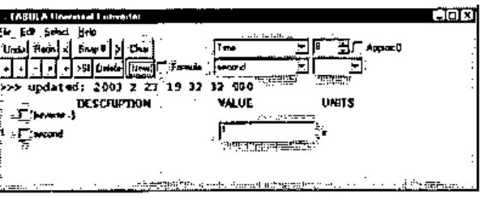

Now you can search in the two leftmost combos for a ‘wattage’ item, but there are faster ways to do the same thing. Search for “watt” in the calculator’s data base. The Edit menu is the normal place to look for a ‘Find’ item, but now you’ve got a line with a VALUE field, you don’t need it. You can also put single-letter commands in the VALUE column. These commands are followed immediately by their argument. Thus to search for “watt” you’d enter:

```text
Fwatt
```

*…the two item combos come up with the first match.*

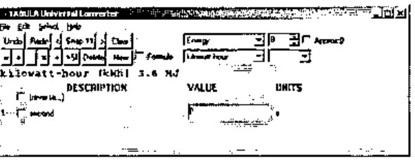

You don’t happen to want this match. Press F3 (c/f Windows 2000 Notepad: it’s the menu item: Edit / Find Next F3) to cycle round all the matches. When you find the one you want, click button: New… and enter: 100 (for the 100W light-bulb).

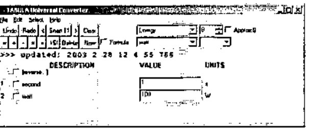

The product of these two lines should be “watt-seconds”, an energy measure like “kilowatt-hours”. To form the product, select both lines (by clicking the two checkboxes) and click the Product (×) button. The new line that appears has nominal units: W s.

What’s a W s? It is indeed an energy unit, as TABULA will presently confirm. As soon as you click the checkbox of line 3 then the lower right combo gets a list of alternative compatible units that TABULA has met from its imported TXT files. You see the first one (J) appear. Drop the combo down and select “kcal” (for food calories):

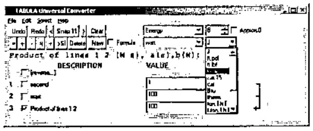

*…line 3 is still the product of lines 1 and 2, but now expressed in the new energy units.*

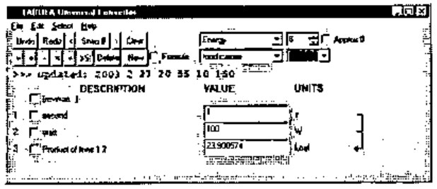

How much energy in a pound of fat? Let’s look for the word “fat”, using the 1-letter command: F or: f as we did before. In any VALUE field enter:

```text
Ffat
```

*…the two line-selection combos locate a suitable constant.*

Click button: New:

*…the new line appears.*

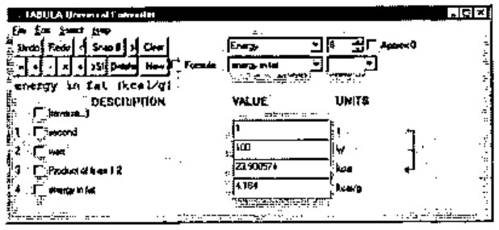

Now dividing line 3 by line 4 will give units of grams. Check lines 3 and 4, then click button: Divide (÷). Then check line 5 as you did with line 3 and change its units to: lb.

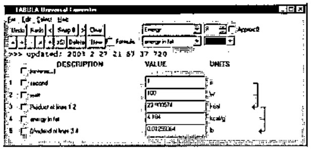

Now you might think to increase the value of “second” (line 1) in steps until line 5 approaches 1 lb. TABULA lets you do that, and indeed provides good support for it, letting you increase or decrease the entire number, or a selected digit position. Place the cursor in line 1 and press/hold ‘]’ to increase the value typamatically, or ‘[’ to decrease it (‘[’ ‘]’ are used as arrow keys, since other alternatives are already in use). Watch line 5 approach: 1lb (it’s fairly fast!).

But TABULA has another trick up its sleeve. You can alter line 5 itself directly to the target value you want (viz. 1 for the 1lb you’re asked for) and the alteration will be propagated back to the lines it depends on. We call this: *function inversion* because we have defined the forward function to calculate line 5 (L5) solely by means of two equations:

> L5 = L3 / L4<br>
> L3 = L1 * L2

Yet TABULA is able, by a combination of the differential calculus and Newton-Raphson, to compute the inverse function: L5 → {L1, L2, L3, L4}. The algorithm used is powerful and general, and will be the subject of a separate paper, to be published some time in 2004.

Notice that if you let TABULA do this, all four lines (1-4) will potentially change. Yet you want to keep the light-bulb wattage constant, not to mention the fat energy. To fix, or *hold*, the values of lines 2 and 4, letting only lines 1 and 3 change, check the boxes: 2 and 4, then enter a new number (viz. 1) in line 5:

*…all fields are recomputed.*

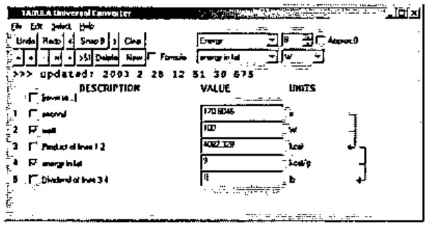

…and you can see the bulb will burn for 170.8046 s.

If you don’t want to see all those figures after the decimal point, round them off in all fields by lowering the digit in the top right control from 8 to, say, 5 (meaning 5 significant figures overall, scientific-style, not 5 places of decimals):

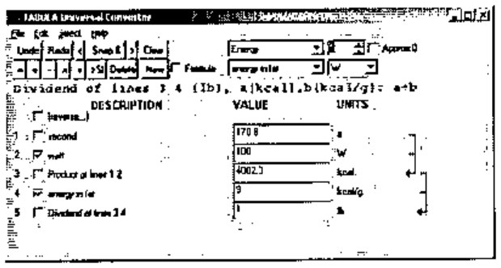

Now click button: Snap to save a snapshot of the form in memory. Each snapshot is a specialised calculator. All your current snapshots will be saved in a single named file when you choose menu: File / Save Ctrl+S in the normal way. You can entitle individual snapshots, their titles will appear in the Select menu, and as the window caption when you select one of them.

To entitle this snapshot “Food Wattage” you use another 1-letter command: T, typing it into any VALUE field. You’ll notice the original numeric contents are instantly restored once the command has been executed. Thus, enter:

```text
TFood Wattage
```

(the T is case-insensitive, but upper/lower case is honored in the argument.)

*…whatever follows T becomes the window caption and the VALUE field regains its numeric value.*

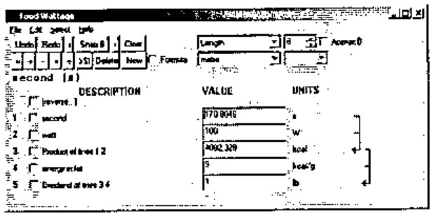

Finally replace the current snapshot (to update the window caption which is saved with it) by menu Select / Replace Snapshot (Alt+R), and save to disk (Ctrl+S).

From this simple scenario, you see that TABULA has a crop of useful features for creative calculation which saves you from having to type-in and parameterize formulas at run-time, or look-up units conversions. You can define new stored constants and formulas in TXT files, which TABULA loads when it starts up. You don’t have to specify formulas for the backward computations either, it works all that out for itself. It would be easy in principle to accept novel line definitions during a run session, but I haven’t bothered to implement the input dialogs to accept all that (the hardest part) because it’s just as easy to save your work, edit the TXT files and restart TABULA. Moreover this gives you greater flexibility when composing new formulas because you can consult existing formulas to help you.

## Defining Constants, Conversions and Formulas

The syntax for defining new formulas is straightforward. Here’s a fairly complex calculation, followed by the TXT file entries originally used to define each line (noting that the units and values have subsequently been redefined). You can display the formula for line 4 by placing the cursor in its VALUE field, as the screen-shot shows.

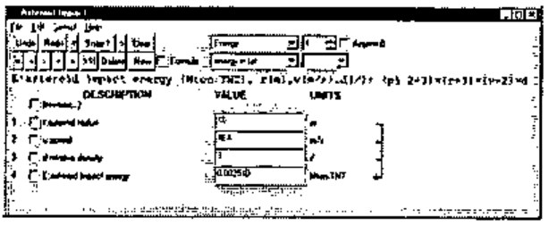

```apl
r:asteroid radius (m) 1 m
v:speed (m/s) 40000 m/s
d:relative density (/) 3 /
E:asteroid impact energy (Mton.TNT), r(m),v(m/s),d(/):
      (pi 2÷3)×(r*3)×(v*2)×d
```

You can write the TXT definitions either in APL syntax (I tell TextEdit to use the APLFONT screen font), or in an Excel-like syntax if you want to avoid APL symbols. For each formula TABULA makes a guess about which you’ve used (you’ll see I’ve used APL symbols: `÷×*` above, augmented by a small repertoire of built-in arithmetic functions like pi and sqrt.) The above snapshot was created simply by selecting the formula: the preceding three input lines: r, v and d, were included automatically. You can specify existing lines as inputs to the new formula line by checking their boxes. TABULA matches them up by looking for compatible units, so you don’t have to say which is which. If TABULA can’t match your checked lines with formula variables, it automatically creates any extra input lines the formula needs.

The syntax for defining a constant or a conversion is:

```text
[<var>:]<name>(<nominal-units>) <value> <units>
```

and for defining a formula is:

```text
[<var>:]<name>(<nominal-units>),<dependency>:<formula>
```

`<dependency>` is:

```text
<var>(<units>) [,<var>(<units>)...]
```

`<nominal-units>` serve as a new-unit definition provided by you in the TXT file,

`<units>` must be defined elsewhere in some other TXT line,

`<value>` can be an expression – any that APL can evaluate – but typically just a suggestive number representation, like that used for: grain, troy below, where `1÷480` expresses the fact that there are 480 grains in a troy ounce.

`[<var>:]` at the front of a definition is used for determining dependencies, but is not essential, except when specifying default input lines to accompany formula definitions in the TXT files.

Ultimately TABULA converts all units to SI-units, and it is marginally quicker to start-up if you define `<units>` in SI-units directly. However that is inconvenient and hardly ever done in my set of definitions. See my UMASS.TXT file:

```apl
gram                         (g) 1E¯3 kg
tonne                        (t) 1E3 kg

ounce, avdp                 (oz) 28.3495 g
ounce, troy           (oz.troy) 31.1035 g
grain, troy           (gr.troy) 1÷480 oz.troy
pound, avdp                 (lb) 16 oz
stone, avdp                 (st) 14 lb
hundredweight, avdp        (cwt) 112 lb
ton, avdp                  (ton) 2240 lb
ton, avdp                  (ton) 1.01605E3 kg
slug                      (slug) 14.5939 kg

deadweight ton             (dwt) 1 t
long tonne              (t.long) 1 ton
metric ton               (ton.m) 1 t
bushel, wheat, USA    (bu.wheat) 60 lb
bushel, barley, USA (bu.barley) 48 lb
bushel, oats, USA      (bu.oats) 32 lb
bushel, rye, USA        (bu.rye) 56 lb

atomic unit of mass        (a.u) 1.660430E¯27 kg
mass of neutron        (neutron) 1.674920E¯27 kg
mass of proton          (proton) 1.672614E¯27 kg
mass of electron      (electron) 9.109558E¯31 kg
```

Which is more or less as they appeared in the sources I looked-up [2], [4], hence the capricious use of g, kg, oz, lb, t and ton.

Incidentally you can use non-APL symbols in values, thus: `1/480`, `9.109558E-31`. You can also define aliases. Thus: metric ton (ton.m) is an alias of: tonne (t), as is: deadweight ton (dwt).

You’ll notice that: ton, avdp (ton) has been defined twice, once as 2240 lb and once as 1.01605E3 kg. Clearly the first definition is the clearer and happens to be exact, the second ‘definition’ is properly an approximation. It’s only there for reference and experimentation. TABULA uses the first definition it comes across, because it looks up a list of the nominal units (of which ton is one) using {iota}. There’s no requirement to define a unit in terms of units already defined – TABULA is multi-pass when it converts units.

No distinction is made between a constant and a units-conversion. One consequence of this is that you have the option of defining new ‘units’ (with a distinctive name) for each constant you specify. You needn’t, but then you must make the nominal unit the same as the actual unit. Thus: mass of electron (electron) – from the above – will be recognised as a unit of mass in its own right. The same goes for earth and moon-masses, defined elsewhere. TABULA likes SI conventions, but doesn’t enforce them.

## Dimensional Analysis

TABULA internally reduces arbitrary units to basic SI units. There are only 7, viz:

```text
Length, metre             (m) 1 m
Mass, kilogram           (kg) 1 kg
Time, second              (s) 1 s
Current, ampere           (A) 1 A
Temperature, kelvin       (K) 1 K
Intensity, candela       (cd) 1 cd
Amount of matter, mole  (mol) 1 mol
```

It also converts a ‘units’ string to a canonical form, enabling it to recognise whether two given units are compatible, i.e. one can be converted into the other by a factor. Incidentally, under this definition, Celsius (°C), Fahrenheit, (°F) and Kelvin (K) are *not* compatible units. They have to be linked in TABULA by formulas (which every schoolchild in England used to know by heart).

Notice the TABULA convention for a unitless measure: (/). The way units are converted, and different units expressions reconciled, the invention of (/) was rather like the invention of Zero in the Arabic number system. It is strictly a departure from SI. But so is the use of ‘/’ anyway. The trouble is that the SI system uses constructs like this, which are complicated to handle in a computer program:

> 1 J = 1m<sup>2</sup> kg s<sup>-2</sup>

In TABULA’s canonical form, this becomes:

```text
'J' matches 'm m kg/s/s'
```

where each basic SI unit is preceded by either a space or ‘/’, serving both as separator and inversion operator. Either operator applies only to the unit immediately following it.

The purist might well want TABULA to reformat its canonical form to proper SI form when displaying units to the user – but it doesn’t. Isn’t this a purely cosmetic requirement, on a par with having a proper symbol: π? Why APL never admitted π into its character set is something I never quite understood – it makes the language seem less than serious to an old-fashioned physicist like me. No doubt there are APLers alive who remember the actual committee meetings at which this was thrashed out – and π lost! I suppose it would have had to be a postfix operator: the only one, because if you’re going to admit π you really have to admit 2πr and 2π. Insisting on 2π1 or π2 just won’t do. The TABULA built-in function: pi is more than just a cover-function to Circle: it allows (2 pi r) as well as (pi r) and (r pi 2) …but not of course (r × 2 pi). It’s amazing the amount of time you can waste over such trivia.

## Calculating Results

The active lines of the display are generated from a single array, T1, which has a row for every numbered line. The contents of T1 defines the state of the system, i.e. screen updates are moved into T1, all computation is carried out in T1, and the results are moved back to the screen. The columns of T1 are never accessed in the code by in-line integers, always by named constants (APL doesn’t give you named constants, so these are global vars!). These are:

| | |
|---|---|
| Tname | the descriptive name of the line, can be altered by a 1-letter command: N |
| Tquan | the quantity appearing in the VALUE field |
| Tunit | the “nominal units” of Tquan as it appears in the UNITS column |
| Tsiqn | the quantity Tquan converted to SI units using: Tfact |
| Tsiun | the units of Tsiqn (always canonical SI units) |
| Tfact | the factor to convert Tquan to Tsiqn |
| Tdepn | a dependency vector, valid only for calculated lines, listing the input lines to the formula |
| Tfmla | the formula (source) for a calculated line: the actual formula used is compiled into an APL fn. |
| Tmodl | a “model” for function-inversion if the default model won’t work. (Not explained here.) |

Here’s the contents of T1 for our Food Wattage example (the last column: Tmodl has been omitted):

```apl
      ct
∘ Tname Tquan  Tunit  Tsiqn   Tsiun         Tfact    Tdepn  Tfmla
1 secon 170.8  s      170.8   s             1
2 watt  100    W      100     m m kg/s/s/s  1
3 Produ 4082.3 kcal   17080   m m kg/s/s    4.184    1 2   a(s),b(W): a×b
4 energ 9      kcal/g 37656   m m/s/s       4184
5 Divid 1      lb     0.45359 kg            0.45359  3 4   a(kcal),b(kcal/g): a÷b
```

All the end-user calculations (i.e. those defined by the set of formulas governing the calculated lines) are carried out in column Tsiqn. The steps of the calculation are:

- Fetch changed values from the screen into Tquan
- Convert Tquan to Tsiqn
- Compute new Tsiqn for each computed line, in a sequence governed by Tdepn
- Convert Tsiqn back to Tquan
- Update the screen to reflect Tquan.

The formula is not used directly to perform calculations. Instead each formula is compiled into a forward function which is executed to effect the forward calculation step. Here is the forward function for line 4 in the asteroid example, together with its source formula:

```apl
E:asteroid impact energy (Mton.TNT), r(m),v(m/s),d(/):
      (pi 2÷3)×(r*3)×(v*2)×d

    ∇ ⍙z←⍙exe4;r;v;d
[1]   (r v d)←T1[ 1 2 3 ;Tsiqn]
[2]   ⍙z←(pi 2÷3)×(r*3)×(v*2)×d
    ∇
```

## Drawing & Handling Dependencies

Column Tdepn of T1, the dependencies, govern not only the order of recalculation, both forward and backward, but the drawing of arrows on the screen to show what quantity feeds into what.

Tdepn is valid only for a calculated line. It is then a vector of line numbers, which map lines onto variables used in the formula according to the formula’s dependency list.

Thus in the T1 listed above, Tdepn in line 5 is: (3 4). This says that var: a in the formula comes from line 3, and var: b comes from line 4. When new lines are added or deleted, Tdepn is easy to recompute.

In use, the Tdepn column is converted into a dependency matrix: dm, a boolean n-by-n matrix where n is the number of lines defined. As an example of how this is used, the execution sequence of forward functions is computed by:

```apl
z←sor ↑closure dm
```

where fn: sor sorts columns of the (n,n) boolean matrix into dependency order. The fn: closure is computed by essentially OR-accumulating the matrix product of dm with itself until there is no further change:

```apl
z←z∨z∨.∧d
```

where z starts off as a copy of d.

## Future Features

A proper Windows product is primarily menu-driven, an architectural imperative which Windows inherited (don’t say “stole!”) from prior WIMP (Windows / Icons / Mouse / Pointer) interfaces like the Xerox ALTO and the Apple Macintosh. This commands that all the functionality should be accessible from the menus alone. TABULA violates this commandment, notably with the 1-letter commands, none of which yet have corresponding menu items, nor the dialog boxes they’ll need. This is cumbersome to program and also to use, being only useful to novices, which is not to say it isn’t important. But the truth of the matter is that entering 1-letter commands into any handy VALUE field is the slickest way to drive TABULA.

Excel output is planned, and will be very useful. The existing crop of snapshots in memory will be saved as a single workbook having one snapshot per sheet. Thanks to MSO-view, this enables TABULA to be used to generate more specialised calculators like those cataloged in [3].

Graph plotting is an obvious enhancement, as is a 2-D table. TABULA will allow the column of figures it builds to be replicated horizontally as a 2-array, stepping one or more of the lines. This leads naturally to graphic output. An existing chart package will be bolted-on, or else the 2-array will be output to Excel, allowing chart sheets to be defined by the Excel user.

## References

1. The Sinclair Executive pocket calculator: http://www.nvg.org/sinclair/calculators/executive.htm
2. Seafriends - Units, constants and conversions : http://www.seafriends.org.nz/books/units.htm
3. Martindale’s The Reference Desk – Calculators On-Line Center: http://www-sci.lib.uci.edu/HSG/RefCalculators3A.html
4. Kaye & Laby, Tables of Physical and Chemical Constants, 14th Edition (1973), Longmans.
