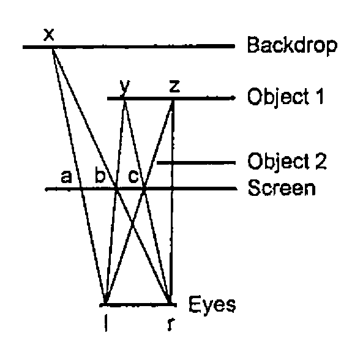
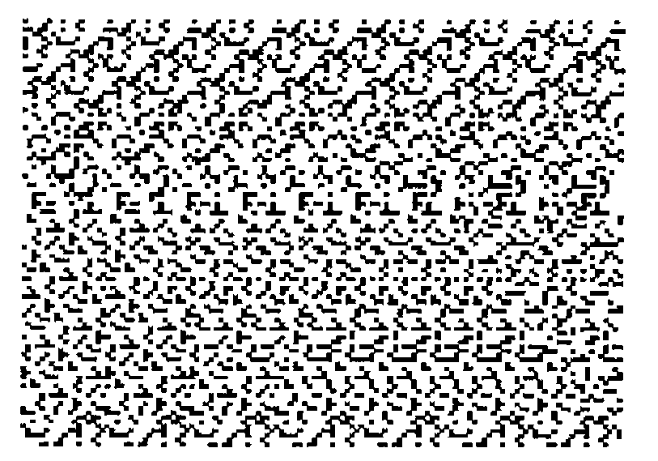
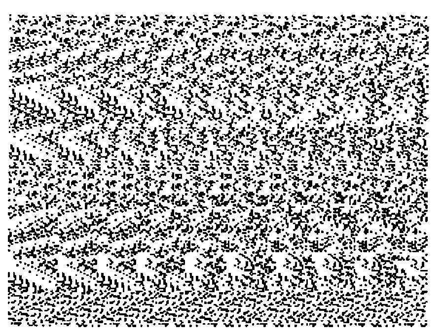
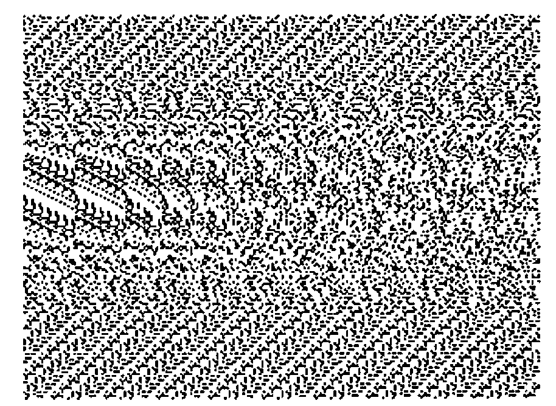

*by E.A. Clough*
{ .byline }

## Introduction

This note was inspired by a recent article by C.A. Reiter in *Vector* [1], by a ‘Low Level’ note by M. Liardet in *Personal Computer World* [2], and by my desire to learn how to program in J. I assume familiarity with Reiter’s article, which describes the structure of bitmaps and gives J functions for handling them. My approach to the production of ‘stereograms’ — pictures which may be seen in stereo — is a little different from that outlined by Liardet in that I form them from the information in the separate images seen by the left and right eyes.

Programs have been developed in Windows J v7.0. I am grateful to Norman Thomson for advice on tidying up the code and comments on presentation.

## Geometry

A viewer sees images of two-dimensional objects which lie behind a planar screen made of pixels. The objects occupy planes parallel to the screen and the viewer’s eyes lie on a line which is parallel to the pixel rows. Considerations of linearity then confirm what common sense suggests, *viz.* that, if there is an unobstructed view of an object, the screen image seen by the right eye is displaced to the right of that seen by the left eye but is otherwise geometrically identical: in other words, the left-right displacement is the same for every point on the object.



Figure 1: a Plan View
{ .caption }

Figure 1 shows a plan view of an arrangement, with a backdrop behind the objects. From similar triangles, (*xab*,*xlr*) or (*ybc*,*ylr*):

left-right image displacement (*ab* or *bc*) = *d*/(1+*q*)

where *d* = distance between the eyes<br>
*q* = ratio of the distances of eyes and the particular object from the screen.

Thus the displacement is a function of the distance or depth of the object behind the screen and it can be used as a key parameter in the development of a program.

## Scaling

Because of the degrees of freedom in the system, scaling is not critical. I normally work with arrays of 128×96 pixels, to keep stereogram production runs down to about 5 minutes on my 486DX40 computer (8Mb RAM), but I print at 500% magnification to produce a picture about 6.7 inches wide. Since my eyes are about two and a half inches apart, the distance between them (*d* above), at this scaling, is:

```text
128 * 2.5 / 6.7 =  48  pixels
```

If the backdrop is at the same distance from the screen as the eyes, its *q*-value is unity and its displacement is 24 pixels. Images of objects may then have displacements of 1 pixel upwards. (My code does not permit an object to occupy a place on the screen, i.e. a displacement of zero.)

In practice I have obtained reasonable results with a backdrop displacement of 18 pixels but I have not experimented to determine whether there is an optimum for stereogram production.

## Creation of a Stereo Image

In the formation of a stereo image, pixels only interact with others in the same row, because the rows are parallel to the line of the eyes.

In Figure 1, point ‘*x*’ would be visible to the operator’s left and right eyes so the two pixels ‘*a*’ and ‘*b*’, which the eyes see when looking in that direction, must be made the same colour. Also, if the left eye looks in the direction of pixel ‘*b*’ it would be able to see the point ‘*y*’, on object 1 and, since the right eye would also be able to see point ‘*y*’, the pixel ‘*c*’ must be made the same colour too. If, however, this process is continued via pixel ‘*c*’, the left eye would be able to see point ‘*z*’ but the right eye would not, because object 2 would be in the way, terminating the sequence. The process may now be restarted at pixel (*a*+1) using a different colour (provided ‘*a*+1’ has not already been coloured).

Another type of terminating event, not shown in Figure 1, occurs if the path of the beam from the backdrop or object to the right eye lies beyond the edge of the screen.

Stereograms are produced by the function ‘stereo’ in Appendix 1, using a filename argument of the form ‘xxxNN’, where ‘xxx’ is the generic filename and ‘NN’ is the (two-digit) displacement integer for the backdrop. It applies the above logic to two arrays representing left- and a right- eye pictures. Execution of the program converts the right eye array into a stereo array indexing pixel colours which the program uses from a palette of 100 colours put in a random order. The palette array and the stereo array are then stored as a bitmap labelled ‘xxxNN’ which may be edited if necessary and magnified for printing.

The array retains its stereo characteristics even if re-saved as a monochrome bitmap; sometimes it actually seems to be easier to see the stereo image in this mode.

## Creation of the Left- and Right-Eye Images

An image of the objects at one distance from the screen may be created in Windows Paintbrush. A black image on a white background will have an associated array, consisting of the numbers 0 and 255. Using J, another array may be amended so that those cells corresponding to the image cells hold the objects’ displacement value. The images of objects at other distances may then be added to build up a composite image.

The function `make` in Appendix 1 produces left- and right- eye pictures from ‘Cyclops’ images of the objects that make up the scene, that is, from images which would be seen by a single central eye. The Cyclops images are held under filenames ‘xxxnn’, where ‘xxx’ is the generic name and ‘nn’ is the displacement value for the object. Function `make` is first called dyadically, with ‘xxx’ as left argument and with a vector right argument, the vector consisting of the array dimensions followed by the backdrop displacement value (or its negative if the arrays have been part-created in an earlier session). The same function is then called monadically with object displacement values as argument, starting with the object furthest from the screen, to produce left- and right-eye bitmaps labelled ‘lxxxnn’ and ‘rxxxnn’. Figure 2 was produced from the following run:

```text
      'c:\jwin\scripts\' gets 'stereo'
      'geom'make 96,128,18
      make"0  u=.15,12,9
      6!:2'stereo','''geom18'''
263.7
```



Figure 2 - Geometry (Triangle and Half-Circle)
{ .caption }

## Two Notes on Scenes

There is inevitably some loss of sharpness at the boundaries of stereogram images and this places a limit on the degree of complexity that can be achieved. Figure 3 was produced, using 256×192 arrays, by filling letters from the name of a well-known journal in Gill Sans MT Shadow font at 72 point. The letters are somewhat ragged. Those with faster machines than mine may be able to do better using larger arrays.



Figure 3 - The Name of a Well-known Journal
{ .caption }

Because I work with images rather than objects, there is no automatic adjustment for the effects of perspective on image size and location. (Objects nearer to the screen will project larger images.) Great accuracy at the drawing stage will not normally be important but it may be more so if the 2-D objects are meant to serve as slices though 3-D objects. Figure 4 is an attempt at such a scene. I have no doubt that a simple J function could be designed to be applied before `make`, operating perhaps on outline rather than filled drawings of objects to produce the Cyclops images.



Figure 4 - Geometric Scene (Humps and Hollows)
{ .caption }

## References

[1] C.A. Reiter, *Fractals RYIJ*, Vector Vol.11 No.2 Oct 1994.

[2] M. Liardet, *Seeing Is Believing*, Personal Computer World Vol.17 No.12 Dec 1994.

[3] Thimbleby and Neesham, *How to Play Tricks with Dots*, New Scientist, 9th October 1993, page 26

## Appendix 1: The Script ‘stereo.js’

```text
NB.  Statement 2 of 'readbmp8' and number 3 of 'writebmp8
NB.  in Appendix 1 of reference 1 are each two statements.
NB.  After making these and other minor corrections, the
NB.  functions were filed as bmp8util.js

0!:3<'c:\jwin\scripts\bmp8util.js'

make=: 0 : 0
z2=:<.y.%2  [ y=.list y. [ nam=._2}.name
('p';'b')=:readbmp8 'c:\jwin\',nam,y,'.bmp'                NB. read 'Cyclops'
b=.b=0           NB. changes image-cells to 1 and background to 0
('l,',y) makes (-dim1){."1 b,"1 (dim0,(y.-z2))$0           NB. Shift left
('r,',y) makes dim1{."1 b,"1~ (dim0,z2)$0                  NB. Shift right
:
d01=:dim0*dim1  [dim0=:0{y.  [  dim1=:1{y.
name=:x.,(list=:":)z  [ z1=.1+z=.|zz=.2{y.
$.=.3: ` 6: @.* zz<0                               NB. don't initialise if zz<0
$.=.4+i.3  [ a=.(dim0,dim1) $ z   [ q=.hue"0]2r3*(i.%<:)z1
(q;a) writebmp8 'c:\jwin\l',name,'.bmp'            NB. left background
(q;a) writebmp8 'c:\jwin\r',name,'.bmp'            NB. right background
q=.''
)

makes=: 0 : 0
''
:
xname=.(0{0{words),name  [  words=.>;:x.
('q';'a')=.readbmp8 'c:\jwin\',xname,'.bmp'
d=.}.~.(,y.)*i.d01               NB. d is vector of image-cell linear indices
a=.(".2{words) d}a               NB. adds image to left/right picture
(q;a)writebmp8 'c:\jwin\',xname,'.bmp'
)

stereo=: 0 : 0
col=:c0 [c1=:1+c0=:"._2{.y. [nn=:100          NB.'c0 is a 2-digit integer
('pp';'al')=:readbmp8 'c:\jwin\l',y.,'.bmp'
('pp';'ar')=:readbmp8 'c:\jwin\r',y.,'.bmp'
pp=: ((c1,3)$0),(nn?nn){hue"0]2r3*(i.%<:)nn
iX=:i.X  [X1=:X-1  {X=:1{$al
yloop"0 i.(0{$al)                              NB. loops through pixel-row dim
(pp;ar)writebmp8 'c:\jwin\',y.,'.bmp'
:
''
)

yloop=: 0 : 0
yal=:y.{al  [ Xy=:X*y.
y.& loop"0 iX                        NB. loops through pixels within rows
:
''
)

loop=: 0 : 0              NB. resetting $. in the last line avoids 'WS FULL'
''
:
$.=.5:`1: @.* c1>(x=.y.){yar=.x.{ar                   NB. Is colour set?
$.=.2  [ col=:c1+nn|(col-c0)  [ xs=.''                NB. change colour
$.=.3:`4: @.* X1<x=.x+(z=.x{yal)  [ xs=.xs,x          NB. beyond screen?
$.=.4:`2: @.* z<:x{yar                                NB. rt eye blocked?
$.=.5  [ ar=:col (xs+Xy)}ar                           NB. change pixel colours
)

t=.'readbmp8 writebmp8  hue  make stereo'
SCRIPTNAMES=.t
```
