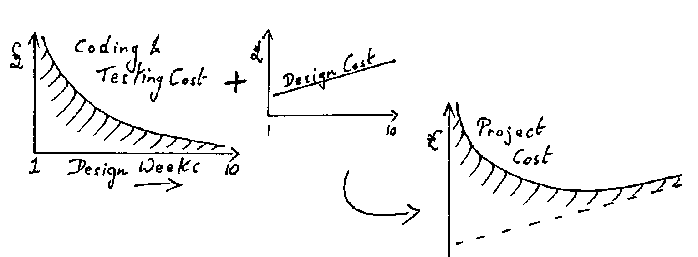

*Romilly Cocking (notes by Adrian Smith)*
{ .byline }

## Some Examples

SAM
: Sales and Marketing in consumer goods. Like all these big systems, it is really terribly simple in operation. Data is dimensioned by “Time,Product,Outlet”, where each cell has info about product price etc. The typical question “How are we doing ….?” requires access to 1Gb of data, with many reports per day. The users rate this as the highest value system they have ever put in.

TULIP
: “… how long before we can start selling these new pension plans?” “5 years” quoth DP, so the Insurance Admin Dept wrote it in APL themselves. Eventually their system was redone in COBOL; it went from 150Mbyte in Sharefile to 1.5Gbyte in Adabas, and took about 20 times as long to write as the APL original!

Petroleum DB
: Some 200Mb of data with complex joins between 17 tables. How do you relate different geologists views on stratigraphy? You have 48 hours to decide if you are going to take a share in an oil field …. “Let’s sit down at the terminal and find out ….”

The developer must focus on two needs:

- systems are professionally developed. They are not end-user systems, nor can they go through the COBOL grinder.
- systems have to track the changing needs of the business.

The closer the functional fit to the user’s needs, the higher his productivity gain, and the more time he will spend using the system.

## Key Objectives for Managing System Development

The system has to be **demonstrably** correct. It also has to be easy to change. You can’t design these at the terminal – that’s not theory; we’ve done it that way and it didn’t work!

You need appropriate design for data, APL functions, the logic within functions. APL gives you more time on design, because the coding is cheaper!

The majority of systems are under designed … looking at the shape of the cost curves, this is a very expensive mistake!

*Coding and Testing vs Analysis and Design*
{ .caption }

In a straw poll, 7 of those present (approx 60 attended) had participated in projects which had (in their view) been over-designed. These all appeared to be defence “cost plus” contracts!

Moral: remember the last time you debugged a set of Xmas-tree lights! The highly coupled version (bulbs in series) is like a bad APL system …. if there are two dud bulbs you are in for a long haul. Use the principles laid out in “Myers” to write systems which behave like the parallel-wired lights. The system is robust to failure of any one element, and what’s more it is quite obvious where the failure has occurred.

## Building on Success

Ask … “Do you know anyone else in this company, or anywhere else, who we should be talking to” They answer 1/2 the time, but often with 2 - 3 other people.

Tell … the world about it! Let the BAA spread it about!! APL has been under threat since its inception because:

1. of a shortage of people who know the language well
2. of a lack of vendor commitment. APL is not in SAA! This leaves lots of DP managers round the world wondering whether APL has a future.
3. of ignorance within DP. We tend to show the DP manager what a lousy job he’s doing. For some reason this argument doesn’t go down too well!
