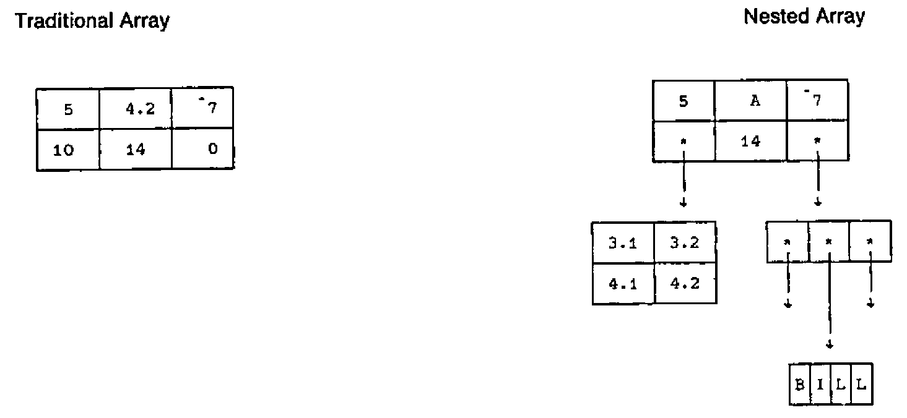
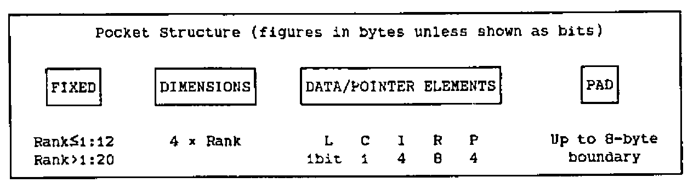
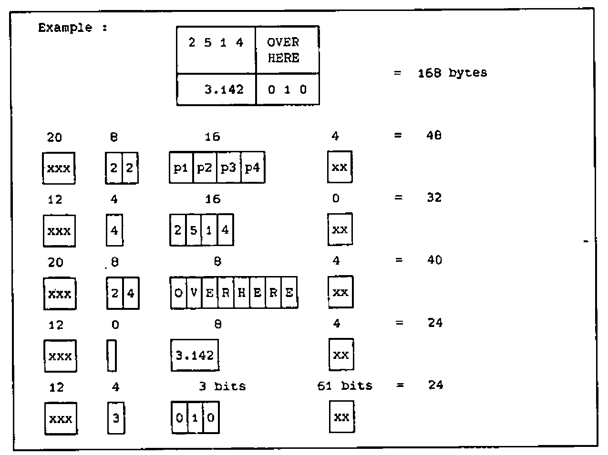
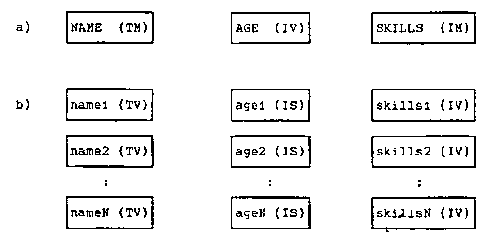

David Crossley
{ .byline }

Nested array versions of APL have been publicly available now for over three years. In this paper, I present some views and guidelines based on continuous experience over this period of using APL\*PLUS’s NARS (Nested Array Research System) and Dyalog APL.

## What Is A Nested Array?

I begin with the basics on the assumption that nested array theory is not a familiar subject. The diagrams below illustrate a traditional array and a nested array each in the shape of a matrix:



Familiar attributes of the traditional array are that:

- it is rectangular.
- it is homogeneous, i.e. numeric in this case.
- each element is a simple scalar item.

The nested array is also rectangular. However, an element may be an array that is enclosed to form a NON-SIMPLE scalar. The array that is enclosed is called the ITEM. Thus a nested array is a rectangular structure whose elements may be simple or non-simple scalars and whose items may be simple scalars or arrays. If all the elements are simple scalars, it looks like, in fact is, a traditional array.

Unfortunately there are two fundamentally different theories defining nested arrays. Briefly, the difference centres around the treatment of simple scalars. The “grounded” theory (advocated by Iverson, Bernecky et al and implemented in Sharp APL) insists that enclosing any array results in an extra level of nesting. The “floating” theory (supported by More, Brown, Smith, Scholes et al and implemented in APL2, APL\*PLUS and Dyalog APL) considers a simple array as a special case, and the result of enclosing is the same simple scalar.

Sharp APL does not allow a nested array to include simple scalar elements; all elements must be nested to a DEPTH of at least one (a simple scalar has a depth of zero). However, versions based on the “floating” theory allow simple scalars to float to the topmost level, a definition that permits simple arrays with both text and numeric elements — called a MIXED or HETEROGENEOUS array.

## Enclosing Arrays

Enclose is a new function that produces a scalar when applied to an array. Some results of applying this and other new functions are illustrated below for the different implementations — observe also that different symbols are used. Since display methods vary, I have used boxing to indicate levels of nesting.

```
Action               "Floating" theory        "Grounded theory
                     APL2/APL*PLUS/Dyalog     Sharp APL

Enclose of a               ⊂10                     <10
simple scalar         10                      ┌──┐
                                              │10│
                                              └──┘

Enclose of an              ⊂1 2 3                  <1 2 3
array                 ┌─────┐                 ┌─────┐
                      │1 2 3│                 │1 2 3│
                      └─────┘                 └─────┘

Catenation of              (⊂1 2),⊂3 4             <(1 2),<3 4
nested arrays         ┌───┐ ┌───┐             ┌───┐ ┌───┐
                      │1 2│ │3 4│             │1 2│ │3 4│
                      └───┘ └───┘             └───┘ └───┘

Catenation of              1,⊂3 4                  1,<3 4
simple scalar           ┌───┐
and nested array      1 │3 4│                 DOMAIN ERROR
                        └───┘

                        S←⊂10                   S←<10
                        V←(⊂1 2 3),⊂4 5 6       V←(<1 2 3),<4 5 6

Disclose -                 ⊃S                      >S
also called First      10                      10

                           ⊃V                      >V
                       1 2 3                   1 2 3
                                               4 5 6

Split -                    ↓V                 not implemented
similar to > in        1 2 3                  - see Disclose
Sharp APL              4 5 6
```

## Strand Notation

Strand notation is the term used to define a vector formed from two or more adjacent items. We already have this capability with simple items, eg

```apl
IV ← 10 20 30

TV ← 'ABC'
```

The extension of this principle allows:

```apl
NV ← e1 e2 e3.... eN
```

where el is any APL expression whose result is an array. Parentheses may be necessary to separate expressions. Strand notation appears to be incompatible with the “grounded” theory. It is implemented in all “floating” theory versions. Formally, it is equivalent to:

```apl
NV ← (⊂e1) , (⊂e2) , (⊂e3) , ..... ,(⊂eN)
```

Which would you prefer to write? Some examples are:

```
      IV TV
┌────────┐ ┌───┐
│10 20 30│ │ABC│
└────────┘ └───┘

      (2+2)(4×12)
4 48                        - note the scalar results

      'FRED' 'BILL' 'JIM'
┌────┐ ┌────┐ ┌───┐         - APL*PLUS requires parentheses here
│FRED│ │BILL│ │JIM│           but this is soon to be relaxed
└────┘ └────┘ └───┘
```

Strand notation also applies to assignment:

```
      A B C ← ⎕ ← 'ONE' 2 (⊂,1+2)
            ┌───┐
┌───┐       │┌─┐│
│ONE│  2    ││3││
└───┘       │└─┘│
            └───┘

      A               B              C
                                   ┌───┐
┌───┐                              │┌─┐│
│ONE│               2              ││3││
└───┘                              │└─┘│
                                   └───┘
```

The following example illustrates strand notation usage to form a nested vector of inverted items:

```
NAME (TM)          AGE (IV)          SKILLS (IM)
─────────          ────────          ───────────
W.SMITH               22              2 5 7 0 0
P.JONES               45              1 2 6 7 9
J.LEWIS               31              5 7 8 0 0

      PERSONNEL ← NAME AGE SKILLS

      0 1 0 ⌿¨ PERSONNEL
┌───────┐ ┌──┐ ┌─────────┐
│P.JONES│ │45│ │1 2 6 7 9│
└───────┘ └──┘ └─────────┘

      PERSONNEL ← PERSONNEL JOIN1 ¨ ('D.BERRY') 19 (1 3)

      PERSONNEL
┌───────┐ ┌──┐ ┌─────────┐
│W.SMITH│ │22│ │2 5 7 0 0│
│P.JONES│ │45│ │1 2 6 7 9│
│J.LEWIS│ │31│ │5 7 8 0 0│
│D.BERRY│ │19│ │1 3 0 0 0│
└───────┘ └──┘ └─────────┘
```

Various criticisms are made against strand notation:

a)
:   that there is an implied function between each strand element.

b)
:   that visual context is further confused (what does A B C F X Y Z mean?)

c)
:   that a single-element vector cannot be formed without explicit use of two functions, ie ravel enclose.

Note that for point (c) the same applies for a simple input; assignment of a scalar results in a scalar, not a vector. However, a point to watch is the case of a single expression when using execute to build a strand, as eg.

```apl
⍎,' ',I⌿VARS
```

where VARS is a matrix of variable names.

## Storage Of Arrays

When designing applications using nested arrays, it is very important to be aware of the workspace implications. Even with IBM mega-workspace, it is all too easy to gobble bytes on a prodigious scale in the heady early days of using nested arrays. The nesting overhead for non-simple arrays can be high. The size figures in the examples shown below apply to APL\*PLUS, but other implementations are likely to be of similar magnitude.

The unit of storage in arrays is called the POCKET. The data/pointer elements of a pocket are homogeneous, either all data of one type or all pointers. In a simple, homogeneous array, there is a single pocket. In any other array, there is more than one pocket. (Think of the implications of an array, albeit simple, with both character and numeric elements).





Taking the PERSONNEL example from the previous section, consider the workspace implications of the two structures below with realistic amounts of data:

a)
:   a structure that presents the information in a very convenient form for selection purposes. However, retrieval and updating is not convenient.

b)
:   a structure that is also convenient for selection purposes (since most functions such as epsilon and iota work on nested vectors). Retrieval and updating on a record basis are greatly simplified.

In fact, we see that there is a very large structural overhead incurred with approach (b), whilst that for (a) is trivial. The implications must be carefully assessed before adopting approach (a).



```
Size information :
                         (a)            (b)

          NAME         200 × 10       200 × 7 (say)
          AGE          200            200
          SKILLS       200 × 10       200 × 5 (say)

          Data storage    10,800          6,400
          Array storage   10,912         16,032
          Overheads          112          9,832
          Unit increment      56             84
```

## Practical Usages of Nested Arrays

### Inverted Data Structures

This usage of nested structures was the subject of the last section. It avoids the need for a multiplicity of global variables that would otherwise be needed to carry information for many fields. Coding is also greatly reduced since many operations that need to be carried out on all fields may be executed in a single expression, eg

```apl
PERSONNEL←(⊂I)⌿PERSONNEL
```

There is a further advantage on systems liable to interrupts; either all items (fields) are updated, or none are. This same advantage applies when updating a component file since the structure may be stored in a single component instead of one component per field.

### Control Blocks

Utility software such as screen-handling or structured file systems often require many miscellaneous items of information to keep track of the environment. A file system may need a tie number (IS), a file-name (TV), an index of field names (VTV), and so forth. Conventionally, such information is stored in an untidy mass of globals — take a look at proprietary screen software such as APE sometime!

All of this information can be carried as a single nested array in a variable whose name is chosen by you as the designer. This variable may then be a common argument to utility functions, and returned, possibly modified, as the explicit result.

### Polyadic Functions

Functions suffer the drawback of allowing no more than two arguments. A nested vector allows any number of arrays to be gathered, and the process to be reversed inside the function. For example:

```apl
    ∇ R←INSERT PARS;I;X
[1]  ⍝ Inserts values into subscripted positions
[2]  ⍝ PARS ←→ <vector to be modified><subscripts><new values>
[3]    R I X ← PARS
[4]    R[I]←X
    ∇
```

### Lists

Tables of standard information, such as product names, may be stored as vectors of text vectors (VTVs). Since most standard functions apply to nested arrays, VTVs simplify coding. For example:

```apl
      PRODUCTS←'HAMMER' 'CHISEL' 'SCREWDRIVER' 'SAW' 'BRADAWL'

      PRODUCTS ⍳ 'CHISEL' 'SAW' 'PLYERS'
2 4 6
```

## Operator Extensions

The introduction of nested arrays to APL is, in my view, justified not so much by the added versatility of data structures per se as by the enormously increased richness brought about by operator extensions. A new power has been provided comparable in magnitude to the difference between traditional APL and, say, FORTRAN.

In the past the distinction between operators and functions has, to most practitioners, been fuzzy. Because the number of available operators was small (reduction, scan, inner product, outer product, and, some would say, axis), their slightly different syntax has been considered a special case. In fact, the rules for applying operators have always been clear to theorists (although the ∘ in outer product is an anomaly). In the true tradition of APL, the rules are simple and consistent. An operator is applied to one or two function (or array) operands to form a DERIVED FUNCTION that is then applied to one or two array arguments. Operators have precedence over functions. They have long left scope (functions have long right scope). That is to say, the left operand of an operator is the longest function expression to its left; its right operand, if there is one, is the function (or array) immediately to its right. The right operand may, of course, be extended using parentheses. For example:

```
      + / 1 2 3              + is the left operand of monadic operator /
6                            +/ is the monadic derived function

      +/¨ (1 2 3) (4 5 6)    +/ is the left operand of monadic operator ¨
6 15                         +/¨ is the monadic derived function
```

The limitation on the extension of operators was the requirement that the result of the derived function be simple. Nested arrays remove this constraint. The re-definition of existing operators and the newly-introduced operators vary between the different implementations. Sharp APL has a number of operators of great power but restricted to a defined set of primitive functions. Other implementations have introduced operators with simpler definitions applicable to any function (including user-defined functions) meeting valency requirements. APL2 even permits user-defined operators. The further discussions in this paper follow the APL\*PLUS model.

### Extension of Existing Operators

Existing operators are re-defined to work on nested arrays. Taking “reduction” as an example, the new definition for the vector case is:

```apl
+/ e1 e2 e3  ←→  ⊂(⊃e1) + (⊃e2) + (⊃e3)
```

whence:

```
      +/ (1 2 3) (4 5 6) (7 8 9)
┌────────┐
│12 15 18│
└────────┘

      ,/ 'ABC' 'DEF'
┌──────┐
│ABCDEF│
└──────┘
```

A user-defined function may be written to exmine the way an operator works:

```
    ∇ R ← A PLUS B
[1]   A '+' B 'is' (R←A+B)
    ∇

      PLUS/ (1 2 3) (4 5 6) (7 8 9)
4 5 6 +  7  8  9 is 11 13 15
1 2 3 + 11 13 15 is 12 15 18
┌────────┐
│12 15 18│
└────────┘
```

Inner product is an interesting operator to examine using this technique.

### New Operators

APL\*PLUS introduced a single new operator of great power called “each” written as ¨. It is a monadic operator that may be applied to either a monadic or dyadic function to produce a monadic or dyadic derived function respectively. The derived function is applied to each (corresponding) item of the argument(s) after scalar extension if required.

```
      ⌽¨ (1 2 3) (4  (5 6))
        ┌───────┐
┌─────┐ │┌───┐  │
│3 2 1│ ││5 6│ 4│
└─────┘ │└───┘  │
        └───────┘

      6↑¨ 'DAVID' 'BILL' 'ME'
┌──────┐ ┌──────┐ ┌──────┐
│DAVID │ │BILL  │ │ME    │
└──────┘ └──────┘ └──────┘
```

The great potential for “each” is to be found when applied with user-defined functions:

```
      TRIM '   some  text    '
some text

      TRIM¨ '   Hammer   ' '    Monkey    wrench ' '  Saw '
┌──────┐ ┌─────────────┐ ┌───┐
│Hammer│ │Monkey wrench│ │Saw│
└──────┘ └─────────────┘ └───┘
```

## Summary

Operator extensions made possible by nested arrays undoubtedly improve the modularity of APL. This is seen in the ability to write more compact code. The need for looping is all but eliminated. These advantages should lead to more readable, more maintainable code.

There are pitfalls to avoid. Greater power in the language presents many more ways of doing the same thing badly. A common fault when first trying the new facilities is to over-use the “each” operator — I have seen 6 or more occurrences in a single statement. Examination almost always suggests a more succinct approach by collecting the functions involved into a user-defined function that is then applied with a single “each”, eg

```apl
⊃¨⍴¨⍴¨ARRAY        is replaced by        RANK¨ARRAY
```

This technique also avoids large temporary usage of the workspace. Consider, for example, the implications of:

```apl
⍴¨⎕FREAD¨TIE,¨COMPTS
```

Deeply-nested structures should also be avoided. Apart from the quite considerable structural overhead in workspace, items that are deeply-nested are difficult to manipulate often leading to over-complex code.

A word must be said about computing efficiency. We are currently seeing first generation implementations of nested arrays, although second generations are now emerging. The nested approach may be slower than a non-nested solution to the same problem. This may be because the primitive functions and operators are not so slick with nested structures, or it may be because the approach per se demands far greater use of resources. The former reason should improve as implementations are enhanced (we are already seeing this). Otherwise the computational cost is a factor to be traded-off against the benefits of programming ease and maintainability.

I have found working with nested array versions of APL a delight. With awareness the pitfalls are easy to avoid. Going back to ‘ordinary’ APL reminds me of a time some while ago when I was required to program again in FORTRAN; perhaps a little extreme as an analogy but nested-APLers will know what I mean.
