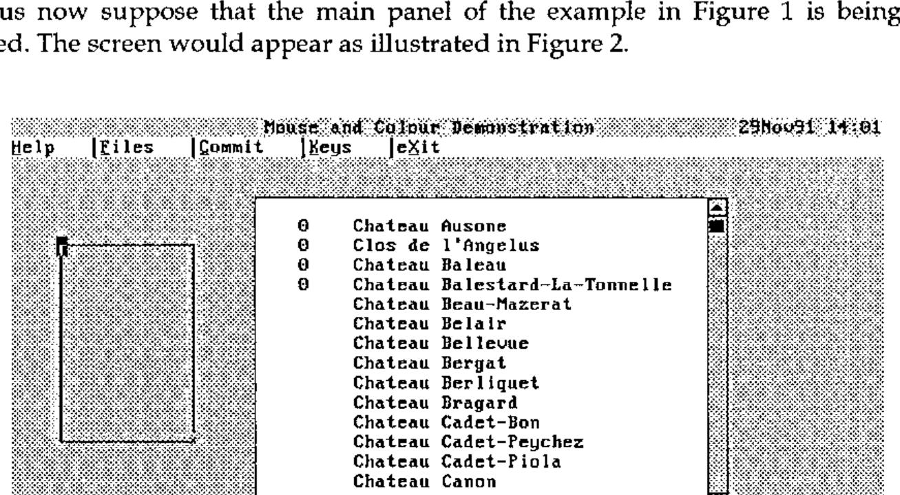

*by David Crossley*
{ .byline }

The value of any aid in designing and generating panels for screen display is readily appreciated by those involved in serious applications development. Using the basic screen facilities of your version of APL may be fun at first, but soon the sheer repetitive nature of screen interface handling becomes tiresome. Most programmers will develop a few macros and this helps. Most suppliers also provide utility workspaces to design panels, or forms as they are often called. However, in my view a fully integrated design toolkit is the only real answer.

The subject of this article is such a package. It incorporates well tried and tested ideas gleaned from many years working with a very good panel design facility in a mainframe environment. The contribution that a good facility makes towards programming productivity should not be underestimated. My experience suggests 40-50% savings in screen-intensive applications, and most of them are. There are also excellent spin-offs. It is easier to provide a consistent, corporate look and feel across (and within) applications. It is more likely that proper help facilities will be incorporated. Support for special features, such as sliders, pop-ups and pull-downs can be included. Panel design packages provide immediate potential for automatic documentation - never a strong point for any programmer I have worked with. But importantly from the systems design viewpoint, the supporting facilities can provide the complete basis for full interface handling - the screen display, keyboard and mouse control.

The origins of this panel design package go back about two years, though the concepts considerably pre-date that time. After many years using mainframe APL, I started work in a relatively greenfield environment (for the company) with PCs linked to a workstation under Unix. There were few support facilities. Though some had been migrated from the mainframe, the important area of panel design was unsupported, partly because the APL in use was Dyalog with the recently introduced `⎕SM`, an advanced screen management facility. My first task was to write a panel design package along with support functions, with Dyadic’s useful though limited `⎕SM` design workspace as a starting point. This effort repaid itself many times over and soon migrated to other development areas within the company.

I have since developed various applications for 80386/80486-based personal computers running under DOS. The lack of proper mouse and full colour support common to most APLs within this environment has increasingly irked me, especially with MS Windows on the same machine, unhappily incompatible with APL. Inspired by recent Vector articles [Cannon 91;Smith 90], I researched the use of DOS interrupts directly from APL. The results were sufficiently impressive to warrant a complete re-write of the panel design package to incorporate full support, and many additional features, within the software. I call this package the Delphi Panel Design Toolkit after my trading name.

## What is a Panel Design Toolkit?

The first component of a toolkit is a mini-application to describe a panel, or form, and store it away somewhere for later use. This design tool allows different areas of the panel to be identified as "fields" and ascribes various attributes to each field, such as whether or not input is permitted, what sort of data it will contain, colours and so forth. There is a great deal of scope here for associating properties with fields that will simplify the programming task later; a function to validate user input is one such idea. Special fields might also be recognised, such as a menu bar now made so familiar by its acceptance in graphical user interfaces.

Many panel design packages effectively stop at this point without realising the great potential in terms of application interface control. This is a mistake. The second component should be the provision of a host of programming support utilities. Firstly, a "setup" utility to retrieve a saved panel, usually from a file, and display it with current application data. Secondly, a "read" utility to handle all user communications, whether by means of keyboard or mouse. And finally, a supporting cast of functions to allow the programmer to make changes on the fly in a controlled manner. For example, items on a menu bar might be temporarily disabled but remain visible; better done in cooperation with panel software.

The "read" utility is perhaps the single most powerful tool. It can handle not only pedestrian traffic, such as accepting input, refreshing the screen, scrolling fields and so on, but also more sophisticated tasks such as validating input, insisting on corrections for inappropriate entries, intercepting specific events such as help requests - the scope is tremendous. Each activity handled by the tool is a task less for the programmer to worry about. If an event can be handled in a standard way, let the tool do it. But allow other events to return control to the program for suitable action.

These are the philosophies embodied in the *Delphi Panel Design Toolkit*.

## The APL Framework

Panel definitions are stored on an APL component file, normally associated with a single application. The *Panel Definition Tool* (see below) has its own panel file, and indeed the application code utilises its own services correctly. A file may be created using the `P_CREATE` utility, or else the tool can do the work when the first panel is saved. There is no naming convention imposed, but I find it useful to have a name of the form ‘panxxxxx’ for ease of identification.

The file structure is very simple. It has a directory which records panel names, short descriptions, creation timestamps and pointers to other components where the full definition for a panel resides. A component is reserved optionally to store red-green-blue colour scales that allows individual colours for an application to be customised - more on this later.

A panel definition variable is a nested vector with 4 items:

- the associated filename;
- the panel identification name;
- a nested structure that describes function (or other) key actions;
- a matrix with one row per field, describing attributes for that field.

This panel variable is defined in the workspace when required and is an argument to and returned in the result from almost all service functions. Its contents may be altered in the process. Programmers who wish to meddle directly with this variable, as they surely will, are provided with a set of subscript variables for items and columns of the main matrix, such as `P⍙VIDEO` for the column containing the video (colour) attribute. This is a good general practice since it soothes some of the pains of future upgrades.

There are a few globals but not many. One holds the last-used panel file, allowing the filename to be elided in various function calls, i.e. omitted or represented as `''`. Other globals relate to the mouse, keyboard and output translation, the latter being implementation specific.

## Mouse Technology

For readers who are not familiar with the use of a mouse, and perhaps also for some who are, here is a short digression on the subject. Physically, a mouse has two or three buttons and plugs into a serial (or parallel) port to the computer. It translates roller ball movements into relative screen movements of a small pointer on the screen. To use a mouse, a driver program must be loaded into DOS. This can be done at any time but is usually included in the boot procedures. The load program specifies which protocol is to be used; in effect,
how many buttons are active. The norm is two active buttons (left and right), but three can be made active.

All sorts of mouse attributes are configurable, such as the pointer shape and colours, and the dynamic properties of its movement. Attributes, mouse button presses and movements are accessed through specific APL facilities, such as `⎕MOUSE`, or through a set of DOS interrupts (the method used in my software). For full details refer to [Duncan 88].

Essentially, the programmer is interested in three parameters for controlled use of the mouse:

- the screen coordinates of the mouse;
- the combination of buttons that are currently pressed (including none);
- the perceived state of the mouse.

With a two-button mouse, there are 4 button combinations, *viz* left, right, left and right, and none. It is nice for left-handed people to have the option to swap left and right buttons, since the index finger is generally preferred for the main clicking task. Unfortunately, this must be supported in software.

The useful mouse states are single click, double click, and drag (button held down). Their detection requires constant monitoring using a short time interval to distinguish between states. This interval should be user- configurable (as should the mouse’s dynamic properties) since some people react faster than others.

Thus a two-button mouse offers 10 different combinations of buttons and states (including no buttons pressed) and also the positional information on which to make program control decisions. In practice, only a small subset of events is acceptable. Conventionally, just the left button is live and click is the main activator. Double click is normally used to complete some activity.

The great virtue of the mouse is its enormous facility for rapid movement around the screen, making keystroke navigation even more ponderous than it seemed. From being a mouse-sceptic (before I used a mouse), I now applaud the "point-and-click" approach as effective and time-saving; it has opened up new horizons in the design of screen-based applications.

## It’s a Colourful World

Another digression. Most 80386/80486 machines these days have a Video Graphics Adaptor (VGA), and most text-based APLs grossly under-utilise its potential. Many of you will think that you are limited to the 8 or 16 rather lurid standard colours that are initially presented when you switch on. This is not the case.

The VGA is set up to mimic earlier graphics cards by default. Text modes still impose a limit of 16 simultaneous colours (8 standard plus 8 enhanced colours using the bright and blink bits for foreground and background respectively). But each of those 16 colours can be mixed individually to your own taste.

In fact, the VGA is sophisticated circuitry, differing by manufacturer, with very rapid switching facilities, especially if controlled directly. For text-based screens (as opposed to graphics), control at that level is unnecessary. The use of a few DOS interrupts accessible from most APLs is all that is required.

The 256 colour registers are split into 4 "pages" of 64 registers for text modes, only one page of which is used, and only a "palette" of 16 of those registers is used. Each register (or DAC register for digital-to-analogue-convertor, to give it its full name) points to a colour mix. A mix is a combination of red, blue and green values on a scale from 0-63 that gives a specific colour. All 0’s give black. All 63’s give white. There are over 260,000 possibilities in between.

It is not really necessary to have a deeper understanding of the VGA beyond that described here to use the DOS interrupts. For the latter, and for a varied and readable book on the PC in general, I recommend [Norton 88].

The panel design tool incorporates a facility to customise colour palettes and the use of colours. This information is stored on the panel file for use over the whole application. Programmer tools are provided to switch palettes and to restore standard (or prior) palettes.

## What’s in a Panel?

Before reviewing the mechanics of the panel design tool, it may be helpful to look at an example of what it can achieve as the end-user would see it.

Figure 1 illustrates a very simple application which nevertheless incorporates several built-in features.


*Figure 1: A panel with Files pull-down*
{ .caption }

On the top line there is a title and a date/time field. Then there is a menu bar. The uses for function keys are shown near the base of the screen. And two blocked areas have slider scroll bars to their right. These are all special field types supported without any further coding requirements from the programmer.

The title field takes its text from a specified variable and automatically centres it within the field width.

The date/time field is continuously updated at minute intervals.

A menu bar item may be activated by moving to the item and pressing *Enter*, pressing *Alt* with the underbarred character in the item word, or clicking on the item with the mouse. Each case is functionally synonymous. The item changes its video, normally white-on-black from black-on-white but the choice is left to the designer. Some standard actions are handled directly, such as Help (to display help for the current field or the entire panel) and Keys (to toggle the display of
function key box at the base of the screen on and off). Otherwise the event is returned to the program for appropriate action. In this example, the Files option has been requested and the action has been the display of a selection list of files. This pull-down is of course simply another panel overlaid on top of the main panel.

The function key box near the base of the screen is available as a prompt to the user. An action is invoked by pressing the function key (or indeed any key on the keyboard may be specified), or by clicking on the item with the mouse. Standard actions may also be associated with keys to be handled directly as for the menu bar. I always assign F1 to Help but keys can be arbitrarily assigned to suit house conventions. But normally, the event is reported back to the program for action. The display of the keys box can be toggled on and off. I generally assign F11 for this purpose, with the Keys option on the menu bar as an alternative.

Slider bars are associated during field definition and are then handled entirely by the toolkit software. Both vertical and horizontal sliders are supported. Several related scroll fields may be controlled by one slider, illustrated by the year and wine description fields in the example. These are strictly mouse operated though the data fields controlled by the slider may also be scrolled using movement keys.

Usage of slider bars is conventional. The ratio of the slider marker position to the slider length is kept in step with the ratio of the top-left visible element of the scroll data to its total length within rounding accuracy. Clicking within the slider moves the scroll data accordingly. Clicking on the top or bottom (left or right) box marked with a chevron moves the data by almost a screen window in that direction. By placing the mouse on the marker with the button held down, the marker may then be dragged with almost smooth scrolling of the data. A small box also appears giving the data row (or column) visible in the top-left corner. The slider marker is also updated when scrolled areas are moved by key actions.

The bottom line of the screen is used for error or informative messages if required. Messages are not generated by the panel utilities, but by the user program. If either of two variables (`ERROR` or `MESSAGE`) contains text, the message (on a striking red or a less attention-grabbing white background) is displayed on the bottom line by the "read" utility and cleared the next time round.

The panel tools do not impose any particular convention or layout on the designer. The entire screen may be used including the bottom lines. The special fields are not restricted to a specific place on the screen, with the exception of the keys box and message line. Both facilities can be switched off and remain unused though the latter is in any case transient. Thus the designer is free to develop a personal style naturally taking account of house standards.

Let us now see how the main panel was defined.

## The Panel Definition Tool

### …Getting Started

This is a mini-application in its own right, utilising many of the facilities provided with the toolkit. It is initiated by monadic function `P_DESIGN`. Its argument can be:

> (a) a properly-formed panel variable,<br>
> (b) a text file name and panel name,<br>
> (c) an empty vector.

The result is a panel variable but it is "shy". This means that a result is returned if it is used, e.g. assigned to a variable name, but otherwise it is suppressed. Form (b) is usual but even here the file name may be elided to the last-used panel file. Normally panel definitions will be read from a panel file (for editing) and saved on completion, but the flexibility is there to edit and return a panel variable from the workspace, saving it en route if desired.

### …Defining Fields

For a new panel, a blank screen is presented except for a list of function key uses near the base of the screen. The keys can be toggled off and on using F11. This is a completely empty panel with no fields.

A field is a rectangular box marked using the cursor movement keys after selecting the Create option, or more swiftly by creating a spot and then dragging a box anchored at one corner with the mouse. The field acquires default attributes of which more later.

Fields can overlay other fields, obscuring what lies beneath. This is actually useful. Overlaid fields will normally contain text titles, headings and box characters while input or display fields, possibly with scrollable data, will be placed on top. In fact, two field types are supported called ‘&lt;background&gt;’ and ‘&lt;text&gt;’. The former has extra properties and would normally fill the entire panel area. Firstly it provides a background colour for the panel. But also it provides various default attributes for other fields relating to the mouse, and also a detailed level of help accessible from any field.

Thus the first defined field should be the ‘&lt;background&gt;’. Subsequent fields are defined on top of what is already there, but a facility allows re-ordering in case a background field is forgotten. If customised colours are required, this is the best time to use the Colours option, though the facility can be used at any time.

### …Back to the Example

Let us now suppose that the main panel of the example in Figure 1 is being edited. The screen would appear as illustrated in Figure 2.



*Figure 2: Creating a new field*
{ .caption }

The individual fields are filled with data if available and take defaults otherwise. The figure indicates that data was available for the title and for the list of wines (as variables in the workspace) but not for the year field. The date/ time is generated by a utility function. Text on the menu bar is built into that field. Note that the function key box relates to the panel design facility, not to the panel being defined.

An alternative display option toggled by the Text/Boxes key shows fields marked by boxes in place of the contents display. This is useful for seeing exactly where each field lies. In the figure, the demarcation between the year, wine list and background cannot be differentiated. By switching to Boxes mode, the boundaries would be clear.

The figure shows a new field being created to the left using the mouse. The blob at the top-left is the initial creation point. The cross at the opposite corner is the mouse, dragging the field to the required size. On release it will become the current field, highlighted by a solid border. The current field is the topmost one in which the cursor lies. Clicking with the mouse moves the cursor to that point, making it the current field. An existing field may also be moved using the Move/Resize option or by dragging with the mouse.

### …Field Attributes

Pressing the Attributes key, or double clicking with the mouse on a field, pops the attributes panel up. Figure 3 illustrates this panel shown after double-clicking on the year field. It further shows the field data type, highlighted, in the process of being defined through a second cascading series of pop-up panels.


*Figure 3: Editing the type attribute*
{ .caption }

The left-hand column identifies field attributes. The cursor or mouse may be moved to any data area on the right. Several inputs respond to the Enter key or mouse click by displaying a pop-up (as in the example). Others allow direct input.

Taken in order, the attributes are as follows:

> **Field name.** A user-defined name, or Enter/click presents a pop-up of special names. &lt;background&gt; and &lt;text&gt; have already been mentioned. In addition, there are:
>
> | | |
> |---|---|
> | &lt;command&gt; | to define a menu bar field; |
> | &lt;time&gt; | to define a date/time field; |
> | &lt;title&gt; | to define a title field; |
> | &lt;slider-#&gt; | defining system-generated slider bar fields. |
>
> Some of the remaining attributes may be protected when a special field is chosen.
>
> **Row/column.** Defines the top-left screen coordinates and the number of rows and columns. These may be changed.
>
> **Type.** Defines the type of data that will appear in the field. Options are Character, Numeric or Date with finer details such as formats for each. Default allows Character or Numeric, but would generally be chosen for non-input fields. A Character field type with a comprehensive set of edit facilities, including word wrap, is included.
>
> **Behaviour.** The options here are partly implementation-dependent. It allows various behaviour attributes when the field is entered, such as input protection and clearing on input; if control is to be returned such as on entry, after modification, and on exit; and when the field is left, to retain active video. The required options are selected through a pop-up panel.
>
> **Video.** Specifies the foreground and background colours for the field in normal state, and optionally when the cursor is in the field. A pop-up panel provides a bar to choose the colours, illustrating what the selection looks like. The example shows the different active video for the Type field.
>
> **Scroll.** Relates this field to other fields with the same vertical or horizontal scroll number. All fields with the same vertical scroll number will scroll in parallel when any of the fields is scrolled. Ditto for horizontal scroll groups.
>
> **Display variable.** Normally the name of a variable that will supply the contents of the field. For a protected field, it can be any APL expression yielding an appropriate array.
>
> **Display function.** An optional function (or APL expression) to be applied to the display variable whose result then supplies the field contents. This is useful for special formatting of, say, numeric data.
>
> **Input variable.** A variable to receive the result of the field when it is modified by the user. It defaults to the display variable if not defined.
>
> **Input function.** A function (or APL expression) to alter or verify an item of the field when modified. It might, for instance, check that a numeric value is within a given range, or it could change a response to a nicer format, or remove superfluous blanks.
>
> **Event function.** This is a function that allows an exit event to be checked to see if it applies. For example, a left or right arrow movement key might be an event to return control to the main program, but special action applies only to certain fields, otherwise the normal movement action is to be taken. This facility allows the latter case to be filtered out, thereby improving performance.
>
> **Help.** A pop-up edit panel allows help text to be composed for the field. This is displayed when a help key is pressed (normally F1 or the Help menu bar command) with the cursor in the field. If the help key is pressed a second time, the generally more detailed help composed for the &lt;background&gt; field is displayed.
>
> **Mouse details.** Mouse actions and buttons are selected from pop-up menus. The appearance of the mouse pointer is specified by two sets of character-foreground colour-background colour triplets that are respectively "exclusive ORed" and "ANDed" with whatever is on the screen at the current pointer position. These actions are of course handled by the mouse driver. A small box labelled TRY IT allows you to see what the pointer will look like. Mouse details can be set individually for a field or set globally for unspecified fields.
>
> **Sliders.** Sliders can be specified both vertically and horizontally. On exiting, sliders will be generated automatically around the field. A slider can also be generated around a set of fields sharing the same scroll group either vertically or horizontally, but not both. If the result is not what is required, the fields generated for the sliders can be edited.

An option is included to save the set of attributes as the defaults. These are inherited by new fields as they are created, and also by unnamed fields.

### …Setting Function Keys

The panel to set function keys is actioned by the Keys option from the main panel. It is illustrated in Figure 4.


*Figure 4: Defining function keys*
{ .caption }

Key details are defined in four parallel columns. The first identifies all keys that will cause control to be returned to the program. This may include any key, not just function keys. The next column indicates the standard use for that key, if it has one, from ‘help’, ‘keys’ and ‘quit’, all of which invoke special action. The third and fourth columns describe the key mnemonic and a brief description of its purpose, used to compose the help block at the base of the screen. These items are left blank for keys that are not to be included in the block. The numbers on the left can be edited to change the presentation order.

The keys may be shown with or without a surrounding box, and in the former case with a short title inserted within the lower box. The colours used and the mouse details may also be chosen. Having compiled the list, the Show option provides a preview of what it will look like. Key actions are not field specific. However, an action can be filtered out using the Event Function attribute described above.

### …Saving the Panel

Having completed the panel definition process, the Commit option presents a pop-up panel showing the panel file and panel name, if they have been defined, and a short description. The names may be changed, and a new file or panel name created if necessary. This provides a means of copying a panel between files, and of using an existing panel as the starting point for a new panel. A warning message gives the current status of file and panel.

Finally, software can generate a skeleton control function for the panel, localising all referenced variables, identifying function references and providing a control structure for events implied by the key actions and other events. Figure 5 provides a sample for your perusal.

```apl
     ∇ PAN←TEST1;⎕SM;ERROR;MESSAGE;KEYS;P;RGB;SMROWS;SMUPD;Z;TEXT;TITLE;YEAR
[1]   ⍝∇ Demonstration panel
[2]   ⍝  Control for panel TEST1 generated by program
[3]   ⍝  Referenced variables:
[4]   ⍝   TEXT TITLE YEAR
[5]   ⍝  Referenced functions:
[6]   ⍝⋄  CLEANTEXT
[7]
[8]    TITLE←' '
[9]    TEXT←' '
[10]   YEAR←0
[11]   P←P_SETUP'd:\WS\pantest'P_GET'TEST1'     ⍝ Get panel and setup
[12]   RGB←P_SETCOLOURS P                       ⍝ Set colours, return prior
[13]   SMROWS←P P_MAINFIELD'Commands YEAR TEXT' ⍝ Input field numbers
[14]   SMUPD←'*'                                ⍝ Fields to refresh (all)
[15]   Z←(⊃SMROWS)1 1                           ⍝ Initial context
[16]   KEYS←'F2' 'F12' 'ER' 'F' 'C' 'X' 'M1' 'M2'
[17]
[18]  Read:Z P←P P_MOUSEREAD SMROWS'*'Z SMUPD ⋄ SMUPD←0
[19]
[20]   →Modified Key[(Z[5]P_BEHAVIOUR modified)⍳1]
[21]  ⍝ Exit events
[22]  Modified:→NotYet
[23]
[24]  Key:→KeyF2 KeyF12 KeyER KeyF KeyC KeyX KeyM1 KeyM2 None[KEYS⍳Z[4]]
[25]  ⍝ Key events
[26]  KeyF2:→NotYet
[27]  KeyF12:→NotYet
[28]  KeyER:→NotYet
[29]  ⍝ Menu bar events
[30]  KeyF:→NotYet
[31]  KeyC:→NotYet
[32]  KeyX:→NotYet
[33]  ⍝ Mouse events
[34]  KeyM1:→NotYet
[35]  KeyM2:→NotYet
[36]
[37]  NotYet:ERROR←'Event ',(4⊃Z),' not yet available' ⋄ Z[4]←⊂'' ⋄ →Read
[38]  None:ERROR←'Unknown event ',4⊃Z ⋄ Z[4]←⊂'' ⋄ →Read
[39]
[40]  Exit:SETCOLOURS RGB
     ∇
```

*Figure 5: Sample generated control function*
{ .caption }

## Support Tools

Designing a panel is just the first part of the process. A suite of tools is provided to be used by the programmer for all sorts of tasks. The basic tools deal with setting up and reading from the keyboard and mouse actions. The latter tool is in fact the engine that drives the application. Other tools allow control of the colour palette, hiding of the key block, disabling or highlighting of menu bar items, pro forma selection panels, and many other facilities.

### …The Engine Room

The "read" tool warrants a closer look. Its arguments pass through the panel definition variable; fields to visit and in which order when using movement keys (tabbing and back-tabbing); keys to intercept and return control (or the standard set); the current context, i.e. where the cursor and mouse are, and optionally the next action to take; and fields to be refreshed as a result of any action taken by the main program of which the panel software would be unaware.

The tool constantly monitors the keyboard and mouse, taking the appropriate action when any events occur, such as updating the screen, scrolling, displaying help information, toggling keys, validating modified fields, and returning control to the main program. It is only the latter occurrence that requires the main program to take over. The current context and the possibly updated panel definition variable are returned. The current context identifies the cursor and mouse positions, the last key and exit event, or mouse event and button, and flags for updated fields. This context vector may be used, modified and returned to the "read" tool to adjust the environment.

## Footnote

I should add that although this is a text-based package written in Dyalog APL, based to some extent on their screen manager, the principles are much more general, applicable to and able to be implemented on most other APL platforms running under DOS.

## References

[Cannon 91] Ray Cannon: *‘Mice do it on the Mat’*, Vector 7.3 p.130

[Smith 90] Adrian Smith: *‘Lots More VGA Colours’*, Vector 7.1 p110

[Duncan 88] Ray Duncan: *‘MS-DOS Functions’*, Microsoft Press

[Norton 88] Peter Norton/Richard Wilton: *‘Programmer’s Guide to the IBM PC’*, Microsoft Press
