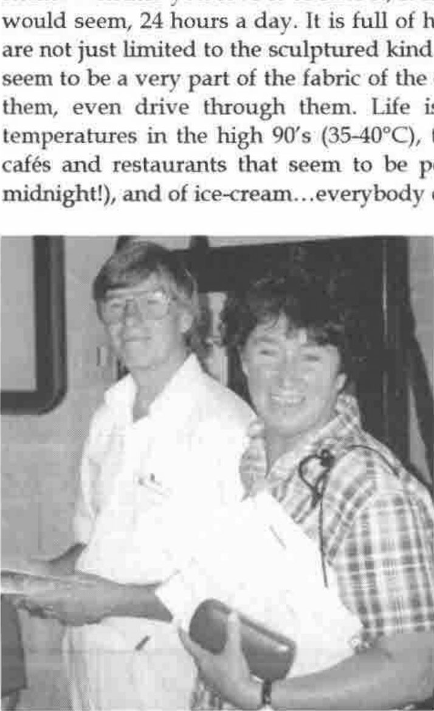
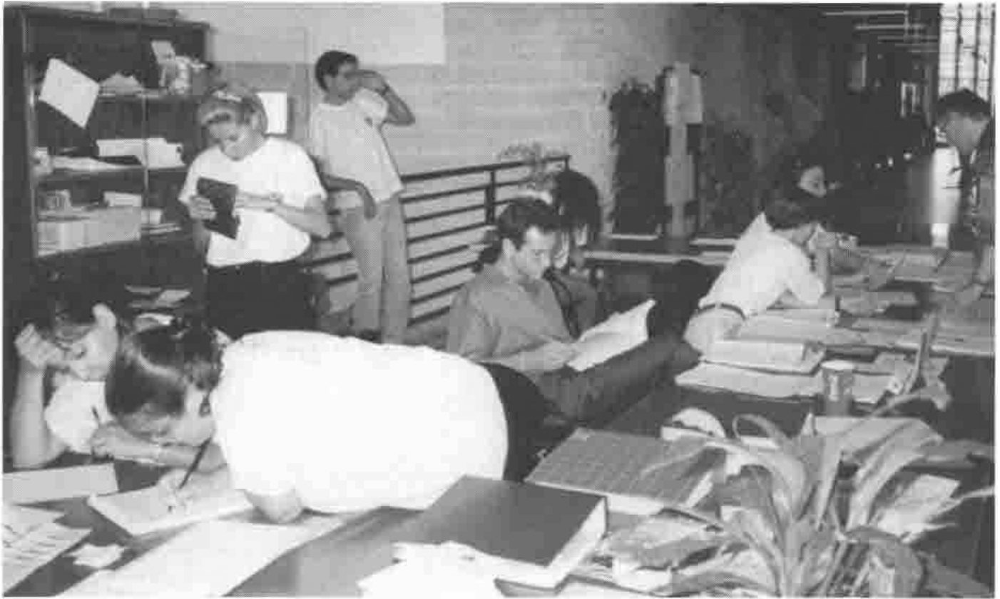
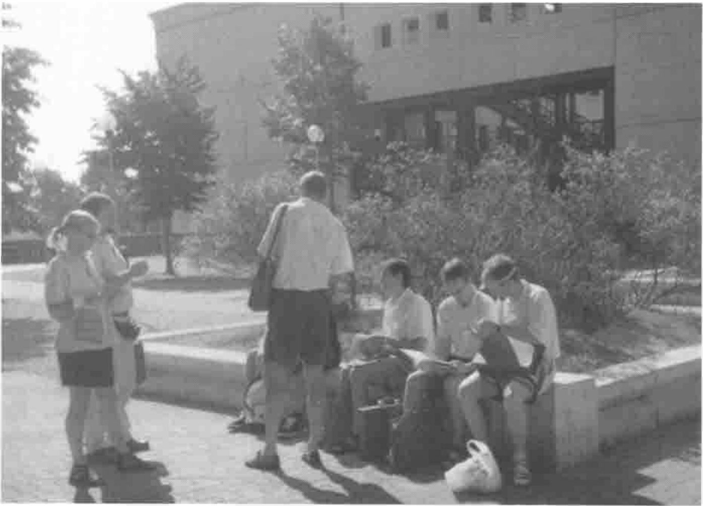

*by David Crossley, St Didier, France*
{ .byline }

## The Venue…

Rome. Whether you love it or hate it, it is not a city to see and forget. It lives, it would seem, 24 hours a day. It is full of happy, friendly people. The works-of-art are not just limited to the sculptured kind. It has its famous monuments, but they seem to be a very part of the fabric of the city. You can touch them, walk through them, even drive through them. Life is lived in the open air, though with temperatures in the high 90’s (35-40°C), this is not too surprising. It is a city of cafés and restaurants that seem to be permanently open (queues for tables at midnight!), and of ice-cream…everybody eats gelato.

David & Annette Crossley
{ .caption }

Then there is the driving. Creative, suicidal, artistic, macho. These are a few words that come to mind. A dent in one’s car appears to be obligatory. But then they seem strangely tolerant of drivers who are foreign to their ways, who stop abruptly to pore over a street map on realising that this is yet another one-way Via going in exactly the opposite way to the intended direction. Hooting vigorously does not, in the main, seem to be part of the arsenal.

So this was the back-drop to the conference. Well…almost. The conference site was at the University of Rome "Tor Vergata" on the outskirts of the city, not an area that attracts many tourists. ("Tor" is an old word for a tower although I never spotted this particular one.) The conference hotels were scattered around various parts of Rome, mostly around the central area.

Your correspondent, along with quite a sizeable number of delegates, was located in a very attractive quarter called Parioli, not too convenient for the city centre though it did have the advantage of being on top of one of the highest Roman hills (the advantage, apart from the view, being that the temperature was perhaps a degree lower!). Transport to the conference site was by coach, three in total, that each collected delegates (and accompanying persons, if they wished to spend the day at the conference site!) from a scheduled group of hotels. The downside of the Parioli hotel was that it was first for morning collection (7:50am) and last for evening drop-off (arrival time in the lap of the Gods). Thus, we had two trips lasting up to 1½ hours per day. Never mind. We had a magnificent sight-seeing tour of Rome, absolutely wonderful on the first day. Then I realised the cunning of the conference organisers. These were coach forums (or is it *fora*). I would bet that whole journeys were spent by some people deep in APL discussion without even noticing the magnificence through which we were passing.

The Front Desk, Hard at Work
{ .caption }

Then there was the conference itself. But first, a few words about the organisers, and the organisation. There is something fascinating about Italian organisation. Hands up all those who thought, at some stage or another, that we were heading for, well, perhaps a fiasco? What about those Web pages that were still Under Construction (and the long wait to download a pretty graphic to bring this to our attention!) just weeks before the conference. Did the accompanying persons wonder about their programme of guided tours? My wife’s cousin is something of an old hand at organising conferences in Rome (two so far), but from afar with local support. He finds it a frustrating, hair-tearing experience (though he is excitable)…but then everything works out on the day.

That’s what happened at APL98. Everything happened when it should, although one suspected a certain amount of nervous tension in the back-room. Sessions started on time. Equipment was provided for the speakers and presenters. A well-equipped workshop was provided. And the food was wonderful…and this in a University canteen! It certainly comes high on my list of APL conferences for organisation (realised) and facilities, not to mention the conference program itself.

Evening social events started with the Welcome drink, the Banquet, a Music evening, a Rome walk-about, and a Survivors’ Bruschetta & Wine evening (*bruschetta* - pronounced brew-sketta) is a simple but delicious recipe of tomatoes and herbs on toast impregnated with olive oil and garlic). The Banquet on the second evening was unusual, but not a bad idea in that people had an earlier opportunity to get to know one another. Of course, the meal was excellent …was it 8 or 9 courses? Italy is now thought of as **the** gastronomic country in Europe, and although I live in France, I would concur. We were not disappointed at the conference.

For all of this, we have much to thank Paolo Di Chio, his organising committee, and coordinators. But especially Paolo Di Chio. I do not know how he managed it, but he seemed to have time to attend to even the smallest detail as though one were the only person he had to deal with, both before and during the conference. I have heard this comment from numerous people. In my case, in pre-conference e-mails, he managed to track me down from a FAX with an erroneous e-mail address. Enough said.

## …and the Conference

Having formerly been a regular attendee at APL conferences, this was my first since APL92 in St Petersburg. I liked the trend that has evolved during the intervening period towards tutorials and, particularly, the workshops with a computer per person. As always, the parallel sessions sometimes presented a difficult choice as to which to attend, the losers often being the refereed papers.

I am glad to report that presentational standards have improved, with the now ubiquitous, modern, graphical tools largely replacing the illegible, scrawled, hand-written foil, often shown incrementally with a covering piece of paper that always slips off. Oops! What a give-away! Also, I know all about stage-fright (hence the need for thorough rehearsal), but inaudible muttering (and this is not a language issue) just out of range of the microphone is not a big audience stimulator. We even had an incoherent speaker (not too subtle clue there) which had something to do with prior evening revelling. But these are specific rather than general criticisms.

I shall say nothing about the refereed sessions simply because they are written up in the Proceedings. I do, however, have a theme. And that is…

## Yes, APL Does Have a Future

By Wednesday lunch-time, at the half-way point of the conference, the climate was upbeat. We had heard two plenary sessions whose subjects concerned successful products written in APL. Two new features under late beta-test had been announced at the Dyadic Vendum Forum (sic) that potentially open up new marketing opportunities for APL. We had participated in tutorials and workshops explaining techniques that improve the efficacy of APL (and J) within and outside its domain.

Then we had the Panel Session and a grey cloud descended. The subject was the motto for the conference: "New Gems From Old Roots". Incidentally, there seems to be a new meaning to APL: The Array Processing Language, though I am relieved to say that A Programming Language is still alive, well and dominant. The panel discussion seemed to be saying that APL in its present form is doomed and that a new language, possibly salvaging its array handling capabilities, is our salvation. The panel were most certainly not of accord on this subject, but the negativists outnumbered the positivists by 3:2 with the sixth somewhere between. Early audience statements (hardly questions) also leaned strongly towards the negative view. So what is the matter with the APL community? Do we have a death wish?

It seems that APL is doomed because:

- its notation is symbolic (funny symbols);
- it is an interpretive language (too slow; we should be developing a compiled product);
- it lacks modern programming facilities, largely due to lack of interest/initiative by the vendors;
- it is not portable;
- it is not freely available to educational institutions which prevents students from not only gaining exposure to the language, but also of writing and selling applications without recourse (somebody really suggested this idea!).

We did hear some positive aspects. The advantages of APL are:

- its notation (concise, elegant code);
- it is an interpretive language (fast development on ever faster hardware platforms; à la mode like Java);
- the vendors are constantly innovating and incorporating modern programming facilities;
- it is relatively portable compared with other languages;
- vendors offer very low cost options to educational institutions, often with unlimited availability, but with reasonable prohibition on unlicensed commercial distribution of derived products.

These arguments are, of course, very familiar, repeated endlessly at conferences, in editorials and articles. Unfortunately, it seems that the negative arguments tend to prevail. This is not a good thing for the younger delegates at conferences. Moreover, I am convinced that they do not reflect reality. There are many APLers who obtain a good living from APL. There are many more APLers about than one suspects from conference attendances and association memberships. There are many new applications being developed, new areas being entered. As Mark Twain cabled: "The report of my death was an exaggeration."

## Eric Baelen: I Can Succeed with APL - and So Can You

Probably the best, and certainly the most witty, session of the conference was given by Eric Baelen, President of LEX2000 and also APL2000, who completely reversed the negativity of the day before. He commenced by examining 16 or so companies that are, one way or another, APL success stories. Some develop products written in APL. Others have important control systems written in APL. At least one company ran everything using coordinated systems written in APL, including accounts and payroll packages. Many of these companies are large, publicly-quoted multi-million dollar businesses. Often, the users are unaware that the language in use is APL; and, indeed, why should they care. In one case, after a company take-over, the APL system was replaced for the usual pat reasons, only to be re-instated when its full value was realised.

He then went on to review the perceived shortcomings of APL…and demonstrated that these were often advantages. Does it matter that an APL function that runs in 0.5 seconds on the current range of fast machines (mandatory anyway if you wish to run Excel or MS Word in finite time) will run 100 times faster in C? For most business applications, the answer is No. What about the enormous productivity gain in development time of that same piece of code when written in APL?

Eric concluded with a series of tips on how to market APL. The message was clear and positive. If we believe in the product, spread the gospel, search out market opportunities (and there are many), and exploit them.

[As this was a Plenary Session, it does not appear as a paper in the Proceedings. I do hope that Eric will publish the talk as an object lesson to us all. Exhilarating stuff.]

## Morten Kromberg: The Adaytum Planning System Architecture

The opening Plenary Session introduced us to one of the APL success stories. The Adaytum product is a highly successful, business planning product based around a multi-dimensional spreadsheet.

The Adaytum Delegates Relaxing in the Italian Sun
{ .caption }

We were taken through the historical development of the product. It was the brainchild of George Kunzle whilst working with IBM. When IBM declined to market his product, he left to set up what became Adaytum KPS Software based on this product which he somehow managed to take with him. In 1995, Adaytum acquired the Danish software group, Insight Systems. Their team of APL experts along with SQL interface know-how provided the basis for rapid development and growth of the already successful KPS product, now known as the Adaytum Planning System. The company has continued to grow rapidly, with current expansion into the US market and ambitious plans for the future.

Morten has no doubts about the reasons for this success. Firstly, they have an excellent product that fills a market niche that was incredibly unfilled. Many large companies get by with a horrendous mish-mash of Excel spreadsheets. Secondly, Adaytum fully understands the importance of excellent marketing. They have a versatile product that is usually sold with a consultancy part to tailor the product to the specific needs of the company.

An on-line demonstration gave us an admittedly limited flavour of this highly functional product. With a fully up-to-date Windows interface, it is no slouch compared with state-of-the-art mass packages. Yet this has been achieved with a handful of APL programmers and a couple of C programmers (to optimise critical coding parts and external interfaces, as I understand it).

In an amusing look at the architectural aspects of the system, and the inevitable pros and cons of using APL, I think that we were all convinced that APL was the right choice.

## Alexei Mirochnikov / Carlo Alberto Spinicci: The GAMA/SOFIA Portfolio Management System

Another Plenary Session describing a successful product developed in APL.

In a very amusing opening speech, Carlo Alberto Spinicci of APL Italiana explained how the original SOFIA product came to market as a DOS product in the 80’s written in APL\*PLUS for the PC. It is a highly technical product designed for the management of portfolios, latterly specialising in the insurance sector. It has become the de facto package for the business in the Italian market, having obtained an 85% penetration.

[Quote: "As you all know, I speak English very well. However, as a protest against having English as the language for the conference, I shall now speak English very badly."]

The main talk was given by Alexei Mirochnikov of Infostroy, a software house in St Petersburg. He described the evolution of GAMA, a kind of son of SOFIA, to take the DOS version of SOFIA and re-package it as a Windows product using Dyalog APL. His company already had close links with APL Italiana and Insight Systems of Denmark, co-operating to develop software less expensively in Russia. In a marketing tie-up with a Norwegian company, Infostroy were given the go-ahead to develop the Windows product for a very specific sector in three months! For various reasons that Alexei covered, this target was not met, but the product did come to market and is now selling in various Scandinavian countries, though with different financial emphases.

Alexei then gave a short on-line demonstration of the product. As mentioned, this is a highly technical product, presenting an enormous range of densely packed analyses, not ideal for a projected screen display. It is also a package that requires some considerable training before professionals can take full advantage of its facilities. However, we were able to get the flavour of a very sound product.

Indeed, judging by the questions, there were numerous delegates in the audience who obviously have substantial experience of this highly technical, financial sphere, to the extent that Carlo Alberto felt obliged to defer such questions until later and concentrate on APL implementation matters.

An important aspect here is that extensive multi-lingual support (though maybe not Japanese!) is provided that is fundamentally designed into the product. It is integrated into products such as Excel, Internet Explorer and ODBC.

Of particular interest is the GUI screen development tool developed by Infostroy. With a large number of existing dialogs - I think 70 (different technical screens) was the number mentioned - this facility allows existing dialogs to be quickly changed, and new dialogs to be added without code modification.

## Other Sessions

There were, of course, many other sessions. As mentioned, you can read about the refereed papers in the Proceedings. If you are a developer, I would strongly recommend Bob Bernecky’s paper entitled *Egregion: A Branch Coverage Tool for APL*. Although the approach is well-known to most developers, the extension of the ideas should be seriously considered.

As for the vendor workshops and product announcements, I am sure that articles will soon be appearing in Vector. Watch out for Dyadic’s Threads and ActiveX Controls.
